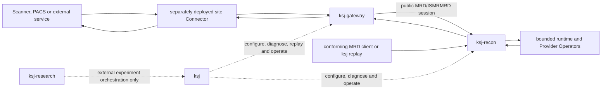

# KSpaceJet applications

KSpaceJet has four explicitly named executable projects. Their output names use the
`ksj` prefix; their source directories use the repository-wide `kspacejet-*` form.
When `KSJ_BUILD_APPLICATIONS=ON`, all four targets participate in the default build.
When `KSJ_ENABLE_INSTALL_RULES=ON`, all four executables are installed. The experiment
workloads below `tests/research` remain independently controlled by `KSJ_BUILD_RESEARCH`.

`apps/` contains process entry points only. Their shared `ksj_program` target lives in
`libs/core/kspacejet-program`; no reusable library target belongs below `apps/`.

| Source directory | CMake target | Executable | Role |
| --- | --- | --- | --- |
| `kspacejet-cli` | `ksj_cli` | `ksj` | User, developer and operations CLI. |
| `kspacejet-gateway` | `ksj_gateway` | `ksj-gateway` | Integration gateway for external systems and site connectors. |
| `kspacejet-recon` | `ksj_recon` | `ksj-recon` | Admission, bounded runtime and Provider execution service. |
| `kspacejet-research` | `ksj_research` | `ksj-research` | Cross-framework experiment runner. |

`ksj-gateway` does not define or translate a KSpaceJet-private raw-data protocol. It
accepts or forwards only the selected public MRD/ISMRMRD streaming-session binding;
site-specific proprietary adaptation must remain in a separately deployed connector.
`ksj-recon` alone owns scan admission, the resource ledger, backpressure, pipeline
execution and Provider scheduling. The gateway never chooses an algorithm or directly
owns Provider buffers.

Each reconstruction extension is a dynamically loaded Provider library (a shared
library on Linux or DLL on Windows), not a separate KSpaceJet executable. The reconstruction service
loads compatible trusted Providers in-process through the Provider ABI.

The default application build creates and installs `ksj`, `ksj-gateway`, `ksj-recon`,
and `ksj-research`. The four executables share the same application build and installation
policy; no executable-specific build option or preset is needed. `KSJ_BUILD_RESEARCH`
remains reserved for `tests/research` and does not control any application executable.

Each skeleton implements `--help`, `--version`, and `--format text|json`. Operational
behavior is added only through shared framework libraries; applications must not grow
independent copies of the parser, planner, runtime, Provider ABI, or MRD data plane.
