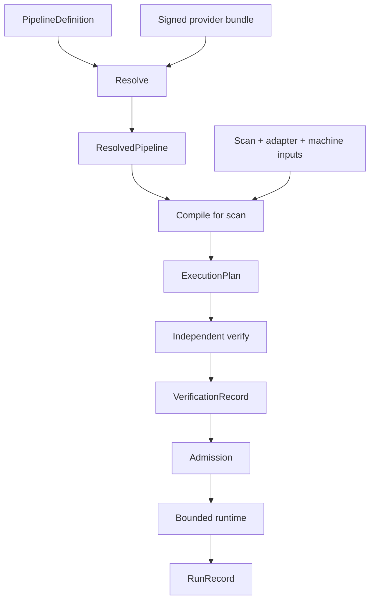
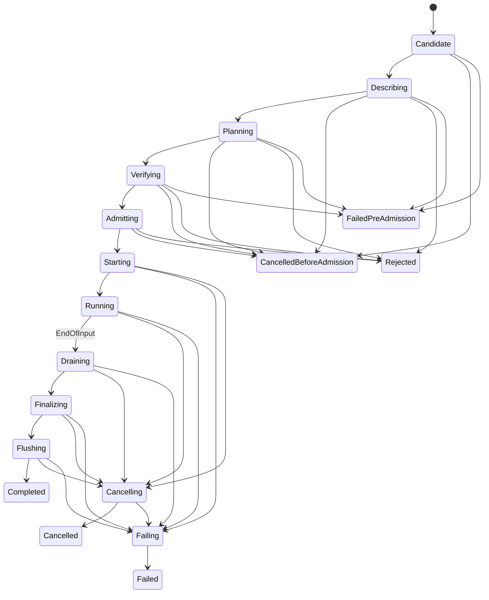
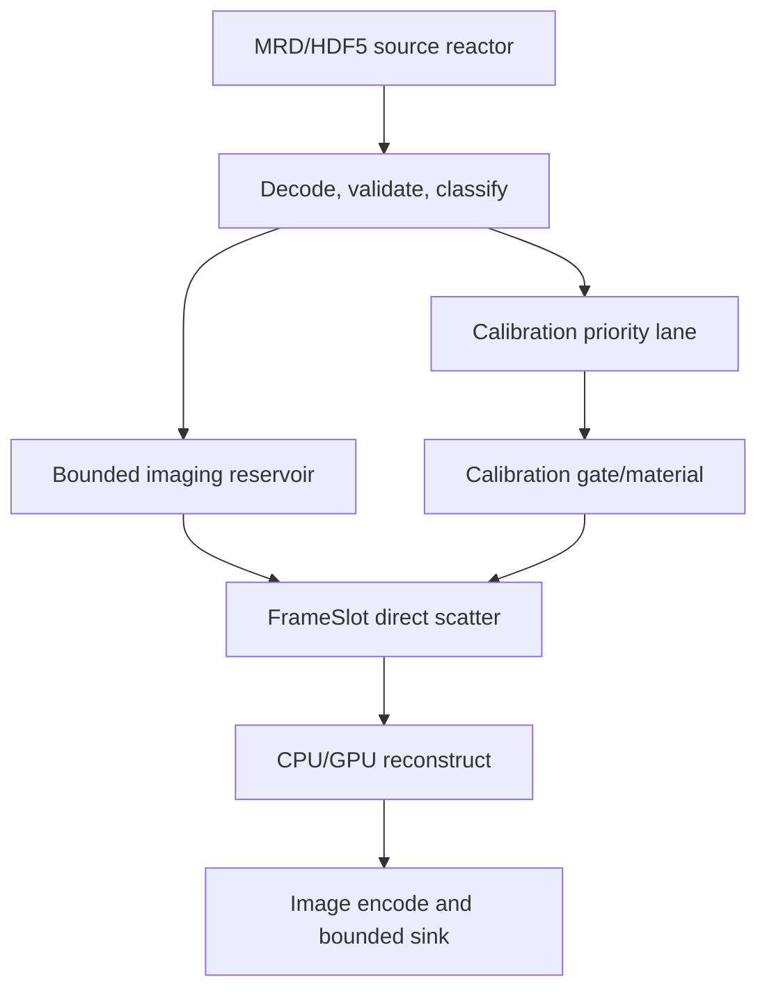

# KSpaceJet 重建 Pipeline 全面评估与优化设计

> 文档状态：建议冻结版
> 评估对象：`pipeline_definition.md`
> 命名策略：项目尚未发布，本文直接定义唯一当前形态；不保留版本后缀、兼容别名或并行格式。
> 核心目标：把“优秀的形式化蓝图”收敛成“可以分阶段实现、可验证、可测量、能承载 CPU/NUMA/GPU 实时 MRI 重建的工程规范”。

---

## 阅读导航

- 第 0–3 节：总体评价、评分、优点和阻断问题；
- 第 4–8 节：优化后的 artifact、profile、schema、PipelineDefinition 和 OperatorContract；
- 第 9–12 节：MRI 数据语义、FrameSlot、Buffer/账本、Provider ABI 和 KeyShard；
- 第 13–18 节：compiler/verifier、调度、背压、生命周期、GPU 和故障隔离；
- 第 19–23 节：性能、可观测性、参考数据路径、工程目录和测试；
- 第 24–26 节：实施路线、迁移表和最终建议。

---

## 0. 执行结论

原方案不是普通的“节点 + 队列”流水线，而是在尝试建立一套：

- 可声明；
- 可冻结；
- 可验证；
- 内存有界；
- 可取消；
- 可观测；
- 可复现；
- 支持动态 Provider 的 MRI 重建运行时。

方向是正确的，而且其中几项设计明显优于常见重建框架：

1. PipelineDefinition 与 scan-specific ExecutionPlan 分离；
2. Provider 合同不能被 pipeline 文件覆盖；
3. item 与 byte 双重容量；
4. KeyShard 单写者和 coalesced activation；
5. fan-out all-or-none；
6. calibration progress reservoir；
7. EndOfInput、cancel、failure、terminal output 进入同一生命周期模型；
8. 先串行 oracle、虚拟时间和反例 corpus，再开发并行 fast path。

但当前文本更接近“目标架构 + 形式化研究纲领”，还不能直接作为 production 开工。主要原因不是设计思想错误，而是：

- 规范范围过大，同时试图支持 SDF、CSDF、任意 keyed dynamic、merge、join、reorder、calibration、NUMA、GPU、异步终止和独立证明；
- 若干 artifact 的权威归属存在直接冲突；
- 类型、shape、layout、charged bytes 与 compiled-graph `BufferHandle` 语义现已在 generic synchronous graph 中冻结并执行；它仍不等同于可泛化的调度、隔离或任意多消费者执行模型；
- Provider ABI 无法强制合同中已经假定的 output、scratch、retain、async 和 terminal 资源；
- `strict-online` 的名称强于当前系统真正能保证的内容；
- MRI frame 完成条件与资源上界混淆；
- GPU/NUMA、transport 边界、崩溃恢复和部分输出语义仍不闭合。

综合结论：

> **架构蓝图约 8/10；作为可直接实现的冻结规范约 5.5/10。**  
> 应保留其数据流、资源和生命周期内核，但将当前实现收缩为一组可组合、可强制的 MRI 有限流式原语，并把高级证明、通用动态 Provider 和复杂调度逐步开放。

### 0.1 评分

| 维度 | 评分 | 判断 |
| --- | ---: | --- |
| 架构目标与边界意识 | 9.0/10 | 很强，产品层与运行时层分离正确 |
| Artifact 分层 | 8.5/10 | 主体正确，但 profile、Provider resolution、certificate 边界需修正 |
| 生命周期与终止语义 | 8.5/10 | cancel/failure/terminal epoch 很成熟 |
| 有界内存与背压思想 | 8.5/10 | 方向正确，物理内存域和 transport 边界尚缺 |
| MRI 数据语义 | 6.0/10 | calibration 考虑深入，但 frame classification/completion 不足 |
| Schema 语义闭合度 | 5.5/10 | 多处仍是概念字段，无法唯一求值 |
| CPU/KeyShard 调度 | 6.5/10 | 原则正确，资源事务和多 scan 公平性待落实 |
| NUMA/GPU 执行模型 | 4.0/10 | 只有 placement/fence 术语，缺少完整 device plan |
| Provider ABI 与可强制性 | 4.5/10 | 运行时想保证的能力超过 ABI 已定义的能力 |
| 故障隔离与供应链安全 | 4.5/10 | 已识别问题，但尚未成为体系 |
| 可观测性与可复现性 | 6.5/10 | 方向正确，缺稳定事件 schema 和 PHI/cardinality 约束 |
| 当前实施可控性 | 5.0/10 | 若不收缩范围，极易陷入“验证器先行、主链迟迟不可运行” |

### 0.2 当前 generic synchronous 实现状态与下一边界（非规范性）

当前代码已从单条专用链切换为 generic synchronous graph。下表只描述已实现边界；
未列出的能力不能由名称、Provider 约定或旧文档暗示为可用。

| 范围 | 当前边界 |
| --- | --- |
| 计划与验证 | `ExecutionPlan` 冻结 generic `synchronous_nodes`、pool、FIFO edge、calibration-artifact binding、资源与 terminal obligation。compiler 和独立 verifier 分别核验拓扑、冻结 Provider/contract/config identity、精确 TypeDescriptor、容量和 accounting。 |
| node 输入 | 所有声明的 input binding 都是必需的。一个 node 可有至多四条动态 data edge，并可读取任意已声明的静态 calibration artifact；动态 cohort 只接受完全相同的 `DataItemIdentity`。 |
| firing | executor 先预留全部 downstream output，再以可回滚 reservation claim 全部动态 input；缺少 sibling 或 output 容量时保持上游不变。随后才 materialize input、调用 Provider、commit sealed output 并 ACK input。identity、type、callback 或 commit 违反均 fail closed。 |
| calibration | estimator 的普通 firing 可将一个 sealed output 以显式 binding id 发布到 scan-local `CalibrationArtifactStore`。同一 artifact 可被多个 consumer 以只读 RAII lease 并发读取；发布后不可覆写，EndOfInput 后已发布 artifact 仍可读取，abort 拒绝新读取。 |
| ingress/egress | named ingress 以 pre-reserved mutable pool slot + edge credit 接收数据，只有 `seal_and_commit` 后可见。imaging、noise calibration 和 phase reference 使用同一机制；`CompletedFrameIngressBridge` 从 `HostFrameAssembler` 复制完成 frame，并且只在 ingress commit 后 ACK source lease。egress lease 暴露只读 type/identity/metadata/payload，必须显式 ACK。 |
| terminal | 各 ingress EOI 后 edge 先 drain；node 只有在动态输入全 drain 后才执行 terminal callback。artifact 只从普通 firing 发布，terminal 只处理 data output 与 missing-binding closure。 |
| storage | pool/edge storage 是由调用方按 frozen id 传入的 fixed slabs；没有隐藏全局 registry。RAII handles、edge leases 和 artifact read leases 保持正确生命周期与资源账本。 |
| 当前范围 | 当前没有 arbitrary keyed join、fan-out、异步 Provider callback、跨进程隔离或 device-memory scheduler。它们必须先成为明确 plan/verifier/accounting/test 语义，才可以被开放。 |

`offline` 与 `bounded-online` 是当前 in-process runtime 的可用 profile；
`isolated-strict-online` 与 `deadline-qualified-online` 仍要求已认证的 worker fault
boundary、supervisor、资源 quota 与 watchdog/timeout enforcement。
## 1. 评估边界与判断标准

本评估只基于所提供的 `pipeline_definition.md`，不假设其引用的其他规划或理论文档已经补齐本文发现的缺口。

判断标准不是“概念是否先进”，而是以下问题能否得到唯一、可测试的答案：

1. 同一组输入是否得到确定的 ResolvedPipeline 与 ExecutionPlan；
2. compiler、verifier、runtime 对字段含义是否完全一致；
3. Provider 能否通过 ABI 被限制在合同资源内；
4. 输入、输出、异步任务和 buffer 生命周期是否有闭合状态机；
5. bounded memory 是否覆盖真实 host、pinned、device、transport 和瞬时复制峰值；
6. 在线 scanner 不可暂停时是否仍能保证 raw acquisition 不丢失；
7. CPU、NUMA、GPU 计划能否真实落地，而不是只记录一个 placement 标签；
8. crash、hang、cancel、device lost、slow sink 后是否总能形成唯一终态；
9. 测试能否构造反例证明实现没有暗含未声明语义。

---

## 2. 原方案最值得保留的设计

### 2.1 Authored graph 绝不是 execution plan

这是整份设计最重要的原则。用户只描述逻辑 DAG、参数和 Provider 意图；线程、shard、queue、batch、NUMA、GPU、permit 和 memory reservation 必须由真实 scan 与机器共同导出。

应完整保留：

```text
PipelineDefinition
  + exact Provider-owned OperatorContracts
  + ScanDescriptor
  + TargetEnvelope
  + MachinePolicy
  + requested profile
  -> ExecutionPlan
```

### 2.2 禁止隐式 merge、drop、barrier 和 partial

以下行为必须继续保持显式：

- 多源输入；
- 数据丢弃；
- 重排；
- 降采样；
- whole-scan barrier；
- calibration dependency；
- partial image；
- archive/spool；
- 非关键 telemetry 分支。

这能防止“结果看起来正常，但数据已被静默丢失或乱序”。

### 2.3 Calibration progress reservoir

如果 imaging 数据先于 calibration 到达，而 waiting imaging 占满全部容量，ingress 会停止读取，后面的 calibration 永远到不了。为 calibration 进展保留独立容量是非常专业且必要的设计。

优化版会保留这一思想，但把它落实为：

- ingress 后立即进行轻量、无阻塞 header classification；
- calibration priority lane；
- imaging-prefix reservoir；
- decoder lookahead slot；
- 明确的 per-key 与 aggregate horizon；
- 超界立即结构化失败。

### 2.4 Full firing reservation 与 no hold-and-wait

调用 Provider 前一次取得完整 firing 所需资源，失败则不持有半套资源等待，这一原则正确。

但实现不应依赖全局大锁。优化版会把资源预切分到 scan-local/stage-local pool，并定义固定 try-reserve 顺序、唯一线性化点、ticket fairness 和按稀缺资源 generation 唤醒。

### 2.5 Fan-out all-or-none 与 immutable payload

必需算法分支应继续保持：

- payload seal 后只读；
- 所有目标 edge 预留成功才发布；
- 任一目标不足则不产生部分可见性；
- 慢分支的生命周期进入 retention 预算。

同时必须区分物理 allocation 与每条 edge 的逻辑 credit，避免共享 payload 被重复计费。

### 2.6 终止不是事后补丁

`on_scan_end`、`on_cancel`、normal flush、async token、terminal output 和下游 firing 都必须预先有界，这一点应保留。

优化版进一步规定：

- normal finalizer 可以产生已认证、有限的普通 MRI data output；
- runtime 要求 `on_cancel` 及其 cleanup 只能释放或 quarantine 已有资源、settle 已注册 async
  work，并写入独立诊断/审计通道；`cancel_cleanup.outputs` 不是当前 Contract 字段；
  不得取得普通 data 的 OutputGrant、发布普通 MRI data，或触发 data-producing 下游 firing；
- 因而在 terminal phase 中，只有正常 EndOfInput 的 `on_scan_end`/`normal_flush` 是
  output-bearing 路径；
- failure diagnostic 使用独立审计通道；
- ordinary async token 清零是正常 finalization 的前置条件；
- cancel 时先失效 epoch，再 quarantine 尚未完成的 device/IO buffer，不能提前复用。

---

## 3. 必须先修复的问题

### 3.1 P0：阻断实现或会产生错误保证

| 编号 | 问题 | 直接影响 | 优化决定 |
| --- | --- | --- | --- |
| P0-01 | 当前范围同时覆盖通用数据流理论、插件 ABI、调度、证明和硬件执行 | 工程无法形成最小闭环 | 当前实现只支持有限 MRI motifs；高级 CSDF/通用 merge/任意 automaton 延后 |
| P0-02 | `max_frame_acquisitions` 被示例用作 completion | 欠采样、ACS、navigator、duplicate 下会提前完成或永不完成 | CompletionPredicate 与 ResourceUpperBound 完全分离 |
| P0-03 | MergeSpec 同时属于 OperatorContract，又列具体 source edge id | Provider 静态合同不可能知道用户图中的 edge id | graph binding 与 node planning requirements 共同给出显式多输入关系；compiler 生成对应 plan |
| P0-04 | requested profile 同时冻结到 ResolvedPipeline，又作为 scan 编译输入 | 同一 resolved artifact 是否可重用不明确 | ResolvedPipeline 保持 profile-neutral；PlanBuildRequest 选择唯一 profile |
| P0-05 | 将 OperatorContract 另作 identity artifact | 产生重复且不必要的 identity 链 | Contract 仅作为已解析 Provider/Operator 的 typed planning input |
| P0-06 | ResolvedPipeline 与“actual ABI descriptors”都像编译权威 | resolver 与运行前加载结果可能漂移 | ResolvedPipeline 冻结 Provider bundle 与 Operator 选择；加载后提供 typed contract |
| P0-07 | 端口类型只有字符串，layout/shape/memory domain 未闭合 | 无法安全跨 DLL、CPU、GPU 或验证零拷贝 | authored contract 只写 registry `type_ref`；compiler 展开冻结 TypeDescriptor 并严格匹配；转换必须显式 |
| P0-08 | ResourceExpr 无单位、无 key 环境、无 bounded reducer | 无法正确计算多 encoding、per-key、bytes/count | 这属于后续 planning-expression 设计；当前 Contract 不含 ResourceExpr |
| P0-09 | Provider ABI 未定义 FiringLease、OutputGrant、retain、async 等能力 | runtime 预留资源但 Provider 仍可绕过 | 使用 host-owned capability ABI，输出和资源只能经 lease 获得 |
| P0-10 | 进程内 native Provider 仍被纳入 strict-online | crash、hang、私有 malloc/thread 无法隔离 | strict profile 要求隔离 worker；进程内模式仅为条件有界 |
| P0-11 | `M_plan` 未覆盖 allocator、pinned、GPU、transport、copy 峰值 | bounded-memory 结论可能偏小 | 改为多域 ResourceVector，并定义实际 charge 规则 |
| P0-12 | “停止 read”被当成在线无损背压 | scanner 不可暂停时仍可能丢数据 | 新增 IngressAdapterContract；无 pause 则要求有界 raw spool |
| P0-13 | certificate、witness、independent verifier 的可信边界不清 | compiler 可能自证，出现虚假安全感 | plan、untrusted witness、independent VerificationRecord 分离 |
| P0-14 | cancel cleanup 可输出普通 data，但 cancel 后又停止 ordinary firing | 下游是否处理 cleanup output 自相矛盾 | abort cleanup 不得产生普通 MRI data |
| P0-15 | crash 后部分输出、恢复和 exactly-once 范围未定义 | 下游可能收到重复或把失败 run 当成功 | 当前实现明确 fail-stop-no-resume；replay 创建新 run id |
| P0-16 | GPU 只有 async/fence 术语，无 device resource model | buffer 复用、取消、显存和 PCIe 无法证明 | 新增 DevicePlan、TransferOccurrence、event/fence quarantine |
| P0-17 | 服务时间模型缺失 | 无法决定并发数、queue depth、吞吐稳定性和 TTFI | 新增 PerformancePolicy 与 ServiceDemandSpec；性能结论与安全证明分离 |

### 3.2 MRI completion 不能由“最大数量”代替

真实 ISMRMRD 输入可能包含：

- noise；
- calibration；
- calibration-and-imaging；
- phase correction；
- navigation；
- dummy；
- partial Fourier；
- parallel imaging undersampling；
- duplicate/reacquisition；
- 多 encoding space；
- 缺失或越界 index。

因此必须拆成两个对象：

```text
CompletionPredicate
  exact_index_coverage
  validated_last_flag
  key_watermark
  end_of_input_policy

ResourceUpperBound
  max_unique_indices
  max_total_arrivals
  max_duplicate_arrivals
  max_payload_bytes
```

Cartesian frame 建议使用固定容量 completion bitmap：

- canonical index 映射到 bitmap；
- duplicate policy 明确为 reject、ignore-identical 或 replace-before-seal；
- frame seal 后的 late acquisition 默认失败；
- 缺失 index 在 EndOfInput 时按 contract 选择 fail、explicit partial 或 certified skip；
- XML 无法提供精确 sampling plan 时，不能用 envelope maximum 猜测完成，只能依赖经过验证的 LAST flag/watermark 或 EndOfInput。

### 3.3 “有界 occurrence”不等于“有界时间”

应明确区分四类结论：

| 结论 | 含义 |
| --- | --- |
| space-bounded | host-enforced 资源不超过冻结上界 |
| occurrence-bounded | 计划内 firing/token/terminal occurrence 数量有限 |
| conditionally terminating | Provider、backend、sink 最终推进且调度公平时有限 drain |
| deadline-qualified | 在特定软硬件和 WCET/service curve 下满足 deadline |

在同进程 native Provider 下，系统最多能严谨声称前三者中的前两项，以及带外部假设的第三项，不能把 cooperative quantum 当成硬 WCET。

### 3.4 P1：进入 production pilot 前应解决

| 问题 | 建议 |
| --- | --- |
| authored node 复制完整 ports，形成双权威 | node 只引用 operator；ports 在 resolution 展开 |
| JCS 不会重排无序数组 | JCS 前按 kind-specific 规则对 nodes/edges 等按稳定 id 排序 |
| KeyShard lazy mapping 无碰撞、复用、late-event 规则 | 固定 mapping algorithm、slot generation、completed-only eviction、late event fail |
| 输入端口的 close 语义不完整 | 每个声明 input 都必须有显式来源，所有已绑定 lane 必须 closed |
| 一个 node 一个物理 OperatorInstance 限制 NUMA/GPU | 一个 LogicalNodeRuntime 可拥有计划内 execution contexts/replicas |
| 语义 key 与 line/coil/tile 计算分块混淆 | 拆分 SemanticKey、OrderKey、PlacementKey、WorkPartition |
| 规划选择 batch/placement 无确定 tie-break | 冻结 compiler semantics、policy id、topology digest、deterministic tie-break |
| output 已部分可见但 scan 后续失败 | RunRecord 记录 visibility、last committed ordinal、sink ack boundary |
| multi-scan 公平性未定义 | 层次化 scan fairness + scan 内 deadline/ordinal 调度 |
| planning 期间 acquisition 已到达 | pre-admission staging、planning timeout、pause/burst/spool 进入 adapter contract |

---

## 4. 优化后的总体原则

### 4.1 标准术语与多 Operator 组合边界

`contract` 只用于 Provider 与 host 必须共同遵守的、可验证的承诺；它不是 pipeline、计划或运行记录的泛称。本文固定使用下列术语：

| 名称 | 所属与职责 | 不应混同为 |
| --- | --- | --- |
| `PipelineDefinition` | pipeline 作者声明的逻辑 DAG、参数、节点与边 | scan-specific 物理计划或 Provider 实现 |
| `PipelineNode` | 某条 pipeline 中对一个 Operator 的一次实例化，携带 node id、Operator 引用与该实例 config | 可复用算法本身 |
| `Operator` | 一个语义单一、可复用的算法能力，具有命名端口和配置语义 | Provider、node 或 runtime service |
| `Provider` | 可独立发布的 bundle/动态库；可提供多个 Operator 的实现 | 单个 Operator 或 pipeline |
| `OperatorContract` | Provider 对一个 Operator 的稳定可连线接口：`operator_id` 与 typed ports | PipelineNode、planning requirements 或 ExecutionPlan |
| `OperatorContractBinding` | compiler 将一个 node 绑定到已解析 Provider/Operator 的 typed contract | 用户编写的 node config |
| `NodePlanningRequirementsBinding` | `PlanBuildRequest` 中 node id 与该实例的调度、资源、速率、拓扑和终止 requirements | Provider ABI capability、raw config 或 runtime state |
| `OperatorPlanBinding` | `ExecutionPlan` 中 node id 与 canonical config digest 的不可变对应 | Provider ABI 的第二份 config 参数 |
| `ExecutionPlan` | compiler 为一个 scan/profile/机器快照导出的物理资源、执行安排和 node config identity | 可编辑的逻辑 DAG |
| `VerificationRecord`、`AdmissionRecord`、`RunRecord` | 分别记录验证结论、动态准入决定和实际运行结果 | OperatorContract |

一个重建 pipeline 由多个 `PipelineNode` 经 typed edge 组合而成；每个 node 绑定一个 Operator，同一个 Operator 可以由多个 node 或不同序列的 pipeline 重复使用。一个 Provider 也可以提供多个 Operator，因此 OperatorContract 不能误称为 Provider 级 contract。Operator 的边界应由稳定的数据语义、端口/生命周期、配置和复用价值决定；例如 `kspace_prewhiten → coil_compress → cartesian_fft → coil_combine → image_scale` 是可组合的算法阶段。不要为了拆分循环而把行 FFT、列 FFT 等内部实现细节伪装成独立 node。

`HostFrameAssembler`、admission、`BufferPool`、reorder、bounded edge、ledger、公开 ingress/egress adapter 和生命周期收敛属于 host/runtime 能力，不是可替换的算法 Operator，也不得由 Provider 或 pipeline author 绕过。

### 4.2 只保留六个核心持久 artifact

为避免“修复过度设计时又制造更多 artifact”，优化版将真正需要持久化、进入审计链的对象控制为六个：

| Artifact | 唯一权威 |
| --- | --- |
| PipelineDefinition | 逻辑 graph、参数、Provider 选择意图、显式 binding |
| ResolvedPipeline | exact bundle、contract/type/config snapshot，保持 profile-neutral |
| ExecutionPlan | 某 scan、profile、机器快照下唯一可执行物理计划；每个 node 的 canonical config digest binding 也被冻结其中 |
| VerificationRecord | independent verifier 对 plan 的结论、假设和 witness 摘要 |
| AdmissionRecord | 动态资源 lease、准入决定和机器 generation |
| RunRecord | 实际状态、资源 high-water、错误、输出可见性、可复现信息 |

以下对象是签名输入或运行请求，不必都成为顶级运行 artifact：

- ProviderBundleManifest；
- OperatorContract；
- TypeRegistry 条目及其解析后的 TypeDescriptor；
- ScanDescriptor；
- TargetEnvelope；
- MachinePolicy/MachineSnapshot；
- IngressAdapterContract；
- EgressAdapterContract；
- PerformancePolicy；
- ProviderQualificationRecord；
- PlanBuildRequest；
- ProofWitness。

这些输入即使不是“顶级用户 artifact”，也必须以 canonical snapshot 嵌入核心 artifact，或作为 content-addressed immutable object 持久保留并可按 digest 解析。ExecutionPlan 不能只保存日后无法反查的裸 digest；否则 independent verifier 无法复验，RunRecord 也无法长期复现。

### 4.3 权威流



### 4.4 语义图与物理执行图分离

PipelineDefinition 中的 graph 只表达算法语义。ExecutionPlan 可以在不改变语义的前提下：

- fusion；
- microbatch；
- FrameSlot 化；
- CPU/GPU variant 选择；
- NUMA context 复制；
- 显式 transfer occurrence；
- queue/slot/permit 配置；
- work partition；
- placement。

但物理优化必须满足：

1. 每个输出仍能映射回逻辑 node/port；
2. error、metric、trace 保留逻辑归属；
3. 不改变 order、completion、partial、determinism 和 failure 语义；
4. plan 中记录 fusion group 与 provenance；
5. verifier 可从逻辑 graph 重新检查物理计划没有遗漏 barrier、transfer 或 terminal occurrence。

compiler 不能仅凭 shape 猜测某个 Operator 能否安全分块或融合。未来只有显式的 Provider capability
和相应 node planning requirements 同时允许、且 verifier 能验证其前置条件时，才允许对应转换；当前
Contract schema 不含 `PartitionCapability/WorkPartitionSpec` 或 `FusionCapability`，没有该能力时必须保持原逻辑 node 和执行边界。

---

## 5. Execution profile 重新定义

原 `strict-online` 容易被理解为硬实时。建议改成明确的 claim matrix：

| Profile | 内存有界 | Provider 故障隔离 | 有限失败收敛 | deadline | 外部 sink durability |
| --- | --- | --- | --- | --- | --- |
| `offline` | 可选 | 可选 | 条件性 | 不承诺 | 由 sink 定义 |
| `bounded-online` | 是 | 取决于部署 | 条件性 | 不承诺 | 由 sink 定义 |
| `isolated-strict-online` | 是 | 必须 | supervisor 决策与 host worker 隔离有界；device 回收有条件 | 仅条件性 | 由 EgressAdapterContract 定义 |
| `deadline-qualified-online` | 是 | 必须 | 仅在冻结的 OS/device fault assumptions 内有界 | 仅对已 qualification 的机器/shape 保证 | 明确冻结 |
| `research-unbounded` | 否 | 否 | 否 | 否 | 不承诺 |

规则：

1. ResolvedPipeline 不冻结 requested profile；当前可选性只由
   `PipelineDefinition.allowed_profiles` 与 `MachinePolicy.allowed_profiles` 共同决定。每个
   OperatorContract 都必须满足固定的 `offline` 与 `bounded-online` contract constraint；不存在
   `supported_profiles` 字段、per-operator profile list 或 variant-profile 交集；

   runtime 也不从 Contract 选择 implementation variant；未来若引入该能力，必须作为独立 planning
   input/plan decision，而不是恢复 Contract profile fields；
2. PlanBuildRequest 显式给出唯一 profile；
3. ExecutionPlan、VerificationRecord、AdmissionRecord、RunRecord 冻结该 profile；
4. runtime 不得静默降级或替换 profile；
5. 旧 `strict-online` 只有在满足进程隔离、transport boundary、host-enforced resource 和 watchdog 条件时，才能映射到 `isolated-strict-online`。

> **当前实现准入边界（M0/M1，非规范性）：** 进程内路径目前只接受 `offline` 与
> `bounded-online`。`isolated-strict-online` 和 `deadline-qualified-online` 一律拒绝；
> 进程内 watchdog 不是这里要求的 worker 故障边界。完整状态和下一边界见第 0.2 节。

---

## 6. Canonicalization、身份和 digest

### 6.1 修正后的 digest 规则

每类 artifact 使用两种 domain-separated digest：

```text
artifact_digest = SHA-256(
  "kspacejet:artifact:<artifact-kind>\0"
  || canonical_full_bytes
)

semantic_digest = SHA-256(
  "kspacejet:semantic:<artifact-kind>\0"
  || canonical_semantic_bytes
)
```

要求：

- OperatorContract payload 内不保存自身 digest；
- digest 作为 bundle manifest 中的 detached integrity 字段；
- object key 使用 RFC 8785/JCS；
- 对语义无序数组，在 JCS 前按 schema 指定的稳定 id 排序；
- 对有序数组保持原顺序；
- ID、provider id、port name 建议限制为 ASCII 子集；
- 限制 JSON 最大 byte、depth、array length 和 string length；
- duplicate key、未知语义字段、超出精确整数范围全部拒绝。
- detached integrity 字段均不进入自身 hash view；
- semantic cache 命中后，仍要重新绑定当前 artifact_digest 与 provenance，不能把 cache 当成内容身份。

建议同时保存：

| Digest | 用途 |
| --- | --- |
| artifact_digest | 覆盖完整 artifact，包括 display metadata |
| semantic_digest | 排除 schema 明确标记为非执行语义的 annotation，仅用于 plan cache |

两者的排除规则必须由 schema 固定，不能由调用者自行选择。

### 6.2 Resolution 与 runtime attestation

ResolvedPipeline 保存完整 contract/type/config snapshot 或 content-addressed reference。compiler 只以该 snapshot 为权威。

compiler 从每个 resolved node 的 exact canonical config bytes 以
`kspacejet:artifact:operator-config` domain 派生 digest，并为每个 node 写入一个
`ExecutionPlan.OperatorPlanBinding { node_id, canonical_config_digest }`。独立 verifier 从同一
ResolvedPipeline 重算并要求完整 node 集合和 digest 精确匹配；`PlanBuildRequest` 不接受调用者提供的
config digest。

加载动态库后：

```text
actual_provider_descriptor_digest
  must equal
resolved_provider_descriptor_digest
```

不相等立即拒绝；不能用 runtime 返回的新 descriptor 重新解释已经冻结的 pipeline。

---

## 7. 优化后的 PipelineDefinition

### 7.1 作者能写什么

作者声明：

- pipeline identity；
- 允许 profile；
- 有限参数；
- Provider requirement；
- node/operator/config；
- edge；
- ingress/egress；
- calibration/merge/join 等具体 binding；

作者不能声明：

- thread、shard、queue、batch、NUMA、GPU stream；
- runtime memory reservation；
- provider 文件系统路径；
- environment expansion、脚本、网络 URL；
- 隐式 drop/merge/spool/layout conversion；
- 私有 transport credit。

### 7.2 最小示例

```json
{
  "kind": "PipelineDefinition",
  "pipeline": {
    "id": "org.example.reference-cartesian",
    "display_name": "Reference Cartesian reconstruction"
  },
  "allowed_profiles": [
    "offline",
    "bounded-online",
    "isolated-strict-online"
  ],
  "parameters": {
    "normalization": {
      "type": "enum",
      "values": ["unitary", "backward"],
      "default": "unitary"
    }
  },
  "provider_requirements": [
    {
      "alias": "reference",
      "provider_id": "org.kspacejet.reference"
    }
  ],
  "nodes": [
    {
      "id": "classify",
      "operator": {
        "provider": "reference",
        "id": "acquisition_classify"
      },
      "config": {}
    },
    {
      "id": "bin",
      "operator": {
        "provider": "reference",
        "id": "cartesian_frame_assemble"
      },
      "config": {
        "duplicate_policy": "reject",
        "incomplete_policy": "fail"
      }
    },
    {
      "id": "recon",
      "operator": {
        "provider": "reference",
        "id": "cartesian_reconstruct"
      },
      "config": {
        "normalization": {"$param": "normalization"}
      }
    }
  ],
  "edges": [
    {
      "id": "classified-to-bin",
      "from": {"node": "classify", "port": "imaging"},
      "to": {"node": "bin", "port": "acquisition"}
    },
    {
      "id": "bin-to-recon",
      "from": {"node": "bin", "port": "frame"},
      "to": {"node": "recon", "port": "frame"}
    }
  ],
  "bindings": {
    "ingress": [
      {
        "id": "acquisitions",
        "type": "ismrmrd.acquisition",
        "to": {"node": "classify", "port": "acquisition"}
      }
    ],
    "egress": [
      {
        "id": "images",
        "type": "ismrmrd.image",
        "from": {"node": "recon", "port": "image"}
      }
    ],
    "calibration": [],
    "merge": []
  },
  "annotations": {}
}
```

### 7.3 不再复制完整 ports

authored node 不重复 Provider 的完整端口表。edge 引用 port name，resolver 从冻结的 OperatorContract 展开并验证。

Provider bundle identity 与当前唯一 OperatorContract 共同避免 PipelineDefinition 与 OperatorContract
两份 port schema 同时演化。

### 7.4 Merge 的当前所有权

`OperatorContract` 只声明可连接的 typed ports，绝不能引用某个用户 pipeline 的具体 edge id。
具体 source edge、顺序和 close 语义属于 PipelineDefinition binding；每 node 的有限多输入、保留和
调度要求属于 `PlanBuildRequest.NodePlanningRequirementsBinding`；compiler 才将这些输入冻结为物理
plan。`MergeCapability`/`MergePlan` 等更细的通用模型属于后续设计，不是当前 Contract schema。

---

## 8. OperatorContract、类型与 planning input

### 8.1 当前 canonical taxonomy

`OperatorContract` 是 Provider-owned 的稳定可连线接口，只有 `operator_id` 与 typed ports。
Provider ABI 仍是实现能力的上界，但每个 pipeline node 的调度、资源、速率、拓扑和终止 requirements
不属于 Contract：它们放在
`PlanBuildRequest.NodePlanningRequirementsBinding { node_id, requirements }`，并针对 resolved Contract
ports 验证。

node 的 raw config 仍由 PipelineDefinition/ResolvedPipeline 持有。compiler 为每个 resolved node 派生
`ExecutionPlan.OperatorPlanBinding { node_id, canonical_config_digest }`；该 digest 只绑定 exact canonical
config bytes，不改变 Provider C ABI，也不是用户可重复填写的配置字段。

本节后面的 partition、fusion、firing motif 和 typed expression 内容是后续 planning/Provider-capability
设计讨论，不是现行 Contract schema 字段或当前已实现能力。

### 8.2 TypeRef、TypeRegistry 与解析后的 TypeDescriptor

`ksj.kspace-frame` 不是一段由开发者自行解释的字符串：它是一个可读的
`TypeRef`。Provider 作者在 authored `OperatorContract` 的 port 中只写这个
引用，例如：

```json
{
  "name": "frame",
  "type_ref": "ksj.kspace-frame",
  "direction": "input"
}
```

`types/registry.json` 是可审阅的唯一类型源：它同时说明 payload/metadata
语义，并冻结 payload kind、element type、rank、dimension meanings、layout、
stride、允许的 memory domain、alignment 和 mutability。
`tools/type_registry/generate.py` 从该文件生成 recon model 与 Provider SDK 的
registry factory/matcher；Provider 合同不得复制结构字段，更不得手写摘要。
语义或结构改变必须新建不同的 TypeRef，不能修改既有 registry entry。

compiler 在解析合同后才把 TypeRef 展开为 `ExecutionPlan` 中的完整
`TypeDescriptor`。编译产物保留可独立验证所需的结构及自动导出的
`type_identity_digest`：

```json
{
  "type_ref": "ksj.kspace-frame",
  "type_identity_digest": "sha256:...",
  "payload_kind": "buffer_handle",
  "element_type": "complex_float32",
  "rank": 3,
  "dimensions": ["channel", "ky", "kx"],
  "layout": "channel_major_contiguous",
  "strides": "canonical",
  "explicit_byte_strides": [],
  "allowed_memory_domains": ["host_normal"],
  "min_alignment_bytes": 64,
  "mutability": "immutable_after_publish"
}
```

`type_identity_digest` 由固定的 `kspacejet.type-identity` domain 和完整的
canonical structural descriptor 自动计算；它用于机器身份和 attestation，不能
单独取代结构校验。精确匹配要求 TypeRef、identity digest 和每一个结构字段一致：

- dtype、rank、dimension meaning、layout、alignment、memory domain 任一不兼容即拒绝；
- layout/memory transfer 必须成为显式 host adapter 或 transfer occurrence；
- compiler 不得偷偷 materialize 或 transpose；
- Provider ABI 只交换 opaque handle 和冻结 descriptor，不交换 STL 容器或编译器相关对象。

### 8.3 当前的 port 骨架

当前可解析的完整合同见
`providers/kspacejet-cartesian-recon/contracts/cartesian_ifft2_coil_images.json`。其 authored 接口如下：

```jsonc
{
  "kind": "OperatorContract",
  "operator_id": "cartesian_ifft2_coil_images",
  "ports": [
    {
      "name": "kspace",
      "type_ref": "ksj.kspace-frame",
      "direction": "input"
    },
    {
      "name": "coil_images",
      "type_ref": "ksj.coil-image-frame",
      "direction": "output"
    }
  ]
}
```

config resolution 产生完整 canonical JSON；compiler 冻结其 digest，runtime 在调用 Provider 前将
invocation 的 node/config identity 与 `OperatorPlanBinding` 对照。普通 data terminal 规则是：
`on_cancel` 不产生普通 MRI data；它不是 `cancel_cleanup.outputs` Contract 字段。

### 8.4 后续设计：Partition 与 fusion capability（非当前 schema）

`PartitionCapability/WorkPartitionSpec` 至少声明：

- 可分轴和合法 tile/coil/line/slab domain；
- halo、边界和只读/独占访问规则；
- partition 独立性；
- partial result 的汇聚 counter/bitmap；
- reduction 运算、结合顺序和 determinism class；
- per-partition output/scratch bound；
- merge/finalize 语义。

`FusionCapability` 至少声明：

- 可融合的相邻 operator/interface/variant；
- 可消除的临时 buffer；
- memory-domain 与 alias 条件；
- exception/terminal 传播；
- 数值等价等级；
- 允许的 reorder/reduction 变化。

verifier 只能接受 Provider 已 qualification 的 transformation。FFT、coil compression、非线性处理和浮点 reduction 不能仅凭 shape 自动拆分或融合。

### 8.5 后续设计：firing motifs（非当前 schema）

以下是未来 planning model 可支持的可组合原语：

| Motif | 语义 |
| --- | --- |
| bounded map | 1:1 或有限 1:N，per occurrence 上界固定 |
| bounded microbatch | 同一 batch domain 内的有限 batch |
| keyed accumulator | 固定 key domain、固定容量 state、明确 completion |
| keyed gate | 依赖 token 前有限等待，具备 progress reservoir |
| fixed keyed join | 输入 lane 和 skew/retention 有界 |
| bounded reorder | ordinal、gap、capacity、flush 明确 |
| frame/volume transform | 输入已 materialized，输出和 workspace 有界 |
| scan finalizer | 明确 whole-scan barrier，只能有限执行 |

延后：

- 通用 CSDF；
- same-port 任意 merge；
- 任意 Provider 定义 schedule automaton；
- multi-epoch calibration；
- 运行时动态 graph；
- 无上界迭代算法；
- 未经 host 强制的 Provider private thread/allocation。

### 8.6 后续设计：typed ResourceExpr（非当前 schema）

原表达式只有无符号算术，但缺少量纲和 per-key 环境。优化版采用：

- compiler 先生成 `NormalizedScanFacts`，将复杂 XML/array 变成已验证 scalar；
- Provider expression 只能引用固定 symbol table；
- 每个 expression 有 unit；
- expression dependency graph 必须无环；
- 限制最大 depth/node count；
- 支持有限 `sum_over/max_over`，其 domain 必须由 compiler 冻结；
- 禁止任意脚本、文件、网络和 Provider callback。

建议 unit：

```text
scalar
count
items
bytes
microseconds
permits
bytes_per_second
items_per_second
```

只允许量纲合法的运算。例如：

- bytes + bytes 合法；
- items + bytes 非法；
- count × bytes 得到 bytes；
- bytes × bytes 非法；
- align_up 只接受 bytes；
- ceil_div(bytes, scalar) 得到 bytes 或 count，必须由 schema 指定。

不要让 Provider 直接写 `scan.encoding_limits[0]`。改为引用：

```text
facts.encoding_count
facts.max_frame_unique_indices
facts.max_frame_total_arrivals
facts.max_frame_payload_bytes
facts.max_active_semantic_keys
facts.frame_slot_bytes
facts.max_channel_count
```

---

## 9. MRI 数据语义：classification、key 与 FrameSlot

### 9.1 AcquisitionClassificationSpec

在 frame assembler 前必须有显式、固定的 acquisition classifier。分类只能基于：

- 公开 ISMRMRD header/flags；
- ScanDescriptor；
- 已冻结 config predicate；
- 不可变、可审计的规则摘要。

典型输出 lane：

```text
noise
calibration
calibration_and_imaging
imaging
phase_correction
navigator
ignored_explicitly
```

任何 drop 必须由分类规则或显式 Operator 产生结构化记录，不能藏在 edge policy。

`waveform` 不是 acquisition flag 类别，而是独立 ISMRMRD message/type。source router 必须先按 message type 区分 acquisition、waveform、image/其他公开消息，再只对 acquisition 执行上述 flag classification。

### 9.2 四种 key 必须分离

| 概念 | 作用 | 示例 |
| --- | --- | --- |
| SemanticKey | frame 正确性、completion、状态归属 | encoding/slice/contrast/repetition |
| OrderKey | 输出确定顺序 | series/frame ordinal |
| PlacementKey | NUMA/GPU 亲和与跨节点一致映射 | frame hash、device group |
| WorkPartition | frame 内计算分块 | coil batch、line block、tile、slab |

原设计只靠 partition key，会迫使单 frame 内并行隐藏到 Provider backend，host 无法调度和计量。WorkPartition 必须由 resolved shape 通过 checked expression 推导，并以固定 counter/bitmap 汇聚，不改变 SemanticKey。

### 9.3 FrameSlot 而不是堆积 acquisition 对象

对 256 通道系统，完整 float complex frame 可能达到数百 MiB。推荐数据路径：

```text
acquisition
  -> validate/classify
  -> direct scatter into fixed FrameSlot
  -> completion bitmap
  -> preprocess/whitening/optional coil compression
  -> CPU/GPU work partitions
  -> image output
```

FrameSlot：

```text
FrameContext
  semantic_key
  order_key
  placement_key
  deadline
  raw/tiled buffer leases
  completion bitmap
  duplicate/missing state
  calibration handle/epoch
  work-partition counters
  device fences/events
  slot generation
  terminal epoch
```

状态：

```text
Free -> Filling -> Ready -> Computing -> Emitting -> Quarantined? -> Recycled
```

只为同时活跃的 frame 分配 2–N 个 slot，不按全 scan frame 总数预分配。slot 复用时递增 generation，所有 async token/output 都携带 `(slot_id, generation)`，防止 ABA 和 stale completion。

#### 串行 Cartesian 实现边界（非规范性）

当前实现的是有界 `FrameSlot`、同步 callback 和串行 drain 的正确性基线，不是
通用顺序调度器的替代品。为避免在未知的更小 ordinal 前过早发布，某个
`FrameSlotContext` 第一次出现时，它的 `OrderKey` 必须不小于已经启动 frame 的最大
`OrderKey`；第一次出现的更小 key 被拒绝。已知 key 的后续 acquisition 仍按其已有
slot 处理。任意合法的 frame/key 交错、并发 dispatch 和 gap 驱动发布，必须等到
它们必须作为显式 Operator 或后续冻结的图语义开放。

---

## 10. Buffer、内存域与资源账本

### 10.1 Buffer 生命周期

```text
MutableBufferLease
  -> producer fills
  -> validate size/type/layout
  -> seal()
  -> ImmutableBufferHandle
  -> publish/read-many
  -> last lease released
  -> recycle after all fences
```

规则：

- Provider 不能直接 publish；
- output 只能从 host OutputGrant 取得；
- seal 后不可写；
- BufferView 只引用固定 subrange，不拥有独立 deleter；
- Provider 不能保存 callback 裸指针；
- device/IO 尚未完成时进入 quarantine，不能因 cancel 提前复用；
- 强隔离模式可通过只读映射强化 immutable 语义。

### 10.2 四类 ledger

| Ledger | 计量对象 |
| --- | --- |
| PhysicalMemoryLedger | host、pinned、hugepage、device 等实际 allocation |
| QueueCreditLedger | 每条 edge 的 item、descriptor、logical byte occupancy |
| LeaseLifetimeLedger | retain、fan-out slow branch、async、quarantine 的同时存活数量与 bytes |
| TransferLedger | cross-NUMA、H2D、D2H、device-to-device staging 与 fence |

共享 payload 的物理 allocation 只计一次；每条 fan-out edge 只计 descriptor/queue credit。LeaseLifetimeLedger 只能约束同时存活的数量和 bytes，不能单独证明最长存活时间；时间上界来自 adapter service、timeout、backend completion 和 fault assumptions。

### 10.3 charged bytes 定义

`charged_bytes` 不能等同于 payload length。至少包括：

```text
allocator size class
+ alignment/page rounding
+ allocation header
+ fixed buffer metadata
+ explicitly budgeted fragmentation margin
```

以下也必须进入独立预算：

- resize/copy 时新旧 buffer 同时存在的瞬时峰值；
- thread stack/TLS；
- BLAS/CUDA runtime pool；
- socket/kernel/decoder staging；
- HDF5/mmap/page cache policy；
- pinned memory；
- GPU memory、cuFFT/cuBLAS workspace；
- event/stream descriptor；
- telemetry ring；
- crash/audit/terminal emergency reserve。

### 10.4 多域 ResourceVector

单一 `M_plan` 应改为：

```text
ResourceVector
  host_normal_bytes
  host_pinned_bytes
  host_hugepage_bytes
  device_bytes[device]
  spool_bytes
  transport_bytes
  descriptor_count
  async_token_count
  cpu_leaf_permits
  backend_gang_permits
  gpu_stream_slots[device]
  copy_engine_slots[device]
  io_slots
```

进程总边界：

```text
R_total_bound =
  R_process_baseline
  + sum(admitted_scan.R_plan)
  + R_shared_runtime
  + R_transport_decoder
  + R_external_worker_quota
  + R_emergency_control
  + R_os_safety_margin
```

每个 memory domain 独立比较，不能把 host 空闲内存挪给 GPU，也不能把普通 host memory 当 pinned capacity。

“分域”不代表这些资源在物理上互不重叠。host 侧还必须验证层级约束：

```text
host_normal
+ host_pinned
+ host_hugepage
+ shared_host
<= host_total_cap

host_pinned <= pinned_cap
host_hugepage <= hugepage_cap
```

若某 allocation 同时属于 pinned 与 hugepage，schema 必须定义唯一交叉类别和 owner charge，避免重复或漏计。

### 10.5 典型内存估算

```text
M_host =
  M_raw_slabs
  + K_frame * M_frame_slot
  + M_calibration
  + M_concurrent_scratch
  + M_pinned
  + M_descriptors
  + M_transport
  + M_fragmentation
  + M_terminal_reserve

M_gpu =
  K_device_frame * M_device_frame
  + M_fft_recon_workspace
  + M_calibration_device_copy
  + M_transfer_staging
  + M_cancellation_tail
```

`K_frame` 由最大同时活跃 frame、计算尾延迟和 sink stall 推导，而不是总 frame 数。

---

## 11. Provider C ABI 与 FiringLease

### 11.1 最低 ABI

```c
ksj_status ksj_provider_query(...);
ksj_status ksj_operator_create(...);
ksj_status ksj_execution_context_create(...);
ksj_status ksj_key_state_init(...);
ksj_status ksj_operator_on_start(...);
ksj_status ksj_operator_process_batch(...);
ksj_status ksj_operator_on_scan_end(...);
ksj_status ksj_operator_on_cancel(...);
void       ksj_key_state_reset(...);
void       ksj_execution_context_destroy(...);
void       ksj_operator_destroy(...);
```

所有结构必须包含：

- `struct_size`；
- capability bits；
- reserved fields；
- 明确 calling convention；
- 明确字符串、错误对象和 handle 的所有权。

禁止：

- STL/C++ 对象跨 ABI；
- exception 穿越 ABI；
- 跨模块 new/delete；
- 未注册后台线程；
- callback 返回后继续使用临时裸指针。

### 11.2 FiringLease

`process_batch` 获得 host-owned capability：

```text
FiringLease
  InputBatchView[]
  OutputGrant[]
  ScratchArena
  KeyStateView
  RetentionGrant
  AsyncTokenRegistry
  CancellationView
  ResourceOccurrenceId
  SlotGeneration
  TerminalEpoch
```

事务：

```text
peek/derive
  -> try reserve complete lease
  -> claim input
  -> invoke provider
  -> on success: validate and commit sealed outputs
  -> on failure: abort occurrence and release uncommitted grants
  -> release unused grants
```

“rollback”只适用于调用 Provider **之前**的 reservation/input-claim 失败。Provider 一旦被调用，就可能已经修改 KeyStateView、启动 async/device work 或产生其他内部副作用，此时不能把 input 重新入队并假装事务从未发生：

- `Done/AsyncPending`：按合同验证并提交或等待已注册 completion；
- `StructuredFailure/ContractViolation`：该 occurrence 不重投，整个 scan 进入 abort/failing，只回收尚未发布的 grant；
- `Yield` 只有在 Provider 明确保证“未消费输入、未修改持久 key state、未启动 async、未 seal output”时才允许重新调度；
- 若未来需要可重试的状态修改，必须引入显式 COW/transactional state API，不能依赖普通 C++ 对象回滚。

Provider 返回：

```text
Done
Yield
AsyncPending
StructuredFailure
ContractViolation
```

输出只能通过 OutputGrant：

1. 取得 mutable lease；
2. 填充；
3. seal；
4. 返回 produced descriptor；
5. host 验证 item/byte/type/layout；
6. fan-out 原子 commit；
7. 未使用额度回退。

超出 grant、double release、stale generation、late epoch、异常穿越 ABI 都是稳定的 ContractViolation。

### 11.3 strict profile 约束

`isolated-strict-online` 下：

- scan-dependent heap 必须走 HostMemoryBroker，或被独立 worker 的 OS quota 完整覆盖；
- Provider private threads 默认为 0；
- CPU backend 通过 host backend executor；
- GPU allocation、stream、event 通过 host device API；
- callback 不得执行网络或任意文件 I/O；
- `on_cancel` callback no-throw、no-data-output、优先 no-allocation；
- 不符合者只能进入 bounded-online/offline。

---

## 12. LogicalNodeRuntime、execution context 与 KeyShard

### 12.1 修正“一个 node 一个 OperatorInstance”

推荐模型：

```text
LogicalNodeRuntime
  -> OperatorControlInstance      // 逻辑生命周期唯一
  -> NumaExecutionContext[N]      // 计划内、host 创建
  -> DeviceExecutionContext[G]    // 计划内、host 创建
  -> KeyStateSlot[K]
```

这仍保持一个逻辑 node 的统一生命周期，但允许：

- 每 NUMA domain 独立 FFT plan/workspace；
- 每 GPU 独立 stream/context；
- thread-unsafe backend handle 不跨 domain 共享；
- KeyShard 固定 home，减少远端内存访问。

未来的 Provider capability/planning model 必须声明：

```text
serial_instance
serial_per_key_reentrant_across_keys
fully_reentrant
```

`max_in_flight` 是数量上限，不等于线程安全声明。

### 12.2 并发 key 规则（后续设计）

当前 generic synchronous executor 不维护隐式 key table。需要 keyed state 的 Operator 必须把其
key、容量、生命周期和 EndOfInput 行为作为显式 planning/runtime 语义冻结；稠密索引、hash
表、rehash 或 eviction 不能由 executor 暗中选择。

### 12.3 Activation 状态机

每个 shard：

```text
Idle -> Enqueued -> Running -> Idle
                    |      |
                    +-> pending bit -> re-enqueue
```

约束：

- 同一 serial key 永不并发；
- shard 已 Running 时新输入只设置 pending bit；
- callback 每次最多处理 activation bound 或 cooperative scheduling quantum；
- long CPU backend 与 GPU operation 不用 worker 原地等待；
- continuation 由资源 generation/event reactor 唤醒。

---

## 13. Compiler、ExecutionPlan 与独立验证

### 13.1 两阶段编译

为降低在线 TTFI：

1. `PlanTemplate`：按 ResolvedPipeline、Provider snapshot、MachinePolicy class 预编译并缓存；
2. `Scan binding`：XML 到达后绑定 ScanDescriptor、TargetEnvelope、adapter contracts 和具体 MachineSnapshot。

PlanTemplate 是内部 cache，不必成为新的用户 artifact。

### 13.2 编译步骤

```text
1. schema/canonical/digest/bundle trust
2. resolve exact contract/type/config snapshot
3. validate typed semantic DAG and bindings
4. classify scan facts and finite key domains
5. validate CompletionPredicate separately from ResourceUpperBound
6. select exact implementation variant
7. derive FrameSlot, WorkPartition and placement
8. insert explicit transfer/adapter/fusion occurrences
9. size edge/slot/reservoir/terminal ResourceVector
10. evaluate service feasibility against PerformancePolicy
11. derive close/terminal/async occurrence ranking
12. freeze deterministic ExecutionPlan
13. emit optional ProofWitness
14. independent verifier recomputes obligations
```

compiler 选择必须冻结：

- compiler build id；
- semantic identity digest；
- planning policy id/digest；
- normalized topology digest；
- deterministic tie-break；
- selected variant；
- decision trace/provenance。

### 13.3 ExecutionPlan 最低内容

```text
input artifact digests plus resolvable canonical snapshot references
one OperatorPlanBinding per resolved node: node id + canonical config digest
node planning requirements provenance used to derive the physical plan
requested profile
compiler/planning semantics
elaborated typed DAG
selected implementation variants
host adapters and transfer occurrences
resolved shape/layout/memory domains
SemanticKey/OrderKey/PlacementKey/WorkPartition
explicit ingress frame storage and data-edge plans
edge and reservoir item/byte capacities
multi-domain ResourceVector
CPU/NUMA/GPU/IO placement
service assumptions and performance feasibility
normal/abort terminal plan
runtime enforcement rules
source-to-derived-value provenance
```

### 13.4 Certificate 的正确边界

推荐将 `ExecutionPlanCertificate` 重命名为 `VerificationRecord`。若保留旧名称，它也只能是验证记录，不能拥有第二套执行语义。

流程：

```text
PlanCompiler -> ExecutionPlan + untrusted ProofWitness

IndependentVerifier(
  source artifacts,
  ExecutionPlan,
  optional witness
) -> VerificationRecord
```

verifier 必须重算：

- graph/port/type；
- expression 和单位；
- key domain；
- occurrence/terminal balance；
- capacity 下界；
- ResourceVector；
- profile feature eligibility；
- plan 与所有 exact digest 的绑定。

VerificationRecord 对结论分类：

| 类别 | 示例 |
| --- | --- |
| host-enforced guarantee | queue/lease/handle generation、物理池上界 |
| runtime-checked claim | envelope、output N+1、callback overrun |
| conditional liveness | Provider/backend/sink 最终推进 |
| empirical performance | benchmark model 与实测 p99 |
| external assumption | hardware、transport、durability |

它不是算法正确性证书，也不是临床图像质量证书。算法正确性应由独立 ProviderQualificationRecord 与 golden/tolerance 数据集证明。

---

## 14. 调度、资源事务和多 scan 公平性

### 14.1 避免全局原子大包锁

admission 时将全局预算切成：

```text
process
  -> scan-local pools
    -> stage-local slot pools
      -> firing lease
```

fast path 尽量只竞争：

- mailbox；
- prebound StageSlot；
- 最后的 CPU/GPU permit。

确需多资源 try-reserve 时：

1. 固定资源获取顺序；
2. 失败立即 rollback；
3. 唯一 linearization point；
4. ticket/fairness；
5. continuation 订阅最稀缺资源的 generation；
6. 不在任一 worker 上等待 future、socket、GPU fence 或 backend permit。

### 14.2 层次调度

```text
scan level:
  weighted fair / deficit round robin / admission priority

within scan:
  earliest deadline or frame ordinal

bounded priority boosts:
  calibration progress
  smallest reorder gap
  sink drain
  terminal/control cleanup
```

executor 分离：

- source/decoder reactor；
- CPU leaf pool；
- backend gang coordinator；
- GPU launch/completion reactor；
- sink reactor；
- control/terminal executor。

普通 data 永远不能借用 terminal/emergency reserve。

---

## 15. Ingress、egress 与真正的背压边界

### 15.1 不可能三角

以下三项不能在任意外部停顿下同时无条件成立：

```text
有限内存
+ raw reliable
+ 任意长下游停顿
```

因此 `停止 read()` 只证明进程内不会继续膨胀，不自动证明 scanner 端不丢 acquisition。

### 15.2 IngressAdapterContract

必须冻结：

```text
source_mode =
  pausable
  bounded_burst
  non_pausable_with_spool

max_residual_burst_bytes
pause_propagation_us
sender_max_pause_us
kernel_socket_staging_bytes
decoder_staging_bytes
decoder_lookahead_items
planning_staging_bytes
planning_timeout_us
spool_capacity_bytes
spool_min_write_rate
overflow_outcome
```

最低容量近似：

```text
C_ingress >=
  residual_sender_burst
  + arrival_rate * (
      pause_propagation
      + scheduler_reaction
      + bounded_recovery
    )
  + decoder_lookahead
  + planning_staging
```

无法验证 pause，也没有足够 raw spool 时，`isolated-strict-online` 必须拒绝。

spool 仅用于公开 raw MRD/ISMRMRD 输入，可采用受控 HDF5/journal；不能借此发明私有 scanner wire protocol。

### 15.3 Calibration priority lane

```text
source reactor
  -> message-type router
       -> acquisition decoder/classifier
            -> calibration priority lane
            -> imaging-prefix reservoir
            -> navigator/phase-correction lane
       -> waveform ingress lane
       -> image/other public-message lane
```

必须实际预留：

- 至少一个最大消息 decoder slot；
- calibration frame/material slot；
- per-key imaging prefix；
- aggregate prefix；
- classifier descriptors；
- 到达 calibration 所需的 transport staging。

### 15.4 EgressAdapterContract

冻结：

```text
min_service_rate
max_stall
queue/staging bound
ack_boundary
durability
idempotency_key_support
flush semantics
slow_sink_policy = fail | bounded_spool
```

非关键实时显示、归档、调试分支必须经过显式 Tee/Spool/Drop Operator：

- critical branch 保持 reliable；
- archive 可使用 bounded spool；
- telemetry 可显式 drop；
- 两个 reliable sink 都必须进入 service assumption。

---

## 16. Runtime 生命周期、终止和恢复

### 16.1 统一状态



Outcome 分类：

| Outcome | 含义 |
| --- | --- |
| Rejected | 可归因于请求的 schema/config/contract/scan/profile/policy/capacity 无效、不支持或不可准入 |
| CancelledBeforeAdmission | 用户在 admission decision 前取消 |
| FailedPreAdmission | decode、I/O、compiler/verifier 内部或系统错误 |
| Cancelled | admitted 后显式取消，cleanup 完成 |
| Failed | admitted 后发现错误，并且 cleanup/quiescence 已完成，或故障域已被 supervisor 隔离接管 |
| Completed | 所有 edge/token/fence/terminal 清零且 sink 达到冻结 flush boundary |

系统错误不能伪装成用户输入 Rejected。

### 16.2 per-port close

EndOfInput 不是普通 queue item。每条 input lane 独立：

```text
Open -> ClosePending -> Closed
```

ClosePending 是独立于普通 data capacity 的有序 close fence：

- 不占用可能耗尽的普通 data slot；
- 必须排在此前已经 commit 的 FIFO data 之后；
- 目标只能在此前 data 全部 drain 后观察到 Closed；
- cancel/failure 不伪造 normal close，而是转入 abort/failing。

terminal eligibility 必须同时满足：

```text
all bound input lanes closed
unbound optional lanes are AbsentClosed
ordinary queued occurrences == 0
ordinary running callbacks == 0
ordinary async tokens == 0
reserved but uncommitted outputs == 0
completion state resolved
normal terminal FiringLease acquired
```

部分启动失败时，每个 instance 使用：

```text
Constructed -> Starting -> Started -> Terminal -> Destroyed
```

- 只对已经 Constructed 的 instance 执行 reverse-order cleanup；
- 已成功 Started 的 instance 恰好一次收到 `on_cancel`；
- `on_start` 返回失败的 instance 按 ABI 指定的 partial-start cleanup 后 destroy；
- 尚未 Constructed 的 node 不伪造 callback；
- 全部清理完成或 worker 故障域被隔离后，scan 才进入最终 Failed。

### 16.3 cancel/failure

单调 cause rank：

```text
none < cancel < failure < invariant
```

规则：

- Completed 后不能升级；
- cleanup 前更高 rank 可以覆盖较低 rank；
- secondary cause 全部保留；
- abort epoch 失效后普通 output commit 被抑制；
- on_cancel 不产生普通 MRI data；
- GPU/DMA/IO 未完成的 buffer 进入 quarantine；
- fence 完成后才释放；
- fence 永不完成时，supervisor 可以在有界时间内决定 run Failed 并隔离 host worker；这不等于 GPU 资源已经安全回收。

### 16.4 RecoveryClass

建议当前实现只承诺：

| Class | 语义 |
| --- | --- |
| fail_stop_no_resume | worker/process crash 后 run 永久 Failed，不自动续跑 |
| source_replay_new_run | HDF5/raw spool 可从头重放，但必须生成新 run id |
| durable_checkpointed | 暂不支持；需要 journal、checkpoint、idempotent sink |

当前实现首先保证 `commit-at-most-once`：

> 在一个未崩溃 runtime epoch 内，同一 occurrence 最多 commit 一次。

只有当 run 到达 Completed，且 VerificationRecord/terminal counters 证明所有 required occurrence 都恰好 commit 一次时，才能在该 runtime epoch 内称为 exactly-once。

输出幂等键建议：

```text
(run_id, egress_port, image_key, ordinal)
```

这个 key 只能去除**同一 run** 内的重发。`source_replay_new_run` 使用新 run id，可能与失败旧 run 已可见的 provisional output 形成业务重复。若需要跨 run 去重，必须额外冻结：

```text
replay_of
source_sequence_digest
stable_semantic_output_id
cross_run_sink_policy = keep_both | replace_provisional | reject_duplicate
```

RunRecord 必须记录：

- `egress_visibility = none | partial | flushed`；
- last committed ordinal；
- sink ack/commit boundary；
- provisional output disposition。

---

## 17. CPU、NUMA 与 GPU 执行计划

### 17.1 CPU/NUMA

ExecutionPlan 冻结：

- CPU set；
- NUMA home；
- input/frame/scratch allocation home；
- execution context home；
- work stealing 允许范围；
- remote access policy；
- MKL/OpenMP thread count；
- nested/dynamic threading；
- backend gang affinity；
- hugepage/pinned policy。

全图使用一致 PlacementKey，避免每个 node 独立 hash 导致同一 frame 在 socket 间反复迁移。

### 17.2 GPU DevicePlan

每个 GPU：

```text
device id and topology
device memory pool
pinned host pool
stream slots
event slots
copy-engine slots
FFT/BLAS plan and workspace
calibration resident set
H2D/D2H transfer occurrences
multi-scan quota/fairness
cancellation-tail reserve
device-lost policy
```

推荐路径：

```text
pinned input FrameSlot
  -> async H2D
  -> preprocess / FFT / recon / combine
  -> async D2H final image
  -> encoder/sink
```

中间数据尽可能 device resident。跨 memory domain 的 copy 必须是 plan 中显式 occurrence，不能藏在 Provider callback 内。

GPU callback 只负责 launch 并返回 `AsyncPending`；worker 不等待 event。completion reactor 在 event 到达后提交 continuation。

### 17.3 取消与 device buffer 安全

取消顺序：

```text
stop new launches
-> invalidate terminal epoch
-> invoke no-data-output on_cancel
-> suppress pending output commit
-> quarantine host/device leases
-> wait for registered fence/event
-> release after completion
-> isolate host worker if tail deadline expires
-> mark device/context/leases tainted until driver-confirmed recovery
```

terminal epoch 只能防止 stale output 发布，不能单独阻止仍在运行的 kernel 写旧地址。

杀死 host worker 不保证已启动的 GPU kernel 立即停止，也不保证 CUDA context teardown 有界。超时后必须：

- 停止向受影响 device 新 admission；
- 保持相关 host pinned/device lease quarantined；
- 只有 fence 完成、驱动明确确认 context 销毁，或在独占设备上完成受支持的 reset 后才能复用；
- 共享 GPU reset 可能影响其他进程，必须作为相关故障记录；
- `deadline-qualified-online` 的失败收敛只能在冻结的 driver、device ownership 和 fault-containment assumptions 内声明。

---

## 18. Provider 隔离、供应链与滚动升级

### 18.1 信任等级

| 等级 | 执行方式 | 允许 profile |
| --- | --- | --- |
| trusted-reference | 官方、静态或受审计进程内 | `offline`、`bounded-online` |
| qualified-isolated | 独立 worker、OS quota、watchdog | `isolated-strict-online` |
| developer-untrusted | sandbox probe/worker | `offline`、`research-unbounded` |

高可靠性部署：

```text
gateway/control/admission
  -> content-addressed worker process/pool
       -> Provider bundle
       -> bounded shared-memory transport
```

gateway 不加载算法动态库。worker hang/crash 后 supervisor 仍能形成 RunRecord，并回收已经确认安全的 host resource lease；GPU/IO tainted lease 必须等待设备或驱动确认，不能仅因进程退出就复用。

这里的隔离边界是**完整 reconstruction-service/worker 进程**，不是给每个 node 发明 Provider RPC，也不是扩展 scanner 的公开 MRD 协议。进程间共享内存仅属于部署内部实现，不进入 PipelineDefinition、OperatorContract 或公开 wire semantics；如果产品明确禁止任何内部进程数据面，则 `isolated-strict-online` 必须延后，不能用进程内 watchdog 冒充隔离。

`isolated-strict-online` 默认要求“一 scan 一个 host 故障域”。若 worker pool 中一个进程同时执行多个 scan，Provider crash 会形成相关失败，只有 MachinePolicy 显式接受该 fault group 时才允许。GPU strict profile 还必须冻结设备为独占、受支持的 MIG/partition，或明确接受共享 device fault 会影响其他 scan。

### 18.2 Bundle 预执行验证

签名 manifest 至少包括：

```text
provider id
platform triplet
bundle/library digest
current ABI descriptor layout
contract/config/type descriptor digests
host capability requirements
complete dependency closure or approved system set
CPU ISA/GPU runtime requirements
SBOM/provenance
signature issuer/key id
qualification record digest
```

加载顺序：

1. 安装到 content-addressed immutable registry；
2. 不执行代码地验证 manifest、签名、hash、依赖和 trust policy；
3. 防止 symlink、RPATH/DLL search order、dependency substitution；
4. 通过只读 mount/file handle 消除 verify-to-load TOCTOU；
5. 在 sandbox worker 中加载；
6. ABI descriptor digest 与 manifest attestation；
7. 不一致立即拒绝。

### 18.3 滚动升级

不要在已有进程中热替换或 `dlclose` Provider。

安全流程：

1. 新 bundle 安装到新 content-addressed slot；
2. replay golden、ABI、安全、negative corpus；
3. 启动绑定新 bundle digest 的 worker pool；
4. canary 只接新 scan；
5. 活动 scan 固定旧 worker；
6. rollback 只改变新 admission 路由；
7. 旧 worker drain 后整体退出；
8. 安全吊销单独定义 drain 或 abort 策略。

---

## 19. 性能模型与 admission

### 19.1 TargetEnvelope 与 PerformancePolicy 分离

| 对象 | 内容 |
| --- | --- |
| TargetEnvelope | 安全上界：shape、arrival burst、动态 key、payload、stall |
| PerformancePolicy | SLO：TTFI、frame latency、throughput、queue age、headroom |

PerformancePolicy 示例字段：

```text
max_ttfi_us
max_frame_latency_us
required_frame_rate
max_queue_age_us
minimum_headroom_by_resource
deadline_class
priority
```

### 19.2 ServiceDemandSpec

每个 implementation variant 按 shape/layout/backend 提供经过 qualification 的模型：

```text
fixed_cost_ns
cost_per_item
cost_per_payload_byte
max_nonpreemptible_ns
cpu_permit_duration
backend_gang_width_and_duration
H2D/D2H bytes and duration
gpu_stream/device duration
memory-bandwidth demand
benchmark provenance
confidence/safety factor
```

这不是形式证明，而是可审计的经验 envelope。

### 19.3 稳定性检查

对每种瓶颈资源 `r`：

```text
offered_work_r
  < available_service_r * configured_headroom_r
```

资源至少分开检查：

- CPU leaf；
- backend gang；
- memory bandwidth；
- NUMA interconnect；
- PCIe；
- GPU compute；
- GPU copy engine；
- pinned/device memory；
- ingress decoder；
- sink。

headroom 由 MachinePolicy 冻结，不在规范中硬编码固定百分比。

TTFI 关键路径至少包括：

```text
first-frame acquisition
+ classification
+ batch wait
+ queue delay
+ calibration wait
+ assemble/preprocess
+ H2D
+ reconstruction
+ D2H/encode
+ sink visibility
```

p99 只能由统计实验报告；VerificationRecord 只能说明计划在给定 service assumptions 下未显然过载。

---

## 20. 可观测性、审计与可复现性

### 20.1 受保护的 AuditEvent

```text
kind
run_id / session_id
monotonic_event_seq
monotonic_timestamp
state_before / state_after
plan_digest
provider_bundle_digest
node / edge / shard slot / occurrence
slot_generation
terminal_epoch
resource_domain
resource summary or invariant delta when audit mode requires it
primary / secondary causes
```

metrics/trace 可以有界丢弃，但必须有 drop counter。对 critical audit 的准确承诺是：

- process 存活且 bounded emergency journal 可写时，不主动丢弃状态迁移、admission、contract violation、final outcome 和 ledger invariant 事件；
- journal 已满或不可写时，按 MachinePolicy fail-closed、停止新 admission，不能继续运行并静默丢失；
- power loss 后是否 durable 由 MachinePolicy 中的 audit sink policy 冻结；
- 高频 reservation delta 默认进入有界 proof trace/aggregate counter，不要求每次变化都同步 durable，否则审计本身会成为无界瓶颈；
- audit journal、flush 带宽和 emergency capacity 必须进入 ExecutionPlan/MachinePolicy。

### 20.2 必须暴露的指标

| 类别 | 指标 |
| --- | --- |
| Memory | 每域 reserved/committed/resident/high-water |
| Queue | edge item/byte occupancy、oldest age |
| Reservation | failure reason、backpressure duration、wakeups |
| Execution | callback duration、quantum violation、active shard |
| Async | token age、stale completion、quarantine bytes |
| MRI state | calibration/join/reorder retention、FrameSlot state |
| Device | stream/event occupancy、H2D/D2H、kernel/device fault |
| Lifecycle | 各 scan state duration、terminal counter |
| Egress | sink stall、visibility、last committed ordinal |
| Supervisor | worker restart、hang kill、orphan reconciliation |

不要把 patient/header、raw AcquisitionIndex 或无限 key 直接作为 metrics label，避免 PHI 泄漏与 cardinality 爆炸。per-key 细节只进入受控采样 trace。

### 20.3 Determinism class

```text
bitwise_deterministic
numerically_deterministic_on_qualified_platform
tolerance_bounded
statistical_nondeterministic
```

RunRecord 冻结：

- 输入 digest 或在线 canonical sequence digest；
- pipeline/resolved/plan/verification digests；
- planner/verifier/runtime build；
- OS/kernel/container；
- CPU model/microcode/ISA dispatch；
- topology/affinity/hugepage；
- GPU/driver/runtime/cuDNN/cuBLAS/cubin/PTX；
- MKL/OpenMP threading；
- FP rounding、FTZ/DAZ、FMA policy；
- RNG algorithm/seed；
- Provider dependency closure/SBOM；
- selected backend/variant；
- source/sink adapter build/contract。

---

## 21. 优化后的参考重建数据路径



建议参考 Cartesian pipeline：

```text
MRD acquisition
-> validate/classify
-> noise/prewhiten calibration
-> keyed Cartesian FrameSlot assemble
-> optional coil compression
-> FFT/reconstruction
-> coil combine
-> crop/scale/metadata
-> public ISMRMRD image sink
```

优化重点：

- acquisition 直接 scatter 到最终 raw/tiled FrameSlot，不保留大量 acquisition 对象；
- raw int16 尽量延迟转 float；
- 以 coil batch/tile 执行 WorkPartition；
- calibration 可用后尽早做 whitening/coil compression；
- GPU path 保持中间数据 device resident；
- 非关键 archive/telemetry 使用显式 Tee/Spool/Drop；
- 物理 fusion 不改变逻辑 trace 和 failure 归属。

---

## 22. Schema 与代码目录建议

```text
spec/
  README.md
  adr/
    artifact-authority.md
    digest-canonicalization.md
    provider-trust.md
    resource-ownership.md
    terminal-recovery.md
  semantics/
    type-system.md
    graph-elaboration.md
    firing-model.md
    completion-and-classification.md
    resource-expression.md
    buffer-and-ledger.md
    lifecycle.md
    execution-profiles.md
    proof-boundary.md
  schemas/
    pipeline.schema.json
    operator-contract.schema.json
    type-registry.schema.json
    resolved-pipeline.schema.json
    target-envelope.schema.json
    machine-policy.schema.json
    execution-plan.schema.json
    verification-record.schema.json
    admission-record.schema.json
    run-record.schema.json
  abi/
    provider.h
    firing-lease.md
    buffer-handle.md
    async-token.md
  examples/
    cartesian-recon/
  fixtures/
    canonicalization/
    valid/
    invalid/
    golden-resolved/
    golden-plans/
    lifecycle-traces/
    verifier-negative/
```

所有 CLI、online service、dry-run 必须共享同一 parser/resolver/compiler；independent verifier 使用独立 derived-semantics 检查路径。

---

## 23. 验证与测试矩阵

| 层 | 必须覆盖 | Oracle |
| --- | --- | --- |
| JSON/schema | duplicate、unknown、超深/超长、整数溢出、无序数组换序 | 有限时间/内存稳定拒绝；semantic digest 稳定 |
| XML/HDF5 | XXE、巨大 XML、坏维度、截断、envelope +1 | materialize 前失败，无越界 |
| MRI completion | undersampling、partial Fourier、ACS、noise、duplicate、missing、late event | bitmap/flag/watermark oracle 正确，不能用 max count 猜测 |
| Type/layout | dtype/rank/stride/memory domain/alignment mismatch | resolution/plan 阶段明确拒绝或显式 transfer |
| Expression | unit mismatch、cycle、array bound、overflow、align | verifier 与 compiler 结果一致 |
| Bundle | 签名篡改、SO/DLL 替换、symlink、RPATH、TOCTOU | 执行代码前拒绝 |
| ABI | struct_size 过小或不一致、exception、double free、late callback | host/controller 不崩溃，稳定错误码 |
| Malicious Provider | output N+1、retain 泄漏、私建线程、无限 malloc | worker 隔离，账本不负；独立故障域中的其他 scan 不受影响 |
| Liveness | sync 死循环、阻塞 syscall、永不完成 async、GPU fence hang | watchdog 后形成唯一 Failed |
| Verifier negative | capacity -1、删除 terminal occurrence、换 digest、伪造 ranking | independent verifier 全拒绝 |
| Ledger property | reserve/commit/release 每个故障点、fan-out 中断 | conservation 恒成立，publish all-or-none |
| Lifecycle model | 每状态 cancel/failure/EOI 竞争、duplicate close | 唯一终态，无非法 callback |
| Concurrency | missed wakeup、ABA、同 key 双 dispatch、极端 contention | 同 key 不并发，无永久饥饿，与 serial oracle 等价 |
| Memory bound | 最大 burst、calibration prefix、join skew、slow sink | 每域 high-water 不超 plan/OS quota |
| GPU | cancel while kernel、device lost、event late、buffer reuse | quarantine/taint 正确，无 use-after-free；未确认恢复前停止 device admission |
| Crash recovery | 每个持久状态前后 kill -9 | 无遗留 Running；按 RecoveryClass reconcile |
| Egress | write/flush/commit 断开、同 run 重发、跨 run replay | Failed 不标 Completed；同 run 幂等；跨 run 按 replay policy 处理业务重复 |
| Multi-scan | 大 key scan、优先级、资源争用 | 公平性和 deadline policy 可复现 |
| Observability | telemetry 饱和、audit journal 临界、worker crash | journal 健康时关键 audit 不主动丢；满时 fail-closed；drop 可见 |
| Reproducibility | 相同输入多次、不同合法 interleaving | 满足 determinism class |
| Sanitizer/fuzz | ASan/UBSan/TSan、ABI/XML/JSON fuzz | reference runtime/provider 无未解释缺陷 |

建议将以下两类故障注入自动生成，而不是手写少量案例：

1. 每个资源 API 的调用前后失败；
2. 每个可持久状态迁移前后 kill/crash。

---

## 24. 分阶段实施路线

### M0：规范与可信边界

冻结：

- artifact authority；
- digest/canonicalization；
- profile claim matrix；
- TypeDescriptor；
- Provider C ABI；
- CompletionPredicate；
- Buffer/ledger；
- failure/recovery；
- VerificationRecord 边界。

退出条件：所有 P0 schema 歧义都有唯一 machine semantics。

### M1：串行可信基线

- HDF5 replay；
- 静态 Cartesian reconstruction Provider；
- 同步 callback；
- Cartesian classification/completion bitmap；
- FrameSlot；
- serial oracle；
- golden image/tolerance。

退出条件：无并发也能完整跑通 empty/normal/incomplete/cancel/failure。

### M2：compiler + independent verifier

- ResolvedPipeline；
- checked typed expressions；
- conservative ExecutionPlan；
- negative verifier corpus；
- deterministic plan fixture。

退出条件：对所有小图与 property model verdict 一致。

### 阶段 3：host-enforced bounded CPU runtime

- FiringLease；
- BufferHandle；
- multi-domain ledger；
- bounded edge；
- identity generation and stale-completion protection；
- terminal state machine；
- fault injection；
- 单 scan、单 NUMA。

退出条件：任何注入点账本守恒，实际 high-water 不超 plan。

### M4：Provider 隔离与运行记录

- worker/supervisor；
- OS quota/watchdog；
- content-addressed bundle；
- RunRecord；
- crash reconciliation；
- rolling upgrade。

退出条件：死循环、crash、无限 retain 不影响 gateway 和其他故障域。

### M5：公开在线 source/sink

- Ingress/EgressAdapterContract；
- pre-admission staging；
- pause/burst/spool；
- slow sink；
- fail-stop recovery。

退出条件：最大合法 burst/stall 下 raw 不丢、内存不越界；不可满足时 admission 前拒绝。

### M6：并行、NUMA 与 GPU

逐项开放：

- multi-KeyShard；
- WorkPartition；
- calibration gate；
- fixed join/reorder；
- async backend；
- NUMA contexts；
- GPU resident path；
- async cancel quarantine；
- multi-scan fairness。

每项必须带独立 feature bit、proof obligation 和 negative corpus。schema 能解析不等于 runtime 已支持。

### M7：严格 qualification

- exact machine service model；
- stress/soak；
- fault-domain qualification；
- performance headroom；
- deadline-qualified profile；
- canary/rollback。

只有 M0–M5 全部通过，且实际启用的 M6 特性均通过验证，才开放 production `isolated-strict-online`。

---

## 25. 从原方案迁移到优化版

| 原方案 | 优化版 |
| --- | --- |
| authored node 复制 ports | node 引用 operator；resolution 展开 ports |
| MergeSpec 在 contract 中列 edge id | graph binding + NodePlanningRequirementsBinding + compiled plan |
| profile 冻结到 ResolvedPipeline | ResolvedPipeline profile-neutral；PlanBuildRequest 选择 |
| contract 内含独立 digest | Contract 仅为已解析 Provider/Operator 的 typed planning input |
| type string + capability | authored TypeRef + registry-resolved exact TypeDescriptor |
| max count 可作 completion | CompletionPredicate 与 ResourceUpperBound 分离 |
| untyped ResourceExpr | typed scalar facts + unit-safe expression |
| 一个物理 OperatorInstance | 一个 LogicalNodeRuntime + planned contexts |
| partition key 同时承担全部职责 | Semantic/Order/Placement/WorkPartition 分离 |
| 单一 M_plan | multi-domain ResourceVector |
| charged bytes 含义模糊 | physical/queue/lifetime/transfer 四账本 |
| output 由 Provider 自行产生 | host OutputGrant + seal + commit |
| full bundle 可能依赖全局原子操作 | scan/stage pool + fixed try-reserve transaction |
| 停 read 即在线背压 | adapter pause/burst/spool contract |
| cancel cleanup 可输出 data | abort 无普通 MRI data，仅释放与诊断 |
| certificate 像第二张 graph | plan + untrusted witness + independent VerificationRecord |
| strict-online 可进程内 | isolated strict 必须有 fault boundary |
| crash/replay 未定义 | fail-stop-no-resume；replay = new run |
| GPU 只用 async/fence 表述 | DevicePlan、TransferOccurrence、quarantine |
| p99 由运行证明暗示 | safety verification 与 empirical performance 分离 |

---

## 26. 最终建议

原设计不应推倒重来。最有价值的部分——artifact 分层、有界资源、KeyShard、calibration reservoir、fan-out 事务、terminal epoch、串行 oracle 与反例驱动——应该成为 KSpaceJet 的核心竞争力。

真正需要改变的是实现顺序和保证边界：

1. 先把 authority、type、completion、Buffer、ABI、terminal 六条语义链闭合；
2. 把当前实现收缩到可组合、可强制的 MRI 有限 motifs；
3. 用 FrameSlot 和真实 sampling coverage 驱动数据路径；
4. 用多域 ResourceVector 代替抽象单一内存上界；
5. 把 GPU/NUMA/transfer/async cancel 放进 plan，而不是藏进 Provider；
6. 把 strict profile 建立在隔离 worker、transport contract 和 host-enforced capability 上；
7. certificate 只陈述可验证结论与外部假设，不包装成算法或临床正确性证明；
8. 先得到一条串行、正确、可回放的 reference pipeline，再逐项打开并行特性。

最终形态应是：

> **一个 MRI 专用、typed、bounded、host-enforced、scan-compiled 的流式 runtime；它能清楚区分“已经强制保证的安全性”“依赖 Provider/外部服务的条件性活性”和“必须通过实测 qualification 得到的性能”。**

达到这一点后，原方案的理论深度才会真正转化为可维护、可优化、可上线的工程优势。
