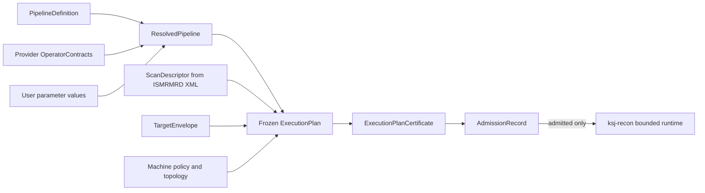
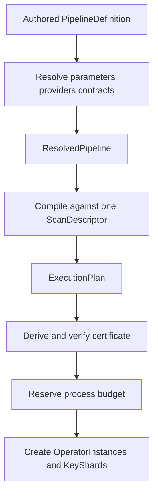
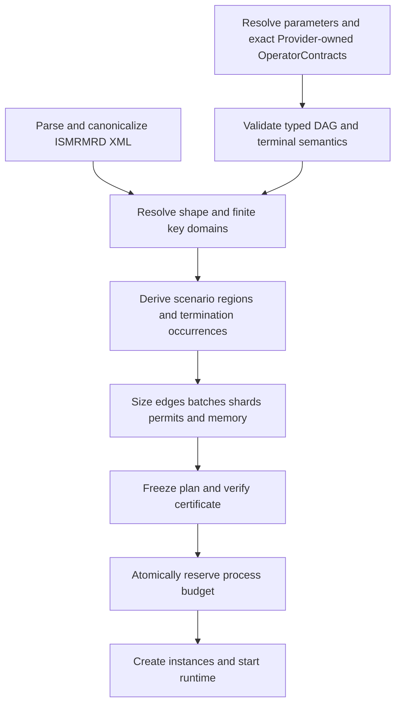
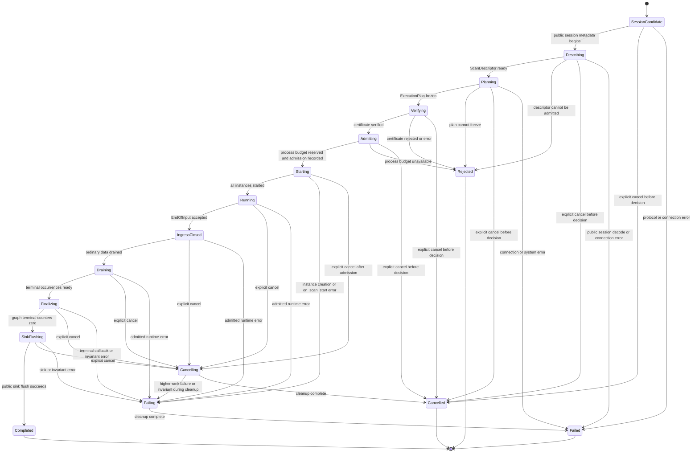

# KSpaceJet PipelineDefinition 与重建流水线设计

> **历史 / 非规范性记录。** 本文保存已撤回或探索性的 Pipeline 设计，不定义当前产品
> 能力、状态、接口、部署、验收或 artifact authority。其关于公开 MRD/ISMRMRD session、
> `ksj-gateway`、Connector、scanner/采集集成、网络 relay/transport 或结构化 core logging
> 的任何表述均已撤回。当前产品边界、artifact authority 与执行状态的唯一权威为
> [KSpaceJet project plan and acceptance](KSpaceJet_project_plan_and_acceptance.md)。
>
> **历史实现基线说明。** 本文与
> [KSpaceJet Pipeline Review Optimized](KSpaceJet_pipeline_review_optimized.md) 共同保留当时
> 对 profile-neutral `ResolvedPipeline`、`PlanBuildRequest`、`TypeDescriptor`、
> `ResourceVector`、`NodePlanningRequirementsBinding` 和 `VerificationRecord` 的设想；两者
> 都不是当前实现的权威。新实现只能依据 canonical execution ledger 及相应受维护的
> 源码、schema 和测试；`ExecutionPlanCertificate`、旧 profile 名称和其他历史字段均不得
> 作为实现依据。

> 状态：历史设计记录；非当前实现基线。
> 历史适用范围：文件 replay、公开 MRD/ISMRMRD streaming session、Provider plugin 与 **ksj-recon** 内部 runtime。
> 非目标：定义新的网络协议、复刻任何私有历史格式、规定具体重建算法，或把运行时调度参数写死在用户 pipeline 文件中。
>
> 本文历史段落中的 `strict-online`、`bounded-best-effort` 等旧 profile 名称不再是当前
> profile identifier；当前 mode、profile 准入和边界见 canonical execution ledger。

> **类型实施基线。** Provider authored `OperatorContract` 的每个 port 只写可读的
> `type_ref`，其唯一来源是 `types/registry.json`。compiler 解析该 TypeRef 后，才在
> `ExecutionPlan` 中冻结完整的结构和自动导出的 `type_identity_digest`；Provider 作者
> 不手写 payload、metadata 或 descriptor digest。

## 1. 目的、边界与权威关系

KSpaceJet 的重建 pipeline 不能只是一个按顺序调用算法模块的配置文件。它必须同时是：

1. 对用户和 Provider 作者可读的声明图；
2. 对扫描专用编译器可求值的资源与依赖输入；
3. 对 runtime 可执行、可观测、可取消的计划来源；
4. 对 certificate、测试和论文实验可冻结的可复现 artifact。

本文件定义这条链中的产品层语义。它回答“图如何写、合同属于谁、扫描开始前如何展开、事件如何同步”；不重新定义数学定理或实现算法。

| 文档或 artifact | 唯一职责 | 不负责 |
| --- | --- | --- |
| **PipelineDefinition** | 作者编写的逻辑 DAG、节点端口、Provider/Operator 引用、参数与边 | scan 专用 shard、队列、线程、NUMA 或 admission 数值 |
| **OperatorContract** | Provider 对一个 Operator 的稳定可连线接口：`operator_id` 与 typed ports；authored port 只含 TypeRef | 节点级调度、资源、速率或终止规划 |
| **NodePlanningRequirementsBinding** | `PlanBuildRequest` 中某个 node 的 scan/planning 输入 | Provider ABI 能力或 authored config |
| **ResolvedPipeline** | 参数默认值、Provider bundle、contract 与配置 schema 的精确冻结结果 | scan shape、动态 process reservation |
| **ScanDescriptor** | 从 ISMRMRD XML 得到的不可变 scan 描述，以及可在准入前获得的公开 metadata | 第三方算法配置、任意未声明运行时状态 |
| **ExecutionPlan** | 某一个 scan 的已冻结物理安排、解析后的 TypeDescriptor，以及每个 node 的 config identity binding | 可编辑的用户配置、动态 admission outcome |
| **ExecutionPlanCertificate** | 对冻结 ExecutionPlan 的独立可验证伴随物 | 第二张 graph 或可被 runtime 回写的计划 |
| **AdmissionRecord** | verifier 结果、动态 process-budget reservation 和 admitted/rejected outcome | 修改 plan 或 certificate digest |

因此，用户写的 PipelineDefinition 绝不是 execution plan。所有任务数、KeyShard 数、edge 容量、batch、CPU permit、NUMA home 和资源 reservation 均由编译器从实际 scan、合同和目标机器导出。

### 1.1 标准术语与多 Operator 组合边界

为避免把所有 artifact 都称为 contract，本文采用以下固定分层：

| 名称 | 唯一职责 | 不应混同为 |
| --- | --- | --- |
| `PipelineDefinition` | 作者编写的逻辑 DAG | 物理执行计划或 Provider 实现 |
| `PipelineNode` | 对一个 Operator 的一次 pipeline 实例化：node id、Operator 引用与实例 config | 可复用算法本身 |
| `Operator` | 语义单一、具有稳定端口与配置语义的可复用算法能力 | Provider、node 或 host runtime 服务 |
| `Provider` | 可独立发布的 bundle/动态库，可实现多个 Operator | 单个 Operator 或整条 pipeline |
| `OperatorContract` | Provider 对一个 Operator 的稳定可连线接口：`operator_id` 与 typed ports | PipelineNode、planning requirements、ExecutionPlan 或运行记录 |
| `OperatorContractBinding` | compiler 对 node、已解析 Provider/Operator 与 typed contract 的绑定 | 用户编辑的 pipeline 配置 |
| `NodePlanningRequirementsBinding` | `PlanBuildRequest` 中 node id 与该实例的调度、资源、速率和拓扑约束 | Provider contract、raw config 或 runtime state |
| `OperatorPlanBinding` | `ExecutionPlan` 中 node id 与 canonical config digest 的不可变对应 | Provider ABI 的第二份 config 参数 |
| `ExecutionPlan` | 某 scan/profile/机器快照的物理资源、执行安排和 node config identity | 作者可编辑的逻辑 DAG |
| `VerificationRecord` / `AdmissionRecord` / `RunRecord` | 验证结论、动态准入结果、实际运行结果 | OperatorContract |

因此，重建 pipeline 应由多个 `PipelineNode` 和 typed edge 组成：一个 node 绑定一个 Operator，同一个 Operator 可在多个 node 或不同序列 pipeline 中复用，一个 Provider 也可以提供多个 Operator。Operator 应保持单一且稳定的算法语义，例如 `kspace_prewhiten → coil_compress → cartesian_fft → coil_combine → image_scale`；但行 FFT、列 FFT 等仅为同一算法内部实现时，不应机械拆成多个 node。`HostFrameAssembler`、admission、`BufferPool`、reorder、bounded edge、ledger、公开 ingress/egress adapter 与生命周期处理属于 host/runtime 能力，不是 Provider 可替换的 Operator。

下列文档共同构成规范，冲突必须先通过 ADR 解决：

- [总体实施规划](streaming_reconstruction_framework_plan.md)拥有产品边界、Provider ABI、部署、工具和权威工作单。
- [MRI 流水线、并行模型与可证明执行理论](streaming_pipeline_parallelism_theory.md)拥有形式模型、证明义务、资源定理和 certificate 验证边界。
- 本文拥有 PipelineDefinition、OperatorContract、ResolvedPipeline 与扫描编译的产品 schema 语义。



## 2. 不变的产品边界

1. 原始采集语义只有 ISMRMRD：离线为标准 ISMRMRD HDF5，在线为冻结的公开 MRD/ISMRMRD streaming session。
2. PipelineDefinition、OperatorContract、plan、ledger、KeyShard 与 CalibrationReady 都是进程内 artifact 或状态；它们绝不变成 KSpaceJet 私有 wire message、credit、ACK 或恢复协议。
3. Provider 是独立动态库 plugin。Provider 仅扩展算法 Operator；不能扩展 scanner protocol、gateway、socket、TLS、控制面或资源账本。
4. 一个 admitted scan 中，一个逻辑 node 恰有一个 OperatorInstance。KeyShard 是该 instance 内部、由 host 创建的 runtime-private 单写者状态，不是额外 Provider instance。
5. Provider 在 **ksj-recon** 进程内运行。native crash、内存破坏或无限不协作 callback 不能在同一进程中隔离；需要更强故障域时应部署独立 reconstruction-service 进程，而不是增加 Provider worker 或私有 IPC。
6. 逻辑 graph 是有限 typed DAG。资源、空闲槽位和 continuation 形成的增强执行图可以有受控循环；用户不能在 PipelineDefinition 中写逻辑环。

## 3. Artifact 生命周期与冻结规则

### 3.1 四个不可混淆的图层



- **Authored PipelineDefinition** 只能引用一个已登记的 Provider identity，不能引用文件系统 DLL/SO 路径。
- **ResolvedPipeline** 必须将所有 Provider bundle digest、Operator、参数默认值和每个 node 的 canonical config 精确化。严格在线准入不能使用未解析配置。
- **ExecutionPlan** 只对应一个 immutable ScanDescriptor、ResolvedPipeline、TargetEnvelope 和 MachinePolicy 组合，并为每个 resolved node 冻结一个 `OperatorPlanBinding { node_id, canonical_config_digest }`。该 digest 由 canonical config bytes 以 `kspacejet:artifact:operator-config` domain 派生；它不是作者可填写的第二份 config，也不是 Provider ABI 字段。
- certificate 仅从已冻结 plan 派生。admission 的成功、拒绝或资源 reservation 不得写回 plan、ResolvedPipeline 或 certificate。

### 3.2 Canonical JSON 与 digest

机器作者格式是 UTF-8 JSON。YAML、Web UI 或其他 authoring UI 可以作为前端存在，但必须先转换为同一个 canonical JSON，runtime 不读取未转换的 YAML/XML 配置。

所有 JSON artifact 使用：

- JSON Schema 2020-12 完成结构验证；
- RFC 8785 JSON Canonicalization Scheme 的 canonical byte sequence；
- SHA-256 作为 artifact digest；
- 受检查的无符号整数算术；所有进入 canonical JSON 的资源、计数、byte、duration 和 dimension 必须是 `[0, 9007199254740991]` 内的整数 JSON number，禁止 NaN、Infinity、负数、分数或隐式浮点舍入；编译器内部可用 `uint64_t`，但不能把超出 JCS 精确整数范围的值序列化；
- 严格拒绝 duplicate key、未知语义字段和未声明字段。

非语义的人类说明只能放在受 schema 限定的 metadata/annotations 字段，且不得影响 digest 之外的执行行为。runtime 不支持静默迁移其他格式；迁移工具必须生成一个新的 canonical artifact 和 provenance。

### 3.3 身份与不可变性

| 对象 | 当前规则 |
| --- | --- |
| PipelineDefinition schema | 固定 `kind`、严格字段和 checked-in schema 共同定义结构；未知必需字段一律拒绝 |
| pipeline identity | `id` 和内容 digest 共同确定作者输入；图、端口、参数默认值或资源相关变化必须产生新的 artifact |
| Provider bundle | provider id 与 bundle digest 共同锁定 |
| OperatorContract | operator id 与 typed ports 定义可连接接口；它不是独立 identity artifact |
| Provider C ABI | host 和 Provider 均按当前唯一 ABI header/descriptor 布局检查；ABI 正确不代表 contract 相容 |
| ExecutionPlan/certificate | 输入 digest 固定；不允许就地修改 |

### 3.4 execution profile 的唯一选择

每次 `ksj run`、online scan 或 `ksj pipeline dry-run` 都由 invocation/request 明确给出一个
`requested_execution_profile`；`PipelineDefinition.allowed_profiles` 与 `MachinePolicy` 共同决定该
profile 是否可选。`OperatorContract` 不声明或选择 execution profile；profile 相关的计划、准入和
运行时要求由 pipeline、MachinePolicy 与实际 runtime 共同处理。compiler 只在请求值被 pipeline 与
部署共同允许时继续，并把这个唯一值冻结到 ExecutionPlan、VerificationRecord 和 run manifest。任何
一层都不得静默替换用户请求的 profile。

## 4. PipelineDefinition

### 4.1 作者可写内容与禁止内容

PipelineDefinition 声明：

- pipeline identity、允许 profile；
- 参数及其有限、可验证的默认值；
- Provider selection constraint；
- graph node、每个 node 的端口接口断言、Operator 与 config binding；
- typed edge；
- ISMRMRD ingress 与 image/waveform egress binding。

PipelineDefinition 禁止声明：

- worker 数、thread affinity、NUMA node、queue depth、queue byte 数、KeyShard 数、task 数、runtime reservation 或 process memory；
- 任意 DLL/SO absolute path、环境变量展开、shell expression、动态脚本、网络 URL 或未签名 bundle；
- 隐式 merge、隐式 drop、隐式 whole-scan barrier；
- 私有 transport metadata、网络 credit、网络 retry 或任何非公开 MRD wire 字段。

MRI acquisition edge 一律是 reliable。若要降采样、合并、丢弃非关键诊断、重排或生成 partial result，必须是显式 Operator，并由其 contract、端口类型与输出边界表达；不能把语义藏在 edge policy 中。

### 4.2 最小结构

```json
{
  "kind": "PipelineDefinition",
  "pipeline": {
    "id": "org.example.reference-cartesian",
    "display_name": "Reference Cartesian reconstruction"
  },
  "input_profile": {
    "kind": "ismrmrd-hdf5",
    "container": {"mode": "auto"}
  },
  "allowed_profiles": ["offline", "bounded-online"],
  "parameters": {
    "acceleration": {"type": "integer", "minimum": 1, "maximum": 8, "default": 2}
  },
  "provider_requirements": [
    {"alias": "reference", "provider_id": "org.kspacejet.reference"}
  ],
  "nodes": [
    {
      "id": "reconstruct",
      "operator": {"provider": "reference", "id": "reference_reconstruct"},
      "config": {"acceleration": {"$param": "acceleration"}}
    }
  ],
  "edges": [],
  "bindings": {
    "ingress": [{"id": "acquisitions", "type": "ismrmrd.acquisition", "to": {"node": "reconstruct", "port": "acquisition"}}],
    "egress": [{"id": "images", "type": "ismrmrd.image", "from": {"node": "reconstruct", "port": "image"}}],
    "calibration": [],
    "merge": []
  },
  "annotations": {}
}
```

为避免本历史示例误导当前格式，`input_profile` 使用受维护 schema 的现行容器选择
语义：`container.mode` 只能是 `auto` 或 `explicit`。`auto` 由未来 P2-007 的
runtime-owned source adapter 在标准 raw-container discovery 后使用，且只在恰有一个
candidate 时绑定；多个 candidate 不能暗中选择 `/dataset`。显式形式为：

```json
{
  "input_profile": {
    "kind": "ismrmrd-hdf5",
    "container": {
      "mode": "explicit",
      "path": "/dataset_2"
    }
  }
}
```

这里的 `path` 是输入 HDF5 文件内的绝对 container path，而不是 host 文件路径。
作者化 parser 只验证和 canonicalize 这一 closed selector；它不扫描 HDF5，也不决定
实际绑定。`dataset_group` 和固定 `dataset` 不是兼容字段。当前格式的权威仍是 checked-in
schema、源码和 canonical execution ledger，而不是本历史文档。

所有数组均使用稳定 id；对象数组的文档顺序不表达执行顺序。graph compiler 依据 edge、order contract 和执行计划决定合法 firing 顺序。

### 4.3 Provider selection

每个 provider 引用有一个本地 alias。alias 使 node 不需要重复 provider id，但不是动态库加载路径。

```json
{
  "alias": "reference",
  "provider_id": "org.kspacejet.reference"
}
```

resolve 阶段把它冻结为：

```json
{
  "alias": "reference",
  "provider_id": "org.kspacejet.reference",
  "bundle_digest": "sha256:...",
  "operators": [{"id": "reference_reconstruct"}]
}
```

resolution 把作者意图变为精确 Provider bundle 与 Operator 选择。已进入 strict-online admission 的 ResolvedPipeline 必须包含这些不可变 identity；没有注册、签名或信任策略不通过的 bundle 不能被 resolution 选中。

### 4.4 参数和 config binding

parameters 是有限、类型化的配置输入。当前格式支持 boolean、integer、string、enum、array 与 object 的受限 JSON Schema 子集；对 dimension、byte、duration 和 count 必须有闭区间。

node config 可以使用 literal，或以下无歧义 parameter reference：

```json
{
  "acceleration": {"$param": "acceleration"},
  "normalization": "unitary"
}
```

格式不支持字符串模板插值、环境变量、文件读取、表达式执行或 Provider 自行修改默认值。解析顺序为：

1. 验证 parameter definition；
2. 合并 command/service 提供的值与 default；
3. 将 parameter reference 替换成 concrete JSON value；
4. 对 concrete node config 运行 Provider config schema；
5. 将结果写入 ResolvedPipeline 并计算 digest；
6. compiler 对每个 resolved node 的 exact canonical config 派生 `canonical_config_digest`，写入
   `ExecutionPlan.operator_plan_bindings`。独立 verifier 必须从同一 ResolvedPipeline 重算完整的
   node→digest 集合；`PlanBuildRequest` 不接受调用者伪造或替换该 digest。

### 4.5 节点、端口和边

node 必须引用一个 Provider alias 和一个 Operator。PipelineDefinition 不重复声明 ports；实际 ABI descriptor 的 OperatorContract 是端口的唯一权威。任一 edge 或 binding 连接到不存在、方向错误或类型不匹配的 contract port 都拒绝 resolution，不能以 pipeline 文件覆盖 Provider-owned OperatorContract。

```json
{
  "id": "reconstruct",
  "operator": {
    "provider": "reference",
    "id": "reference_reconstruct"
  },
  "config": {
    "incomplete_frame_policy": "fail"
  }
}
```

边只连接 node port：

```json
{
  "id": "reconstruct-to-scale",
  "from": {"node": "reconstruct", "port": "image"},
  "to": {"node": "scale", "port": "image"}
}
```

端口类型集合分为：

| 类型类别 | 示例 | 可否跨公开 MRD session | 说明 |
| --- | --- | --- | --- |
| public MRI frame | ismrmrd.acquisition、ismrmrd.waveform、ismrmrd.image | 是 | 与公开 ISMRMRD 语义对应 |
| host materialized intermediate | ksj.kspace-frame、ksj.image-frame | 否 | 仅进程内 BufferHandle/frame contract，不能序列化为私有 raw 格式 |
| internal calibration dependency | concrete calibration TypeRef（如 `ksj.noise-model`、`ksj.phase-model`、`ksj.coil-compression-basis`）与 `CalibrationReady` | 否 | binding 必须显式指向一个 producer output 与每个 consumer input，且 TypeRef 完全相同；`CalibrationReady` 由 host adapter 按已验证 binding 生成，二者均不允许 ingress/egress |
| terminal/failure/cancel | 不作为作者端口 | 否 | 由 runtime 生命周期传播，不允许普通 edge 伪造 |

EndOfInput、Cancel、Failure 与 Completed 不是普通 data port。它们由 runtime 按本文件第 7 节传播，不能被 Provider 或 pipeline author 注入、吞掉或改写。

### 4.6 ingress 与 egress

ingress/egress 是 graph 与公开 MRI session 的唯一绑定点，不是 Provider node：

```json
{
  "bindings": {
    "ingress": [{
      "id": "acquisitions",
      "type": "ismrmrd.acquisition",
      "to": {"node": "reconstruct", "port": "acquisition"}
    }],
    "egress": [{
      "id": "images",
      "type": "ismrmrd.image",
      "from": {"node": "scale", "port": "image"}
    }],
    "calibration": [],
    "merge": []
  }
}
```

- HDF5 replay 与公开 streaming session 都必须映射到同一 ingress frame contract。
- ingress 只能绑定声明的 public MRI frame 类型；每个声明的 node input 恰有一个 producer，除非
  graph 的显式 binding 与该 node 的 planning requirements 定义了一个已验证的多输入关系。
- egress 只能接收与公共 image/waveform contract 相容的输出；最终 delivery 由 runtime 负责，而非 Provider。
- source/sink 不是可替换的算法节点，因而 Provider 无法绕过 admission、read gating、ledger、cancel 或标准 image delivery。

### 4.7 显式 calibration 与 merge binding

`CalibrationReady` 不从“任意看起来像 calibration 的输出”自动猜测。需要 calibration 的
pipeline 必须声明一个 binding；compiler 在 producer 和 consumer 之间插入受控的 host
adapter，而不是将 token 变成普通 MRD message 或任意 Provider callback：

```json
{
  "id": "frame-calibration",
  "producer": {"node": "calibration-reduce", "port": "calibration"},
  "consumers": [{"node": "image-reconstruct", "port": "noise_model"}]
}
```

producer 与 consumer 的 port 必须先在 OperatorContract 中以类型和方向声明。每个 node 的
`NodePlanningRequirementsBinding` 再提供 calibration role、key/bound 与 lifecycle planning；图的
binding 把 producer 与 consumer 精确连起来。host adapter 仅在已验证的 producer completion 发生、材料已经
成为 immutable host-managed BufferHandle 后，产生
`CalibrationReady{key, epoch, digest, handle}`。一个 consumer 每个 binding 只能有一个 producer；
多个 producer 必须先经过一个显式 graph/operator 关系，不能由 runtime 临时挑选。

多条 edge 输入同一 port 同样必须显式。source edge、顺序/close 规则与有限容量属于 graph
binding 和 node planning requirements，不是 OperatorContract 字段；无该显式关系时每个 input
port 恰有一个 producer。更复杂的多输入关系优先使用 Operator 的多个命名 input port。任何
implicit MPMC merge 都是 schema error。

### 4.8 PipelineDefinition 的静态语义验证

JSON Schema 只能检查结构。semantic validator 还必须拒绝：

1. duplicate id、悬空端口、无 source、无 sink、逻辑环或无 reachability 的 node；
2. 边连接的 type、direction 或 access 不兼容；
3. output fan-out 的任何目标不支持 source 的 output contract；
4. authored port 与实际 OperatorContract 不一致；
5. 任一 Provider 不能解析到受信任的 exact bundle；
6. 参数未解析、未知参数、越界值或 config schema 不通过；
7. pipeline 未允许被请求 execution profile；
8. 从公共 ingress 到公共 egress 的路径上存在不可靠 raw edge、隐式 drop 或未声明 partial semantics；
9. 有效的 EndOfInput、failure、cancel 或 completion 路径无法由所有 node 的 planning
   requirements 与 runtime terminal rule 覆盖。

## 5. OperatorContract

### 5.1 所有权原则

OperatorContract 由实际 Provider ABI descriptor 给出，并由 host 解析、hash 和验证。它只声明
`operator_id` 与 typed ports。Provider manifest 仅用于 discovery；PipelineDefinition 的端口断言
仅用于交叉验证；两者都不能放宽该接口。

节点的资源、依赖、速率、终止和调度要求不再借用 Contract 名义：它们是
`PlanBuildRequest` 的 node planning inputs，并在编译时针对 resolved contract 的 ports 验证。

### 5.2 当前 canonical taxonomy：Contract、planning 与 config identity

当前 schema 的字段权威是
[`operator-contract.schema.json`](../../schemas/operator-contract.schema.json)。三个问题必须分开：

| 对象 | 唯一职责 |
| --- | --- |
| `OperatorContract` | Provider-owned 的稳定可连线接口，仅为 `operator_id` 与 named typed ports。 |
| `PlanBuildRequest.NodePlanningRequirementsBinding` | 每个 pipeline node 的规划输入：调度、资源、速率、拓扑和终止等 requirements。它针对 resolved ports 验证，但不成为 Provider ABI 声明。 |
| `ExecutionPlan.OperatorPlanBinding` | 每个 resolved node 的 `node_id` 与 `canonical_config_digest` 的冻结对应。 |

每个 `PipelineNode` 的 raw config 属于 PipelineDefinition/ResolvedPipeline。compiler 从 resolved
node 的 exact canonical config bytes 以 `kspacejet:artifact:operator-config` domain 派生 digest，写入
`ExecutionPlan.operator_plan_bindings`；独立 verifier 重算并要求 node 集合和 digest 精确匹配。
`PlanBuildRequest` 不接受调用者提供的 config digest，Provider C ABI 也不新增该字段。

规划 requirements 一律 live in `PlanBuildRequest`。它们可以引用 Contract 的已解析 ports，却不能把
Provider capability、某个 node 的 config、edge id、队列、worker、placement 或 scan-specific 资源计划
塞回 Contract。当前 `NodeRateSpec` 与 `TerminalPlanningSpec` 承载已实现的 rate/terminal planning；
旧文中的 `CompletionSpec`、`MergeSpec`、`cancel_cleanup`、`call_model`、`order_domain`、implementation
variant、partition/fusion capability 与通用 resource-expression taxonomy 都不是当前 canonical Contract
字段。本文后续若讨论这些旧称，只是概念模型或未来设计，而不是可填写的 Contract schema。

完整可解析例子位于
`providers/kspacejet-cartesian-recon/contracts/cartesian_ifft2_coil_images.json`。其 port 作者视图如下：

```json
{
  "kind": "OperatorContract",
  "operator_id": "cartesian_ifft2_coil_images",
  "ports": [
    {
      "name": "kspace",
      "type_ref": "ksj.kspace-frame",
      "direction": "input"
    },
    {
      "name": "coil_images",
      "type_ref": "ksj.coil-image-frame",
      "direction": "output"
    }
  ]
}
```

这里没有 payload、metadata、descriptor digest 或 optionality 字段：它们不是 authored contract
输入。registry resolution 和 plan compilation 负责生成可验证的精确 descriptor。每个声明的 input
都必须由一条 ordinary data edge、ingress 或 explicit calibration binding 精确提供一次。

runtime 禁止 `on_cancel` 发布普通 MRI data 或触发 data-producing 下游 firing。这是 terminal
rule，不是名为 `cancel_cleanup.outputs` 的 Contract 字段。

### 5.3 后续设计：输入粒度、Key 与顺序（非当前 schema）

本节 5.3–5.6 保留为将来 planning/model 设计的讨论。它们不定义当前 Contract schema；当前
generic synchronous runtime 的行为以第 12 节为准。下表描述候选 planning granularity，而不是
Contract 的字段列表：

为避免与第 5.2 节混同，本节历史文字中的“contract 声明”一律应理解为未来的
`NodePlanningRequirementsBinding`，而不是 `OperatorContract`。

| granularity | firing 单位 | 常见用途 |
| --- | --- | --- |
| acquisition | 单个 acquisition | header validation、轻量预处理 |
| microbatch | 同一 batch domain 的若干 acquisition | 固定开销摊销 |
| window | 具有有限 completion predicate 的 key window | Cartesian bin、有限 frame accumulation |
| frame | 已完成的 logical frame | transform、coil combination、image formation |
| volume | 声明上界的 volume/window | 有界 volumetric post-process |
| scan_finalizer | EndOfInput 且所有前驱 drained 后 | 明确的全 scan finalizer |

partition_key、order_domain 和 join key 都是对内部 AcquisitionIndex 的 IndexProjection。可用字段包括 scan、encoding、average、slice、contrast、phase、repetition、set、segment 与 acquisition_ordinal。node planning requirements 只选择需要的字段；框架绝不把 slice 或 channel 硬编码成默认并行单位。

channel 的处理尤其不能猜测：如果某个 Operator 把 coil channel 作为同一个 frame payload 的维度，它不是额外 KeyShard。当前只有 node planning requirements 明确附带 `NodeChannelGroupSpec` 时才可以把 `channel_group` 加入 projection；它冻结 `channels_per_group`、`max_active_channels` 与 `max_groups` 的有限界。公开来源、canonical group 规则、每 group byte bound 以及其来自 ScanDescriptor 还是 TargetEnvelope 的细化，仍是未来 planning 设计，不是当前 `NodeChannelGroupSpec` 字段。无 `NodeChannelGroupSpec` 时，`channel_group` 不是合法 IndexProjection 字段。

order_domain 只允许：

- strict_global：一个全 scan 输出顺序；
- per_key：每个 declared order key 串行；
- unordered：输出集合允许无序，但仍必须使用 canonical key 比较正确性。

当前 generic plan 不含隐式 reorder 表或 ordinal 规则。若一个算法需要重排，它必须由一个显式
Operator 或冻结的 ingress 语义完成；不能借由 node planning requirements 推断。

### 5.3.1 NodeRateSpec、completion 概念与 terminal planning

资源上界不足以生成 `Gamma`、repetition vector、EndOfInput balance 或 finite termination
ranking。每个 node 的 planning requirements 必须按自身区域选择以下之一：

| 区域 | 必需声明 | certificate 能验证的对象 |
| --- | --- | --- |
| static SDF | 每个 input/output port 的精确整数 consumption/production rate | rate balance 与 repetition vector |
| CSDF | 有限 phase cycle；每 phase/port 的精确 rate | 完整 phase cycle balance |
| keyed dynamic/window/finalizer | 当前 `NodeRateSpec` 的 ordinary/normal-flush output bound；更丰富的有限 completion 条件与 cancel cleanup 仅为概念模型，不是当前 API 字段 | finite EndOfInput balance、occurrence ranking 与资源界 |

静态区域使用如下结构；`phases` 长度为一时即是 SDF，长度大于一时是 CSDF：

```json
{
  "kind": "csdf",
  "phases": [
    {
      "inputs": {"acquisition": {"consume_items": 1}},
      "outputs": {"frame": {"produce_items": 1}}
    }
  ]
}
```

keyed dynamic、window 或 finalizer 的下列结构保留为更丰富 planning 模型的概念示例；它不是当前
`NodeRateSpec` JSON。当前 `NodeRateSpec` 只含 `kind`、static phases、ordinary output bounds 与
normal-flush bounds：

```json
{
  "kind": "keyed_dynamic",
  "completion": {
    "kind": "expected_count",
    "value": {"ref": "scan.encoding_limits[0].kspace_lines"},
    "on_end_of_input": "fail"
  },
  "ordinary": {
    "max_firings": {"ref": "scan.max_frame_acquisitions"},
    "outputs": {
      "frame": {"max_items": 1, "max_charged_bytes": {"ref": "scan.max_frame_charged_bytes"}}
    }
  },
  "normal_flush": {"max_firings": 1, "outputs": {}},
  "cancel_cleanup": {"max_firings": 1, "outputs": {}}
}
```

作为概念模型的 completion 条件（旧文称 `CompletionSpec`）只能由 finite checked expression 组成：
`expected_count`、公开 header/flag predicate、watermark、end_of_key 或 EndOfInput；每种未完成情况必须有 `fail`、显式
`partial_output` 或 certificate 中的 `skip` 行为。对每个 output port，node planning requirements 分别声明
`ordinary` 和 `normal_flush` phase 的 item/charged-byte upper bound；normal terminal output
不能复用笼统的 ordinary maximum。cancel cleanup 没有普通 data output bound，且任何由它触发的 cleanup 都不得形成普通 data edge 或 downstream
ordinary firing。minimum consumption、close behavior 和 MergeSpec 中的输入关系都不是 Contract
port 语义；每个声明 input 的来源、consumption、close 与多输入规则由 planning/graph binding 表达，
compiler 才能确定一个 node 何时具备 terminal 资格。

### 5.4 Batch、资源和有限性

同一 batch 只能混合以下字段完全相同的事件：

```text
operator
partition key and order domain
calibration version
shape and layout
deadline class
resource class
```

当前 `NodeBatchSpec` 给出 item 与 charged-byte 上限。runtime 可以在 node planning requirements 的范围内选择实际 batch；它不得为了达到 preferred size 无限等待，也不得跨 calibration version、shape 或 order domain 混批。wait/deadline 上限是未来 planning/runtime 设计，不是当前 `NodeBatchSpec` 字段。

`max_in_flight` 是一次 scan 中该 node 唯一 OperatorInstance 跨全部 KeyShard 的
instance-wide 上限，即理论模型的 `P_v`，不得按 shard 再乘一次。单个 serial KeyShard
另外满足 `queued + running <= 1`。CPU permit 也必须按互斥类别记账：普通 callback 使用
`executor_leaf`，backend gang 的 coordinator 与内部线程共同使用 `backend_gang`，其余未被
前两类计入的 Provider 自建线程才使用 `provider_private`。三者之和不得超过 MachinePolicy
预算。host 无法直接管理的 Provider allocation 只能进入外部 budget/OS quota；不得冒充
host ledger 的 `M_plan`。

所有 output、scratch、retention、workspace、async token、reorder、join 和 Provider-private thread/allocation 都必须由 planning requirements 给出 finite upper bound 或由受检查表达式导出。无法给出有限上界的 Operator：

- 不能进入 strict-online；
- 不能为 bounded-best-effort 宣称 resource bound；
- 只能在明确标记的 offline-spooled 或 research-unbounded profile 使用；
- 不能被默认 production pipeline 选择。

### 5.5 Calibration、join、reorder 与 terminal contract

Calibration dependency 必须声明：

```text
dependency = none | calibration_ready
calibration key projection
epoch policy = single_epoch
per-key and aggregate precalibration horizon in items and charged bytes
maximum active calibration keys
maximum calibration frame and decoder staging bytes
behavior when EndOfInput arrives before readiness
```

当前 `NodeJoinSpec` 只声明 aggregate retention reservation 与 online admission 所需的
`progress_proof=verified_schedule_automaton|cohort_reservation`；input wiring 仍属于 PipelineDefinition。
每个输入的 key projection、required count/window、watermark/end-of-key/EndOfInput policy、per-key
retention、calibration-version compatibility 与 exactly-once emission rule 是更丰富 join 模型的概念，
不是当前 `NodeJoinSpec` 字段。

当前 generic plan 不定义专用的 reorder specification。每条 data edge 保持 FIFO，多个动态 input 以完整
`DataItemIdentity` 组成显式 cohort；复杂重排、稀疏域、partial result 与 keyed window 仍应由
单独 Operator 和后续计划模型表达，不能隐式落入 executor。

normal `on_scan_end` 与 exceptional `on_cancel` 都是 certificate 中的 terminal occurrence。normal
path 的 `normal_flush` 可以产生已声明、已认证且有界的普通 MRI data output；exceptional path
只能完成资源释放、quarantine、已注册 async
settlement 与独立审计诊断。两条路径的 firing、scratch、cleanup 与 async token 都必须预先
有界、预留并计入 termination ranking；Provider 不得在 terminal callback 中创建未认证 work。

### 5.6 有界资源表达式

Node planning requirements 中的 `ref` 和上界不能执行任意脚本。它们使用受限的 JSON
表达式树，所有中间值都用无符号 64 位 checked arithmetic 计算；溢出、负值、除零和
无法证明为有限的表达式立即使 plan 失效。当前格式只允许以下节点：

```text
{"const": 1}
{"ref": "scan.encoding_limits[0].slice_count"}
{"op": "add", "args": [EXPR, EXPR]}
{"op": "mul", "args": [EXPR, EXPR]}
{"op": "min", "args": [EXPR, EXPR]}
{"op": "max", "args": [EXPR, EXPR]}
{"op": "ceil_div", "args": [EXPR, EXPR]}
```

`ref` 只能指向编译器公开的 `ScanDescriptor`、`TargetEnvelope`、resolved port/interface
或 MachinePolicy 字段；不能读取环境变量、文件、网络或 Provider 私有状态。`sub` 不在
当前格式中提供；需要差值时由 schema 明确声明一个非负派生字段。表达式的 canonical JSON
本身进入 planning input/plan provenance，plan 必须同时保留解析后的值和输入引用，便于解释“任务数、
队列容量和预算如何由实际 scan 得到”。

## 6. 从 ScanDescriptor 到 ExecutionPlan

### 6.1 编译输入

计划编译发生在 ISMRMRD XML 可用后、第一条 acquisition 进入算法 graph 前。输入固定为：

```text
ResolvedPipeline
actual Provider ABI descriptors and OperatorContracts
NodePlanningRequirementsBinding for every resolved node
ScanDescriptor parsed from ISMRMRD XML
TargetEnvelope
MachinePolicy and discovered topology
requested execution profile
```

ScanDescriptor 至少 canonicalize encoding、encoded/recon matrix、FOV、trajectory、encoding limits、direction、已声明 coil/receiver capability 与 shape inference 所需字段。XML 中没有、但每条 acquisition 才揭示的字段不能被事后当作 admission 前已知事实。

对于这一类字段，TargetEnvelope 必须给出有限上界，runtime 在 ingress 验证每个实际值。若公开 binding 在首条 acquisition 前提供该 metadata，才可以把它加入 ScanDescriptor；否则 strict-online plan 只能使用 envelope bound。超出该 bound 是 admitted 后的 input/envelope violation，不是静默扩容或重新规划。

### 6.1.1 TargetEnvelope 与 MachinePolicy 的字段所有权

完整 typed value 均是 pipeline 之外、可审计且有 digest 的输入。这样同一个声明图可以在不同
机器和不同 scanner envelope 上得到不同的合法 ExecutionPlan，而不会被作者配置中的
经验常数锁死。当前小型 source configuration 尚未有 loader 或 digest，不能替代该 typed value。

> 下表描述的是未来 compiler/verifier 所见的**完整 typed planning value**，不是当前
> `config/` 下可编辑 JSON 的格式。当前 source configuration 只保留少数外层 ceiling；在
> P0-006 获得每项 authority 以前，不能以默认值把它扩展为下表的完整对象。

| Typed planning value | 必须提供的约束 | 明确不应出现的内容 |
| --- | --- | --- |
| TargetEnvelope | 最大 XML/frame/image/decoder-staging bytes、samples/trajectory/channel-group 上界、最大 acquisition 速率和 burst、最大 active scan、每个动态 key 的有限 cardinality、calibration horizon、公开 ingress arrival envelope、egress/sink 最小 service 假设、最大外部 stall 与 input/output boundary | 某个 Provider 的线程实现细节、任意 DLL 路径、私有 wire credit |
| MachinePolicy | process/shared/scan memory cap、CPU/backend/provider permit 总量、NUMA domains、允许 memory domain、scheduler/fairness policy 和允许的 execution profile | pipeline node 数、固定 slice/task/shard 数、算法参数或 scanner 私有 metadata |

TargetEnvelope 的 `max_*` 是输入验证上界，不是“只要写了就一定能够完成”的承诺；
MachinePolicy 与 node planning requirements 共同决定是否有足够资源。compiler 必须将二者用到的
具体字段和值写入 ExecutionPlan 和 certificate，而不是只保存两个文件名。

当前 `config/machine-policy.json` 只写一个 execution profile、host-memory、CPU/I/O 与 GPU
enablement；`config/target-envelope.json` 只写 XML/acquisition/frame/image、samples、channels
和 active-scan ceiling。它们刻意不含 `arrival_envelope`、`sink_service_assumption`、calibration、
NUMA、device 或 scheduler 字段。未来的 public/online profile 若需要 `arrival_envelope` 或
`sink_service_assumption`，其 owner 必须在 P0-006 中冻结其来源和值，随后由 typed parser 明确
构造完整 planning value；不得把本地 development config 静默扩展为该对象。

### 6.2 编译算法



编译器按以下顺序工作：

1. 验证 PipelineDefinition schema、canonical digest、Provider bundle、actual ABI descriptor 与 concrete config。
2. 验证 typed DAG、Contract ports、node planning requirements、calibration/graph binding、order、source/sink，以及 EndOfInput/failure/cancel coverage。
3. 用 ScanDescriptor、TargetEnvelope 和 checked expressions 解析 shape、最大 frame bytes、有限 key domain、window cardinality、arrival/service assumptions 与 scenario。
4. 为每个 logical node 创建一个 OperatorInstance plan；为每个 partition domain 推导 KeyShard plan，而不在定义文件中读取任何手工 task count。
5. 推导 ingress、edge、retention、join/reorder progress proof、egress、calibration-progress reservoir、scratch、workspace、continuation 与 terminal work 的 item/charged-byte capacity。
6. 在 MachinePolicy 限制下选择合法 batch、in-flight、CPU/backend/provider permit、NUMA home 和 placement。
7. 生成 finite normal/flush/cleanup occurrence 或等价受验证计数器，计算 M_plan、resource lower bound、schedule policy 和 proof obligations。
8. 冻结 immutable ExecutionPlan，派生 certificate，由独立 verifier 重新检查。
9. 仅在 verifier 成功且 process budget 原子 reservation 成功后，创建每 node 的 OperatorInstance 并调用 on_scan_start。

### 6.3 KeyShard 与任务粒度

ExecutionPlan 的 KeyShardPlan 至少记录：

| 字段 | 含义 |
| --- | --- |
| key projection | 来自对应 node planning requirements 的分区字段 |
| key domain | 由 XML limits、固定配置和 TargetEnvelope 共同形成的有限域 |
| materialization | eager enumeration 或受限 lazy creation |
| max active shards | 同时可存在的 shard 上界及其状态/邮箱 reservation |
| mapping | key 到 shard slot、NUMA home 和 order domain 的确定映射 |
| activation bound | 每次 activation 的 items、bytes 与 cooperative quantum |

对 XML 已给出完整 limits 的维度，compiler 可以枚举实际 encoding/slice/contrast/repetition 等 key。对只能由 TargetEnvelope 上界的维度，compiler 分配有限 slot pool，按稳定 hash 或已验证 mapping lazy materialize；slot 数、邮箱和状态已进入 ExecutionPlan，运行时不得无限新建 shard。

这保证“按真实 scan 解析任务”不退化成“将某个经验常数写进 JSON”：

- frame/window Operator 的 firing 由实际 FrameKey completion 触发，而非每 acquisition 一 task；
- acquisition/microbatch Operator 只创建 coalesced KeyShard activation，不预建 future/task；
- channel、slice、contrast、encoding 只有在合同的 projection 中出现时才影响并行度；
- 输入中出现计划外 key、cardinality 或 frame size 时，runtime 按 profile 明确 Failed 或使用已声明 spool，绝不无界扩容。

### 6.4 ExecutionPlan 的最低内容

```text
input digests: resolved pipeline, ScanDescriptor, TargetEnvelope, MachinePolicy
one OperatorPlanBinding for every resolved node: node id + canonical config digest
node planning requirements provenance used to derive the physical plan
resolved public ingress and egress bindings
shape/layout and maximum charged-byte bounds
scenario regions, rate/EndOfInput balance and terminal occurrence ranking
OperatorInstance and KeyShard plans
edge and reservoir item/charged-byte capacities
batch, activation, CPU/backend/provider permit and NUMA placement policy
join/reorder progress proof, calibration binding and progress rules
scan M_plan, shared/process budget requirements and external budget boundary
service/arrival assumptions, resource lower bounds and profile obligations
```

plan 是 immutable。observed item count、actual queue high water、admission outcome、trace 和 error 只能进入 runtime artifact 与 AdmissionRecord，不能修改 plan。

## 7. Runtime 同步与生命周期语义

### 7.1 Scan、edge、OperatorInstance 的关系



连接被接受只会产生 SessionCandidate，不代表 scan admitted。有效 XML 但不能满足
PipelineDefinition/contract/plan 的 scan 在 admission 前进入 Rejected；公开 session 解码、
连接或系统错误即使发生在 admission 前也是 Failed session，而非 schema rejection。admitted
后的 protocol、Provider、resource、sink 或 invariant error 一律进入 Failed。Completed 只能
表示 host 已成功 flush 到公开 MRD/image sink 的可见边界，不承诺跨网络 durable exactly-once。

每个 data edge 有 Open、ClosePending、Closed 三个内部状态：

1. source 接受 EndOfInput 后停止接收普通 frame，并把它自己的每条出边标为 ClosePending；
2. EndOfInput/ClosePending 绝不越过此前 FIFO data，也不占用可能耗尽的普通 data queue slot；
3. 每条普通 data drain 后，目标 input port 才观察到 closed；同一个规则在每个中间 node 重复传播；
4. 当一个 node 的全部声明 input 已 closed，且已运行的 ordinary callback 到达安全序列化点时，runtime 预约 normal terminal bundle 并恰好一次调用 on_scan_end。window、join、reorder 的剩余状态可以由这个已经认证的 callback 按合同完成 bounded flush，不能要求它们在 callback 前已经自行清空；
5. on_scan_end 及其已声明的 async/flush output 全部完成后，该 node 才把每条 output edge 标为 ClosePending；从此不得再提交该 node 的 ordinary 或 terminal output；
6. 下游接收 ClosePending 后按同一规则 drain、finalize 和 close。cancel/failure 路径不伪造 normal close，而是停止普通 firing、运行已预约的无普通 data-output cleanup 并释放所有 edge reservation；
7. 所有 edge Closed 且 empty、所有 terminal occurrence 完成、所有 async token/output/handle settled、sink flush 成功且 counter 为零，scan 才能 Completed。

### 7.2 KeyShard activation 与无阻塞规则

一个 KeyShard readiness 是：

```text
input available
and all declared dependencies ready
and full output reservation available
and scratch and retained-state reservation available
and CPU/backend permits available
and reorder slot available when required
```

在 dequeue 或调用 Provider 前，runtime 必须原子取得完整 firing bundle：

```text
input claim
all fan-out output item and charged-byte reservations
scratch, retention and workspace reservation
task or continuation descriptor
CPU or backend-team permits
reorder slot and terminal occurrence budget when applicable
```

任一部分失败时，runtime 释放已尝试 reservation、保留已计量输入在 mailbox 中并注册 continuation；不得持有 input、worker permit 或部分 fan-out reservation 等待其他资源。compute worker 永远不等待满 queue、socket、future、calibration、join、GPU fence 或 backend permit。

每个 serial KeyShard 始终满足 queued plus running no greater than one。activation 仅处理合同允许的 max items 或直到 cooperative quantum，用完后重新入 ready queue。这样调度开销随活跃 shard/activation 而非裸 acquisition 数量增长。

### 7.2.1 terminal callback 的安全序列化

terminal arbiter 先停止创建新的 ordinary firing，并让已经运行的同步 `process_batch`
callback 在声明的 cooperative safe point 返回；这是一条 continuation 条件，compute worker
不得原地等待。对正常 EndOfInput，所有 ordinary work 必须已经完成或按 certificate 标为
skipped，随后才可以调用 on_scan_end。对 cancel/failure，host 在同步 callback 到安全点后
立即预约 terminal cleanup 并调用 on_cancel；它**不得**先等待 pending async token、retain 或
output 归零，因为 on_cancel 正是要求 Provider 触发这些资源释放的入口。

terminal arbiter 为 instance 递增不可逆 terminal epoch。每一次 ordinary output commit 和
async completion 都必须携带其认证 occurrence 与 epoch；epoch 已失效时不得提交普通 output，
只能释放其 reservation 并记录取消/失败。normal `on_scan_end` 的 callback/flush 可以使用其
认证的 terminal output occurrence；`on_cancel` 的 cleanup 没有普通 output occurrence，且
不得触发 ordinary downstream firing。两者的 cleanup 和 async work 都必须已在 certificate
occurrence ranking 中。

当前进程内 ABI 不能强制终止不返回的 native callback。超出 quantum 的 callback 仅在其返回后
记录 Provider violation；在此前 runtime 不承诺有限 cancel/completion bound，该 Provider 也
不得被 strict-online admission 接受。

### 7.3 Fan-out、join 与 reorder

- **Fan-out**：payload 用 immutable BufferHandle 共享。publish 前对所有 target edge 原子预留 item/bytes；只有全体 reservation 成功才 commit，可见性是 all-or-none。慢分支 retain 的 payload 生命周期进入 retention ledger。
- **Join**：每个 key 只在全部声明的动态 input、count/window 和 calibration version 一致时 emit 一次。合同未给出有限 skew、retention 和 flush 的 join 不得 strict-online admission。对 strict-online，certificate 还必须为每个 join 提供 `progress_proof=verified_schedule_automaton|cohort_reservation`；若使用 cohort reservation，接收该 key 的第一个输入前必须预留它到 join completion 的最坏进展容量，拿不到完整 cohort capacity 就不得消费上游 item。
- **顺序与 cohort**：每条 data edge 以 FIFO 交付；一个多动态输入 firing 只在所有 head 的完整 `DataItemIdentity` 相等时执行。缺少 sibling 时所有 claim 回滚，identity 不匹配则 fail closed。需要重排、稀疏域或 partial result 的算法必须作为显式 Operator 进入图。
- **Partial result**：默认 EndOfInput incomplete join/frame 为 failure。只有 contract 具有显式 PartialFrame output type 和有限资源/metadata 语义时才可输出 partial result。

### 7.4 Keyed CalibrationReady gate

CalibrationReady 是 session adapter 之后的内部 immutable dependency token：

```text
CalibrationReady {
  calib_key,
  epoch = 0 for the current single-epoch policy,
  calibration_digest,
  read_only_buffer_handle
}
```

每个 gate 都来自第 4.7 节的一个已冻结 calibration binding，并按 `(binding_id, consumer,
CalibKey)` 实例化；不存在“扫描中临时寻找一个 calibration producer”的路径。CalibKey 来自
OperatorContract 的 IndexProjection。校准/影像分类只能使用公开 ISMRMRD header、flags 和已冻结
config predicate；token 不被序列化到 MRD session，也不是私有 frame。

每个 key 的 gate 状态为 Collecting、Ready、Failed、ClosedMissing：

- Ready 前到达的 dependency-required imaging frame 进入该 key 的 bounded waiting set；
- Ready 只唤醒匹配 key，绝不建立 scan-global calibration barrier；
- 当前实现只允许 single epoch；重复 token、epoch 不匹配或同 key 可变 latest state 均是 contract violation；
- EndOfInput 时未 Ready 的 required key 以 CALIBRATION_MISSING_AT_END_OF_INPUT 失败；
- 超过 per-key 或 aggregate horizon 时以 CALIBRATION_HORIZON_EXCEEDED 失败并停止继续 read。

strict-online admission 必须预留以下互不挪用的 progress capacity：

```text
per-key prefix items and charged bytes
aggregate prefix items and charged bytes
maximum active calibration keys
maximum calibration frame bytes
maximum decoder staging bytes
```

该 calibration_progress_reservoir 只用于使尚在后面的 calibration frame 有机会到达。普通 gate retention、output、trace 或另一 scan 均不得借用它。没有 item 和 byte 双界时，必须使用明确 bounded spool、选择非 strict profile 或拒绝准入。

### 7.5 背压、错误与取消

backpressure 只在进程内表达：

- ingress 在 materialize 前取得 item、charged-byte 和 MemoryBroker reservation；不足时停止提交下一次 read/readiness；
- raw acquisition 不允许隐式 drop；合法动作只有 pause、reject new scan、fail/cancel current scan 或显式 spool；
- output 在 publish 前预留 bounded send queue；socket write completion 只表示 host storage 可以释放，不表示远端持久化；
- telemetry 可以声明为可丢，但它拥有独立、有限 budget，不能借用 MRI data 或 calibration progress capacity；
- public session 仅通过标准 transport 的正常流控或关闭/错误体现结果，不增加 KSpaceJet wire credit。

取消和错误均由单一 terminal arbiter 处理：

| 时点或原因 | scan outcome | 必需行为 |
| --- | --- | --- |
| schema、port、Provider ABI、descriptor 或 finite-bound 无效 | Rejected | 不创建 OperatorInstance；写 staged AdmissionRecord |
| certificate 或 process budget 不可行 | Rejected | 不让 acquisition 进入算法 graph |
| 用户明确 cancel | Cancelled | 停止普通 firing，预留 terminal cleanup，恰好一次 on_cancel |
| ingress envelope、calibration/join/reorder、Provider、ledger、sink 或 audit 错误 | Failed | 停止普通 firing，传播 failure，释放后进入唯一终态 |
| native plugin crash | reconstruction-service process failure | 不能伪称单 scan 隔离；由部署监督器处理 |

admission 前的显式 cancel 直接结束为 `Cancelled`，不创建 Provider instance，也不能把
用户取消伪装成 `Rejected`。现有 `AdmissionRecord.outcome` 只表示 `admitted` 或
`rejected`：尚未作出 admission decision 的取消只记录到 run manifest 的
`admission_status=cancelled_before_decision`；如果 plan 已冻结，可附其 immutable digest，
但不能倒写出虚假的 rejection record。

对一个 admitted scan，terminal arbiter 只允许一个最终结果。`Completed` 一旦出现不可
再改变；其余情况下 invariant/protocol/provider/sink failure 的优先级高于显式 cancel，
因此 cancel 与 failure 竞争时最终为 `Failed`，并在结构化记录中保留 cancel 为 secondary
cause。实现使用单调 cause rank `none < cancel < failure < invariant`；较高 rank 可以在
cleanup 前升级已记录的较低 rank，`Completed` 不能再升级。这样不会把已经失败的 scan
错记为取消成功。

normal EndOfInput 路径中，host 在适当的 terminal reservation 已取得后恰好一次调用 on_scan_end；cancel/failure 路径对已经创建的 instance 恰好一次调用 on_cancel，尚未创建的 node 不伪造 callback。normal path 可以触发已声明、已认证的 bounded flush/async output；cancel/failure path 只能触发无普通 data output 的 bounded cleanup/async settlement。之后才等待全部 KeyShard、occurrence counter、token、output 和 handle quiescence，再 destroy OperatorInstance。

## 8. profile、证明义务与观测

PipelineDefinition 和 OperatorContract 使下列理论义务可以被 compiler、certificate 与 runtime 共同检查：

| 性质 | 必需 schema/plan 信息 | verifier 与 runtime evidence |
| --- | --- | --- |
| typed safety | port type、shape/layout、rate、source/sink | PO-01 与 schema/graph corpus |
| bounded memory | output/scratch/retention/state/edge/transport bound | M_plan、ledger conservation、resident trace |
| internal progress | full firing reservation、finite join/reorder、continuation、calibration horizon | PO-07 至 PO-09 与 virtual-time model |
| deterministic ordering | key/order/merge/reorder rule | serial oracle 与 randomized legal interleavings |
| finite drain | EndOfInput balance、terminal work、occurrence ranking | terminal counter 和 zero-at-Completed trace |
| throughput/latency envelope | resource demand、batch、arrival/service assumptions | plan lower/upper bounds 与 benchmark gap |

这不是“证明所有 MRI pipeline 在所有机器上最快”。严格可声称的结论仅限于冻结 TargetEnvelope、MachinePolicy、OperatorContract、公开输入和 certificate 假设内的安全性、条件性活性、资源界和 performance envelope。p99 仍需由独立 run/scan 的统计实验报告，不能由平均服务时间或 queue bound 直接替代。

## 9. 工具、artifact 与开发流程

当前设计要求下列 CLI/服务工具共享同一 parser、resolver、compiler 和 verifier：

```text
ksj pipeline validate <pipeline.json>
ksj pipeline resolve <pipeline.json> --provider-root <root>
ksj pipeline explain <resolved-pipeline.json> --input <scan.h5>
ksj pipeline dry-run <resolved-pipeline.json> --input <scan.h5>
ksj pipeline render <resolved-pipeline.json>
ksj pipeline verify-certificate <execution-plan-certificate.json>
ksj plugin inspect|doctor|test <plugin-bundle>
ksj run --input <scan.h5> --pipeline <pipeline.json>
```

命令中的 `--provider-root` 是已注册、canonicalized、不可变且受 trust policy 管理的 Provider
root selector，不是任意文件系统路径。`plugin inspect/doctor/test` 只有在 bundle 位于该 root
或显式配置的 developer root 时才可以加载动态库；developer root 仍必须做 manifest、schema、
hash、ABI 和 dependency audit，且不能被 production `ksj-recon` registry 自动信任。

实现时 schema 文件的稳定位置和职责为：

```text
schemas/pipeline.schema.json
schemas/resolved-pipeline.schema.json
types/registry.json
schemas/type-registry.schema.json
schemas/operator-contract.schema.json
# PlanBuildRequest is in-memory compiler assembly, not a portable schema artifact.
schemas/target-envelope.schema.json
schemas/machine-policy.schema.json
schemas/execution-plan.schema.json
schemas/verification-record.schema.json
schemas/admission-record.schema.json
schemas/run-record.schema.json
```

其中 JSON Schema 只做结构/基本值域检查；Provider descriptor cross-check、DAG、受限
表达式、finite bounds、resource arithmetic 和 certificate proof obligations 均由同一个
semantic compiler/verifier 完成。

dry-run 与 online admission 必须调用同一 plan compiler 和 independent verifier；任何仅用于 CLI 的第二套 planning logic 都是错误。每个 run 至少冻结：

```text
canonical PipelineDefinition and ResolvedPipeline digest
Provider bundle, contract and config schema digests
ScanDescriptor, TargetEnvelope and MachinePolicy digests
ExecutionPlan, certificate and AdmissionRecord
execution profile, runtime build, Conan lock and Intel payload identity
metrics, logs and optional proof-audit trace
```

公共 Cartesian reconstruction pipeline 的首个用途是验证框架语义，而不是承载专有算法。它应采用显式 graph，例如 acquisition validation → finite Cartesian bin → frame transform → coil combine → image sink；FrameKey、incomplete-frame、normalization、metadata、EndOfInput 与 golden semantics 必须在独立 Provider 设计中冻结，不能由 benchmark 或 Gadgetron 配置隐式决定。

## 10. 验收矩阵

在并行 fast path 之前，必须先有串行 oracle、schema corpus 和 deterministic virtual-time runner。

| 类别 | 必须覆盖的反例或正例 |
| --- | --- |
| schema and digest | unknown field、duplicate id、canonical JSON byte stability、超过 JCS exact-integer range、unresolved provider、contract mismatch、parameter/config error |
| graph compiler | SDF/CSDF rate balance、dynamic completion 条件（概念模型；旧文称 `CompletionSpec`）、calibration/merge binding、多 encoding/slice/contrast/channel envelope 产生不同 plan；没有硬编码 task/shard 数；未知维度无 envelope 时 strict reject；checked arithmetic overflow |
| lifecycle | empty scan、last frame then EndOfInput、每 node terminal output 后 closure propagation、duplicate EndOfInput、terminal flush、async completion、slow sink；Completed 前 edge closed/empty 和 counter zero |
| calibration | token producer/consumer binding、token first/late/interleaved、多 key aggregate cap、horizon plus one、duplicate token、missing at EndOfInput、自锁反例 |
| join and reorder | cohort reservation/schedule automaton、skew at cap、exactly once emission、out-of-order completion、gap at EndOfInput、explicit partial only |
| pressure and cancellation | tiny edge + slow fan-out branch、burst/recovery、reserve/commit/release fault injection、cancel vs failure race、terminal epoch stale output、Provider over-output/over-scratch/thread/quantum violation |
| concurrency | same key never concurrent、different key may parallel、missed wakeup adversarial schedule、serial oracle equals all legal interleavings |
| platform | Linux and Windows schema/digest/plan fixture byte compatibility；shared-library Provider ABI conformance |

## 11. 权威工作单映射与实施顺序

本文不新建平行工作单 ID。实现按总体规划已有的权威 ID 拆分：

| 工作单 | 本规范中的交付物 |
| --- | --- |
| **KSJ-CORE-001** | contract/ownership/terminal ADR；明确语义 on_frame 由 ABI process_batch（batch 可为 1）实现 |
| **KSJ-CORE-002** | ScanDescriptor、owned frame、BufferHandle、source-to-EndOfInput mapping |
| **KSJ-GRAPH-001** | PipelineDefinition、ResolvedPipeline、typed DAG schema/parser/canonical digest/invalid corpus |
| **KSJ-GRAPH-002** | OperatorContract、DependencySpec、KeyShard/Join/Reorder/Calibration/profile schemas 与 expression evaluator |
| **KSJ-GRAPH-003** | scan-specific compiler、ExecutionPlan/certificate/admission schemas、independent verifier |
| **KSJ-CORE-003** | serial PipelineRunner 和 reference pipeline oracle，不依赖 thread pool |
| **KSJ-CORE-004** | item/byte ledger、atomic firing bundle、fan-out all-or-none |
| **KSJ-CORE-005** | scan state machine、EndOfInput/drain/terminal counter、AdmissionRecord、cancel/error propagation |
| **KSJ-CORE-006 to KSJ-CORE-012** | KeyShard continuation executor、batch/fusion、join/reorder、calibration progress、NUMA/fairness、unified permit |
| **KSJ-CORE-013** | formal/virtual-time conformance models and counterexample fixtures |
| **KSJ-SDK-004** | batched Provider lifecycle, resource plan and output capacity reservation |
| **KSJ-TOOL-005, KSJ-TOOL-006, KSJ-TOOL-016** | validate/explain/dry-run, run artifact and certificate/trace checking |

推荐的实际实施门槛是：

1. 冻结本规范及 JSON Schema、OperatorContract schema、canonical digest fixtures；
2. 实现纯串行 scan compiler/runner 和小型 synthetic ISMRMRD oracle；
3. 将 Cartesian reconstruction Provider 放到 schema/contract/conformance harness 下；
4. 实现 plan/certificate verifier 后才开始 bounded edge、并发 KeyShard 和在线 MRD source；
5. 只有 runtime enforcement、proof-audit trace 与 failure corpus 通过后，strict-online 才可启用。

在第 1 至 3 步完成前，新增公开数据集、Gadgetron 对照或性能数字不能替代 pipeline 语义、资源界和终止正确性的验收。

## 12. 当前 generic synchronous runtime（非规范性）

本节描述当前可执行路径；它不把尚未实现的 fan-out、任意 keyed join、异步回调、跨进程
隔离或 device-memory 调度表述为已提供的能力。

| 范围 | 当前边界 |
| --- | --- |
| 冻结计划 | `ExecutionPlan` 只包含 `synchronous_nodes`、`synchronous_buffer_pools`、`synchronous_data_edges`、显式 calibration-artifact bindings、资源需求和 terminal obligations。每个 node 都冻结 `OperatorPlanBinding { node_id, canonical_config_digest }`，compiler 与独立 verifier 都核验完整节点集合、端口、精确 TypeDescriptor、容量和 accounting。 |
| 动态输入 | 一个 node 可以有至多四条动态 data edge。它们以同一完整 `DataItemIdentity`（semantic hash、order、ordinal）的 cohort 触发；缺少任一 input 时 reservation/claim 全部回滚，identity 不匹配立即 fail closed。当前不把 arbitrary keyed join、窗口或 fan-out 伪装成已支持能力。 |
| firing 事务 | executor 固定执行“先 reserve 所有 output，再 claim 所有动态 input，随后 acquire 静态 calibration artifact、调用 Provider、seal/commit output、最后 ACK input”的顺序。容量不足不得消耗上游 item；callback、type、identity、seal 或 commit 违反都会终止整张图。 |
| calibration | calibration estimator 在普通 firing 中将已封存 output 一次性发布到 scan-local `CalibrationArtifactStore`。store 冻结 binding 的 source-pool identity 与精确 type，可向多个 consumer 发放只读 RAII lease；EndOfInput 后已发布 artifact 仍可读取，未发布 binding 成为 terminal missing，abort 拒绝新的 reader。 |
| ingress 与 egress | named ingress 给调用方预留 mutable pool slot 和 edge credit；`seal_and_commit` 才使 item 可见。imaging、noise calibration 与 phase reference 都可通过同一 ingress 机制接入。完成 Cartesian frame 可由 `CompletedFrameIngressBridge` 复制到指定 ingress，且仅在提交成功后 ACK source lease。egress 以只读 lease 提供 payload、metadata、type 和 identity，必须显式 ACK。 |
| terminal | ingress EndOfInput 先关闭各自 edge；node 只有在动态 input 已 drain 后才可以调用 terminal callback。calibration artifact 只允许普通 firing 发布；terminal 只完成 data output 或关闭/检查未满足 binding。所有节点完成后才关闭 artifact store 和 graph。 |
| storage 与资源 | pool/edge slab 由调用方按 frozen id 显式提供，executor 拒绝缺失、重复或多余 storage；没有隐藏全局 registry。固定 BufferPool/Edge、resource ledger 和 read leases 以 RAII 保持 handle/slab 生命周期，避免重复记账或提前回收。 |

当前顺序保证和 failure behavior 是同步 graph 的一部分，而不是 Provider 命名约定。后续扩展
fan-out、任意 keyed join、异步 callback 或多 device 时，必须先在 plan、verifier、resource
accounting 和 focused tests 中显式建模，再开放 runtime 行为。
