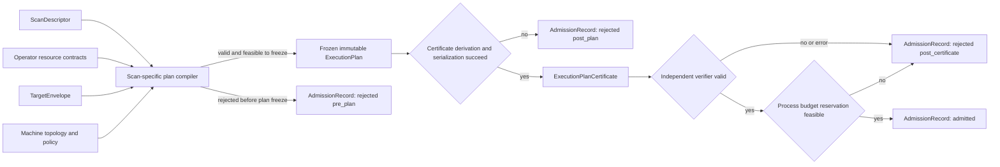
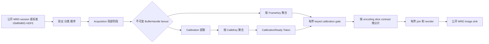
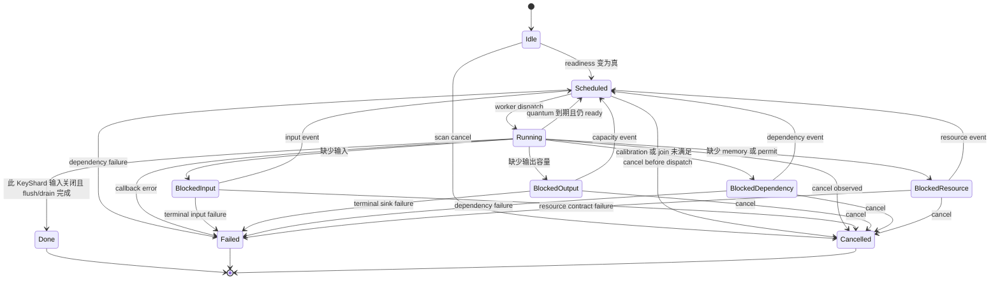
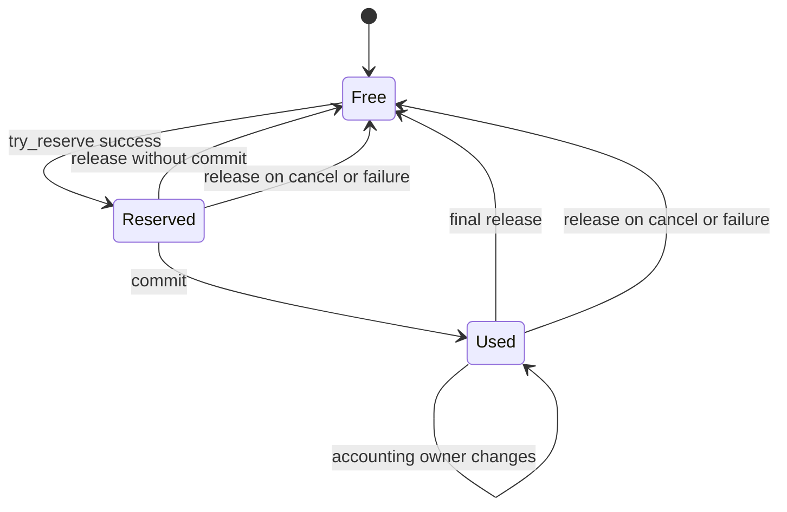
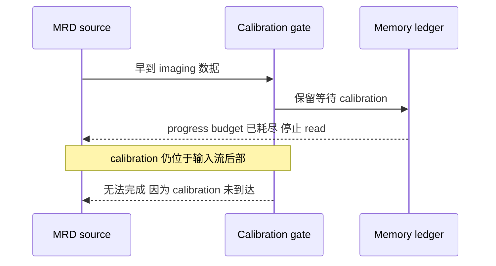
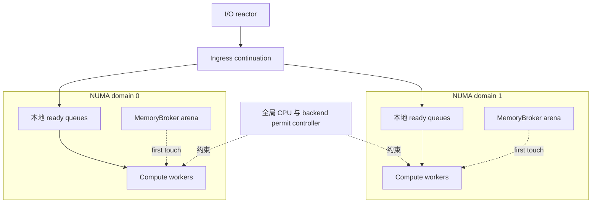
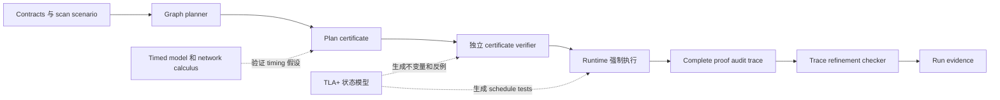

# KSpaceJet MRI 流水线、并行模型与可证明执行理论

> 状态：架构提案与形式化研究基线
>
> 适用范围：KSpaceJet 在线公开 MRD/ISMRMRD streaming session 与离线标准 ISMRMRD HDF5 重建 runtime；Linux x86_64 与 Windows x86_64；C++20。
>
> 相关文档：[流式重建框架实施规划](streaming_reconstruction_framework_plan.md)、[并行开发规范](../conventions/parallelism.md)、[论文初稿](../papers/kspacejet_resource_contract_streaming_paper_draft.md)、[公平对照协议](../papers/kspacejet_gadgetron_comparison_protocol.md)。
>
> 本文只研究 pipeline、调度、并行、资源和框架开销；具体重建算法被视为具有声明服务需求的黑盒。

## 1. 结论与研究主张

KSpaceJet 不应声称在任意 MRI pipeline、任意硬件、任意输入和任意 Provider 下达到全局最高性能。带 precedence、有限内存、多资源、NUMA、不可抢占任务和 deadline 的联合调度一般不存在高效的万能最优解；经典资源约束多处理器调度的大多数一般情形已是 NP-complete[^garey-johnson]。吞吐、time-to-first-image（TTFI）、尾延迟、内存、能耗和多 scan 公平性之间也不存在不依赖策略选择的单一最优点。

本文采用更严格、可证伪的目标：

> 对冻结的 scan 描述、pipeline、Provider 合约、输入流量包络和机器资源模型，KSpaceJet 在接纳数据前生成一份可机器验证的执行计划；runtime 强制执行该计划的容量、并发和生命周期约束，并用独立轨迹检查验证被完整观测的具体运行没有偏离抽象模型。

本文使用 **scan-resolved contract-carrying dataflow**（扫描解析、契约携带的数据流）作为这一闭环的描述性短语，而不是新的产品名、API 名或通用数据流演算。研究创新在于把 MRI scan descriptor、参数化数据流、资源账本、调度证书、在线校准进展条件和实现轨迹精化连接起来。

允许的结论分为四级：

| 结论级别 | 允许表述 | 证据要求 |
| --- | --- | --- |
| 无条件安全性质 | 对所有合法 transition 保持某个归纳不变量 | 数学证明、独立 certificate checker、实现 invariant test |
| 条件性活性或时延 | 在明确的输入、服务、外部进展和 Provider 合约下成立 | 定理、假设清单、反例与模型检查 |
| 模型内最优性 | 对固定图、服务需求、资源和调度模型达到最优或给定 gap | 可验证 lower bound、solver certificate、独立 checker |
| 实机性能 | 在冻结机器与 workload 上更快、延迟更低或更稳定 | 重复实验、置信区间、完整配置与反例搜索 |

禁止把以下结论写入架构保证或论文结论：

- arbitrary reconstruction graph 的全局最优调度；
- bounded memory 自动推出低 p99；
- 使用 backpressure 自动推出 throughput optimality；
- 有限状态 model checking 等同于证明任意规模 C++ 实现；
- 普通 Linux/Windows 上的无条件 hard real-time；
- 未计量第三方隐藏分配时的严格进程 RSS 上界；
- benchmark p99 等同于数学最坏情况保证。

## 2. 优化目标与黑盒算法边界

“不考虑算法实现性能”不能把 Operator 执行时间设为零，否则任何调度模型都没有物理意义。框架不分析 FFT、NUFFT、校准或并行成像算法内部，只把每个 Operator 在给定 batch、shape 和资源上的服务需求作为黑盒输入：

\[
\bigl([w^-_{v,r},w^+_{v,r}](b,\theta),
[\tau^-_v,\tau^+_v](b,\theta)\bigr),
\]

其中 \(w^-_{v,r}\le w^{actual}_{v,r}\le w^+_{v,r}\) 是一次 firing 对可补充服务资源 \(r\) 的工作需求区间，按资源分别使用 core-time、memory-traffic bytes、I/O bytes、device-time 等量纲；\(\tau^-_v\le\tau^{actual}_v\le\tau^+_v\) 是指定资源分配下的 wall-clock service-time 区间。resident-memory capacity 由 \(S_v/R_v/A_v/W_v\) 和 ledger 单独建模，不能塞进 \(w\)。\(v\) 是 Operator，\(b\) 是 batch，\(\theta\) 是已解析 scan scenario。work 与 wall time 不能互换；上下界也不能混用：

- \(w^-\)、\(\tau^-\) 或精确值用于资源/critical-path lower bound 和吞吐 upper bound；
- \(w^+\)、\(\tau^+\) 用于 admission、资源预留和保守 schedule；独立的 minimum service curve 用于 deadline/backlog 保证；
- 普通 profile 下经 holdout 验证的经验区间只能生成预测；
- 任一方向没有可靠界时，相关 certificate 字段为未知，不能给出该方向的性能定理。

arrival curve \(\alpha_e(t)\) 与 minimum service curve \(\beta_v(t)\) 是独立的累计函数类型，不是 per-firing work 或 service-time。\(\alpha\) 为到达上界，\(\beta\) 为累计服务下界，只用于第 11.7 节的 backlog/delay 推导；不得把 service curve 填入 \(w\) 或 \(\tau\)，也不得反转其不等式方向。

默认优化问题是约束优化而不是单指标排名：

\[
\begin{aligned}
\text{maximize}\quad & \lambda_{admitted} \\
\text{subject to}\quad
& M_{managed,resident}\le B, \\
& L_{first}\le L_{first}^{target}, \\
& L_{deterministic}\le L_{max}^{target}\quad\text{when a hard envelope exists},\\
& P_{executor\_leaf}+P_{backend\_gang}+P_{provider\_private}\le P_{machine},\\
& \text{ordering, fairness, cancellation and correctness contracts hold}.
\end{aligned}
\]

若没有确定性 arrival/service envelope，p99 只能作为实验目标，不得伪装成上述约束的已证明结果。编译器应输出 Pareto 候选或由部署策略明确选择 throughput、TTFI、memory 和 fairness 的权重，不能隐藏策略取舍。
三个 permit 子账户按 execution context 互斥；backend gang 的 coordinator 只计在 `backend_gang`，不与 `executor_leaf` 重复计算，详见第 10.2 节。

### 2.1 执行 Profile

profile 之间不得静默降级：

| Profile | 允许能力 | 证明强度 | 合同失败行为 |
| --- | --- | --- | --- |
| `strict-online` | finite graph/scenario、有限 output/retention/horizon、可验证服务假设 | 受管内存、条件性活性与适用的性能界 | admission reject |
| `bounded-best-effort` | 资源仍有界，但允许经验 service envelope 或不提供 deadline certificate | 资源安全；性能只实测 | throttle、reject 或明确 fail |
| `offline-spooled` | 显式 HDF5/spool，可容纳 whole-scan 或未知在线 horizon | 由 spool 和离线预算决定 | 不得声称 strict-online 性质 |
| `research-unbounded` | 仅研究用途的未知上界 Operator | 无产品资源保证 | 不进入 daemon 默认配置或论文资源主张 |

## 3. 扫描解析的形式执行模型

一次 scan 的冻结执行计划定义为：

\[
P(\theta)=(G,\Sigma,\Gamma,q,C,D,K,\mathcal R,\Pi).
\]

各项含义如下：

| 符号 | 含义 |
| --- | --- |
| \(\theta\) | 从 ISMRMRD XML、pipeline 配置、Provider descriptor 和 TargetEnvelope 得到的冻结参数 |
| \(G=(V,E)\) | typed logical Operator DAG；`strict-online` 要求 scan 实例化后有限，逻辑环在 graph validation 时拒绝 |
| \(\Sigma\) | 有限 scenario 状态机，例如 init、calibration、imaging、drain |
| \(\Gamma\) | static/cyclo-static 区域的 token incidence/rate |
| \(q\) | 一个稳态周期的 repetition vector |
| \(C\) | edge、retention、join、reorder、task、ingress 和 egress 的 item/charged-byte 容量 |
| \(D\) | 分量化的 \([w^-_{v,r},w^+_{v,r}]\)、\([\tau^-_v,\tau^+_v]\) 及另行标注单位的 arrival/service envelope 集合 |
| \(K\) | key projection、顺序、merge、window、watermark、flush 和 completion 规则 |
| \(\mathcal R\) | CPU、NUMA、I/O、backend team、内存等总资源 |
| \(\Pi\) | 编译后的 firing template、placement、batch 和并发策略 |

`ExecutionPlan` 仍是现有架构中的唯一规范执行计划对象。本文定义：

\[
Certificate=Cert(P(\theta)),
\]

即 `ExecutionPlanCertificate` 是由不可变 `ExecutionPlan` 派生、供独立验证的 artifact，不属于 \(P(\theta)\) 的组成量，也不是第二套 planner 或 graph model。

版本化 PipelineDefinition、ResolvedPipeline、OperatorContract、RateSpec/CompletionSpec、
calibration binding 与 runtime closure 的产品 schema 以
[PipelineDefinition v1 与重建流水线设计](pipeline_definition_v1.md)为准；本文只使用其
冻结后的语义来定义形式模型、证明义务和 performance envelope。

本文保留总体规划的定义：**OperatorInstance** 是某个 pipeline node 在一次 scan 中的唯一运行实例。一个 OperatorInstance 可以拥有一个或多个内部 **KeyShard**；KeyShard 是按 key 分片的单写者状态和 mailbox，**activation** 是 KeyShard 的一次有界调度。KeyShard 是 runtime 私有实现概念，不改变 Provider ABI lifecycle；它也不与论文研究平面的 external load actor 混用。

对 scenario \(\sigma\)，令 \(\Gamma_\sigma(\theta)\in\mathbb Z^{|E_\sigma|\times|V_\sigma|}\)，行表示 edge，列表示 Operator firing，production 为正、consumption 为负。静态速率区域必须找到正整数 repetition vector：

\[
\Gamma_\sigma(\theta)q_\sigma=0,
\qquad
q_\sigma\in\mathbb N_{>0}^{|V_\sigma|}.
\]

对 CSDF，生产和消费量是 Operator phase cycle，平衡使用完整周期总量。本文以下使用 `EndOfInput` 表示内部输入关闭事件；对有限 scan 与 `EndOfInput`，不强行套用无限周期平衡，而验证：

\[
n_u p_e-n_v c_e=z_e(final)-z_e(initial),
\]

并要求 drain 后除明确 durable output 外的 edge 均为空。source、sink 和环境进展可建模为显式环境节点，避免把外部条件藏在证明外。

### 3.1 编译、准入与证书



图编译发生在 XML、pipeline 和 Provider descriptor 可用之后、第一条 acquisition 进入算法图之前。plan 在派生 certificate 前冻结；最终 outcome 和动态 process-budget reservation 只写入独立 `AdmissionRecord`，并仅引用决策阶段已经存在的 plan/certificate digest，不得回写 plan。`strict-online` 只有在 certificate 被独立 verifier 接受且 admission 原子取得预算后才能开始；其他 profile 必须在 artifact 中明确标注缺少的 proof obligation。

### 3.2 分层理论而不是单一演算

| 层 | 推荐模型 | 主要用途 | 主要边界 |
| --- | --- | --- | --- |
| 参考语义 | Kahn Process Network | 定义确定、无副作用 Operator 的调度无关流语义 | 原始 KPN 使用无界 FIFO，不能直接证明内存和实时性 |
| scan 编译 | 参数化 SDF、CSDF、有限 scenario-aware dataflow | rate balance、静态 firing、buffer 与周期吞吐 | 任意 data-dependent 输出必须受 scenario 和上界约束 |
| 生命周期 | transition system、colored/timed Petri net | reservation、fan-out、join、cancel、failure | 大实例会状态爆炸 |
| 周期性能 | timed event graph 与 max-plus | 固定计划的渐近 initiation interval | 只覆盖 conflict-free、已解析的周期区域 |
| 确定性时延 | deterministic network calculus | burst、backlog、queue capacity 和条件性 delay | service curve 必须真实成立；fork/join 界可能较松 |
| 并行映射 | work/span、RCPSP、MILP 或 CP-SAT | 资源 lower bound、放置、batch、fusion 和 optimality gap | 一般问题不可廉价全局求解 |
| 多 scan | WFQ/DRR service guarantee | 服务份额、service lag 和无饥饿 | callback 非抢占时间必须有界 |

有界 runtime 必须证明：对未拒绝、未丢弃的 accepted trace，它 observationally refines 参考流语义。不能把 KPN 的无界 FIFO 当成产品实现。

## 4. MRI 事件、Key 与依赖模型

### 4.1 规范事件索引

每个事件至少拥有内部逻辑索引：

```text
AcquisitionIndex = (
  scan,
  encoding,
  average,
  slice,
  contrast,
  phase,
  repetition,
  set,
  segment,
  acquisition_ordinal)
```

这些字段来自公开 ISMRMRD 语义或 ingress 后的本地顺序，不添加私有 wire 字段。Operator 通过 `IndexProjection` 从索引选择自己的 partition key、order domain 和 join key；框架不得把 slice 硬编码为唯一并行单位。

### 4.2 DependencySpec

现有 Operator 资源合约继续作为公共基线：

\[
C_v=(T_v,K_v,P_v,B_v,S_v,R_v,A_v,W_v,H_v,U_v,F_v)
\]

其中 \(P_v\) 只表示 scan \(s\) 中 node \(v\) 的唯一 `OperatorInstance` 跨其 KeyShard 的最大并发 callback/firing 数，因此 \(P_vS_v\) 是该 scan 的并发 scratch 上界。跨 scan 同一 Operator 的实例数是 process-level admission 量 \(I_{v,process}(t)\)，不得塞入单 scan 的 \(P_v\) 或再次乘入 \(M_{plan,s}\)。

`DependencySpec` 是其中 \(T_v\)、\(K_v\)、\(R_v\) 和 \(F_v\) 的可验证展开，至少包含：

```yaml
input_granularity: acquisition | microbatch | window | frame | volume | scan_finalizer
partition_key: [encoding, slice, contrast]
order_domain: strict_global | per_key | unordered
completion:
  expected_count: finite_integer_or_expression
  watermark: optional_declared_event
  flush: end_of_key | end_of_input | explicit_event
calibration:
  dependency: none | projected_key
  version_policy: single_epoch_v1
production_bound: finite_expression
retention_bound_bytes: finite_expression
max_in_flight: finite_integer
batch_domain: [partition_key, order_domain, calibration_version, shape, deadline_class]
```

无法得到 finite production、retention、window、reorder 或 full-scan state 上界的 Operator：

- 不得进入 `strict-online` profile；
- 可以进入明确标记的 offline/spooled 或 unbounded research profile；
- 不得支持有界内存或确定性时延的论文主张。

### 4.3 MRI pipeline 分区

图编译器应把一次逻辑 pipeline 分成四类区域：

1. **static-rate region**：rate 和 phase 已解析，使用预计算 firing template；
2. **keyed dynamic region**：同 key 单写者，不同 key 并行；
3. **bounded join/barrier region**：校准、frame、volume、reorder，具有有限 retention 与 flush；
4. **full-scan/finalizer region**：只有 `EndOfInput` 已到达且全部前驱 drained 后 ready。

普通 streaming Operator 不得隐式等待全 scan。需要 whole-scan state 的 Operator 必须声明容量或使用显式 spool。

## 5. 推荐的 Pipeline 架构



设计规则：

- calibration 分支和 imaging 分支并行；不依赖 calibration 的预处理继续推进；
- calibration 依赖阶段只能消费不可变 `CalibrationReady(key, version)`；不得读取可变的“最新 calibration”；
- v1 每个 `CalibKey` 只支持一个 epoch；在线 recalibration 以后通过显式 version/watermark 扩展；
- calibration gate 只唤醒匹配 key，不建立 scan-global barrier；
- frame、slice、contrast、set、repetition、encoding 等 key 在数据允许时独立并行；
- sink 的输出顺序由显式 order domain 和 bounded reorder buffer 保证；
- `EndOfInput` 只表示输入关闭；它使显式 scan finalizer 在全部前驱 drained 后具备执行资格。`Completed` 只在所有 edge drain 和 sink flush 后产生，普通 Operator 不得隐式等待全 scan。

## 6. KeyShard 与 Continuation 执行模型

### 6.1 为什么不用每 acquisition 一个任务

每条 acquisition 产生一个或多个 future/task 会使调度成本、queue node、引用计数和 trace 成本与 acquisition 数量成正比，并放大全局 MPMC 竞争。每个 scan-level OperatorInstance 应拥有由执行计划解析出的有限 KeyShard 集合。每个 KeyShard 拥有：

- bounded mailbox；
- window、join、reorder 和 calibration state；
- `queued_or_running` 单 bit 或等价状态；
- 当前 key 的唯一写者语义；
- bounded activation quantum。

KeyShard readiness 定义为：

\[
ready_v=
input_v\land dependency_v\land outputReservation_v
\land memory_v\land cpuPermits_v.
\]

一次 activation 最多处理 `max_items_per_activation` 或运行到 `cooperative_quantum_us`。若仍 ready，则重新排队，让其他 scan 和 KeyShard 获得服务。

### 6.2 状态机与无阻塞规则



worker 永远不得等待满 queue、socket、future、calibration、join、GPU fence 或 backend permit。阻塞态注册 bounded continuation，事件注册必须使用 `check-register-recheck`，防止事件在检查和注册之间发生而丢失唤醒。

`Done` 只表示一个 KeyShard 的终态，不等于 `OperatorInstance` 完成。Provider 终止采用三阶段协议：

1. `EndOfInput` 到达时停止接纳该 node 的新普通输入；cancel/failure 时停止创建新普通 firing，并等待当前同步 callback 在声明的 cooperative bound 内返回到安全序列化点；
2. host 在预留 terminal callback 的 output/scratch/token bundle 后，恰好一次调用正常 `on_scan_end` 或异常 `on_cancel`。两者本身以及其允许产生的 bounded flush/output/cleanup/async work 都是 certificate 中的认证 occurrence；`on_cancel` 必须触发 pending async 取消与 retain 释放，host 不得在调用它之前等待这些资源归零；
3. terminal callback 已返回或完成其异步协议后，host 才等待全部 KeyShard 进入兼容终态、node occurrence/counter 为零、所有 async token/output/handle 结算，然后销毁该 scan 的 instance。

任何单 shard 都不能独立触发 instance/factory 销毁。callback 超出 cooperative bound 时记录 Provider violation、停止该 scan 并拒绝 strict-online 资格；v1 进程内 plugin 没有 worker/OS kill 隔离，不能把 native crash 或无限 callback 伪装成单 scan 终止。需要更强故障域时部署独立 reconstruction-service 进程。

每个 serial KeyShard 必须满足：

\[
queued_v(t)+running_v(t)\le 1.
\]

### 6.3 原子 firing reservation

一个 firing 只有在能够原子取得完整资源 bundle 时才能开始：

```text
input claim
all fan-out output item/byte reservations
scratch and retained-state reservations
task and continuation descriptor
CPU or backend-team permits
reorder slot when required
```

任一项失败则完整回滚并注册 continuation。禁止持有 input、worker permit 或部分 fan-out reservation 等待另一项资源。多资源内部实现仍应采用固定全局顺序或单次事务化 reservation，避免 allocator/permit 子系统形成隐藏环。

### 6.4 Reservation 生命周期



ledger 的原子 primitive 仍只有 `try_reserve`、`commit` 和 `release`。所谓 rollback 是尚未 commit 的 reservation 执行 `release`；ownership transfer 只是一次 commit/release 事务中的责任账户元数据变化，不是第四种 capacity primitive。item 和 charged-byte 两个维度必须同时成功，图中每个 transition 对 reservoir 守恒，也不能用一次 release 同时归还两个真实 owner。

## 7. Fan-out、Join、Reorder 与 BufferHandle

### 7.1 Fan-out

- bulk payload 默认不可变，多个分支共享 host-owned `BufferHandle`；
- publish 前对全部目标 edge 原子预约 item/charged-byte capacity；
- all-or-none publish，任何分支都不能提前看到半次 fan-out；
- 共享 handle 延长的真实 allocation 生命周期进入 retention ledger；
- 引用计数增加不重复计量同一 allocation；copy-on-write 必须先取得新 reservation。

### 7.2 Join

每个 `JoinSpec` 必须声明：

- 每个输入端的 key projection；
- expected count 或有限 window；
- watermark、end-of-key 或 `EndOfInput` flush；
- 最大 retained items 与 charged bytes；
- calibration version 一致性；
- 完整 key 只 emit 一次的终态规则。

未知 skew 或 retention 上界的 join 不能进入 `strict-online` profile。

### 7.3 Reorder

默认使用 keyed serial 执行。若同一 order domain 内允许并行：

1. dispatch 时分配 ordinal；
2. 同时预约 bounded reorder slot；
3. 只提交 `next_expected`；
4. 调度窗口不得大于 reorder capacity；
5. 内层调度优先推进最小缺口，避免后序结果吃满 buffer 而前序任务得不到资源。

这里的 exactly-once 只指进程内结果可见性和 accounting terminal state，不承诺网络持久化 exactly-once。

## 8. MRI 校准进展条件

### 8.1 有限缓冲自锁反例

仅有 bounded queue 和 source read gating 不足以保证 MRI pipeline 活性：



如果 calibration 可位于同一顺序流的任意晚位置，而早到 imaging 数据必须全部保留，则系统可能“为了等待 calibration 而停止读取，因停止读取而永远等不到 calibration”。预留控制消息空间不能跳过 socket 前面的 imaging payload。

### 8.2 Strict profile 的准入条件

TargetEnvelope 或输入 profile 必须为每个 `CalibKey` 同时声明 item 与 charged-byte 进展界，并声明可同时处于 collecting 状态的 key 数：

```text
max_precalibration_prefix_items_per_calib_key
max_precalibration_prefix_charged_bytes_per_calib_key
max_active_calibration_keys
max_precalibration_prefix_items_total
max_precalibration_prefix_charged_bytes_total
max_calibration_frame_charged_bytes
max_decoder_staging_charged_bytes
```

若一个维度可以由另一个维度、`max_frame_charged_bytes` 和完整 cardinality 严格推导，certificate 可以记录推导式而不是重复配置；最终仍必须得到 item/byte 双预算。总量必须覆盖各活跃 `CalibKey` 的可实现最坏组合，不能只把单 key 最大值相加而忽略共享输入顺序约束，也不能只验证单 key 后让多 key 击穿全局预算。

准入时把早到 imaging prefix 转移到专用 `calibration_progress_reservoir`，同时预留 calibration frame 本身和 decoder staging，足以跨过最坏前缀并使 calibration 到达。该 reservoir 不能被普通 gate retention、performance telemetry、output 或其他 scan 借用；proof-critical audit trace 使用独立预留。

若无法给出上界，只能：

- 使用显式、有界和可审计的 spool adapter；
- 选择允许明确拒绝或失败的 profile；
- 判定 `non_online_admissible`。

### 8.3 校准进展命题

**命题 CAL-PROGRESS（条件性）**：若每个 calibration 在声明的 per-key 与 aggregate item/charged-byte horizon 内到达，admission 为该 horizon、calibration frame 和 decoder staging 预留不可挪用的双预算 capacity，source 最终提供数据，且 calibration KeyShard 获得公平服务，则 read gating 不会阻止该 calibration 被接收和处理。`CalibrationReady` 只是公开 MRD session adapter 之后的进程内依赖事件，不是 wire message。

证明对每个 active `CalibKey` 和 aggregate reservoir 使用剩余 `(items, charged_bytes)` 的词典序度量：每个前缀事件至少使 items 严格下降，并按真实 resident charge 同时消耗 bytes；普通 retention 不能消耗 progress reservoir。任一声明界先被违反时 scan 明确失败；否则有限步后 calibration 已接收并释放相应 progress reservation。

## 9. Microbatch、Fusion 与热路径开销

### 9.1 Batch domain

只有以下属性完全一致的事件才能进入同一 batch：

```text
operator
partition key and order domain
calibration version
shape and layout
deadline class
resource class
```

batch 同时受以下上限约束：

```text
items <= B_items
charged_bytes <= B_bytes
wait_time <= B_wait
```

触发条件为 preferred size、最大等待、deadline slack、window/`EndOfInput` flush 任一满足。首图阶段使用 1 或小 batch，首图后切换 throughput batch，并使用滞回避免模式抖动。

若服务模型为：

\[
\tau_v(b)=h_v+g_v(b),
\qquad
\mu_v(b)=\frac{b}{h_v+g_v(b)},
\]

则增大 \(b\) 可以摊薄 dispatch、ABI、queue 和 trace 固定开销 \(h_v\)，但会增加 batch wait 和 WIP。编译器在声明范围内选择 batch，并把最大输入、输出和 scratch 容量计入 admission。

### 9.2 Queue elision 与 fusion

只有相邻 Operator 同时满足以下条件时，编译器才可消除通用 edge queue 或形成 fused activation：

- 同 placement 和 memory domain；
- 1:1 rate 且 shape 已解析；
- 无跨事件 retained state；
- 无独立 fairness、deadline 或 failure boundary；
- fusion 不降低关键 pipeline width；
- direct handoff 仍保留 trace lineage、取消和 accounting。

否则使用 bounded edge。fusion 减少 queue、调度和 ABI 成本，但可能降低 pipeline parallelism，必须由同一 cost model 或 benchmark 决定，不能默认全图融合。

## 10. CPU、NUMA 与多 Scan 并行模型

### 10.1 执行器层级



规则如下：

- I/O reactor 只做异步 I/O、解析和 continuation，不执行重建 callback；
- 每个 NUMA node 拥有本地 executor domain、ready queue 和 MemoryBroker arena；
- KeyShard 在 scan start 通过负载模型和稳定 hash 选择 NUMA home；
- state 与大 buffer 在 home node first-touch；
- KeyShard 可以由同 node 任一 worker 运行，不必绑死单核；
- stateful 或大 retained-state KeyShard 不迁移；
- v1 使用确定性的本地 ready queue，不启用通用 work stealing；
- 后续只有 `migratable=true` 的 stateless activation 可以在同 NUMA 域内参与受限 steal；跨 NUMA steal 还必须证明排队收益高于 remote-memory 代价，并单列 remote bytes、migration 和 steal 指标。

shard 数可以高于 worker 数以吸收 key skew，但 shard state 仍保持单写者。

### 10.2 统一 backend thread budget

runtime worker、MKL/OpenMP/FFTW 内线程和 Provider 私有线程共享同一个资源向量。permit 分类互斥：普通 callback worker 计入 `executor_leaf`；进入 backend gang 的 coordinator 与其他 backend threads 一起计入 `backend_gang`，不再同时计作 executor；Provider 私有线程只有未被前两类计算时才计入 `provider_private`。任意时刻：

\[
P_{executor\_leaf}(t)+P_{backend\_gang}(t)+P_{provider\_private}(t)
\le P_{configured}.
\]

单线程 kernel 请求一个 permit。需要 \(k\) 线程的 vendor kernel 作为 gang task 原子请求 \(k\) 个 permits，协调 worker 包含在 \(k\) 内；同时 executor 少运行 \(k-1\) 个普通任务。默认设置 backend local thread count，禁止 `parallel_for` 外层再启动多线程 backend。

Provider 未声明自建线程或超过合约，属于 conformance violation。若 callback 内部线程无法由 host 控制，其资源不能支持严格性能或公平性定理。

### 10.3 两级多 scan 调度

外层按 NUMA domain 使用 weighted DRR/WFQ 选择 scan，内层选择该 scan 的 ready KeyShard：

```text
outer priority = fair service deficit and scan quota
inner priority = deadline slack
               + first-image critical rank
               + bottleneck pressure
               + age
               + locality
```

每个 scan 独立限制 managed bytes、in-flight firing、ready activations 和 CPU service。首图未产生时可以获得 bounded first-image boost，但 boost 有最大 quantum，不能绕过外层公平性。cancel、`EndOfInput` 和 cleanup 使用独立小额保留，不与数据任务竞争到资源耗尽。

DRR cost 使用声明或观测的 CPU service units，完成后按 actual cost 修正，不能以任务数量代替工作量。必须报告 service lag、normalized slowdown 和 starvation bound，而不只报告 Jain index。

若 Provider callback 可以无限运行且不可抢占，任何 wall-clock TTFI、p99 或公平定理都不成立。descriptor 必须声明最大 cooperative quantum；runtime 对超时 callback 产生 violation。v1 只支持进程内动态库插件，因此不能用进程终止补救不合作的 callback；此类 Provider 不得进入要求这些界的 profile。

### 10.4 GPU Future Boundary

v1 不实现 GPU runtime，但资源与 buffer contract 应保留以下中立维度：

```text
memory_domain
device_id
cpu_permits
device_queue_or_stream_tokens
device_bytes
pinned_host_bytes
transfer_bytes
completion_fence
```

未来 H2D/D2H 是显式 graph Operator 和账本项；host worker 只提交异步操作并注册 completion continuation，禁止同步等待设备。Provider ABI 不暴露 CUDA/HIP 类型。

## 11. 可证明命题

### 11.1 RATE：静态区域一致性

**命题 RATE**：对固定 scenario 的 static/CSDF region，若存在正整数 \(q_\sigma\) 满足 rate balance，initial token 与 buffer capacity 足以执行一个认证周期，并且周期末 marking 回到初始 marking，则该区域存在有界周期执行。

compiler 必须同时验证 schedule，而不能只验证 \(\Gamma_\sigma q_\sigma=0\)；平衡是一致性的必要组成，不单独保证 liveness。

### 11.2 MEM：受管内存上界

对 scan \(s\)，定义唯一 charge 给该 scan 的、互不重复的 committed/resident allocation 集合 \(\mathcal A_{host,s}(t)\)。它既包括有 live handle 的 allocation，也包括 lease 释放后仍保留给该 scan 的 MemoryBroker committed free pool block 和已经 commit 给该 scan 的 host transport storage；进程共享且尚未 charge 给任何 scan 的 pool block 不属于该集合：

\[
M_{managed,resident,s}(t)=
\sum_{a\in\mathcal A_{host,s}(t)}resident\_capacity(a).
\]

诊断可以另外报告 live-handle capacity：

\[
M_{live,s}(t)=
\sum_{a\in\mathcal A_{host,s}(t)}capacity(a)\cdot
\mathbf 1[refcount_a(t)>0],
\]

但 \(M_{live,s}\) 不能替代 resident 左值；同一底层 allocation 在每个统计中都各自只计一次。

编译预算沿用总体架构和论文中的 \(M_{plan}\)：

\[
M_{plan}=M_{fixed}+M_{transport}+\sum_{e\in E}Q_e+
\sum_{v\in V}(P_vS_v+R_v+W_v)+
M_{reorder}+M_{journal}+M_{exec}+M_{guard}.
\]

分解与现有 Operator contract 一一对应：

- \(M_{transport}\) 只包含 host 可以计量和预留的 ingress、egress、codec、send/receive 与 user-space TLS staging；
- \(Q_e\) 是 edge 的真实 resident capacity，包括该 edge 负责的 payload、metadata 和 queue-node capacity；
- \(P_vS_v\) 是最大并发 callback 的 scratch，\(R_v\) 是 retention/join/window，\(W_v\) 是 per-scan state、plan 和 workspace；
- 进入下游 edge 前的 output reservation 计入相应 \(Q_e\)，delivery/send-owned output 计入 \(M_{journal}\)，不得重复记账；
- \(M_{exec}\) 包含 bounded task、continuation、调度元数据，以及 evidence mode 下预留的 proof-audit records；
- \(M_{guard}\) 只包含可计算、可预留的 allocator size-class、pool committed slack 和 user-space library slack。

不可见的 kernel socket buffer、网络在途字节、不可拦截 TLS/vendor allocator、GPU driver 和 OS page cache 不属于 \(M_{plan}\)，必须进入 external budget、RSS 分账或由 process/device quota 强制。

对每个 item/charged-byte reservoir，令 \(C_r=(N_r,B_r)\) 为容量，\(R_r(t)\) 为 reserved，\(U_r(t)\) 为 committed/used，逐分量保持：

\[
0\le R_r(t)+U_r(t)\le C_r.
\]

等价地，\(Free_r=C_r-R_r-U_r\)。三个 primitive 和由它们组成的事务不得创造 capacity。

**命题 MEM（条件性 framework-managed memory bound）**：若所有受管 allocation 在 acquire 前 reserve，ownership transfer 不新增 allocation，fan-out all-or-none，copy-on-write 先 reserve，取消/失败最终 release，且 Provider 不违反声明，则：

\[
M_{managed,resident,s}(t)\le M_{plan,s}.
\]

证明对 `try_reserve`、`commit`、`release`、retain 和 cancel/failure cleanup 作归纳。handle retain 只改变引用，不重复计算 allocation。第三方隐藏 allocator、GPU driver、OS page cache、kernel socket 和不可拦截 TLS buffer 需要单独报告或由 OS/process quota 强制，不能伪装成该定理覆盖范围。

对 process 共享池、共享 immutable cache 和共享 host transport metadata，配置并由 MemoryBroker 强制有限上限 \(M_{shared}^{cap}\)，保持：

\[
M_{shared,resident}(t)\le M_{shared}^{cap}.
\]

scan 结束后，block 只有在先取得 shared 子账户 capacity 时才能从 scan 子账户原子转入共享池；否则必须 trim/decommit/release。连续 scan 不得让 shared committed pool 越过该上限。对同时 admitted 的 scan 集合 \(\mathcal S(t)\)，process 级条件上界为：

\[
\mathcal A_{process}(t)=
\mathcal A_{shared}(t)\uplus
\biguplus_{s\in\mathcal S(t)}\mathcal A_{host,s}(t),
\]

并因此有：

\[
M_{process,managed}(t)\le
M_{shared}^{cap}+\sum_{s\in\mathcal S(t)}M_{plan,s}
\le M_{process}^{cap}.
\]

\(M_{shared}^{cap}\) 与 \(M_{process}^{cap}\) 是 machine policy 和 certificate 中的常量，不是运行时实测值。admission 必须在同一个 process budget 内原子保留新增 \(M_{plan,s}\)，不能依赖各 scan 分别满足上界却让总和超过机器预算。共享 MemoryBroker pool 必须在 shared 与各 scan reservation 之间做互斥 charge：全局 committed block 只计 shared 子账户，转入 scan 子账户后只计对应 \(M_{plan,s}\)，不能两边重复计量。

### 11.3 DET：调度无关的逻辑结果

**命题 DET**：若 Operator 是确定的，port 是 single-writer FIFO 或显式确定 merge，key update 串行，fan-in 顺序已定义，没有 timing-dependent branch 和未声明副作用，则所有公平合法 firing interleaving observationally equivalent：`preserve`/`per_key` domain 的输出序列相同，`unordered` domain 按规范 key canonicalize 后的 multiset 相同。

并行浮点 reduction 必须使用固定归约树才能承诺 bitwise determinism；否则只允许声明带 tolerance 的 numerical determinism。

### 11.4 LIVE：无内部资源死锁

仅有“前向 graph 是 DAG”和“queue 有界”不充分。严格定理需要：

1. resolved graph/scenario 有限，或动态区域由有限状态合同约束；
2. firing 原子取得完整资源 bundle，不发生 hold-and-wait；
3. worker 从不阻塞等待 edge、future、dependency 或 permit；
4. fan-out all-or-none；join/reorder 有有限 retention、skew 和 total flush；
5. dependency-progress capacity 不被普通 retention 占用；
6. 每个 callback 在 bounded quantum 内返回、yield 或异步化；
7. continuation scheduler 弱公平且无 missed wakeup；
8. source、sink 和 transport 最终提供声明的正服务；
9. `EndOfInput` 最终到达，或 cancel/failure 进入唯一终态；
10. compiler 已通过 schedule automaton、cohort reservation 或等价 certificate 证明所有 bounded join/fork 的 progress capacity 充分。

**命题 LIVE（条件性）**：在上述假设下，runtime 不产生内部资源循环等待；只要外部进展假设继续成立，从任一非终态 blocked marking 都有某个合法 transition 最终被启用并由公平 scheduler 执行。该命题不单独推出 scan 终止。

证明可采用两类构造：

- compiler 输出经过验证的 firing automaton，runtime 只执行允许 transition；
- 对结构化 fork-join 使用 cohort reservation，在接纳一个 key 前预留其到 join 的最坏 progress capacity。

无法构造 certificate 的任意图不得进入 `strict-online` profile。外部 sink 永久停止时只能证明资源有界和 externally blocked quiescence，不能证明完成；这不是内部 deadlock。

### 11.5 TERM：有限输入终止

TERM 额外要求 compiler 给出有限 expanded transition plan，或给出等价的每个 scenario/key/Operator/phase 安全 firing 计数器。该计划必须在编译期包含普通 firing、`on_scan_end`/`on_cancel` terminal callback、`EndOfInput` flush、terminal callback/flush 产生的全部下游 firing、scenario branch 的 skip 以及 cleanup；runtime 只能启用、完成或跳过其中已经认证的 occurrence，不能在运行时创造未计数的 occurrence。

令 \(\mathcal O_s\) 是 scan \(s\) 的有限认证 occurrence 集合，定义：

\[
\rho_s(t)=
\left|\{o\in\mathcal O_s\mid state_o(t)\notin\{completed,skipped\}\}\right|.
\]

完成一个 ordinary/flush/cleanup occurrence 会使 \(\rho_s\) 减少一；scenario 决策把不可达 occurrence 原子标记为 `skipped`，也只会使其下降。flush 产生的下游工作在 \(\mathcal O_s\) 中从一开始就已计数，因此不会在较早拓扑 rank 上新增未计工作。若使用符号计数器而不是逐 occurrence 展开，certificate 必须给出同构映射，runtime 对每次 firing 原子递减对应预算，任何 underflow 或未认证 firing 都使 scan 失败。

若输入有限、Operator total、LIVE 与公平性假设成立，并且每次 progress transition 最终完成或跳过至少一个尚未终结 occurrence，则良基自然数 \(\rho_s\) 最终到零，scan 进入唯一终态。

可重新产生上游 work、无限 scenario loop 或无法给出 firing 上界的 Operator 必须提供另外的良基 ranking function，否则不能使用 TERM，也不能进入要求有限 drain 的 `strict-online` profile。

### 11.6 THR：吞吐上界与计划最优性

对固定 scenario 的周期区域，每个逻辑周期在可补充速率资源 \(r\) 上的工作量：

\[
D^-_{\sigma,r}=\sum_{v\in V_\sigma}q_{\sigma,v}w^-_{v,r}.
\]

\(D^-_{\sigma,r}\) 与资源容量 \(\kappa_r\) 必须使用匹配量纲。例如 CPU 使用 core-seconds 与 cores，memory/I/O 使用 bytes 与 bytes/second；resident memory 等纯容量资源另以 admission constraint 建模，不能与速率资源混算。只有经过验证的实际工作下界才能产生以下吞吐上界；若只有工作上界，就不能使用该式。任何该 scenario 的 schedule 都满足：

\[
\lambda\le\lambda_{upper}=
\min_{r:D^-_{\sigma,r}>0}\frac{\kappa_r}{D^-_{\sigma,r}}.
\]

等价的资源 initiation-interval 下界为：

\[
II_{resource}\ge\max_{r:\kappa_r>0}\frac{D^-_{\sigma,r}}{\kappa_r}.
\]

有限 CPU DAG 另有 work/span 下界：

\[
T_P^*\ge\max\left(\frac{T_1}{P},T_\infty\right).
\]

其中 \(T_1\) 是总 work，\(T_\infty\) 是 critical-path span。该式是有限批次 completion time 的下界，不是一般稳态吞吐公式。

对固定服务时间、固定映射，并且已经把共享 CPU/resource choice 展开为 conflict-free 顺序、加入 resource token 和 buffer free-slot token 的**增强执行/资源图**，最大 cycle mean 给出该固定计划的渐近 initiation interval。该图不是前述逻辑重建 DAG；资源和 free-slot token 会有意引入周期：

\[
\lambda_{plan}=\frac{1}{II_{MCM}}.
\]

独立 solver/checker 还必须给出同量纲的 \(II_{lb}\)。它至少不小于上述 resource bound，并可包含 relaxed dependency/cycle、key-width 和 precedence bound；certificate 必须列出每个组成项，不能把预测值伪装成 lower bound。报告：

\[
gap=\frac{II_{plan}-II_{lb}}{II_{lb}}.
\]

若 firing time 是精确的确定值，结果是该执行模型内的精确渐近周期；若使用经过保证的执行时间上界，结果是保守的计划吞吐下界；若只使用经验拟合值，则只能称预测。只有 solver 证明 gap 为零且独立 checker 验证成功时，才允许称该固定实例“model-optimal”。一般图使用 deterministic heuristic，报告 gap 和反例，不声称全局最优。

### 11.7 DELAY：Backlog 与条件性时延

若 cumulative arrival 满足 arrival curve：

\[
\alpha(t)=\sigma+\rho t,
\]

某段 runtime 提供 rate-latency service curve：

\[
\beta(t)=R[t-T]^+,
\]

且 \(\rho<R\)，则 deterministic network calculus 给出：

\[
Backlog\le\sigma+\rho T,
\qquad
Delay\le T+\frac{\sigma}{R}.
\]

串联系统使用 min-plus convolution。items 和 charged bytes 分别计算。fork/join 使用最慢分支、skew 和 retention 的显式界，不能把每级 p99 或 worst-case delay 天真相加。

service curve 若只是拟合值，则上述结果只是候选模型，必须经 adversarial burst、slow sink 和 holdout workload 寻找反例。普通 Linux/Windows 上若没有 WCET、调度和系统噪声控制，只能称 conditional soft-real-time bound。

### 11.8 FAIR：多 Scan 服务下界

在 scan \(i\) 权重为 \(\phi_i\)、每个 activation 最大非抢占成本有界、scan 持续 backlogged、executor 公平且资源合同成立时，令 \(\kappa\) 为该调度域的总可用 CPU service capacity，理想 GPS 服务份额为：

\[
rate_i\ge
\frac{\phi_i}{\sum_j\phi_j}\kappa.
\]

实际 WFQ/DRR 对理想服务的 lag 可以由 quantum 和最大 activation cost 界定。实现必须用虚拟时间与合成 cost 验证具体常数；callback 无上界时只能证明 dispatch fairness，不能证明 wall-clock fairness。

### 11.9 OVERLOAD 与 CANCEL

当 admitted arrival 严格位于已验证 service region 内时，可以证明相应 backlog bound。超过能力时，KSpaceJet 只保证：

- managed resources 仍在预算内；
- source throttle、new-scan reject 或明确 fail；
- 不静默丢失 acquisition；
- 压力解除并恢复正服务后，从当前 backlog 在有限时间恢复。

不能同时保证持续超载下“接受全部、无丢失、有限内存、有限延迟”。

若 transport close、callback cooperative cancel、continuation drain 和资源释放分别有上界，cancel bound 才能由这些串行/并行阶段组合。任意第三方 hang 无法在同一进程内证明有限取消；v1 不提供 worker 或 OS kill boundary，必须拒绝该 Provider 的 strict-online 准入并明确不声称取消上界。

## 12. Execution Plan Certificate

planning 在冻结 plan 前失败时直接产生 `pre_plan` rejected `AdmissionRecord`；否则 planner 冻结 `ExecutionPlan` 并派生不可变 certificate。独立 verifier 通过且动态 process budget 原子预留成功后，admission 才能产生 admitted `AdmissionRecord` 并把 scan 标记为 admitted。每个 admitted scan 必须在标准 run artifact 中保留对应的 `execution-plan-certificate.json` 与 `admission-record.json`；rejected scan 保留 outcome 为 `rejected` 的 record、结构化原因和该阶段可安全保留的诊断摘要。最低 certificate 字段如下：

```json
{
  "schema_version": 1,
  "execution_profile": "strict-online",
  "execution_plan_digest": "...",
  "scan_descriptor_digest": "...",
  "target_envelope_digest": "...",
  "pipeline_digest": "...",
  "provider_digests": ["..."],
  "machine_policy_digest": "...",
  "scenario_graph": {},
  "rate_balance": {},
  "end_of_input_balance": {},
  "key_order_join_and_flush": {},
  "finite_termination_ranking": {},
  "edge_item_byte_capacities": {},
  "calibration_progress_horizon": {},
  "key_shard_batch_and_concurrency": {},
  "resource_and_numa_mapping": {},
  "objective_policy_and_units": {},
  "managed_memory_bound": {
    "scan_bound": {},
    "shared_cap": 0,
    "process_cap": 0,
    "pool_transfer_policy": "trim_or_reserve_shared"
  },
  "external_noncovered_budget": {},
  "service_and_arrival_assumptions": {},
  "critical_path_and_resource_lower_bounds": {},
  "schedule_initiation_interval": {},
  "model_optimality_gap": {},
  "proof_obligations": {},
  "proof_audit_trace_schema_digest": "...",
  "planner_solver_checker_versions": {}
}
```

`AdmissionRecord` 使用独立 schema，最低包含：

```json
{
  "schema_version": 1,
  "decision_stage": "post_certificate",
  "execution_plan_digest": "...",
  "execution_plan_certificate_digest": "...",
  "outcome": "admitted",
  "verifier_status": "verified",
  "process_budget_reservation": {},
  "rejection_code": null,
  "rejection_detail_digest": null
}
```

`outcome` 只允许 `admitted` 或 `rejected`，`decision_stage` 只允许 `pre_plan`、`post_plan` 或 `post_certificate`，`verifier_status` 只允许 `not_run`、`verified`、`rejected` 或 `error`。字段规则固定为：

| 决策 | plan digest | certificate digest | verifier status | process reservation | rejection code |
| --- | --- | --- | --- | --- | --- |
| admitted / `post_certificate` | 非空 | 非空 | `verified` | 非空 | null |
| rejected / `pre_plan` | null | null | `not_run` | null | 非空 |
| rejected / `post_plan` | 非空 | null | `not_run` | null | 非空 |
| rejected / `post_certificate`，verifier 拒绝/错误 | 非空 | 非空 | `rejected` 或 `error` | null | 非空 |
| rejected / `post_certificate`，process budget 不足 | 非空 | 非空 | `verified` | null | 非空 |

`post_plan` 只用于 plan 已冻结、但 certificate 派生、canonical serialization 或 digest 构造失败的路径；没有这类失败时不得人为使用该 stage。所有 rejection 使用稳定错误码，且 record、plan 和 certificate digest 一经写入不得修改。

每个 proof obligation 的状态只能是 `verified`、`enforced-runtime`、`not-applicable` 或 `unavailable`，并附 checker evidence。`strict-online` 不允许 required obligation 为 `unavailable`；其他 profile 可以保留该状态，但必须删除相应定理或性能 claim。

planner 可以使用 CP-SAT、MILP、SMT 或 heuristic，但可信基不应只包含 planner 本身。需要一个较小、确定性、只做整数/有理数与 graph transition 检查的独立 verifier。verifier 至少重新验证：

- port、shape、rate 与 `EndOfInput` balance；
- finite output、retention、join、reorder 和 calibration horizon；
- finite expanded occurrence/symbolic counter、flush 派生 firing 和 termination ranking；
- buffer capacity、resource non-overlap 与 thread permits；
- managed-memory 账户分区无重叠，且 shared/process cap 与 pool transfer policy 可强制；
- schedule automaton 或 cohort reservation 的合法性；
- lower bound、reported plan cost 和 optimality gap；
- 所有 capacity arithmetic 无整数溢出。

## 13. Proof Obligations

| ID | 义务 | 失败行为 |
| --- | --- | --- |
| PO-01 | typed port、shape 与 layout 一致 | 拒绝 pipeline |
| PO-02 | static rate balance 或 finite-scan `EndOfInput` balance | 拒绝 `strict-online` profile |
| PO-03 | scenario 只在声明的 quiescent boundary 切换 | 拒绝 plan |
| PO-04 | output、retention、skew、reorder、full-scan state 全部 finite | 转 offline/spooled 或拒绝 |
| PO-05 | ledger 保持 `Free + Reserved + Used = Capacity` | runtime violation，scan fail |
| PO-06 | fan-out all-target atomic reservation | runtime violation，scan fail |
| PO-07 | no worker blocking 与 no hold-and-wait | conformance/CI failure |
| PO-08 | schedule automaton 或 cohort reservation 证明内部 progress | 拒绝 `strict-online` profile |
| PO-09 | weak-fair continuation、bounded callback 和无 missed wakeup | conformance failure |
| PO-10 | deterministic merge/order 与 reference trace refinement | 降级 determinism claim 或拒绝 |
| PO-11 | arrival/service/backlog/capacity inequality | admission reject 或不提供时延 claim |
| PO-12 | resource non-overlap、NUMA placement 和 unified permits | 拒绝 plan |
| PO-13 | finite drain termination ranking、runtime counter enforcement 与 terminal-zero trace | 拒绝 `strict-online` profile |
| PO-14 | external allocator、socket/TLS、OS/device memory 边界单列 | 禁止 total-RSS claim |
| PO-15 | complete proof audit trace for the observed run refines abstract transitions | 任一 trace gap/drop 使 evidence run invalid |
| PO-16 | 全部 shape、item、byte 和 capacity 算术 overflow-safe | 输入或 plan 拒绝 |
| PO-17 | cooperative finite cancel bound | 不提供 cancel bound，且拒绝 strict-online 准入 |

## 14. 形式化与验证工具链



### 14.1 TLA+/TLC 与 Apalache

建立小规模抽象模型，覆盖：

- item/byte reservation、commit、derived ownership-account transfer、release；
- KeyShard scheduled bit 与 continuation；
- all-or-none fan-out；
- join、reorder、`EndOfInput`；
- calibration horizon；
- cancel、Provider failure、slow sink；
- 两个或多个 scan 的 DRR service。

TLC/Apalache 用于寻找有限模型中的 safety/liveness 反例，不替代一般规模归纳证明，也不直接证明 C++ 内存模型实现。

### 14.2 Timed Model

UPPAAL 或等价 timed automata 只用于研究和小规模 deadline、cancel、burst、slow-sink 交互验证，不成为开源产品构建依赖。工具许可证和版本必须记录在 research environment lock 中。

### 14.3 虚拟时间与差分测试

实现 deterministic virtual-time simulator：

- 生成 bounded graph、key、rate、arrival 和 service event；
- 枚举或随机打乱合法 interleaving；
- 将同一 event schedule 输入串行 oracle 与并行 runtime；
- 比较 canonical output/event hash；
- 把 TLA+/timed-model counterexample 转成可重复 C++ test；
- 在 TSAN、ASAN/UBSAN、长时间 soak 下重复。

### 14.4 小实例精确 Oracle

对小型 graph 使用 MILP/CP-SAT 求解最优 batch、fusion、concurrency、placement 和 schedule，作为生产 heuristic 的 oracle。CI 检查 heuristic 可行性；research benchmark 报告其 optimality gap。solver 输出必须由独立 checker 验证。

## 15. Runtime Invariants 与可观测性

### 15.1 必须在线检查或可离线重放的不变量

```text
0 <= reserved + used <= capacity for every item/byte reservoir
every managed allocation belongs to exactly one accounting owner
live BufferHandle refs reconcile with allocation lifetime
managed resident capacity reconciles live allocations plus broker-owned committed free blocks
shared managed resident capacity <= certified shared cap
shared cap + all admitted scan reservations <= certified process cap
every firing/flush/cleanup consumes one certified occurrence or symbolic counter unit
termination counter never underflows and equals zero at Completed
serial KeyShard queued + running <= 1
every accepted event has exactly one terminal accounting state
fan-out visibility is all-or-none
join emits each key and calibration version at most once
output ordinal is monotonic within each order domain
gate, join and reorder charged bytes stay within certificate
executor_leaf + backend_gang + provider_private permits stay within configured CPU budget
worker blocked_on_queue_or_future == 0
cancel terminal state leaves no owned task, continuation, handle or reservation
proof audit trace gap + drop + overflow == 0 for an evidence run
```

performance telemetry 必须有界、非阻塞、允许按策略丢弃，并计量丢弃数和开销。proof-critical audit trace 是单独的 evidence-mode 通道：容量在 plan 中预留，记录 verifier 要求的 transition id 与 sequence；任何 gap、drop、overflow 或 checksum failure 都使 PO-15 和该次 evidence run 失败。普通生产运行可以不开启完整 audit trace，但此时不得声称完成了该次运行的 trace refinement。两条通道都不得用同步文件 I/O 阻塞重建 worker。

### 15.2 性能和解释指标

至少记录：

- KeyShard activation、batch fill、batch wait 和 callback duration；
- ready-to-run scheduling latency、queue wait、continuation wake latency；
- calibration wait、join/reorder occupancy 和 horizon remaining；
- per-edge item/bytes high-water mark；
- allocation、resident capacity、copy bytes 和 handle retention age；
- CPU/backend permit wait 与 oversubscription violation；
- per-NUMA local/remote bytes、key skew、steal、migration 和 `idle_with_eligible_work`；
- per-scan CPU service、deficit、service lag、TTFI boost consumption；
- observed throughput 与 \(\lambda_{upper}\) 的效率；
- observed TTFI 与 critical-path lower bound 的 gap；
- 端到端 p50/p95/p99，而不是 stage percentile 相加；
- managed bound、observed managed capacity、RSS/working set 与 unexplained external overhead 分账。

## 16. 实验与证伪协议

形式证明、模型预测和实机比较分别回答不同问题：

| 证据 | 回答的问题 | 不能回答的问题 |
| --- | --- | --- |
| 数学证明 | 在假设成立时哪些性质必然成立 | 假设是否在真实机器上成立 |
| model checking | 小规模交错中是否存在反例 | 任意规模 C++ 是否正确 |
| trace refinement | 某次实现运行是否遵守模型 transition | 未执行路径是否正确 |
| synthetic runtime benchmark | 调度、queue、backpressure 和 NUMA 机制效果 | 完整产品用户体验 |
| Gadgetron/BART 对照 | 冻结 workload 下的跨框架实际表现 | 任意算法和机器的普遍优越性 |

必须预注册并主动寻找反例：

1. late、missing 和 interleaved calibration；
2. finite burst、长期 overload、slow sink 和 sink recovery；
3. fan-out 一支永久变慢；
4. join skew、reorder gap 和 missing `EndOfInput`；
5. key skew、少量巨大 frame 与大量小 frame；
6. 多 scan 不同权重、first-image boost 和 cancel storm；
7. NUMA remote access、restricted affinity 与 container CPU quota；
8. MKL/OpenMP/FFTW backend team 与外层 KeyShard 并行；
9. Provider 超过 output、scratch、thread 或 callback-duration 合约；
10. process failure、transport close 和 cleanup deadline。

论文 runtime 归因应使用相同 MRD 输入、相同 paced schedule、相同 matched kernel、相同 backend/thread 配置和相同计时边界。Gadgetron 是完整主基线，BART Streams 是紧凑次级对照；具体归因门禁服从[公平对照协议](../papers/kspacejet_gadgetron_comparison_protocol.md)。

推荐的可证伪假设：

- TH-F1：所有合法运行满足 `observed_managed_resident_capacity <= certified_bound`；
- TH-F2：burst 和 recoverable slow sink 不造成内部死锁、丢失或重复，sink 恢复后最终 drain；
- TH-F3：当 arrival/service assumptions 成立时，observed backlog 和 deterministic delay 不超过证书界；
- TH-F4：小型 synthetic graph 的 initiation interval 与 exact oracle 相等或处于预注册 gap 内；
- TH-F5：到达率在声明能力区域内时，长期 queue slope 不为正；超出后发生明确 throttle/reject/fail；
- TH-F6：所有合法 schedule interleaving 在 determinism contract 下得到相同 canonical output；
- TH-F7：混合准静态/KeyShard 调度相对逐 acquisition task、stage-per-thread 和全局 work-stealing 降低框架开销；
- TH-F8：资源隔离后，多 scan 并发对关键 scan TTFI/p99 的膨胀不超过预注册阈值。

p99 的独立实验单位应是独立 scan/replay process run，而不是同一 scan 内相关的 acquisition。使用按 run/scan 的 block bootstrap 或 order-statistic confidence interval，并报告 ratio、置信区间和完整失败次数。

## 17. 可执行实施顺序

本文引用总体规划中的权威工作单，不创建平行的 `THEORY-*` 或 `PAPER-BENCH-*` 命名空间。`KSJ-GOV-001` 必须把下列稳定 ID 物化为带 allowed paths、输入输出、完整 `blocked_by` 和双平台验收的 manifests；本节不改变权威依赖 DAG，也不宣称实现存在。

| 顺序 | 权威工作单 | 子任务 | 交付物 | 核心验收 |
| --- | --- | --- | --- | --- |
| 1 | `KSJ-CORE-001` | execution-model ADR | 术语、假设、非目标、Provider 与 runtime 边界 | 架构评审通过，不写实现 |
| 2 | `KSJ-GRAPH-002` | OperatorContract/DependencySpec、RateSpec/CompletionSpec、KeyShard、merge/calibration binding schemas | schema、valid/invalid corpus、canonical digest | 不硬编码 slice/channel group；未知或单维上界被拒绝 |
| 3 | `KSJ-GRAPH-003` | scan scenario/resource compiler、TargetEnvelope/MachinePolicy 与 certificate verifier | repetition、`EndOfInput` balance、join progress proof、termination ranking、shared/process cap、M_plan、arrival/service、lower bound、certificate | 独立 checker 和 corrupt corpus 通过 |
| 4 | `KSJ-CORE-004` | item/byte ledger 与 callback 前 atomic reservation | transition API、fan-out reservation、continuation | conservation、all-or-none、overflow、TSAN |
| 5 | `KSJ-CORE-005` | scan 终态与 termination counter enforcement | occurrence/counter state、flush/cleanup、AdmissionRecord | 未认证 firing/underflow/非零 Completed 全部失败 |
| 6 | `KSJ-CORE-008` | bounded keyed join/reorder | 串行 oracle、watermark/`EndOfInput`、retention ledger | skew、gap、cancel、missing input 测试 |
| 7 | `KSJ-CORE-009` | calibration gate 与 progress admission | per-key/aggregate 双 horizon、progress reservoir | late/missing/interleaved calibration 不自锁 |
| 8 | `KSJ-CORE-006` | coalesced KeyShard/continuation executor | virtual-time runtime、scheduled bit、wake protocol | worker 不阻塞；TSAN 和 missed-wakeup 测试 |
| 9 | `KSJ-CORE-010` | NUMA planner 与后续可选受限 steal | home placement、local queues、topology abstraction | v1 默认无 steal；双平台 topology 与 remote-byte benchmark |
| 10 | `KSJ-CORE-011` | hierarchical DRR 与 first-image policy | per-scan quota、service accounting、boost | service-lag、starvation、多 scan TTFI 测试 |
| 11 | `KSJ-CORE-012` | unified CPU/backend/provider permits | gang reservation、backend adapters、violation detector | coordinator 不重复计数；nested-parallel conformance |
| 12 | `KSJ-CORE-007` | bounded adaptive microbatch 与 safe fusion | first-image/steady policy、items/bytes/timer | TTFI、throughput、memory Pareto benchmark |
| 13 | `KSJ-CORE-013` | TLA+/timed/virtual-time conformance suite | ledger、join、calibration、termination、cancel、fairness models | 固定 state space 与 counterexample fixtures |
| 14 | `KSJ-TOOL-016` | certificate explain 与 proof-audit trace refinement | versioned report、独立 trace checker | corrupt/gap/drop、ranking underflow/nonzero-terminal certificate/trace 全部拒绝 |
| 15 | `KSJ-PERF-002` | runtime falsification 与 exact-oracle suite | burst、slow sink、key skew、NUMA、multi-scan、permits | TH-F1–TH-F8 产生机器可读 evidence |

`KSJ-PAPER-001` 只有在 `KSJ-CORE-001` 与 `KSJ-GRAPH-003` 完成后才能关闭，用于冻结符号、定理和 claim boundary；它不是顺序 1 的前置实现任务。

任何子任务都必须遵守：

- 生产输入只有公开 MRD/ISMRMRD session 与标准 ISMRMRD HDF5；不增加私有 wire message；
- Provider 拥有算法，框架只管理合同、调度、内存和运行证据；
- 所有一方可链接库使用 SHARED，并验证 Linux/Windows DLL 边界；
- research solver、baseline adapter、external load/fault actor 和统计工具不链接进产品 runtime；
- 先实现串行 oracle 和失败 corpus，再实现并行 fast path；
- 未通过 certificate/invariant/correctness gate 前，不做性能结论。

## 18. 论文结构与创新边界

论文正文建议只保留三个核心定理和一个闭环图：

1. framework-managed memory bound；
2. 带 calibration progress 条件的内部 liveness；
3. performance envelope 与 model-optimality gap；
4. `scan descriptor -> certificate -> runtime enforcement -> trace refinement` 闭环。

完整定义、证明、TLA+/timed models、certificate schema、反例和全 case 结果放补充材料。建议使用的核心贡献表述：

> KSpaceJet 将一次 MRI scan 的数据依赖和 Provider 资源合约编译为可机器验证的执行计划；runtime 通过有界资源账本和无阻塞 KeyShard 执行强制实施该计划，独立轨迹检查器验证被完整观测的具体运行与形式模型一致。

每个论文 claim 必须进入机器可读 registry，至少包含：

```text
claim_id
exact_wording
scope_and_profile
assumptions
theorem_or_artifact
experimental_case
comparison_class
evidence_role
permitted_interpretation
prohibited_interpretation
status
```

跨框架实测只验证真实系统效果和理论界紧致度。Resource-contract 的具体因果仍由 KSpaceJet 内部消融支持；Gadgetron 和 BART Streams 的 product-level 结果不能替代该因果证明。

## 19. 一手资料

- Lee, E. A. 与 Messerschmitt, D. G.，[Static Scheduling of Synchronous Data Flow Programs for Digital Signal Processing](https://ptolemy.berkeley.edu/publications/papers/87/synchdataflow/)。
- Bilsen, G. 等，[Cyclo-Static Dataflow](https://doi.org/10.1109/78.485935)。
- Bhattacharya, B. 与 Bhattacharyya, S. S.，[Parameterized Dataflow Modeling for DSP Systems](https://doi.org/10.1109/78.950795)。
- Geilen, M. 等，[Scenario-Aware Dataflow](https://doi.org/10.1007/s11265-016-1193-7)。
- Le Boudec, J.-Y. 与 Thiran, P.，[Network Calculus](https://leboudec.github.io/netcal/)。
- Tassiulas, L. 与 Ephremides, A.，[Stability Properties of Constrained Queueing Systems and Scheduling Policies for Maximum Throughput](https://drum.lib.umd.edu/items/571fda52-aefb-4497-9a2d-69d8c7c907b9)。经典定理的无限队列、时隙和可行激活集合假设不能未经归约直接用于 KSpaceJet。
- Blumofe, R. D. 与 Leiserson, C. E.，[Scheduling Multithreaded Computations by Work Stealing](https://doi.org/10.1145/324133.324234)。其 fully strict computation 结论只适用于被明确证明满足条件的子图。
- Garey, M. R. 与 Johnson, D. S.，[Complexity Results for Multiprocessor Scheduling under Resource Constraints](https://doi.org/10.1137/0204035)。
- Lamport, L. 等，[Model Checking TLA+ Specifications](https://www.microsoft.com/en-us/research/uploads/prod/2016/12/Model-Checking-TLA-Specifications.pdf)。
- [Apalache Symbolic Model Checker Documentation](https://apalache-mc.org/docs/apalache/index.html)。
- [UPPAAL Official Documentation](https://docs.uppaal.org/gui-reference/verifier/)。

[^garey-johnson]: Garey 与 Johnson 证明了带 precedence 和有限资源的多处理器调度在大多数一般情形下为 NP-complete；因此本文只对受限模型声明最优性，对一般模型报告可验证 gap。
