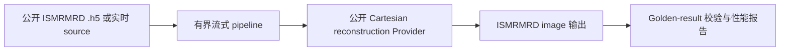
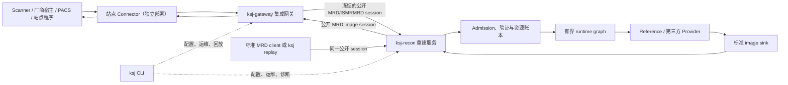
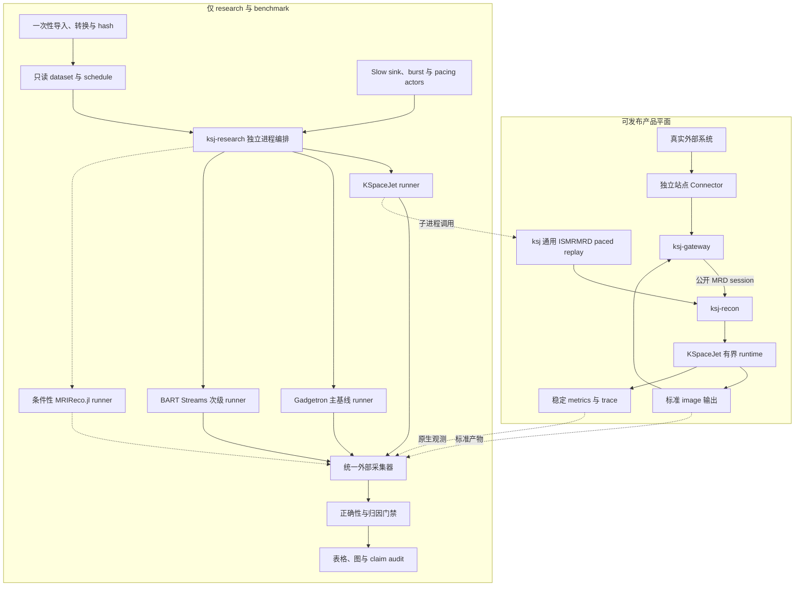
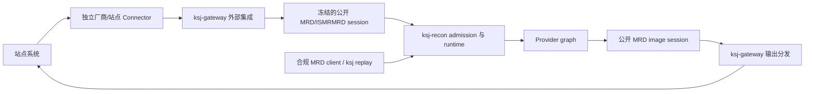
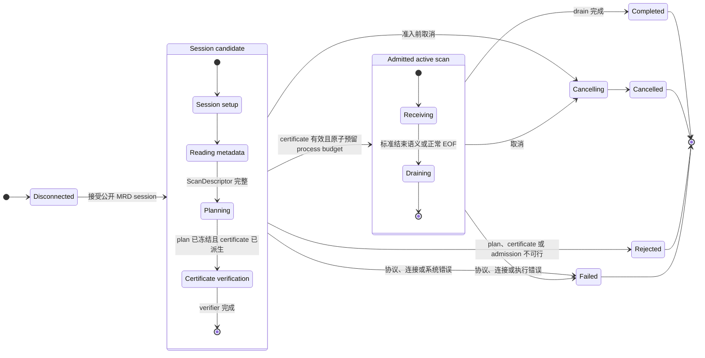
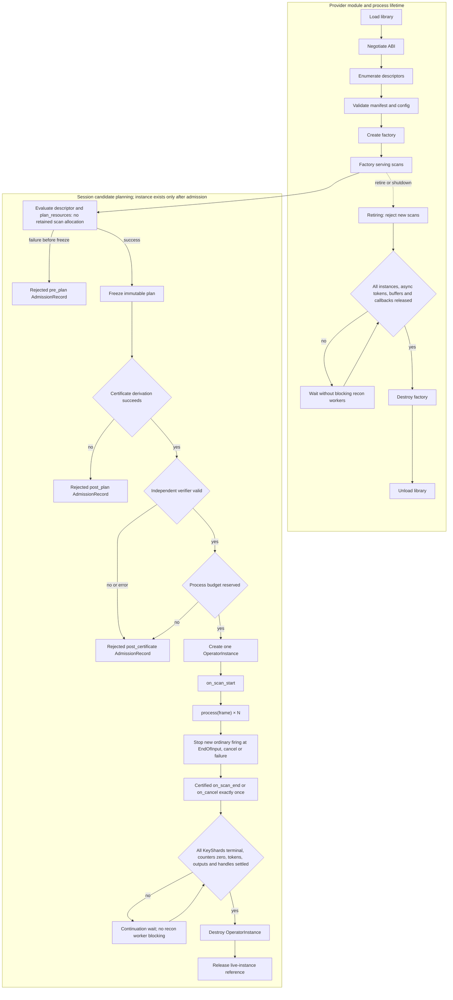
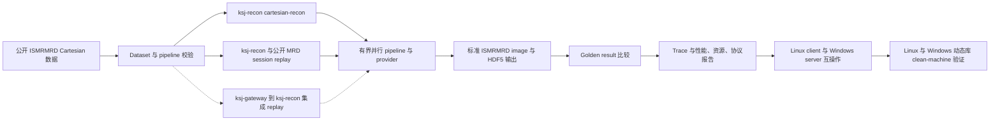

# KSpaceJet 流式重建框架实施规划

> **历史 / 非规范性记录。** 本文保存已撤回或探索性的架构提案，而不定义当前产品能力、
> 状态、接口、部署、验收或 artifact authority。尤其是其中关于公开 MRD/ISMRMRD
> session、`ksj-gateway`、Connector、scanner/采集集成、网络 relay/transport 或结构化
> core logging 的主张均已撤回。当前产品边界、artifact authority 与执行状态的唯一权威为
> [KSpaceJet project plan and acceptance](KSpaceJet_project_plan_and_acceptance.md)。
>
> 状态：历史提案（保留以供技术考察，不是架构或实施基线）。
> 历史适用范围：Linux x86_64、Windows x86_64/MSVC，C++20，Conan 2 依赖管理。
> 本文不恢复 DPC、BRF、ComQ、私有协议或专有重建算法。
> 历史执行拓扑曾列出 `ksj`、`ksj-gateway`、`ksj-recon` 与 `ksj-research`；该描述不规定
> 这些程序当前的角色或能力。当前可执行行为和边界只以 canonical execution ledger 及其
> 对应源码、测试为准。

## 1. 愿景与完成定义

KSpaceJet 是一个以 ISMRMRD 为唯一公开原始采集输入契约的高性能 MRI 重建框架。它的设计目标与 Gadgetron 相近：将采集数据通过可组合的处理图转成重建图像；但实现必须采用更清晰的契约、更严格的资源边界、更可靠的性能证据和更简洁的开发者体验。

框架的核心定义如下：

> KSpaceJet 通过有界、可观测、可取消的数据流图处理 ISMRMRD 采集数据；provider 拥有具体重建算法，框架拥有调度、内存、数据契约、性能诊断、部署与扩展机制。

首个公开可用版本必须形成完整闭环：



### 非目标

- 不兼容旧 BRF、私有 replay、DPC operation queue 或 vendor 私有采集格式。
- 不将专有重建算法放入本仓库；公开 Cartesian reconstruction Provider 仅用于验证框架能力。
- 不让 public API 暴露 Eigen、MKL、IPP、OpenCV、ITK 或 FFTW 类型。
- 不以 GUI、DICOM、云端调度或多节点分布式运行为首个发布版本的前置条件。
- 不允许无界队列、隐藏数据复制、全局可变 scan 状态或没有基准依据的“优化”。

## 2. 当前基础与差距

应保留并复用的基础组件：

- `libs/core`：内存池、NUMA placement、线程服务、日志、配置、进程基础设施。
- `libs/numerics`：`Pooled*`/`View` 数据模型、FFT、线性代数、NUFFT 和以 benchmark 驱动的后端选择。
- `libs/io/kspacejet-ismrmrd`：ISMRMRD HDF5 顺序读取 facade。
- `tests/benchmarks`、`tools/ksj_numerics_benchmark`：数值与性能验证基础。
- `third_party/intel`：经本地 Conan recipe 打包的 Intel 动态库 payload。

当前缺失的框架核心能力：

- scan 生命周期、数据帧、错误和取消等稳定 runtime 契约；
- 算子图、端口类型、静态 graph 校验、背压和调度器；
- 可在异步边界安全持有的数据所有权模型；
- provider SDK、插件 ABI、接口一致性和动态加载；
- 标准 image writer、公开 reference pipeline 与端到端 golden 测试；
- 服务进程、CLI、指标、trace 与可复现实验协议。

现有 `DatasetReader` 是顺序文件 source：传给 callback 的 `std::span` 只在该 callback 内有效。任何异步运行时都不能保存该 view；进入异步 stage 前必须转成拥有或共享 pooled buffer 的 frame。

## 3. 目标架构



### 3.1 四工程、命名与部署边界

所有 KSpaceJet 自有可执行文件使用小写 kebab-case 的 `ksj` 前缀；安装文件名、服务名和文档名称使用同一个精确名字。`KSpaceJet` 仅用于项目/显示品牌，`ksj` 用于命令和内部 CMake target 前缀。CMake target 使用 `ksj_` snake case：`ksj_cli`、`ksj_gateway`、`ksj_recon`、`ksj_research`；源码目录遵循仓库统一的 `kspacejet-*` 目录命名。不得使用含义不明的 `fe`、`be`、`d` 后缀，也不得保留与 CLI 或动态插件加载重复的并列 helper 程序。扩展重建模块不是新的可执行程序，而是使用当前 Provider C ABI 的独立 `.so`/`.dll`。

| 工程目录 / 二进制 | 运行与安装 | 唯一职责 | 明确不负责 |
| --- | --- | --- | --- |
| `apps/kspacejet-cli` / `ksj` | 默认构建、安装 | 统一 CLI：本地 run、数据/pipeline/provider 工具、replay、诊断和运维 | 常驻转发或第二套 runtime |
| `apps/kspacejet-gateway` / `ksj-gateway` | 默认构建、安装 | 面向 scanner、厂商宿主、PACS 和站点服务的集成网关；独立 Connector 的注册/健康监管、认证/TLS、站点路由、公开 MRD 会话转发和输出分发 | 专有协议/SDK 解析、算法、Provider 调用、scan admission、执行图、资源账本或私有 wire protocol |
| `apps/kspacejet-recon` / `ksj-recon` | 默认构建、安装 | 真正的在线重建服务：admission、`ExecutionPlan`、runtime、背压、内存/线程预算、动态加载的 Provider plugin 和标准 image delivery | 厂商 SDK、PACS/workflow 逻辑或任意私有采集格式 |
| `apps/kspacejet-research` / `ksj-research` | 默认构建、安装 | 跨框架实验编排、证据冻结、统计和论文制品 | CLI、gateway、reconstruction service 的 runtime/data-plane 依赖、Provider ABI 或私有 wire shortcut |

在 `KSJ_BUILD_APPLICATIONS=ON` 的应用配置中，四个工程均进入默认构建和安装。VS Code 的 `KSJ: build Linux Debug applications`、`KSJ: build Linux Release applications`、`KSJ: build Windows Debug applications` 和 `KSJ: build Windows Release applications` 均构建全部四个可执行程序。既有 `KSJ_BUILD_RESEARCH` 继续只控制 `tests/research` 中的研究测试/实验目标，不控制 `ksj-research`。Provider plugin 是单独构建、安装并由内容摘要标识的动态库，而不是应用进程。

`ksj-gateway` 与 `ksj-recon` 的边界是稳定的部署边界，而不是旧系统前/后端代码的迁移边界：独立部署的站点 Connector 先把外部系统差异收敛为冻结的**公开** MRD/ISMRMRD streaming session，gateway 只监管/转发该公开 session，reconstruction service 只消费/生成该公开 session。Connector 不属于四个 KSpaceJet 标准工程，也不能把专有 payload 转交给 gateway 或 reconstruction service。两者之间绝不引入 KSpaceJet 私有封包、credit、重试或数据格式。最小部署和公平 runtime benchmark 可以让合规 MRD client 直接连接 `ksj-recon`；真实 scanner/站点集成默认经过 Connector 与 `ksj-gateway`，其额外 hop、copy 和延迟必须独立计量。

建议的目录与模块边界：

```text
apps/
  kspacejet-cli/                 统一 CLI（ksj）
  kspacejet-gateway/             外部系统集成网关（ksj-gateway）
  kspacejet-recon/               在线重建服务（ksj-recon）
  kspacejet-research/            已安装的实验 runner

libs/core/
  kspacejet-program/             四个入口共用的内部 program 库

libs/recon/
  kspacejet-recon-model/     稳定数据、状态、错误、事件契约
  kspacejet-recon-graph/         图配置、静态校验、图编译
  kspacejet-recon-runtime/       executor、队列、背压、scan 生命周期
  kspacejet-provider-sdk/        provider C ABI 与 C++ 包装
  kspacejet-ismrmrd-output/      标准输出 writer

libs/transport/
  kspacejet-control/             后期控制 API；不得进入热数据面

providers/
  kspacejet-cartesian-recon/     公开、简单、可验证的 Cartesian reconstruction Provider
  examples/                      passthrough、计数器、质量控制示例

schemas/
  pipeline.schema.json
  operator-contract.schema.json
  execution-plan.schema.json
  run-record.schema.json

tests/integration/
  datasets/
  pipelines/
  golden/
```

新增的一方库目标必须显式使用 `SHARED`；可执行目标正常保持 `add_executable`。第三方依赖只经 Conan 管理；Intel 运行时仅经 `third_party/intel` 的本地 Conan recipe 提供。

### 3.2 产品平面与论文实验平面的硬边界

论文需要调用 KSpaceJet、Gadgetron 和 BART Streams，但这些基线不是 KSpaceJet 产品架构的一部分。实现必须把可发布的 reconstruction 数据面与仅用于论文复现的实验平面分开：实验工具可以复用公开 CLI、schema 和 run artifact，不能把 baseline adapter、比较标签、故障注入或统计逻辑链接到 daemon、runtime 热路径或 Provider ABI。



边界规则如下：

| 能力 | 所属边界 | 发布/ABI 规则 |
| --- | --- | --- |
| ISMRMRD inspect/validate、通用 paced replay、标准 image compare、trace/metrics、run artifact | 产品 tooling | 可以随 `ksj` 发布；只通过稳定产品契约工作 |
| `ksj-gateway`、`ksj-recon`、有界 runtime、Provider SDK、Cartesian reconstruction Provider、passthrough 示例 Operator | 产品 runtime/SDK | 不包含任何基线名称、论文 case id 或 research callback；gateway/reconstruction service 之间只使用公开 MRD session |
| 数据下载与一次性转换、baseline lock、跨框架 runner、matched-kernel adapter、slow-sink proxy、统计和作图 | `research/benchmarks` | 默认不构建、不安装、不导出 CMake target，不进入产品 Conan graph |
| Gadgetron、BART Streams、可选 MRIReco.jl 环境 | 外部冻结实验环境 | 只以容器/环境 digest 和独立进程运行；不得链接进 KSpaceJet 二进制 |

研究侧 KSpaceJet adapter 必须只调用公开 `ksj` CLI、`ksj-recon` 的 MRD endpoint 或正常 Provider SDK；不得增加“仅供论文”的 frame 字段、Operator callback、queue 分支或 telemetry fast path。比较分类、baseline 版本和 case 标签全部放在外层 evidence manifest。clean-machine 测试必须证明四个应用均按 install manifest 安装；同时确认 `ksj`、`ksj-gateway` 和 `ksj-recon` 的 runtime/data-plane 依赖图不包含 `ksj-research`、研究 adapter、故障注入或其传递依赖。`ksj-research` 不得与 `KSJ_BUILD_RESEARCH` 混用。

## 4. 先冻结的数据与生命周期契约

必须先完成契约和测试，之后再实现并行 runtime 或 provider。当前实现应定义以下对象：

- `ScanDescriptor`：从 ISMRMRD XML 提取的 encoding、矩阵、FOV、trajectory、coil、方向等不可变描述。
- `FrameEnvelope`：`scan_id`、单调 `sequence_id`、时间戳、trace id、deadline、取消 token、内存 lease。
- `AcquisitionFrame`：header、samples、trajectory、discard 区间；异步边界后必须拥有或共享底层 pooled buffer。
- `CalibrationFrame`、`ImageFrame`、`WaveformFrame`、`ControlEvent`、`EndOfInput`、`FailureEvent`；`EndOfInput` 只表示输入关闭，`Completed` 必须等待 graph drain 和 sink flush。
- `Operator`：`on_scan_start`、`on_frame`、`on_scan_end`、`on_cancel`；失败使用结构化 status，ABI 边界不得抛异常。
- `PortContract`：输入/输出 frame 类型、顺序要求、batch/并发能力和可暂停语义；具体 edge 容量与可靠背压策略由 graph compiler 和 TargetEnvelope 决定，Provider 不得把 raw MRI edge 改成隐式 drop。
- `ScanContext`：每个 scan 独占，禁止静态变量承载结果相关状态。
- `RuntimeServices`：内存、executor、trace、plan cache、配置快照；不得暴露后端实现类型。

PipelineDefinition、OperatorContract、ResolvedPipeline、ScanDescriptor 到
ExecutionPlan 的字段所有权和编译顺序，以[PipelineDefinition 与重建流水线设计](pipeline_definition.md)
为准；本规划负责产品边界、Provider ABI、服务部署和权威工作单。PipelineDefinition
不得写入任务数、KeyShard 数、队列容量或线程数，这些值只能由 scan-specific compiler
从 ISMRMRD XML、TargetEnvelope、OperatorContract 和 MachinePolicy 推导。

runtime 内部 frame payload 使用不可变、引用计数、带 generation 的 `BufferHandle`。现有 move-only `MemoryLease` 继续作为底层内存所有权实现，但不能直接暴露到 DAG fan-out、网络协议或 plugin ABI；这些边界只能传递 host 管理的 handle 和只读 slice descriptor。

### 所有权规则

1. `std::span`、`*View` 和第三方借用对象不得跨异步边界保存。
2. 初版允许在 source 到 runtime 的边界进行一次受控 materialization；该复制必须可见、被计数并纳入 benchmark。
3. 以后只有在数据证明收益时，才将 source 优化为直接写入 pooled buffer。
4. plan、kernel、trajectory 预计算可放在有完整 key 的只读 process cache；scan 结果相关状态不可跨 scan。
5. provider 的 C++ 内部 API 可以演进；外部 ABI 只使用当前唯一的 C ABI。

## 5. 流式执行与性能模型

> PipelineDefinition、OperatorContract、ScanDescriptor 到 ExecutionPlan 的产品 schema 和运行时同步规则见 [PipelineDefinition 与重建流水线设计](pipeline_definition.md)；详细的 MRI key/dependency 模型、准静态与动态区域划分、OperatorInstance 内部 `KeyShard`、校准进展条件、NUMA/多 scan 调度、形式化命题和 `ExecutionPlanCertificate` 见 [MRI 流水线、并行模型与可证明执行理论](streaming_pipeline_parallelism_theory.md)。本节只保留总体实施约束；三份文档冲突时应先通过 ADR 和 claim audit 统一，不得分别实现两套 runtime 语义。

不得简单地将“每条 acquisition 投入线程池”视为流式框架。应由测量结果决定 batch 和并发边界。每个 operator 必须声明：

```text
输入粒度：acquisition / frame batch / slice / volume / scan
并发键：scan / encoding / slice / contrast / channel group
最大在飞数量：N
最大队列字节：B
资源需求：CPU / NUMA node / Intel 内部线程数
输出顺序：preserve / keyed / unordered
```

执行规则：

- 每条 graph edge 都有最大元素数和最大字节数；默认采集数据不得静默丢弃。
- 每条 edge 显式选择背压：逻辑暂停上游并注册 continuation（不得占用 compute worker 阻塞）、拒绝输入、合并、或仅对可丢事件丢弃。
- 初版使用可靠的 bounded SPSC/MPMC queue 和固定 worker budget；不要过早加入复杂 work stealing。
- 现有通用 `ThreadPool` 的 task deque 不作为数据面 edge queue；在线 graph 必须使用可证明容量和字节预算的专用 queue。
- 高频小任务先以 micro-batch 合并，batch 策略由 benchmark 配置而不是硬编码。
- 大块数据使用 `MemoryBroker` 与 `Pooled*`；稳态目标是热路径零 heap allocation。
- MKL、IPP、FFTW 与 runtime 必须统一控制并发，禁止 worker pool 与后端内部线程池过度订阅。
- operator 必须声明严格顺序、按 key 顺序或完全无序；runtime 负责检查可实现性。

## 6. 在线流式数据面设计

> 互操作与论文门禁：生产数据面只实现公开 ISMRMRD/MRD streaming session，不定义 KSpaceJet wire envelope、私有 message、wire-level credit、恢复协议或必选扩展。`KSJ-NET-000` 必须逐消息核对所选官方协议版本、生成跨平台 fixtures 并冻结互操作行为；协议无法表达的资源控制留在 runtime 内部，不改变线上的 MRI 数据语义。

### 6.1 `ksj-gateway` 与 `ksj-recon` 的集成边界

`ksj-gateway` 是站点和外部系统的隔离层，不是第二个 reconstruction runtime。它监管独立部署的站点 Connector，并负责 Connector 注册/健康、认证/TLS、站点路由、审计和公开会话 relay。厂商协议/SDK 的解析、凭据和协议级重试只能留在这个独立 Connector 中，不能编译进 `ksj-gateway`、`ksj-recon`、runtime 或 Provider SDK。Connector 是站点集成制品，不是 Provider；它不得借 Provider ABI 进入 `ksj-recon`，也不构成第六个 KSpaceJet 标准工程。

首个发布版本不以 DICOM/PACS 或任何特定厂商 Connector 为前置条件；保留这个边界是为了以后接入真实系统时不污染公开数据契约和重建热路径。

Connector 对 gateway、gateway 对 reconstruction service 的输入输出始终是一条冻结的公开 MRD/ISMRMRD streaming session。gateway 可以做公开协议要求的增量 framing、认证/TLS 终止、站点级会话路由和有界 relay，但不能插入私有 metadata、流控 credit、序列号、恢复消息或内部资源状态。它不解析 pipeline、不会加载 Provider，也不能绕过 reconstruction service 的 admission、`ExecutionPlanCertificate`、MemoryBroker 或 read gating。相反，reconstruction service 不加载厂商 SDK、不连接 PACS、不携带站点 workflow 规则；它对 ingress 的唯一在线 MRI 输入就是公开 session。



部署有两种可审计模式：`direct` 让合规 MRD client 直接连接 `ksj-recon`，用于最小部署、开发和与 Gadgetron/BART 的核心 runtime 比较；`gateway` 让外部系统经独立 Connector 与 `ksj-gateway` 接入，适用于真实站点。`gateway` mode 的端到端计时必须报告 Connector/gateway hop、relay staging、序列化和 copy；它不能与只测 `ksj-recon` 的 runtime 结果混为同一个因果结论。两种模式都必须把实际 session 归档/回放为标准 ISMRMRD HDF5，而不是私有格式。

### 6.2 数据格式与传输协议的边界

ISMRMRD HDF5 是归档文件格式，适合离线读取、回放和结果保存；`ksj-gateway` 到 `ksj-recon`、或合规 direct client 到 `ksj-recon` 的在线 MRI 语义使用公开 MRD streaming session。两条输入路径必须映射到同一 runtime contracts：

- scan metadata 是标准 ISMRMRD XML；
- acquisition、waveform 和 image 字段与 ISMRMRD 类型一一对应；
- samples、trajectory 和 image pixels 保持 ISMRMRD 规定的数值类型与布局；
- 连接、配置、数据和结束语义只采用所选公开 MRD session 的正式定义；
- 不允许只有 KSpaceJet 私有代码才能解释的 header、payload、sequence 或 acknowledgement。

在线 capture 必须能无损保存为标准 ISMRMRD HDF5；离线 HDF5 replay 必须能产生与在线 source 相同的 runtime frame 序列。这样算法无需区分文件输入和在线输入。若公开协议没有取消、断线续传或远端持久化确认语义，KSpaceJet 不能在私有 message 中补齐：取消由控制面和连接关闭协调，活动连接断开使 scan 明确失败，持久化完成由本地 sink/run artifact 表达。

### 6.3 数据面组件

```mermaid
flowchart LR
    externalEndpoint["独立 Connector 或 direct MRD client"] --> gatewayRelay["ksj-gateway 有界公开-session relay"]
    gatewayRelay --> byteTransport["reconstruction-service Asio socket or TLS"]
    byteTransport --> mrdDecoder["MRD session incremental decoder"]
    mrdDecoder --> ingressValidation["标准消息校验与内部序号分配"]
    ingressValidation --> acquisitionFrame["MemoryBroker-owned AcquisitionFrame"]
    acquisitionFrame --> runtimeGraph["Bounded runtime graph"]
    runtimeGraph --> imageFrame["ImageFrame"]
    imageFrame --> boundedSendQueue["有界 MRD image send queue"]
    boundedSendQueue --> imageSink["公开 MRD sink 或 ISMRMRD HDF5 writer"]
    imageSink --> gatewayRelay
    directMrdPath["direct mode"] -.-> byteTransport
```



各层职责必须分离：

- `ksj-gateway`：只承担独立 Connector 的注册/健康监管、站点路由和有界公开-session relay；它不能解析专有原始协议、创建 reconstruction-service runtime frame、Provider instance 或私有 session envelope。
- `ByteTransport`：`ksj-recon` 内只负责异步读写、连接、超时和 TLS，不理解 MRI 语义。
- `MrdSessionConnection`：`ksj-recon` 内只增量解析公开 MRD session 消息、长度、生命周期和协议错误；不识别 KSpaceJet 私有 envelope。
- `OnlineAcquisitionSource`：把合法 MRD/ISMRMRD 消息转换为 runtime contracts。
- `IngressController`：根据内存和 graph 容量决定是否继续提交 socket read/readiness；内部 byte/item ledger 不在线上传输。
- `OnlineImageSink`：将 `ImageFrame` 映射回标准 ISMRMRD image 消息。
- `ControlService`：创建、查询、取消 scan；不得承担 acquisition payload 的热路径转发。

首版使用公开 MRD session 所要求的 transport binding；若选定 binding 基于 TCP，则 `ksj-recon` 与 `ksj-gateway` 分别以 Boost.Asio 实现 Linux/Windows 异步 I/O，并在协议允许时通过标准方式启用 TLS。transport 通过接口隔离，未来增加共享内存或其他公开 adapter 时不得修改标准 MRD 数据语义和 runtime frame 契约。首版不引入另一套 ZeroMQ、gRPC 或自定义 TCP framing 数据面。

### 6.4 公开 MRD session binding

`KSJ-NET-000` 必须先选择并锁定一个公开、可引用版本的 MRD streaming session binding，然后形成实现 ADR 和 byte-level golden fixtures。ADR 至少逐项记录：

- 官方消息类型、方向、连接建立、配置、数据、结束和错误语义；
- acquisition、waveform、image 及 metadata 与 runtime contracts 的逐字段映射；
- length、endianness、unknown message、fragmentation、partial I/O 和异常关闭规则；
- 官方参考实现或互操作 peer、版本/commit、构建选项与许可证；
- 标准本身未定义的能力，以及 KSpaceJet 如何仅在控制面或 runtime 内部处理，而不是扩展 wire；
- Linux sender 到 Windows receiver 及反向的相同 byte fixtures。

decoder 在任何分配前检查消息长度、shape、segment bytes、discard 范围、encoding space 和全部整数运算。当前 file reader 尚未公开 waveform，实施时必须补齐，不能把 waveform 变成在线特例。若官方 library 的对象模型需要 payload copy，该复制必须进入 `copy_bytes_total{reason="mrd_adapter"}`；是否采用自有兼容 decoder 只能由互操作测试、安全审计和 benchmark 决定。

KSpaceJet 可以在 ingress 后为 frame 分配内部单调 `event_index`、trace id 和资源账本 key，但这些字段不是 wire contract，不参与外部互操作或断线恢复。

### 6.5 连接与 scan 状态机

本状态机属于 `ksj-recon` 看到的公开 MRD session。每条数据连接最多承载一个活动 scan，避免多 scan 复用造成 head-of-line blocking、复杂公平性和故障耦合。reconstruction service 控制面可以同时管理多个 scan，每个 scan 分配独立的数据连接和 runtime budget；`ksj-gateway` 的外部 Connector 连接生命周期不得改变这里的 admitted/rejected/failed 语义，只能通过公开 session 的正常建立、关闭或错误映射到 reconstruction service。



状态不变量：

- 消息顺序、合法终止和 unknown-message 行为完全服从冻结的公开 MRD session binding；同一连接不复用为多个活动 scan。
- 接受连接只创建 `Session candidate`，不等于 scan admitted；在 certificate 通过独立 verifier 且 process budget 原子预留成功前，任何 acquisition 都不得进入算法 graph。
- plan、certificate、profile obligation 或 process budget 不可行进入 `Rejected`；已经 admitted 后的协议、连接、Provider 或执行错误进入 `Failed`，两者不得混记。
- ingress 分配的 `event_index` 只供本进程排序、trace 和账本使用，不能伪装成网络 exactly-once 或公开 sequence。
- `Completed` 只在输入结束、所有 graph edge drain、所有 sink flush 成功后产生。
- cancellation 必须从 source 传播至 queue、operator、provider 和 sink，并有有限完成 deadline；线上只使用标准关闭/错误语义，不发送私有 cancel message。
- 活动接收期间断线默认进入 `Failed`；只有输入已经完整接收且策略明确允许完成时，才可以继续 drain 并持久化结果。
- 当前实现不支持活动 scan 的部分断线续传。文件 replay 或外部可靠 spooler 可以从头启动一个新 run，但不得把重跑描述为连接恢复或 exactly-once。

### 6.6 Transport-neutral 背压与资源预算

公开 MRD session 不需要暴露 KSpaceJet credit message。runtime 在 source、每条 edge、Operator retention 和 output send queue 上维护 transport-neutral 的 item/byte 双重账本；只有在 ingress 同时拥有 frame slot、byte capacity 和 MemoryBroker reservation 时才提交下一次异步 read：

```text
can_submit_read =
  ingress_free_items >= 1 and
  ingress_free_bytes >= declared_next_message_bound and
  memory_reserved_for_next_message
```

已解析公开 header 后若精确 payload 大小超出 reservation，则在读取 payload 前拒绝该消息或 scan，不能先读入无界临时 buffer。内部可接纳容量来自：

```text
internal_capacity = min(
  ingress_queue_free,
  runtime_edge_free,
  memory_budget_remaining,
  configured_connection_window)
```

MRI calibration 还需要独立的依赖进展双预算。若 calibration 可能位于同一顺序 stream 的 imaging 数据之后，TargetEnvelope 或输入 profile 必须为每个 `CalibKey` 给出 `max_precalibration_prefix_items_per_calib_key` 与 `max_precalibration_prefix_charged_bytes_per_calib_key`，并给出活跃 key 数、aggregate item/byte 最坏界、calibration frame 与 decoder staging 上界；缺失维度只有在能够由 cardinality 和最大 frame charge 严格推导时才可省略。admission 把早到 prefix 转入不能被普通 retention 挪用的 `calibration_progress_reservoir`，保证 read gating 不会在 calibration 到达前自锁。无法得到双维有限 horizon 时，只能使用显式 spool、进入非 `strict-online` profile 或拒绝在线准入。`CalibrationReady` 只是 session adapter 之后的内部依赖事件，不能成为私有 MRD wire message。完整反例和条件性证明见[理论文档第 8 节](streaming_pipeline_parallelism_theory.md)。

要求：

- ingress 容量不足时不提交新的 read/readiness，依靠公开 transport 的正常流控向上游传播背压；不得在用户态增加无界 socket staging。
- `ksj-gateway` 自己也必须有独立的 connection/item/byte 上限，且在 reconstruction service 不可读或外部 Connector 失速时向其外部协议施加正常背压或显式失败；gateway 不得尝试用私有 credit 将 reconstruction-service ledger 透传给 scanner。其 relay staging、copy 和排队时间在 `gateway` mode 中单列；只有显式记账、限制并加入 certificate 的 gateway 资源才可以加入端到端资源界限。
- host 可以计量和预留的 user-space TLS/codec/send/receive staging 只计入 `M_transport`；`M_guard` 只容纳 allocator size-class、pool committed slack 和其他可预留 library slack。不可见 kernel socket buffer、不可拦截 TLS library allocation 和网络在途字节不属于 framework-managed memory theorem，其配置与观测值必须进入 run manifest，并在总 RSS 报告中单列。
- input 的 `decoded`、`enqueued` 和 `last_reference_released` 是不同的内部事件；只有最后引用释放后才归还对应 MemoryBroker 和 edge capacity。
- output 必须先预约 bounded send queue 的 item/byte capacity。queue 满时 downstream edge 使用 continuation 暂停 publish；socket write completion 只表示 host buffer 可释放，不等于远端持久化 commit。
- 如果 scanner 不能暂停且目标机器无法维持输入速率，系统必须明确失败或使用显式 spool adapter，不能静默丢 acquisition。
- 每个 scan 和连接分别限制最大队列字节、最大 frame、最大在飞输出和总内存预算。
- compute worker 不能阻塞在满 downstream edge 上。scheduler 在 callback 前使用 `try_reserve_firing` 原子预留 input claim、全部输出、scratch、task/token 和 CPU permits；失败时不持有部分资源，只注册受调度 continuation。callback 成功后在已预留容量内 commit/publish；fan-out 的全部目标必须属于同一 reservation bundle。join/aggregate 声明 retention key、窗口和 flush 上界，避免固定 worker 全部等待形成死锁。
- 多 scan 使用 per-scan quota 和 weighted fairness，单一高速 sender 不能占满全局内存或长期饿死其他 scan。
- 若公开 MRD binding 或 TLS 实现不能在 header 与 payload 之间暂停读取，adapter 必须声明并预算其最大 staging bytes；达不到 TargetEnvelope 时失败，而不是定义私有 credit envelope。

### 6.7 内存与复制路径

`ksj-recon` 的在线热路径目标是一次网络接收、零额外 payload copy：

1. 在有协议上限的固定小 buffer 中增量解析公开 MRD message metadata。
2. 验证类型、长度、shape 和内部资源 reservation 后，从 `MemoryBroker` 获取精确容量的 lease。
3. 在公开 binding 允许时，decoder/socket 直接把 trajectory/samples payload 读入 leased buffer；若参考 library 强制 materialize，则保留受控的一次复制并单独计量。
4. `AcquisitionFrame` 只持有 header、shape 和 buffer handle。
5. operator 通过 `View` 借用 payload；需要异步保存时显式 retain handle。
6. 输出使用 host 分配的 `ImageFrame` buffer，经有界 send queue 写成公开 MRD image；是否可以 scatter/gather 由冻结 binding 和 TLS 能力决定。

TLS、第三方库或 layout 转换导致的必要复制必须计入 `copy_bytes_total`，并在 trace 中标注来源。`gateway` mode 的 relay/copy 以独立 component 标识，不得被错误归入 reconstruction-service 零复制指标；任何普通 helper 都不能隐藏完整 acquisition/image 的复制。

### 6.8 断线、重试与幂等

在线 scanner 未必能重发数据，因此当前实现采用可证明的语义：

- 活动 scan 断线直接进入 `Failed`，不假装自动恢复，也不在公开 MRD session 外增加续传或确认 message。
- ingress `event_index` 只检测单次连接内的 runtime 顺序，不能用于跨连接去重；ISMRMRD header 字段不被解释为 transport sequence。
- 文件 replay 失败后可以从冻结输入重新开始一个新的 run；当前实现不从中间 frame 继续，也不复用旧 run 的成功状态。
- 必须容忍不可重放的在线 source：接收不完整时输出不得标记为完成。需要可靠落盘的部署可以显式使用独立 spool adapter，先原子完成标准 ISMRMRD HDF5，再启动离线 reconstruction。
- `ksj-recon` restart 使活动 scan 失败；gateway/Connector 重启也只能通过公开 session 关闭使该 scan 明确失败。将来的部分恢复必须同时具备公开/标准化 transport 语义、durable input/output journal、pipeline/provider digest 和 provider checkpoint contract；不能只修改 KSpaceJet wire protocol。
- sink 写出使用临时结果和原子 finalize，避免失败 scan 被误认为完整结果。

### 6.9 控制面

`ksj-recon` 控制面提供 `ControlService`，可用 Boost.Beast 实现 HTTP/1.1 JSON API，以避免把重量级 RPC 框架引入核心依赖。建议端点：

```text
POST   /scans                    创建 scan、选择 pipeline、返回 data endpoint
GET    /scans/{id}               状态、进度、资源和错误摘要
POST   /scans/{id}/cancel        取消
GET    /pipelines                可用 pipeline 与 schema
GET    /plugins                  已加载 provider 与当前状态
GET    /health/live              进程存活
GET    /health/ready             是否可接收新 scan
GET    /metrics                  低基数运行指标
```

reconstruction service 控制面只传配置和状态，不传大 acquisition/image payload。`ksj-gateway` 另有独立的站点 Connector 配置、健康和路由管理面；它只能引用 reconstruction service 的公开 status/identity，不得代理或重写 reconstruction service 的 scan admission 响应。未来可以增加 gRPC adapter，但核心 service 接口和 JSON schema 保持 transport-neutral。

### 6.10 安全与协议健壮性

- 所有长度、维度、乘法和 offset 在分配前检查溢出。
- 设置 XML、attribute、frame、scan、连接和总内存上限。
- 生产部署支持 TLS/mTLS；gateway 的外部认证和 reconstruction service 对 gateway/direct client 的服务认证都发生在 scan admission 之前。
- 日志不得输出患者可识别 metadata、完整 XML 或像素内容；诊断导出需显式授权。
- 公开 MRD session decoder 必须有官方/自建 golden corpus、fuzz、fragmentation、coalescing、slowloris、超大长度和随机断线测试。
- protocol error 使用稳定错误码；不能把第三方异常文本直接返回不受信任客户端。

### 6.11 在线数据面的科学验收

首先为目标部署冻结 `TargetEnvelope`：最大 acquisition/image bytes、峰值 acquisition/s 与 GB/s、最大 scan 时长、最大并发 scan、TTFI/p99、每 scan/进程内存预算。没有 TargetEnvelope 时不能宣称“支持实时”。至少验证：

- 对合法完整 session 零 frame 丢失、零 runtime 重排；公开协议没有唯一序号时不宣称跨连接重复检测；
- 在冻结 `TargetEnvelope` 与预注册 fault profiles 内，observed framework-managed resident capacity 不超过 compiled bound；host-owned transport/TLS staging 进入账本，不可见 kernel socket、不可拦截 TLS/vendor allocator、GPU/driver、OS page cache 与 unexplained RSS 单列实测；
- loopback 公开 MRD session 吞吐与官方互操作 peer、等价 raw transport payload baseline 对比，并报告 codec CPU 和必要复制；
- 从最后一个 payload byte 到 operator entry 的 ingress p50/p95/p99；
- 内部容量耗尽后停止提交 read 的时间、容量恢复后的恢复时间，以及 gate 关闭后仍由 kernel/TLS buffer 接收的字节上界；
- 1-byte fragmentation、多个 frame coalescing 和跨 packet header 的正确性；
- Linux 与 Windows 的相同公开 MRD wire fixture 互通；
- 断线、取消和 provider failure 后连接、buffer、continuation 和 Provider instance 全部回收。
- `direct` 与 `gateway` mode 分别验收：前者报告 reconstruction-service ingress/runtime 指标，后者另报告 Connector/relay staging、copy、hop latency 和输出分发；不得以 direct 成绩替代站点集成测量，也不得把 gateway 成本归因于 Provider/runtime。
- 所选标准 transport profile 的 sustained throughput 至少达到 TargetEnvelope 峰值的 1.5 倍；达不到时 release gate 失败或重新定义受支持 envelope。
- framing、verify、ingress enqueue 的 p99 低于最小 acquisition 间隔的 10%；passthrough 在 decoder 完成受控 materialization 后的应用层 bulk copy bytes 为 0，decoder 自身必要复制必须单列。
- 8～24 小时 soak 没有增长性 RSS、handle、thread 或 retained-buffer 泄漏。

绝对性能 SLO 由目标 scanner acquisition rate、公开 fixture 和代表性部署机器共同确定，不能先凭经验写死；一旦进入 release baseline，回归阈值按第 12 节的性能协议管理。

## 7. 第三方 Provider 与算法扩展设计

术语必须保持稳定：

- `Provider`：可安装、以内容摘要标识、可签名的算法发布包，可以开源或闭源。
- `Plugin`：Provider 在某个平台上的 `.so`/`.dll` 实现。
- `Operator`：Provider 导出的 graph node factory；一个 Provider 可以导出多个 Operator。
- `OperatorInstance`：某个 pipeline node 在一次 scan 中的运行实例。
- `KeyShard`：`OperatorInstance` 内部由 host 执行计划解析的 per-key 单写者状态/mailbox；是 runtime 私有调度概念，不新增 Provider ABI lifecycle。
- `Pipeline` / `PipelineDefinition`：声明式 typed DAG；只引用 provider id、operator id、digest 与 config/端口断言，不依赖动态库文件名，也不携带 scan-specific task、KeyShard、queue 或线程数。完整 schema 见 [PipelineDefinition 与重建流水线设计](pipeline_definition.md)。

Provider 只扩展算法 Operator，不扩展 scanner 协议、控制服务或任意网络 source/sink。这样 framework 始终拥有传输、背压、内存、取消、资源预算和观测语义。

### 7.1 扩展层级

| 模式 | 目标用户 | 性能与隔离 | 推荐用途 |
| --- | --- | --- | --- |
| 内置 operator | KSpaceJet 自身的串行 Cartesian 基线 | 最低开销，不承诺二进制兼容 | 框架验证、基础公开算子 |
| 动态库 C ABI plugin | 第三方 C/C++ provider | 接近内置性能；非法内存、`abort` 或不协作 callback 会影响 host 进程 | 默认且唯一的第三方扩展方案 |

第三方 C++ SDK 是 C ABI 的 header-only/薄封装，不把 STL、异常、RTTI 或编译器私有 ABI 暴露到动态库边界。算法作者主要编写现代 C++ `Operator` 类，生成模板负责导出 C entry point。

### 7.2 独立 SDK 分发

第三方不应克隆完整 KSpaceJet 源码才能开发 provider。应发布独立的 Provider SDK 包：

```text
kspacejet-provider-sdk@kspacejet/stable
```

SDK Conan package 包含：

- 稳定 C ABI headers 与 C++ wrapper；
- `KSpaceJetProviderSDKConfig.cmake` 和 `KSpaceJet::provider_sdk` target；
- `ksj_add_provider_plugin()` CMake helper；
- pipeline、manifest、operator-config JSON schemas；
- sample plugin、in-process conformance harness 和 ABI fixture；
- Linux/Windows CMake presets 与动态运行时部署规则。

生成的第三方项目应能独立执行：

```text
conan install . --build=missing
cmake --preset <platform-release>
cmake --build --preset <platform-release>
ctest --preset <platform-release>
ksj plugin test <built-plugin>
ksj plugin package <built-plugin>
```

### 7.3 稳定 C ABI

当前唯一导出入口为：

```text
ksj_provider_query(request, out_descriptor, out_api, out_error)
```

ABI 规则：

- 所有公开 struct 第一个字段为 `struct_size`；调用方只读取当前 `struct_size` 覆盖的字段，未知字段一律不解释。
- 使用固定宽度整数、显式 enum 值、opaque handle、pointer+length 和函数表；不使用 ABI 宽度不稳定的 `bool`、`long` 或 `size_t`。
- host 与 plugin 先验证必需的 descriptor/table 大小和 capability bits，再创建对象。
- 不跨边界传递 `std::string`、`std::vector`、`std::complex`、异常、allocator 或 C++ object ownership。
- ABI callback 全部 `noexcept` 语义；异常必须在 plugin wrapper 内转换为 `ksj_status`。
- C ABI header 必须能被 C11、GCC/Clang C++20 和 MSVC C++20 直接编译，并固定 Windows calling convention。
- host 分配并拥有跨边界 buffer；plugin 只能通过 retain/release/map/allocate callback 操作。
- DLL unload 前必须销毁全部 instance、异步 token、buffer retain 和 callback；Windows 下不进行危险的强制热卸载。

`host_api` 至少提供：

- buffer allocate、retain、release、map read/write；
- emit output、complete async token、查询 cancellation/deadline；
- 读取不可变 `ScanDescriptor` 与 operator config；
- 结构化日志、metric、trace scope；
- 受限 workspace 和 process cache 服务。
- 受 thread budget 控制的同步、可取消 `parallel_for`，以及下游 output capacity 查询。

`plugin_api` 至少提供：

- plugin/operator 枚举与 descriptor；
- factory create/destroy；
- config validate；
- scan instance create/start/process/end/cancel/destroy；
- plugin diagnostics 与 build information。

### 7.4 生命周期与状态所有权



- scan instance 默认不能跨 scan 复用；其成员状态随 scan 销毁。
- factory 属于 Provider module/process lifetime；单个 scan 的终态只能销毁自己的 `OperatorInstance`，不得直接销毁 factory。只有 retire/shutdown 已阻止新 scan，且所有实例、异步 token、buffer retain 和 callback 引用归零后，才能 destroy factory 与 unload library。
- `on_scan_end`/`on_cancel` 是 certificate 中的 terminal occurrence：先停止新普通 firing并按 ABI 序列化规则调用一次，再等待它触发的 bounded flush/cleanup、KeyShard、counter、token、output 和 handle quiescence，最后 destroy instance。尤其不得先等待 pending token/retain 归零再调用 `on_cancel`。
- cross-scan plan/cache 只能通过 host cache API，key 必须包含 bundle/contract digest、配置、shape、类型、backend 和硬件能力。
- plugin mutable global state 默认禁止；必要的 process service 必须声明线程安全且不影响 scan 正确性。
- runtime 可以同时创建多个 scan instance；plugin 必须根据 descriptor 声明 `single_threaded`、`keyed_parallel` 或 `fully_parallel`。
- side-by-side bundle 切换时，一个 scan 固定使用创建时的 bundle digest；新 bundle 只供新 scan 使用。
- ISMRMRD XML 可用后调用 factory/descriptor 级 `plan_resources`；该调用必须确定、无持久 scan allocation，并把结果纳入 plan digest 和 certificate。只有独立 verifier 通过且 process budget 原子预留成功后，host 才为每个 pipeline node 创建一个 `OperatorInstance` 并调用 `on_scan_start`；per-key 并行只创建 runtime-private `KeyShard`，不创建 partition 级 Provider instance。所有 planning/start 耗时单独计量，首条 acquisition 在此之前不得进入算法 graph。
- 当前实现不自动重试普通 operator callback；只有未来显式声明 side-effect-free、idempotent 且有 checkpoint 契约的 operator 才能重试。

### 7.5 同步、异步与 buffer 规则

plugin process 有两种明确结果：

- `completed_inline`：返回前已消费输入并提交全部即时输出；host 随后可释放输入。
- `pending`：plugin 必须显式 retain 所需 buffer，并返回 async token；完成或取消时归还所有 retain 并 complete token。

ABI 以 `process_batch` 为基本调用粒度，避免每个 acquisition 都跨一次函数表边界。descriptor 必须声明最小、首选和最大 batch，以及 `serial_per_instance`、`keyed_parallel` 或 `reentrant` 调用模型。

要求：

- 不允许保存裸指针；buffer map 只在 map guard 生命周期内有效。
- 输出 buffer 由 host callback 分配，保证 MemoryBroker、NUMA 和统计一致。
- 每个 operator 声明最大 `in_flight`，runtime 不会无限投递 async frame。
- 每个 operator 声明每个 batch 的最大输出 frame 数、最大输出字节、最大 retained input、scratch 和内部状态；无法给出资源上界的 provider 不能进入在线 runtime。
- runtime 调用 operator 前必须从内部账本预留下游 output item/byte capacity；满足 descriptor 的 `emit` 不应发生不可控阻塞。
- plugin 自己创建线程前必须声明；默认使用 host executor 和 thread budget。
- plugin 使用 MKL/IPP/FFTW/OpenMP 时必须遵守仓库 parallelism convention，不能隐藏嵌套线程池。
- provider 可链接自己的 Conan 动态依赖，但必须随 plugin bundle 声明、审计和部署。

### 7.6 Manifest 与能力声明

每个 plugin bundle 必须包含 `provider-manifest.json`，至少声明：

```text
plugin_id / display_name / vendor
build_id / source_identity / bundle_digest
required ABI descriptor/table capabilities
supported_os / arch / compiler_runtime
operator ids / input ports / output ports
ordering / concurrency / batching / max_in_flight
supported ISMRMRD encodings and sample types
minimum/preferred/maximum batch and maximum output bounds
required CPU features / optional Intel backend
config schema path
  runtime dynamic dependencies
  execution_mode = in_process_only
license and provenance files
```

manifest 是 discovery 和 admission 信息，不能替代运行时校验。host 必须交叉检查 manifest、实际 ABI descriptor 和 pipeline graph。

### 7.7 Plugin bundle 与依赖规则

```text
<plugin-id>-<bundle-digest>/
  manifest.json
  schemas/
  bin/linux-x86_64/<plugin>.so
  bin/windows-x86_64/<plugin>.dll
  runtime/<platform shared libraries>
  licenses/
  sbom.json
```

- bundle 只允许动态库；Windows `.lib` 仅作为开发期 DLL import library，不进入运行 bundle。
- `ksj plugin package` 解析 runtime dependencies、收集许可证、生成 SBOM 和 hash manifest。
- 不得从任意当前工作目录搜索 DLL/SO；加载路径由 bundle manifest 和安装根确定。
- plugin id 和内容 hash 一起进入 reconstruction provenance。
- 签名和 trusted publisher policy 作为生产部署能力，开发模式可显式允许 unsigned bundle。

### 7.8 Hardened loader 与身份一致性

- manifest、artifact、schema、SBOM 在加载前进行大小、路径和 hash 校验；pipeline 或网络请求不能提供任意 DLL/SO 路径。
- Windows 使用 Unicode `LoadLibraryExW` 与受控 search flags，不搜索当前工作目录；Linux 使用 `RTLD_NOW | RTLD_LOCAL`，不使用 lazy 或 `RTLD_DEEPBIND`。
- 加载路径 canonicalize 后必须仍位于已注册、不可变的 Provider root；不得全局修改 `PATH` 或 `LD_LIBRARY_PATH`。
- 动态库默认保持加载到进程退出；side-by-side 新 digest 服务新 scan，旧 scan 继续固定原 bundle digest。
- 动态依赖冲突的 provider 不得与现有 plugin 同时加载；必须修复 bundle 依赖，或部署到独立的 `ksj-recon` 进程。

当前项目只维护一套 Provider C ABI、frame ABI、manifest schema 和 operator/config 语义。`struct_size` 与 capability bits 用于边界安全检查，不构成平行 ABI。config migration 由显式工具完成，runtime 不静默迁移。CI 维护当前 header、contract、loader 与 Provider 的一致性 fixture。

### 7.9 进程内加载与故障边界

每个 Provider 是一个独立的动态库 bundle；`ksj-recon` 使用 hardened loader 在自身进程中加载它。`ksj plugin doctor` 和 `ksj plugin test` 复用同一 loader、ABI fixture 和 conformance harness，但它们是 `ksj` 的子命令，不引入独立插件执行程序或私有 IPC。

这是一项明确的当前信任边界：动态库可以被拒绝、禁用或在单独的 reconstruction-service 部署中隔离，但不能在同一进程内隔离 native crash、内存破坏、`abort` 或不合作的无限 callback。所有生产 Provider 因而必须经过接口、资源和协作取消验证；不能满足者不得注册到可接收在线 scan 的 reconstruction service。

- reconstruction service 只在 bundle manifest、签名/信任策略（启用时）、ABI、descriptor、动态依赖和 config 均通过检查后加载 plugin。
- 运行时强制 plugin 的 buffer handle、output reservation、permit、batch 和 cooperative-cancel contract；普通异常转换为结构化 `ProviderFailure`。
- 任意 native process failure 是 reconstruction-service 进程失败，不伪称为单 scan 隔离；部署方需要更强故障域时运行独立 reconstruction service 实例，而不是引入额外的 Provider 执行协议。
- 当前实现默认不强制热卸载 plugin；retirement 仅在所有引用归零后发生，常态可保持到 reconstruction service 退出。

### 7.10 第三方 conformance 与验收

每个发布的 SDK 和 plugin 必须通过：

- manifest/schema/ABI 静态校验；
- 当前 ABI fixture 加载测试；
- frame 类型、shape、ordering、retain/release conformance；
- cancellation、deadline、异常、超时、重复 completion、忘记 release 等故障注入；
- AddressSanitizer/UndefinedBehaviorSanitizer，Linux 再运行 ThreadSanitizer；
- Windows MSVC Release/Debug dynamic runtime 测试；
- 与内置 operator 对比的 plugin dispatch overhead benchmark；
- clean-machine bundle 加载和动态依赖审计。
- 进程内 ABI thunk 相对等价内置 operator 的额外开销应以 batch benchmark 量化；若超过 1%，先增大合理 batch 并定位开销，不能隐藏结果。

## 8. 开发、验证、调试与使用工具规划

### 8.1 工具产品原则

用户入口收敛为一个原生 C++ `ksj` CLI；在线服务明确分为 `ksj-gateway` 与 `ksj-recon`，扩展重建模块以由 reconstruction service 加载的动态库 Provider plugin 交付。发布包不要求用户安装 Python。仓库内部可以使用 Python 做 benchmark 统计和 CI 编排，但产品语义必须实现在可复用 C++ library/runtime 中，不能只存在于脚本；`ksj-research` 是随应用安装的实验 runner，不能成为 CLI、gateway 或 reconstruction service 的 runtime/data-plane 依赖。

所有命令支持 `--format text|json`、`--no-color` 和稳定退出码；机器 JSON 包含固定 `kind`，错误包含稳定 `code`、JSON pointer/输入位置和修复建议。脚本不得解析人类日志判断成功失败。

工具不得进入默认或同步 reconstruction 热路径。显式启用的 capture、frame tap 和 trace producer 必须有界、非阻塞、允许按声明策略丢弃诊断事件并计量自身开销；inspect、trace conversion 和 report generation 只在热路径外运行。

建议固定退出码：`0` 成功、`2` CLI/schema 错误、`3` ISMRMRD/pipeline 无效、`4` plugin/ABI 不兼容、`5` runtime/service 失败、`6` correctness/golden 门禁失败、`7` 性能回归、`8` 环境或部署检查失败。

### 8.2 工具矩阵

| 工具/命令 | 主要用户 | 功能 | 关键输出 | 阶段 |
| --- | --- | --- | --- | --- |
| `ksj version` | 所有用户 | 显示 CLI/runtime/SDK/ABI、build、Conan lock、Intel payload | identity JSON | MVP |
| `ksj config resolve/explain` | 集成/运维 | 展开配置来源、默认值并脱敏 | canonical config + hash | MVP |
| `ksj inspect <input.h5>` | 算法作者、用户 | XML、encoding、维度、flags、coil、trajectory、数量与时间线 | text/JSON scan summary | MVP |
| `ksj dataset validate` | 数据生产者 | ISMRMRD 结构、shape、flag、sequence、有限值检查 | validation report、稳定错误码 | MVP |
| `ksj dataset generate` | 测试开发者 | 生成公开 synthetic Cartesian/non-Cartesian/noise/异常 fixtures | 标准 ISMRMRD HDF5 + manifest | MVP |
| `ksj stream replay` | runtime 开发者 | 按真实速率/最大速率通过公开 MRD session 发送 HDF5，注入 jitter、pause、断线 | MRD traffic + replay report | MVP |
| `ksj stream capture` | 集成/运维 | 将合法公开 MRD session 流无损保存为 HDF5 | ISMRMRD HDF5 + provenance | MVP |
| `ksj pipeline validate` | provider/用户 | JSON schema、端口、DAG、ordering、资源约束校验 | diagnostics JSON | MVP |
| `ksj pipeline explain` | provider/运维 | 展开默认值、画图、列 stage、并发、buffer、性能下界和证书假设 | JSON/resource table/ExecutionPlanCertificate summary | MVP |
| `ksj pipeline render` | provider/文档 | 将 resolved graph 输出为 DOT/SVG/JSON | typed graph artifact | MVP |
| `ksj pipeline dry-run` | provider | 不执行算法，完成 plugin discovery、shape propagation、计划编译、证书验证和 admission | resolved plan、certificate、verifier status | MVP |
| `ksj pipeline verify-certificate` | runtime/CI/研究者 | 使用独立 checker 验证计划证书、digest、容量、调度和 proof obligations | stable verification report | P3 |
| `ksj run` | 所有用户 | 文件 source 的本地端到端重建 | image HDF5、log、metrics、provenance | MVP |
| `ksj scan list/show/cancel` | 在线运维 | 管理 `ksj-recon` scan | status/progress/error | 在线 MVP |
| `ksj gateway list/show` | 集成/运维 | 查询 `ksj-gateway` Connector、路由和健康状态 | status/route/diagnostics JSON | 在线 MVP |
| `ksj plugin new` | 第三方作者 | 从模板生成独立 Conan/CMake provider 项目 | 可构建 sample project | MVP |
| `ksj plugin inspect` | 作者/运维 | 显示 manifest、ABI、operators、依赖和 hash | conformance report | MVP |
| `ksj plugin doctor` | 作者 | 使用 hardened loader 检查 SDK、exports、runtime DLL/SO、CRT/OpenMP 冲突 | actionable diagnostics | MVP |
| `ksj plugin test` | 作者/CI | 在单独启动的 `ksj` test command 中运行 frame、取消、错误和并发 conformance | JUnit/JSON report；native crash 为该 test process 失败 | MVP |
| `ksj plugin package` | 发布者 | 收集动态依赖、schema、license、SBOM、hash/signature | portable plugin bundle | MVP |
| `ksj compare` | 算法/验证 | 比较 ISMRMRD images、metadata、absolute/relative/ULP 误差 | correctness report、difference images | MVP |
| `ksj golden verify/update` | 算法/CI | 使用固定 manifest 验证或显式更新 golden | reproducible gate report | MVP |
| `ksj trace record/summarize` | 性能开发者 | 采集 stage、queue、buffer、thread、network 时序 | JSON/Perfetto-compatible trace | MVP |
| `ksj benchmark replay` | 性能/CI | 完整 pipeline replay、重复进程、统计与 baseline gate | CSV/JSON/Markdown report | MVP |
| `ksj benchmark network` | transport 开发者 | raw transport、公开 MRD session、fragmentation、read gating、bounded send queue、TLS 对比 | throughput/latency/CPU report | 在线 MVP |
| `ksj doctor` | 用户/运维 | 检查 CPU/NUMA、动态库、Intel payload、端口、权限、配置 | health report | MVP |
| `ksj support-bundle` | 运维/支持 | 生成默认不含患者数据和 secrets 的诊断包 | redacted archive + manifest | 发布 |
| `ksj bundle` | 发布工程 | 生成应用、provider、动态库、schemas、licenses 的安装包 | install tree + SBOM | 发布 |
| `ksj sbom generate/verify` | 发布/安全 | 从 Conan graph、Intel manifest 和 install tree 生成/校验 SBOM | SPDX/CycloneDX | 发布 |
| Web Pipeline Studio | 非 C++ 用户 | graph 编辑、schema 表单、trace/metric 浏览 | 纯控制面 Web UI | 后续 |

### 8.3 第三方算法作者的标准流程

```text
ksj plugin new --id org.example.sense --operator sense
cd org.example.sense
conan install . --build=missing --profile:host=<profile>
cmake --preset <platform-release>
cmake --build --preset <platform-release>
ctest --preset <platform-release>
ksj plugin test out/.../sense-plugin
ksj run --input sample.h5 --pipeline examples/sense.json
ksj benchmark replay --pipeline examples/sense.json --dataset sample.h5
ksj plugin package out/.../sense-plugin
```

生成模板必须包含：最小 operator、config schema、manifest、unit test、conformance test、benchmark case、README、Conan profile 和 Linux/Windows CI 示例。用户只需要实现算法语义，不需要编写 DLL 导出、buffer 引用计数或协议代码。

### 8.4 在线集成开发流程

```text
ksj-recon --config configs/recon.json
ksj-gateway --config configs/gateway.json
ksj doctor --recon http://127.0.0.1:18080 --gateway http://127.0.0.1:18081
ksj stream replay sample.h5 --endpoint 127.0.0.1:19000 --rate recorded
ksj scan list --recon http://127.0.0.1:18080
ksj gateway list --gateway http://127.0.0.1:18081
ksj trace summarize <scan-trace.json>
ksj compare --expected golden.h5 --actual output.h5
```

`stream replay` 必须支持固定速率、原始时间戳速率、最大速率、burst、jitter、fragmentation、暂停、取消和断线注入，使在线行为在没有 scanner 的开发机上可复现。它显式记录目标为 `direct` reconstruction-service endpoint 还是 `gateway` endpoint；前者用于 runtime/协议基线，后者用于完整站点集成验证，两个模式的结果不得混合。

### 8.5 标准 run artifact

`ksj run`、stream replay、benchmark 和 `ksj-recon` scan 使用同一产物协议：

```text
run/
  run-manifest.json
  resolved-pipeline.json          when planning succeeds
  execution-plan-certificate.json when certificate is produced
  admission-record.json
  metrics.json
  logs.jsonl
  trace.pftrace                 optional
  proof-audit-trace.jsonl       evidence mode only
  output.h5
  debug/                        only when explicitly enabled
  benchmark.json                benchmark mode only
```

`run-manifest.json` 至少记录 run/scan id、`deployment_mode=direct|gateway`、input hash、pipeline/config hash、Provider/SDK/ABI descriptor 与 artifact hash、KSpaceJet build identity、Conan lock、Intel payload、机器/CPU/NUMA/OS、执行 profile、适用的 plan/certificate hash、AdmissionRecord hash、verifier status、proof-audit trace schema/drop/gap 状态、开始/终态、脱敏策略和每个 artifact checksum。`gateway` mode 还记录 `ksj-gateway` build/config digest、公开 session path、relay staging/copy/hop 指标范围；不得记录患者 payload 或秘密。每个 admitted scan 必须保留其准入前已验证的 certificate 与 outcome 为 `admitted` 的 record；rejected scan 写 outcome 为 `rejected` 的 record、`decision_stage`、结构化原因和该阶段已经存在且可安全保留的 plan/certificate 诊断。产物写入必须失败原子化；未完成 scan 不能生成成功 manifest。

### 8.6 Pipeline 开发体验

- pipeline 使用单一 canonical JSON 格式，并附 JSON Schema；不同时维护 XML/YAML/JSON 三种等价语法。
- `pipeline explain` 输出解析后的默认值、plugin 精确 bundle digest、端口类型、队列容量、thread budget、预计峰值内存和 DOT graph。
- 配置错误必须指向 JSON pointer、operator id、错误值、允许范围和修复建议。
- `dry-run` 完成 plugin load、ABI negotiation、config validation、shape propagation 和 resource admission，但不读取患者数据。
- IDE 可直接使用 JSON Schema 自动补全；可视化 Studio 后续复用相同 schema/control API，不创建第二套 graph 模型。

### 8.7 调试与可观测工具

- `frame tap` 只能显式配置在 graph edge 上，支持 sample rate、最大 frame、最大字节和自动停止；默认关闭。
- trace 使用单调时钟，记录 frame sequence、stage、queue wait、compute、emit、buffer lifetime 和 thread/NUMA，不记录完整患者数据。
- trace 可导出 Perfetto/Chrome Trace 兼容 JSON，优先复用成熟 viewer，不先开发自有时间线 GUI。
- `ksj compare` 同时比较像素、shape、header、attributes 和 provenance，允许按数据类型配置绝对/相对容差。
- 内存报告复用 `MemoryBroker` stats，按 scan/operator/edge/size class 展示 high-water、fallback、remote-NUMA suspect 和 outstanding lease。
- Linux profile wrapper 集成 `perf`，Windows 集成 ETW/WPR 命令生成；外部 profiler 结果与 KSpaceJet trace 通过 scan/trace id 对齐。

### 8.8 复用与清理现有工具

- 保留并扩展 `tools/ksj_numerics_benchmark`，它继续负责 numerics policy，不承担 pipeline benchmark。
- 复用 `tools/kspacejet_static_analysis` 的依赖边界和内存检查能力。
- 复用 `libs/mri/kspacejet-mri-debug` 的受控 array/image dump 与分析原语。
- 以 ISMRMRD HDF5/公开 MRD session 重建 `kspacejet_recon_benchmark` 和 `kspacejet_recon_tools`；不保留 BRF/replay 或其他私有协议兼容分支。
- 外部系统/厂商 Connector 一律作为 `ksj-gateway` 之外的独立站点制品设计；不把旧前端、BRF recorder、私有 socket 或 vendor SDK 引入 `ksj-gateway`、`ksj-recon`、runtime 或 Provider SDK。
- 删除仅剩 `__pycache__`、旧 BRF parser 或已无源码入口的 tool artifact；生成文件不得进入源码和发布包。
- GUI 不进入默认 Conan graph；未来 Web Studio 只依赖控制 API、schemas 和静态资源。

### 8.9 工具实现边界

建议内部布局：

```text
apps/kspacejet-cli/             public CLI (ksj)
apps/kspacejet-gateway/         external-system integration gateway service (ksj-gateway)
apps/kspacejet-recon/           online reconstruction service (ksj-recon)
apps/kspacejet-research/        installed experiment-oriented research runner
libs/tooling/                   inspection, artifacts, compare, packaging
sdk/templates/provider/         standalone provider template
schemas/                        CLI, pipeline, provider, telemetry, benchmark
research/benchmarks/            default-off datasets, adapters, actors, evidence support
```

CLI、gateway、reconstruction service、CI 和未来 Studio 必须复用同一 parser、validator、resource planner、comparator 和 schema，不能各自复制业务规则。gateway 不得复制 reconstruction service 的 admission 或 graph 规则；reconstruction service 不得重新实现 Connector 逻辑。`plugin inspect` 只读 manifest，绝不执行代码；`plugin doctor/test` 由独立启动的 `ksj` 命令使用同一 hardened loader 和 conformance harness 加载第三方动态库，不能伪称其具有进程内 crash 隔离。

### 8.10 论文证据工具链

跨框架比较使用独立 `ksj-research` runner；它与其余三个应用一样默认构建并安装。VS Code 的 `KSJ: build Linux Debug applications`、`KSJ: build Linux Release applications`、`KSJ: build Windows Debug applications` 和 `KSJ: build Windows Release applications` 均构建全部四个可执行程序。它可以用 Python 做实验编排和统计，但不能成为 CLI、gateway 或 reconstruction service 的 runtime/data-plane 依赖，也不能和 `KSJ_BUILD_RESEARCH` 的 test/research targets 混为一个开关。建议布局：

```text
research/benchmarks/
  schemas/                       study/case/dataset/schedule/evidence schemas
  locks/                         frozen KSpaceJet/Gadgetron/BART/MRIReco environments
  datasets/manifests/            source, license, conversion and artifact hashes
  converters/                    one-shot, pinned, tested converters
  schedules/                     deterministic paced/burst schedules
  workloads/                     passthrough, radial-flash, overload cases
  adapters/                      subprocess/container adapters per framework
  runner/                        randomized orchestration and timeout control
  collectors/                    external process/network/resource observers
  reports/                       statistics, tables, plots and claim audit
  tests/fixtures/                schema, adapter and fake-process fixtures
```

研究命令只在 research 环境提供：

| 命令 | 作用 | 不变量 |
| --- | --- | --- |
| `ksj-research lock verify` | 校验 baseline commit/container/environment digest | lock 不一致时禁止正式 run |
| `ksj-research dataset freeze` | 下载、许可证检查、一次性转换、逐级 SHA-256 | 转换结果只读；转换时间不进入测量区间 |
| `ksj-research schedule compile` | 从采集时间或显式负载生成 deterministic pacing | 同一 logical schedule 和 seed 供全部 adapter 使用 |
| `ksj-research case compile` | 解析 workload、baseline、资源、正确性和归因分类 | 生成 canonical case JSON 与 hash |
| `ksj-research run` | 预热、独立进程启动、平衡随机顺序、重复和故障 actor | 不以日志文本判断成功；每次 run 原子落盘 |
| `ksj-research report` | 校验结果后生成统计、Markdown/CSV 和论文图表 | 只读取锁定 evidence，不手工录入数值 |
| `ksj-research claims audit` | 把论文 claim 映射到允许的 comparison class 和 evidence | product-level 结果不能生成 runtime 因果表述 |

每个 baseline adapter 只实现统一的进程协议：`doctor`、`prepare`、`start`、`await-ready`、`run-case`、`stop` 和 `collect`。`prepare` 完成编译、cache warm-up 和格式准备；正式计时从冻结的 `timed_boundary.start` 到 `timed_boundary.stop`。adapter 通过命令、文件、公开 socket 或容器 API 驱动目标，不链接另一个框架的库。baseline 日志解析只用于补充诊断；成败、时钟和资源由外部 runner 采集并通过结构化 adapter JSON 交付。

### 8.11 数据冻结、paced replay 与负载 actors

输入转换严格执行一次并冻结，不允许每个框架在 timed run 中各自即时转换：

```mermaid
flowchart LR
    publicSource["公开源数据"] --> sourceHash["源文件 SHA-256"]
    sourceHash --> licenseGate["许可与可再分发门禁"]
    licenseGate --> pinnedConverter["冻结 converter 与环境 digest"]
    pinnedConverter --> canonicalIsmrmrd["Canonical ISMRMRD 与 logical events"]
    canonicalIsmrmrd --> derivedInputs["Baseline-specific 派生输入"]
    derivedInputs --> frozenManifest["只读 manifest、hash 与 checksums"]
    frozenManifest --> pacedSchedule["冻结 replay schedule"]
```



“公开可获取”和“允许随论文 artifact 再分发”必须是两个独立字段。dataset manifest 至少包含 source DOI/URL、访问日期、license 原文 hash、`publicly_accessible`、`redistribution_status=allowed|prohibited|unclear`、source SHA-256、匿名化审查、converter source/binary/container hash、完整命令、canonical ISMRMRD hash、logical-event hash 和每个 baseline 派生输入 hash。不能再分发时只发布获取/校验脚本和预期 hash，不镜像数据。

BART Streams radial FLASH 数据以 DOI `10.5281/zenodo.17671124` 作为候选来源；该记录当前声明 `CC BY 4.0`。正式纳入前，dataset freezer 仍须冻结 license 证据 hash，并分别完成再分发、派生物和人体数据隐私审核，同时核验源文件、转换器和冻结派生产物 hash。转换、indexing、coil/layout 准备和 cache 生成全部在测量区间外完成并单独记录耗时。若不同 baseline 无法消费数值等价的 logical samples、trajectory 和 metadata，该 case 自动降级为 `product-level`。

`replay-schedule.json` 是 research out-of-band artifact，不是 MRD wire 字段。它至少记录 logical event ordinal、目标单调时钟 offset、payload logical bytes、rate profile、burst windows、jitter/pause、slow-sink delay、随机 seed、`recovery_deadline_ms`、`steady_state_baseline_window_ms`、`steady_state_tolerance`、`steady_state_hold_ms` 和 schedule hash。adapter 只能将同一 schedule 翻译到各框架的公开输入接口，不能重新决定事件顺序、pacing 或在看到结果后修改恢复判据。

负载 actor 位于被测进程之外：

- `paced-source` 支持 stream copy/passthrough 的 recorded、max-rate 和固定速率回放；
- `burst-source` 按冻结窗口和 seed 提供瞬时过载，记录实际 offered load 与发送偏差；
- `slow-sink` 通过减慢公开 image 接收/读取制造 downstream pressure，记录实际 delay 和已接收字节；
- `process-fault` 只在预注册压力 case 中执行 disconnect、cancel 或进程终止，不注入私有 runtime hook。

若某个框架的公开接口无法施加同样 actor 或 timed boundary，case manifest 必须记录差异并标为 `product-level`；不得为追求表面对齐而修改 KSpaceJet 生产协议。

### 8.12 统一采集、两轴归因与 evidence artifact

外部 collector 在同一 monotonic clock domain 记录进程 ready/start/first-output/last-output/exit、RSS/PSS/peak working set、CPU time/utilization、thread/context switch、I/O 和网络字节。框架原生指标与 trace 保存为独立 namespace，不能覆盖外部观测；跨机器实验必须记录 clock synchronization 方法及残差，无法证明时间可比时不合并端到端 latency。

每个 case 在运行前必须选择 `comparison_class` 与 `evidence_role` 两个归因轴：

| `comparison_class` | 必要条件 | 允许的论文表述 |
| --- | --- | --- |
| `framework-isolation` | 相同 logical events、wire protocol/path、serialization、adapter-copy scope、共享 matched kernel、precision/backend/thread budget 和 timed boundary | 可以评价 runtime 调度、传输与内存机制 |
| `matched-reconstruction` | 数学语义、输入输出、精度和 backend 匹配，但使用各自正常 pipeline adapter | 可以评价完整 matched pipeline；需单列 adapter/layout copy |
| `product-level` | 官方算法、协议、layout、backend 或边界任一不同 | 只评价冻结产品配置的端到端结果，不归因于 runtime |
| `offline-algorithm` | 无在线连接/背压语义的匹配离线算法 | 只评价数值 kernel/算法性能 |
| `developer-task` | 预注册任务、参与者和成功标准 | 只评价开发体验，不支持 runtime 性能结论 |

证据权重使用独立机器枚举 `evidence_role ∈ {primary-confirmatory, secondary-contextual, conditional-claim}`，不得与 `comparison_class` 拼成带 `/` 的复合字符串。Gadgetron 主矩阵使用 `primary-confirmatory`；BART Streams 始终使用 `secondary-contextual`；MRIReco.jl 触发实验使用 `conditional-claim`。

只有 manifest 中 `same_logical_events`、`same_wire_protocol_path`、`same_serialization`、`same_adapter_copy_scope`、`same_kernel`、`same_precision`、`same_backend`、`same_thread_budget`、`same_output_semantics` 和 `same_timed_boundary` 全部为 `true`，runner 才能接受 `framework-isolation`；任一为 `false` 或 `unknown` 即拒绝升级。正确性失败的 run 不进入性能聚合；环境、dataset、schedule 或 case hash 不一致的 run 不允许合并。BART Streams 三个场景默认 `comparison_class=product-level`、`evidence_role=secondary-contextual`；只有具体 BS-00 passthrough case 通过协议全部归因门禁后才能把 class 升为 `framework-isolation`，其 evidence role 不变；BS-01/BS-02 的 class 固定为 `product-level`。MRIReco.jl 不产生在线 comparison class。

标准 evidence 目录如下：

```text
evidence/<study-hash>/<case-hash>/<run-id>/
  evidence-manifest.json
  baseline-lock.json
  dataset-manifest.json
  replay-schedule.json
  resolved-case.json
  adapter-result.json
  external-metrics.json
  native-metrics/               optional, framework-namespaced
  traces/                       optional, size-bounded
  output/                       image/result artifacts
  correctness.json
  stdout.log / stderr.log
  checksums.sha256
```

`evidence-manifest.json` 至少固定 baseline role/version/digest、`comparison_class`、`evidence_role`、dataset/source/canonical/derived hash、converter/schedule/case hash、上述十个 `same_*` 归因字段、timed boundary、`conversion_in_timed_region=false`、warm/cold cache、CPU/NUMA/thread budget、actor 实际负载、collector version 和终态。报告生成器先验证全部 schema 与 checksum，再生成 effect size、95% CI、p50/p95/p99、峰值内存、吞吐和 TTFI；claim audit 若发现 product-level 数值被写成 runtime 因果结论必须失败。

## 9. 配置、可运维性与质量门禁

### 9.1 配置与可复现性

- reconstruction-service server、gateway Connector/route、pipeline、plugin manifest 都使用独立、严格的 JSON schema；gateway schema 只描述集成与公开 session mapping，不得嵌入算法或 runtime queue 参数。
- 配置解析后生成 canonical JSON 和 SHA-256 hash；每个 scan 固定使用 admission 时的不可变快照。
- 环境变量只用于部署位置和秘密，不用于悄悄改变数值算法、queue 或 benchmark threshold。
- 每个输出记录 input hash、pipeline hash、Provider id/bundle digest、SDK ABI descriptor、KSpaceJet build identity、Conan lockfile、CPU capabilities、reconstruction-service runtime 配置，以及适用时 gateway build/config digest 与 deployment mode。
- 不支持旧 schema 的运行时猜测分支；提供显式离线迁移命令。

### 9.2 日志、指标与 trace

三类观测数据职责不同：

- log：离散生命周期、错误和人工诊断，结构化 JSON，可按 scan/connection/operator 关联。
- metric：低基数汇总，例如 active scans、throughput、queue bytes、failures、memory high-water。
- trace：高基数逐 frame 时序，仅按采样或诊断会话启用。

核心指标至少包括：

```text
scan_admitted_total / scan_completed_total / scan_failed_total
acquisition_received_total / image_emitted_total
ingress_bytes_total / output_bytes_total / copy_bytes_total
runtime_edge_queue_frames / runtime_edge_queue_bytes / runtime_edge_wait_seconds
operator_compute_seconds / operator_in_flight
memory_current_bytes / memory_high_water_bytes / memory_fallback_total
ingress_read_paused_seconds / output_send_queue_bytes / mrd_protocol_errors_total
time_to_first_image_seconds / scan_completion_seconds
```

运行图的 `edge_queue_*` 指标必须带 `runtime_` namespace，避免与 `ksj-gateway` 的 relay 指标混淆；集成网关使用独立 `integration_relay_*`、`integration_connector_*` 和 `integration_hop_*` 指标，不能并入 reconstruction-service resource ledger。患者、scan id、plugin instance 等高基数字段进入 log/trace，不作为全局 metric label。

### 9.3 故障语义

- 错误分为 protocol、input validation、resource exhaustion、deadline、cancelled、provider、sink、internal。
- 每个错误有稳定 code、stage、可重试性和安全 message；原始异常只写受保护的本地诊断。
- operator failure 默认使所属 scan 在 `ksj-recon` 中失败，不使 reconstruction-service 进程崩溃；当前进程内 plugin 无 worker/OS kill 隔离，native crash 或内存破坏只能使 reconstruction-service 进程失败；需要更强故障域时部署独立 service 实例。
- `ksj-recon` shutdown 先停止 admission，再取消或 drain scan，最后卸载 plugin 和 runtime services。`ksj-gateway` shutdown 先停止接受新的外部会话、通知/关闭已有公开 session，再等待其自身有界 relay 清理；它不得伪造 reconstruction service 的 scan completion。
- reconstruction service `/health/live` 只表示进程运行；reconstruction service `/health/ready` 还检查内存、executor、必要 plugin、输出路径和 admission 状态。gateway 健康状态另行报告 Connector、route 与 reconstruction-service reachability，不替代 reconstruction-service ready。

### 9.4 CI 与平台门禁

| 门禁 | Linux | Windows |
| --- | --- | --- |
| 格式、静态分析、依赖边界 | 必须 | 必须 |
| Unit/contract/schema tests | 必须 | 必须 |
| Reference end-to-end ISMRMRD | 必须 | 必须 |
| 公开 MRD session cross-platform wire fixtures | 必须 | 必须 |
| `ksj-gateway` 到 `ksj-recon` 公开-session relay | 必须 | 必须 |
| Plugin ABI fixture/conformance | 必须 | 必须 |
| ASan/UBSan | 必须 | 可用时 |
| TSan | 必须的专用任务 | 不要求 |
| Replay/network benchmark smoke | 必须 | smoke |
| 正式性能 sweep | 代表性 Linux 机器 | 发布前代表性 Windows 机器 |
| Clean-machine bundle test | 必须 | 必须 |

release 必须发布 SDK/runtime/plugin platform matrix，明确当前 ABI descriptor layout、编译器 runtime、OS/arch 和 bundled Intel payload；并验证 install tree 包含四个应用，同时 `ksj`、`ksj-gateway` 和 `ksj-recon` 不携带 `ksj-research`、研究 adapter 或实验依赖作为 runtime/data-plane 依赖。

## 10. 分阶段路线图与门禁

### P0：架构冻结与环境基线

产物：

- `docs/architecture/` 下的 ADR：输入输出、公开 MRD session binding、transport-neutral 背压、frame/buffer handle、状态、线程模型、provider 信任/ABI、artifact identity、性能协议。
- 公开测试数据与许可证清单。
- 无旧格式、无工作区外 `common`、无系统 Intel 依赖的自动检查。
- Linux/Windows Conan 安装、动态库审计和运行时 DLL/SO 打包检查。
- 四工程命名、目录、安装与 build 契约：`ksj`、`ksj-gateway`、`ksj-recon`、`ksj-research` 均默认构建/安装；`ksj-research` 保持实验编排职责且不进入在线 runtime/data-plane 依赖；算法扩展仅以独立动态库 Provider plugin 发布。

验收：

- 源码和构建图不依赖 BRF、ComQ、旧 DPC runtime。
- Linux 与 Windows host 依赖图中所有带 `shared` 选项的库均为动态版本。
- 有可复现实验环境说明：CPU、NUMA、OS、编译器、Intel payload、频率策略。
- `KSJ-NET-000` 完成；公开 MRD message、状态机、内部 read gating/send queue 映射、限制、错误码和跨平台 wire fixtures 在实现前冻结，并明确禁止私有 wire message。

### P1：契约、fixtures 与串行参考路径

产物：

- `kspacejet-recon-model`。
- ISMRMRD XML 到 `ScanDescriptor` 的解析。
- synthetic ISMRMRD fixture generator：Cartesian、multi-coil、noise、flags、trajectory、截断和损坏输入。
- `AcquisitionFrame` 的 pooled ownership、sequence 与 metadata 校验。
- 不使用线程池的串行 `PipelineRunner`。

验收：

- frame 复制、释放、异常、取消、顺序、非法 header 都有 unit test。
- 串行 pipeline 能从公开 ISMRMRD `.h5` 写出标准 ISMRMRD image。
- 每个 input acquisition 的 sequence 与 metadata 可追溯。

### P2：有界 DAG runtime

产物：

- JSON pipeline schema、parser、静态 graph validator。
- DependencySpec、KeyShard、calibration horizon 和 `ExecutionPlanCertificate` schema。
- scan-specific scenario/resource compiler 与独立 certificate verifier。
- typed port、bounded edge queue、scan state machine。
- admission、backpressure、deadline、取消和错误传播。
- runtime graph edge 的深度、字节数、等待时间、drop/reject 数指标（使用 `runtime_edge_*` namespace）。
- 公开 MRD session incremental codec、协议 corpus 和不依赖 socket 的 connection state tests。

验收：

- 环、类型不匹配、无 source/sink、无界 edge、违反顺序的 graph 在启动前失败。
- 压力测试证明 queue 上限不被突破。
- 取消和 operator 失败后没有泄漏、挂起 worker 或遗漏 `EndOfInput`/terminal cleanup。
- Linux ThreadSanitizer 覆盖 queue、取消和多个 scan 并行。
- Linux/Windows 对同一冻结公开 MRD wire fixtures 解析结果一致，fuzz smoke 通过。
- rate/`EndOfInput` balance、finite retention、calibration 双预算、shared/process cap、finite termination ranking 和 capacity arithmetic 的 certificate corpus 通过；不满足者在启动前拒绝。
- P2 尚未完成 runtime enforcement 与轨迹精化时，只能运行 `bounded-best-effort`；不得提前标记 `strict-online`。

### P3：高性能执行器与内存闭环

产物：

- runtime 专用 executor、资源预算和 CPU/NUMA affinity。
- micro-batch operator wrapper。
- per-scan/per-worker memory lease 策略。
- allocation、copy bytes、NUMA remote access、queue latency 统计。
- FFT/MKL/IPP/FFTW 线程协调策略。
- KeyShard、层次公平、统一 permit、calibration progress reservoir 和 certificate runtime enforcement。
- 完整 proof-audit trace 的 evidence mode 与独立 trace refinement checker。
- 公开 MRD session 的 transport binding、内部 read gating 与 bounded send queue、online source/image sink、capture/replay 工具。

验收：

- 稳态 benchmark 中热路径动态分配为 0，或每次分配均有明确归因。
- observed per-scan framework-managed capacity 不超过各自 compiled bound；shared committed pool 不超过 certificate 的有限 `shared_cap`，且 `shared_cap + admitted scan reservations <= process_cap`。scan-to-shared transfer 不能取得 shared capacity 时必须 trim/decommit/release；总 RSS 与不可拦截 TLS、socket、vendor allocator、GPU/driver 和 page cache 分开报告。
- 每个普通 firing、flush 和 cleanup 都消费 certificate 中的 occurrence/counter；underflow、未认证 firing 或 `Completed` 时 counter 非零均为 violation。
- 线程数不超过配置预算，且没有嵌套线程池导致的过度订阅。
- 与串行参考输出在规定容差内一致。
- 在线 loopback 在 burst、fragmentation、慢 consumer、取消、断线下保持有界并通过协议验收。
- `strict-online` 只在 certificate verifier、runtime invariant、calibration progress 和无丢失 proof-audit evidence gate 全部通过后启用；任何 proof event gap 使该次 evidence run 失效。

### P4：公开 Cartesian reconstruction Provider

首个 Cartesian reconstruction Provider 不追求临床先进算法；目标是完整、公开、可验证：


产物：

- `providers/kspacejet-cartesian-recon`。
- passthrough、quality-control、image writer 示例 operator。
- Cartesian reconstruction pipeline JSON 和 golden image。

验收：

- 公开 multi-coil Cartesian 数据可产生可重复图像。
- 固定输入和线程配置下结果 hash 或数值容差稳定。
- 自动报告首图时间、总时长、峰值内存及 p50/p95/p99 stage latency。

### P5：Provider SDK 与插件 ABI

先稳定内置 C++ operator，再冻结 ABI，避免过早锁死设计。

产物：

- `ksj_provider_query()` C ABI。
- plugin manifest、capability discovery、配置 schema、当前接口一致性规则。
- C++ RAII wrapper；ABI 只允许 POD、buffer handle、status code、callback table。
- plugin loader、动态库路径处理、Windows DLL staging。
- `ksj plugin doctor/test` 复用 hardened loader 与 in-process conformance harness；每个外部 Provider 都是独立动态库 bundle。
- provider starter template 与 sample external plugin。

验收：

- 外部 plugin 不需要 runtime 私有头。
- ABI conformance test 可加载当前 fixture Provider。
- 进程内 plugin 的异常和非法 frame 可转换/拒绝并报告 scan failure；segfault、`abort`、内存破坏和不协作超时明确不承诺进程内隔离。
- 明确不承诺进程内 crash、hang 或 OOM 隔离；无法满足协作取消和资源合约的 Provider 不得进入在线 registry。
- Linux `.so` 与 Windows `.dll` 均可在干净环境加载。

### P6：服务与开发者体验

产物：

- `ksj-recon`：scan admission、pipeline 选择、健康检查、指标、结构化日志和公开 MRD session 数据面。
- `ksj-gateway`：独立外部 Connector 的注册/健康监管、站点路由、认证/TLS、标准 MRD relay 和输出分发；不加载专有 Connector SDK、Provider 或 runtime。
- 原生 `ksj` 的 dataset、pipeline、plugin、run、stream、compare、trace、benchmark、doctor、bundle 命令。
- `ksj plugin doctor/test` 复用 reconstruction service 的 hardened loader、ABI fixture 和 conformance harness；不引入 Provider 子进程或私有 IPC。
- 文件 source 和实时 MRD session source 共用 contracts/runtime；控制服务只负责 admission 与状态。
- reconstruction service 控制面与热数据面分离；gateway 站点管理面与 reconstruction-service scan control 分离。

验收：

- 用户执行 Conan 安装与一条 CLI 命令即可完成 Cartesian reconstruction。
- 无 scanner 环境可用 `ksj stream replay` 对 `ksj-recon` 完成 direct 在线端到端验证，并可经 `ksj-gateway` 完成独立的集成验证。
- 输出包含 pipeline/provider identity digest、配置 hash、输入 hash、机器信息与性能报告。
- `ksj-gateway` 与 `ksj-recon` 之间只能通过冻结公开 MRD session；双平台 relay fixture、失速、断线和有界 staging 测试通过。
- 未安装系统 oneAPI 时 bundled Intel 动态库可工作；Intel 不可用时能降级到便携后端。

### P7：性能科学与发布门禁

产物：

- 基准场景矩阵：Cartesian/non-Cartesian、coil 数、matrix、采样率、batch、内存压力、并发 scan。
- `apps/kspacejet-research` 中已安装的实验 runner，以及 `research/benchmarks` 中默认关闭的 dataset freezer、schedule compiler、外部 load actors、baseline adapters、collector 和 claim audit。
- Gadgetron 完整主矩阵：framework isolation、matched reconstruction、官方 product pipeline、burst/slow sink/持续过载和 soak。
- BART Streams 紧凑次级矩阵：stream copy/passthrough 与一个公开 radial FLASH workload，并在两者适用处叠加 burst/slow sink。
- MRIReco.jl 相关工作定位；只有论文激活开发体验、普遍数值性能或完整算法工具箱 claim 时才建立条件性实验。
- 统一 JSON/CSV/Markdown 报告、baseline/container/机器锁定、重复次数、置信区间和 comparison-class 归因门禁。
- trace/flamegraph 采样和性能回归阈值。
- 与串行 reference runtime、Gadgetron 主基线和 BART Streams 次级基线的可公开复现实验报告。

验收：

- 每项优化都记录正确性、基准数据、硬件、编译器、配置和重复次数。
- 输入导入/转换只执行一次并冻结 source/converter/derived hash；转换不进入 timed region。
- 正确性失败、hash 不一致或归因标签不合法时 runner 必须拒绝生成性能结论。
- 四个应用均出现在默认构建和安装产物中；`ksj`、`ksj-gateway` 和 `ksj-recon` 的 runtime/data-plane 依赖不包含 `ksj-research`、baseline adapter、研究依赖或故障注入分支。该检查不以 `KSJ_BUILD_RESEARCH` 的 test 开关代替。
- 未经 benchmark 证明，Intel 特定路径不得成为默认路径。
- 关键基准性能回归超过 5% 时 CI 阻断或要求明确豁免。
- Linux 与 Windows clean-machine 安装、运行、卸载验证通过。

## 11. 可直接执行的 AI 工作单

每个工作单必须单独提交；不得把 runtime、算法、GUI 或依赖升级混在同一变更中。

### 11.1 执行封装与依赖供应链

`KSJ-GOV-001` 是本历史规划中的设计 ID，不是已实施的全局前置。当前唯一的执行台账是
[KSpaceJet project plan and acceptance](KSpaceJet_project_plan_and_acceptance.md)，它决定工作是否可以开始。
以下 YAML 只是当时设想的 manifest 形状；`docs/work-items/<ID>.yaml` 和
`schemas/work-item.schema.json` 并不存在，不能据此假定仓库有对应的校验或授权机制。

```yaml
kind: WorkItem
id: KSJ-CORE-002
objective: "单一、可验收的结果"
allowed_paths: []
inputs: []
outputs: []
commands: []
acceptance_tests: []
blocked_by: []
activation:
  kind: always
conditional_blocked_by: []
out_of_scope: []
risk_and_rollback: ""
```

在这个历史设想中，`allowed_paths`、`outputs`、`commands`、`acceptance_tests` 和依赖字段会记录可审计元数据。当前仓库没有该 manifest 或 graph validator；实际允许路径、输出、验证命令和依赖由 canonical execution ledger 记录。

条件工作不得使用自然语言或任意表达式。`activation.kind` 只允许 `always` 或 `json_predicate`；后者必须给出已列入 `inputs` 的 `artifact_id`、`json_pointer` 和 `operator ∈ {equals, not_null, in}`，其中 `equals`/`in` 还必须提供类型匹配的 `value`。条件依赖使用相同 predicate 结构：

```yaml
activation:
  kind: json_predicate
  artifact_id: baseline-lock
  json_pointer: /mrireco_jl/experiment_trigger
  operator: not_null
conditional_blocked_by:
  - when:
      artifact_id: baseline-lock
      json_pointer: /mrireco_jl/experiment_trigger
      operator: not_null
    ids: [KSJ-PAPER-010]
```

predicate 输入必须由已关闭前置产生、带 schema/hash 且在开始工作单前冻结。predicate 为 false 时，条件工作单写机器可读 `activation-decision.json` 并进入 `not-applicable`，不伪装成 `completed`；下游条件依赖只有在 predicate 为 false，或为 true 且所有对应 ID 已完成时才满足。validator 必须分别实例化 true/false 分支检查未知 ID、循环、不可达任务和遗漏依赖。MRIReco 条件统一读取 `baseline-lock.json#/mrireco_jl/experiment_trigger`，不得在看到结果后改写。

| ID | 工作内容 | 前置 | 完成定义 |
| --- | --- | --- | --- |
| KSJ-GOV-001 | 建立 work-item schema、为本章全部 ID 生成具体 manifest 并校验依赖 DAG | 本规划冻结 | 每项均有 allowed paths、inputs、outputs、commands、acceptance tests、blocked_by、activation、conditional_blocked_by、out-of-scope；无条件与条件分支 schema/DAG/link tests 通过 |
| KSJ-APP-001 | 建立四工程 CMake/安装 skeleton：`ksj`、`ksj-gateway`、`ksj-recon`、`ksj-research` | GOV-001 | 目录为 `apps/kspacejet-*`，内部 targets 使用 `ksj_` 前缀；四个应用均默认构建/安装，且 `ksj-research` 不成为 CLI、gateway 或 reconstruction service 的 runtime/data-plane 依赖；不改变既有 `KSJ_BUILD_RESEARCH` 语义；Linux/Windows install manifest tests 通过 |
| KSJ-DEPS-INTEL-001 | 审计并冻结 `third_party/intel` 本地 Conan 动态运行时供应链 | GOV-001 | Git-LFS pointer/payload、license、manifest/hash 通过；Linux/Windows profile `conan create` 由对应 CI 验证；拒绝 `.a` 和非 import `.lib`；DLL/SO dependency closure 与无系统 oneAPI clean-machine 测试通过 |

所有工作单都隐式依赖 `KSJ-GOV-001`；任何启用 Intel backend、打包 Intel payload 或发布 runtime bundle 的工作单还隐式依赖 `KSJ-DEPS-INTEL-001`。便携 Eigen/FFTW 路径可以在 Intel 供应链门禁完成前独立推进。

### 11.2 Core runtime 与在线数据面

| ID | 工作内容 | 前置 | 完成定义 |
| --- | --- | --- | --- |
| KSJ-CORE-001 | 写输入输出、frame/buffer、状态、并发、错误、性能 ADR | 无 | 契约评审通过，不写实现 |
| KSJ-NET-000 | 核对并选择公开 MRD streaming session binding | CORE-001 | 官方版本/commit、逐消息映射、互操作 peer、跨平台 fixtures 和“不增加私有 wire message”决策冻结 |
| KSJ-NET-001 | 写公开 MRD binding、内部背压、threat model、TargetEnvelope ADR | CORE-001、NET-000 | read gating、bounded send queue、TLS binding、断线失败和资源限制冻结 |
| KSJ-CORE-002 | 实现 `ScanDescriptor`、frame、immutable `BufferHandle` | CORE-001 | fan-out、generation、retain/release、COW 测试 |
| KSJ-DATA-001 | 实现 deterministic ISMRMRD fixture generator 与 manifest | CORE-001 | 正常、边界、损坏、waveform、multi-coil fixtures |
| KSJ-DATA-002 | 实现同步 file `AcquisitionSource` 和 image writer | CORE-002、DATA-001 | 无 borrowed-view 逃逸，标准 HDF5 闭环 |
| KSJ-CORE-003 | 实现不使用线程池的串行 `PipelineRunner` | CORE-002、DATA-002 | reference passthrough golden 通过 |
| KSJ-GRAPH-001 | 实现 `PipelineDefinition`、`ResolvedPipeline`、typed DAG、参数/Provider resolution 与 canonical digest | CORE-002 | invalid corpus、JCS exact-integer、端口/graph/Provider mismatch、无硬编码任务数、内存上界测试 |
| KSJ-GRAPH-002 | 实现 `OperatorContract` 与 node-owned `NodePlanningRequirements`（含 `NodeExecutionSpec`、`NodeBatchSpec`、`NodeRateSpec`、`NodeResourceRequirements`、`NodeCalibrationRequirements`、`NodeJoinSpec`、`TerminalPlanningSpec`）、显式 data-edge/calibration binding、双 horizon 与 profile schemas；旧规划名 RateSpec/CompletionSpec、MergeSpec 与 ChannelGroupSpec 仅作概念对照 | GRAPH-001 | valid/invalid corpus、canonical digest、static/CSDF/dynamic rate、calibration producer-consumer binding、未知或单维上界拒绝；不硬编码 slice/channel group |
| KSJ-GRAPH-003 | 实现 scan scenario/resource compiler、TargetEnvelope/MachinePolicy、`ExecutionPlanCertificate` schema 与独立 verifier | GRAPH-002、NET-001 | rate/EndOfInput balance、join progress proof、finite termination ranking、shared/process cap、capacity、M_plan、arrival/service assumptions、resource lower bound、overflow、corrupt certificate corpus 通过 |
| KSJ-CORE-004 | 实现 bounded edge、双预算、callback 前完整 reservation 与 continuation publish | CORE-002、GRAPH-003 | stall/fan-out all-or-none、ledger conservation、rollback-as-release、TSAN 通过 |
| KSJ-CORE-005 | 实现 scan 状态机、AdmissionRecord、termination counter enforcement、cancel/deadline/error propagation | CORE-003、004 | connection-accepted、scan-admitted、scan-rejected 分离；每个 firing/flush/cleanup 消费认证计数；underflow、非零 Completed、终态和清理测试通过 |
| KSJ-NET-002 | 实现公开 MRD session codec 与 golden vectors | NET-001、CORE-002 | Linux/Windows byte tests、fragmentation、fuzz、官方 peer 互操作 |
| KSJ-NET-003 | 实现连接状态机、transport-neutral item/byte ledger、read gating 与 bounded send queue | NET-002、CORE-004/005 | connection-accepted、scan-admitted/rejected/failed 与 AdmissionRecord 共用 CORE-005 状态；model test、慢 source/sink、kernel-buffer 单列和内存上界通过 |
| KSJ-CORE-006 | 实现 coalesced KeyShard/continuation executor 与全局 worker budget | CORE-004、005 | virtual-time/missed-wakeup、多 scan TSAN；无 compute worker 阻塞 |
| KSJ-CORE-007 | 实现 bounded adaptive batch、safe fusion、workspace、copy/allocation/trace telemetry | CORE-006 | first-image/steady policy；稳态 allocation、copy 和 telemetry overhead 可归因 |
| KSJ-CORE-008 | 实现 bounded keyed join/reorder、watermark 与 EndOfInput flush | CORE-004、GRAPH-002 | 串行 oracle、skew/gap/missing input/cancel、retention ledger 通过 |
| KSJ-CORE-009 | 实现 calibration gate、per-key/aggregate progress reservoir 与准入 | CORE-008、NET-003、GRAPH-003 | late/missing/interleaved calibration、decoder staging 和双预算自锁反例通过 |
| KSJ-CORE-010 | 实现 NUMA home planner、本地 queues 和后续可选受限 steal | CORE-006、GRAPH-003 | 默认无 steal；双平台 topology、remote bytes 与 idle-with-work benchmark |
| KSJ-CORE-011 | 实现 hierarchical DRR、per-scan quota 与 bounded first-image boost | CORE-006、GRAPH-003 | service-lag、starvation、cancel storm 和多 scan TTFI 测试 |
| KSJ-CORE-012 | 实现统一 CPU/backend/provider permit 与 gang dispatch | CORE-006、SDK-004 | coordinator 不重复计数；MKL/OpenMP/FFTW nested-parallel conformance 通过 |
| KSJ-CORE-013 | 建立 ledger/fan-out/join/calibration/termination/cancel/fairness 形式模型与虚拟时间 conformance suite | CORE-008–012、GRAPH-003 | 固定 TLA+/model state space、shared-pool growth 与 termination counterexample fixtures、TSAN/property tests 通过；formal tools 不进入产品 build/Conan graph |
| KSJ-NET-004 | 实现冻结 MRD binding 所需的 Asio transport 与 cross-platform interop | NET-002、003 | partial I/O、关闭、IPv4/6、适用时 TLS、clean machine |
| KSJ-NET-005 | 实现 online source、image sink、replay/capture | NET-004、CORE-005/006 | 直接 pooled receive，在线 HDF5 闭环 |
| KSJ-CART-001 | 实现 Cartesian reconstruction Provider | CORE-003/006/007、DATA-001、NET-005 | file/online golden image 一致 |
| KSJ-SVC-001 | 实现 `ksj-recon` control service、公开 MRD session 数据面与 admission | APP-001、GRAPH-003、CORE-009–013、NET-005、CART-001 | health/status/cancel、多 scan 资源门禁；默认 `bounded-best-effort`，`strict-online` 保持禁用 |
| KSJ-GATEWAY-001 | 实现 `ksj-gateway` 的独立 Connector 监管、认证/TLS、站点路由、公开 MRD relay 与输出分发 | APP-001、NET-004/005、SVC-001 | Connector/gateway/reconstruction service 仅走冻结公开 session；bounded relay、断线/失速、direct/gateway provenance、Linux/Windows relay fixtures 通过；专有 Connector/SDK、Provider/runtime 均不泄漏到 reconstruction service |
| KSJ-SVC-002 | 启用并冻结 `strict-online` 产品 gate | SVC-001、TOOL-016、PERF-002 | certificate、runtime invariant、shared/process cap、termination ranking、calibration progress、完整 proof-audit trace/refinement 与 TH-F1–TH-F8 evidence 全部通过；任一缺口阻断启用 |
| KSJ-PERF-001 | 建立 transport、runtime、Cartesian reconstruction replay benchmark | CORE-007、NET-005、CART-001 | TargetEnvelope、TTFI、p99、内存、CI baseline |
| KSJ-PERF-002 | 建立理论 falsification 与 small-instance exact-oracle suite | PERF-001、CORE-013、TOOL-016 | bound/gap、late calibration、burst/slow sink、key skew、NUMA、multi-scan、permit evidence |

### 11.3 Provider SDK 与动态插件

| ID | 工作内容 | 前置 | 完成定义 |
| --- | --- | --- | --- |
| KSJ-SDK-001 | 冻结 Provider/Plugin/Operator 术语、状态和信任 ADR | CORE-001 | 明确进程内不能隔离 crash/hang |
| KSJ-SDK-002 | 实现纯 C ABI primitive、`struct_size`/capability 校验、layout fixtures | SDK-001 | C11/GCC/MSVC 编译与 golden offsets 通过 |
| KSJ-SDK-003 | 实现 ABI buffer handle、frame descriptor 和配额 | SDK-002、CORE-002 | transfer/retain/release/overflow 测试 |
| KSJ-SDK-004 | 实现 batched operator 生命周期、resource plan、output capacity reservation | SDK-003、GRAPH-003、CORE-005 | factory/process 与 OperatorInstance/scan 生命周期分离；admission 后 start；terminal callback 先于 quiescence/destroy，且 flush/cleanup 计入认证 counter；有界输出、取消和错误测试 |
| KSJ-SDK-005 | 实现 C++20 typed wrapper 与 exception trampoline | SDK-004 | sample operator 不接触裸 function table |
| KSJ-SDK-006 | 实现 manifest schema、pipeline lock 和 descriptor 核对 | SDK-004 | schema/hash/identity-mismatch 测试 |
| KSJ-SDK-007 | 实现 hardened loader 与本地 provider registry | SDK-006 | Linux/Windows 路径、符号、依赖冲突测试 |
| KSJ-SDK-008 | 在 `ksj plugin doctor/test` 实现共享 loader 的动态插件 conformance harness 与 N-1 fixtures | APP-001、TOOL-002、SDK-005、007 | 独立启动的 CLI test process 使用同一 loader；生命周期、并发、错误、取消、配额套件；native crash 明确作为该 test process 失败 |
| KSJ-SDK-009 | 发布独立 Conan SDK 与 provider starter template | SDK-005、008 | Linux/Windows out-of-tree build/run |
| KSJ-SDK-011 | 实现 plugin pack/sign/install、SBOM 与 dependency audit | SDK-006、007 | 篡改检测和双平台 clean-machine 加载 |
| KSJ-SDK-012 | 建立动态插件性能和 ABI 回归门禁 | SDK-009、011 | dispatch/load/copy/p99 报告进入 CI |

### 11.4 开发与用户工具

| ID | 工作内容 | 前置 | 完成定义 |
| --- | --- | --- | --- |
| KSJ-TOOL-001 | 定义 CLI、退出码、run artifact、脱敏 JSON schemas | CORE-001 | fixtures 与接口策略评审通过 |
| KSJ-TOOL-002 | 建立原生 `ksj` skeleton、identity、统一 text/JSON 输出 | APP-001、TOOL-001 | Linux/Windows install 与 snapshot tests |
| KSJ-TOOL-003 | 实现 config resolve/explain 与 `ksj doctor` | TOOL-002 | canonical hash、来源、脱敏、环境诊断 |
| KSJ-TOOL-004 | 实现 dataset inspect/validate/generate | TOOL-002、DATA-001/002 | 大文件有界内存和 invalid corpus |
| KSJ-TOOL-005 | 实现 pipeline validate/explain/render/certified dry-run | TOOL-002、GRAPH-003、SDK-007 | plugin discovery、plan compiler、certificate verifier 与 runtime validator 完全一致 |
| KSJ-TOOL-006 | 实现统一 run artifact 和 `ksj run` | TOOL-001/002、CORE-003/005、GRAPH-003、CART-001 | 原子产物、强制 plan/certificate/AdmissionRecord/verifier status 与单命令 Cartesian reconstruction |
| KSJ-TOOL-007 | 实现 stream replay/capture/inspect/fault proxy 与 direct/gateway mode provenance | TOOL-002、NET-005、GATEWAY-001 | deterministic online/fault reports；不能混淆 reconstruction-service runtime 与 gateway 集成测量 |
| KSJ-TOOL-008 | 实现 plugin new/inspect/doctor/test/package | TOOL-002、SDK-008/009/011 | 第三方从模板到 bundle 的完整流程 |
| KSJ-TOOL-009 | 实现 image compare 与 golden verify/update | TOOL-002、DATA-002 | metadata/shape/tolerance/CI exit code 测试 |
| KSJ-TOOL-010 | 实现有界 trace producer、report 与 Perfetto export | CORE-007、TOOL-001 | nominal load 不阻塞，drop 可观测 |
| KSJ-TOOL-011 | 实现 reconstruction/network benchmark runner | PERF-001、TOOL-009/010 | JSON/CSV/Markdown、baseline/gate |
| KSJ-TOOL-012 | 实现 reconstruction/gateway service control、support bundle 与隐私审计 | SVC-001、GATEWAY-001、TOOL-001/003 | reconstruction-service health/list/cancel/metrics、gateway Connector/route health、脱敏测试 |
| KSJ-TOOL-013 | 实现 runtime bundle、SBOM/license create/verify | SDK-011、TOOL-003 | dynamic-only dependency closure、clean machine |
| KSJ-TOOL-014 | 增加 ABI/schema/sanitizer/fuzz/load/soak CI | CORE-013、NET-005、SDK-008、SVC-001、TOOL-011/012 | N-1、公开 MRD、plugin、资源增长门禁 |
| KSJ-TOOL-015 | 实现可选 Web Pipeline Studio/monitor | TOOL-005/010/012 | 只消费 schemas/control API，不链接 runtime |
| KSJ-TOOL-016 | 实现 certificate verify/explain 与 proof-audit trace refinement | GRAPH-003、CORE-013、TOOL-005/010 | 独立 checker；corrupt/gap/drop、shared-cap violation、termination underflow/nonzero-terminal trace 拒绝；text/JSON 与 certificate 一致 |

### 11.5 论文对照与复现工具

| ID | 工作内容 | 前置 | 完成定义 |
| --- | --- | --- | --- |
| KSJ-BENCH-001 | 建立 `apps/kspacejet-research` 的实验职责边界与 `research/benchmarks` 默认关闭的证据 schemas | APP-001、TOOL-001 | `ksj_research` 与其余三个应用一起默认构建/安装；CLI、gateway 和 reconstruction service 的 runtime/data-plane dependency diff 不引入研究组件；与 `KSJ_BUILD_RESEARCH` 独立；schema fixtures 通过 |
| KSJ-BENCH-002 | 冻结 KSpaceJet、Gadgetron、BART Streams baseline locks 和可选 MRIReco claim gate | BENCH-001 | commit/container/environment/build flags 可机器校验；MRIReco 默认不构建 |
| KSJ-BENCH-003 | 实现 license-aware dataset freezer | TOOL-004、BENCH-001 | 区分公开获取/可再分发；source/converter/canonical/derived hash 和只读检查通过 |
| KSJ-BENCH-004 | 冻结 BART Streams radial FLASH DOI `10.5281/zenodo.17671124` 候选数据 | BENCH-003 | declared CC BY 4.0 与 license evidence hash、redistribution/derivative/privacy review、源/转换器/ISMRMRD/logical-event/派生产物 hash 完整 |
| KSJ-BENCH-005 | 实现 replay schedule compiler 与 golden schedules | TOOL-007、BENCH-003 | recorded/max/fixed-rate、burst、jitter、slow-sink seed 可重复；转换不在 timed region |
| KSJ-BENCH-006 | 实现外部 paced-source、burst-source、slow-sink 和 process-fault actors | BENCH-005 | 对 fake peer 的 offered load、delay、停止和偏差 golden tests 通过 |
| KSJ-BENCH-007 | 定义 baseline adapter subprocess JSON protocol 和 fake adapter | BENCH-001 | doctor/prepare/start/ready/run/stop/collect、timeout、异常退出和 schema tests 通过 |
| KSJ-BENCH-008 | 实现 KSpaceJet 与 Gadgetron adapters、K0–K5 共享 matched-kernel SHARED library 和 PL-00 正常产品 runner | BENCH-002/005/007、SDK-004、SVC-001、TOOL-006/007/011 | FI、MR、PL-00 与 ST 主矩阵可运行；PL-00 不调用 matched kernel；adapter 不改产品 ABI/协议；layout copy 单列 |
| KSJ-BENCH-009 | 实现 BART Streams adapter 与紧凑次级矩阵 | BENCH-002/004–007 | stream copy/passthrough、公开 radial workload、slow sink/burst 可运行；默认 `comparison_class=product-level`、`evidence_role=secondary-contextual` |
| KSJ-BENCH-010 | 实现跨平台外部 collector | BENCH-007、TOOL-010 | monotonic boundary、RSS/PSS/working set、CPU/I/O/network、native namespace 和 clock residual 完整 |
| KSJ-BENCH-011 | 实现 randomized experiment runner 与原子 evidence writer | BENCH-006–010 | 预热、独立进程、平衡随机顺序、重复、hash 拒绝、失败恢复和 checksums 通过 |
| KSJ-BENCH-012 | 实现 correctness/attribution gate、统计报告、all-case completeness 和 claim audit | BENCH-011、TOOL-009 | product-level 不生成 runtime 因果表述；FI-00–05、MR-00–04、PL-00、ST-00–08 自动生成 S1–S4 且缺项阻断；图表只由锁定 JSON/CSV 生成 |
| KSJ-BENCH-013 | 条件性实现 MRIReco.jl developer/offline adapter | BENCH-002/003/007；`baseline-lock#/mrireco_jl/experiment_trigger != null` 时激活 | 激活时完成对应 developer/offline/toolbox adapter；未激活时输出 `activation-decision.json` 并为 `not-applicable`；不建立在线对照 |
| KSJ-BENCH-014 | 发布 clean-machine reproduction bundle | BENCH-012、PAPER-009 | 不含无再分发权数据；下载验证脚本、locks、hash、raw evidence 和一键报告可复现 |

### 每个 AI 工作单的固定执行约束

```text
只修改任务允许目录；不得恢复 DPC、BRF、ComQ 或私有重建算法。
C++20；新增可链接的一方 library target 必须为 SHARED；可执行目标使用正常 executable target。
public API 不得暴露 Eigen、MKL、IPP、OpenCV、ITK、FFTW 类型。
数据跨异步边界时必须使用明确的 pooled ownership，不得保存临时 span。
product-facing CLI 不得要求 Python；机器输出先定义当前 schema 和 fixtures。
未经验证的第三方 plugin 只能由独立启动的 `ksj plugin doctor/test` 命令加载；通过 ABI、资源和 conformance 门禁后才能注册到在线 reconstruction service。
不得在重建热路径执行日志格式化、文件 I/O、无界分配或阻塞 telemetry。
baseline adapter、converter、fault actor 和统计脚本只能位于 research boundary；不得改变产品 ABI 或公开 MRD session。
dataset 转换必须在 timed run 前完成并冻结 source/converter/derived hash；公开可获取不等于允许再分发。
每个比较 case 先冻结 comparison class；product-level 结果不得归因于 runtime。
同时验证 Linux SO/RPATH 与 Windows DLL/import-library/dynamic CRT。
先写或更新测试；完成后构建最小目标，执行相关 CTest 与必要压力/性能测试。
输出修改摘要、契约变化、验证命令、性能影响与剩余风险。
```

## 12. 性能科学协议

每个性能结论至少记录：

```text
baseline role / version / commit / container or environment digest
comparison class / evidence role / claim scope / timed boundary
source / canonical / derived dataset hash
converter / logical-event / replay-schedule / case hash
conversion_in_timed_region=false
pipeline/config hash
provider bundle/contract digest
CPU / NUMA topology / RAM
OS / compiler / Conan lockfile / Intel payload version
线程数、affinity、batch 配置
source=file|public-MRD-stream、MRD binding version、transport/TLS profile、MTU、socket/TLS buffers、client/server affinity
deployment_mode=direct|gateway、gateway build/config digest、Connector/route identity、relay staging/copy/hop scope（仅 gateway mode）
plugin mode=builtin|in-process|worker、ABI descriptor/digest
actor target/actual rate、burst、slow-sink、seed 和发送偏差
warm-up、重复次数、median、p95、p99、置信区间
吞吐、time-to-first-image、end-to-last-image、峰值内存
allocation count、copy bytes、queue/ledger/read-gate wait、CPU utilization
input decoded/enqueued/released、output queued/write-completed、read-paused/disconnect/failure counters
correctness gate / exclusion reason / evidence checksums
```

Gadgetron 主基线覆盖完整实验和机制归因；BART Streams 次级结果单独成表，不与 Gadgetron 样本混合估计一个总体 effect；MRIReco.jl 默认没有在线性能样本。`framework-isolation` 与 `matched-reconstruction` 默认使用 `direct` reconstruction-service 路径；若将 gateway 纳入比较，双方必须采用匹配的公开 wire/path、relay/serialization/copy scope，并将该事实写入十个 `same_*` 门禁和 timed boundary。跨框架结果只有在 comparison class、timed boundary 和全部 hash 一致时才能成对分析。转换器时间、环境构建时间和首次下载时间作为可复现性成本报告，但不并入 reconstruction latency。

应优先验证的假设：

1. 有界 micro-batch 相比逐 acquisition 调度可降低调度开销并提升吞吐。
2. 以 slice/contrast 等 key 并发可保持正确顺序，同时获得安全并发。
3. 复用 FFT plan、workspace、trajectory 预计算和 pooled memory 可降低 p99 延迟。
4. 统一控制 MKL/IPP/FFTW 与 runtime 线程数可避免吞吐下降。
5. Intel 加速仅在收益超过维护成本时启用，否则保持 Eigen/FFTW 便携路径。
6. transport-neutral byte/item ledger、停止 read 和有界 send queue 可在 downstream stall 时保持 framework-managed memory 上界，而不会损失稳态吞吐。
7. batched C ABI 可将进程内 plugin dispatch overhead 摊薄到内置 operator 的 1% 以内。
8. worker shared-memory 模式能在可接受延迟成本下隔离 crash/hang，且不复制 bulk k-space payload。

## 13. 首个可发布里程碑

首个发布版本以纵向闭环为准，而不是以算法数量为准：



direct 路径是首个 runtime 性能/协议闭环的必需项；gateway 路径是同一版本的集成验收项，必须独立报告其 hop/copy/relay 成本。完成该闭环后，再通过 provider SDK 接入 non-Cartesian、GRAPPA/SENSE、迭代重建或外部闭源 provider。框架必须先证明其流式能力、正确性、性能方法和扩展性，不能再次演变为绑定私有算法的工程。

## 14. 论文驱动的研究主线

产品完成不自动等于科学贡献。KSpaceJet 的论文主线固定为：

> 将 ISMRMRD scan descriptor、typed graph 和第三方 Operator 资源合约编译为 scan-specific execution plan，并通过统一 byte/item resource ledger 管理 source、edge、Operator retention 和 image delivery；在合约受执行的条件下验证 framework-managed resident memory 的可计算上界，再独立评价过载行为和尾延迟。

论文和实验规范已经拆分到：

- [MRI 流水线、并行模型与可证明执行理论](streaming_pipeline_parallelism_theory.md)
- [论文初稿](../papers/kspacejet_resource_contract_streaming_paper_draft.md)
- [KSpaceJet 基线公平对照与复现实验协议](../papers/kspacejet_gadgetron_comparison_protocol.md)

研究实现不得把“模块化 streaming、ISMRMRD、插件、低延迟、resource-aware scheduling、Conan、动态库或 Intel 随包发布”单独写成首创。主因果实验必须让 KSpaceJet 和 Gadgetron 的薄 adapter 调用同一个无框架类型 matched-kernel 动态库；各自官方 pipeline 的产品级结果必须单独报告。BART Streams 提供直接重叠的实时 streaming 次级证据；MRIReco.jl 用于界定离线算法开发相关工作，不被强行改造成在线服务基线。

### 14.1 基线定稿矩阵

| 系统 | 论文角色 | 实测范围 | 决策 |
| --- | --- | --- | --- |
| Gadgetron | 同类型在线重建框架，验证 KSpaceJet runtime 创新 | 完整 framework-isolation、matched reconstruction、product pipeline、burst/slow sink/overload/soak | 必须完成，是主结果和主统计对照 |
| BART Streams | 2026 年直接重叠的模块化实时 pipeline | stream copy/passthrough；一个公开 radial FLASH workload；对适用 case 增加 slow sink 或 burst | 强烈建议完成，作为独立次级结果表，不扩大为完整算法竞赛 |
| MRIReco.jl | 高性能、易扩展的离线算法开发框架 | 默认只做相关工作；不做在线连接、背压、scan admission 或 image delivery 对照 | 仅在特定 claim 被激活时做条件性离线/开发者实验 |

BART Streams 次级矩阵使用其[论文](https://doi.org/10.1002/mrm.70455)和 radial FLASH 候选[公开数据](https://doi.org/10.5281/zenodo.17671124)冻结代码、环境和输入。BS-00、BS-01 和 BS-02 默认均为 `comparison_class=product-level`、`evidence_role=secondary-contextual`；只有 BS-00 同时通过协议规定的 logical events、wire/path、serialization、adapter copy、kernel/backend/thread、output 和 timed-boundary 全部门禁后才能把 class 升为 `framework-isolation`，其 evidence role 不变；BS-01/BS-02 固定不升级。MRIReco.jl 只有在以下 claim 进入标题、摘要或贡献列表时才触发额外实验：

- “算法开发更方便”：预注册 `developer-task`，评价完成时间、正确率、修改量和失败模式；
- “数值重建普遍更快”：使用相同算法/精度/backend 的 `offline-algorithm` benchmark；
- “完整算法工具箱”：建立公开、可复核的算法/序列/数据类型覆盖矩阵。

除此之外，MRIReco.jl 不进入 baseline lock、正式运行矩阵、在线 latency 图或 CI 必需依赖。

### 14.2 证据层级与结果结构

论文结果固定按以下顺序展开：正确性门禁；KSpaceJet–Gadgetron framework isolation；匹配 MRI reconstruction；Gadgetron 完整产品级对照；BART Streams 紧凑次级对照；KSpaceJet resource bound、burst/slow sink 与消融；Provider 开销、跨平台和 scanner 验证。MRIReco.jl 只出现在相关工作，除非上一节 claim gate 被显式打开。

Gadgetron 主实验回答“在 framework-isolation 和 matched-reconstruction 条件下，两个冻结 runtime 的整体效率和资源行为有何差异”；KSpaceJet 内部消融单独回答“resource contract、ledger、executor 等具体机制是否造成观察到的变化”。BART Streams 回答“相对最新直接相关实时工作，KSpaceJet 在代表性 stream/radial 场景中的位置”；MRIReco.jl 回答“论文没有把离线算法开发框架误称为同类在线服务”。三个问题分别成表、分别解释，不合并 effect size。

### 14.3 论文工作单

| ID | 工作内容 | 前置 | 完成定义 |
| --- | --- | --- | --- |
| KSJ-PAPER-001 | 冻结符号、Operator contract、ledger invariant、条件性内存/活性/性能界定理和 claim boundary | CORE-001、GRAPH-003 | 论文、ADR、certificate schema、public descriptor 术语一致；反例评审通过 |
| KSJ-PAPER-002 | 冻结并验证 BENCH-008 产出的 K0–K5 matched-kernel SHARED library、双 adapter 与 PL-00 runner | CART-001、SDK-004、BENCH-008 | 同一二进制/backend/precision；布局 copy 单列；PL-00 明确不调用 matched kernel |
| KSJ-PAPER-003 | 冻结公开 dataset、许可/再分发状态、逐级 SHA-256、replay schedule 和 correctness tolerance | DATA-001/002、BENCH-003–005 | manifest 完整；转换在 timed region 外；主结果无 proprietary-only 数据 |
| KSJ-PAPER-004 | 实现 declared/compiled/reserved/observed/enforced resource telemetry | CORE-004/007、SDK-004 | 每个 ledger bucket 可审计；managed 与 total RSS 分开 |
| KSJ-PAPER-005 | 实现资源账本、read gating、send queue、executor、batch、thread、NUMA 和 Provider 动态插件 ABI 开销消融 | CORE-006/007/010/012、NET-003、SDK-012 | 每个变体先过正确性；production 默认无 research 分支副作用 |
| KSJ-PAPER-006 | 执行冻结 Gadgetron baseline 的独立进程完整主实验 | PAPER-002–005、BENCH-008/010/011 | FI、MR、PL-00、ST 和内部消融均完成；随机化顺序、置信区间、raw artifacts 和 checksums 齐全 |
| KSJ-PAPER-007 | 执行 BART Streams passthrough、radial 和 slow-sink/burst 次级实验；外部阻断时生成正式 waiver | PAPER-003、BENCH-009–011 | `bart-status.json` 为 `completed` 时有三场景单独结果与两轴标签；为 `waived` 时有阻断类别/证据、已完成复现步骤、删除或收缩的 claim 和外部有效性限制；不得静默 skip |
| KSJ-PAPER-008 | 执行第二机器、Windows 和 prospective scanner 验证；无法获得 scanner/审批时生成正式 waiver | PAPER-006、SVC-002 | 跨平台报告必需；scanner 成功时伦理/匿名化/时序完整，waiver 时记录阻断证据、scope reduction 和删除的 claim |
| KSJ-PAPER-009 | 自动生成图表、结果段落数据包并做 claim–evidence audit | PAPER-006–008、BENCH-012、CORE-013、TOOL-016、PERF-002；`baseline-lock#/mrireco_jl/experiment_trigger != null` 时条件依赖 PAPER-010 | Gadgetron 由锁定 raw/tidy data 生成；形式模型、trace refinement 与 TH-F1–TH-F8 falsification evidence 齐全；MRIReco predicate/activation decision 与正文一致；`bart_status=completed|waived` 均校验且与正文一致；无手工改数、无 `[待实验]`、归因标签和 scanner/waiver 状态一致；supplementary all-case registry 无缺项 |
| KSJ-PAPER-010 | 条件性执行 MRIReco.jl 实验 | BENCH-013；`baseline-lock#/mrireco_jl/experiment_trigger != null` 时激活 | 激活时只回答对应 developer/offline/toolbox claim；未激活时为 `not-applicable`；绝不伪装成在线性能对照 |
| KSJ-PAPER-011 | 执行外部 clean-machine 复现审计并冻结投稿 artifact | BENCH-014、PAPER-009 | 外部研究者从文档复现至少一个主结果；失败则保留报告并阻断 artifact freeze |

### 14.4 论文门禁

- correctness 是每个性能 case 的前置门禁；失败 case 不进入速度结论。
- framework-isolation、matched reconstruction 和 product-level comparison 分层报告。
- Gadgetron 完整主矩阵缺失则论文不进入投稿冻结；BART Streams 次级矩阵若因可复现性/许可阻塞，必须公开阻塞证据并收缩“相对最新实时工作”的表述。
- BART Streams 的 stream copy 与 radial 结果单独报告；协议或算法不匹配时不能归因于 runtime。
- 未激活 MRIReco.jl claim 时，不得因没有 MRIReco.jl 在线实验把论文门禁判失败；激活后则必须完成对应条件性实验或删除 claim。
- 第二机器与 Windows 代表性实验是硬门禁；prospective scanner 是强目标，无法完成时必须以正式 waiver、阻断证据和 scope reduction 关闭 `KSJ-PAPER-008`，不能静默跳过。
- 投稿 artifact freeze 依赖 `KSJ-PAPER-011` 外部复现审计。
- 至少 10 个独立进程 run；主要端点报告效应大小和 95% CI。
- memory theorem 只覆盖 host 记账或由 worker/OS quota 强制的资源；不把原始 RSS 直接称为形式上界。
- 持续过载允许明确节流/拒绝；不得同时承诺无限输入、无丢失、有限内存和有限延迟。
- bounded memory 不自动推出 low p99；资源安全和性能假设分别消融、分别下结论。
- 所有图表从锁定 JSON/CSV 自动生成；dataset、pipeline、config、commit、Conan lock 和机器环境可追溯。
