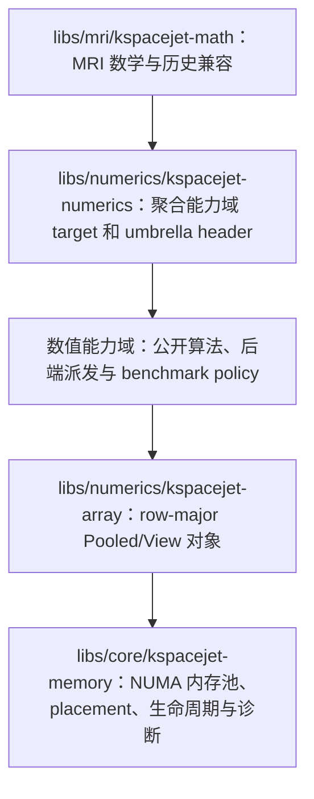
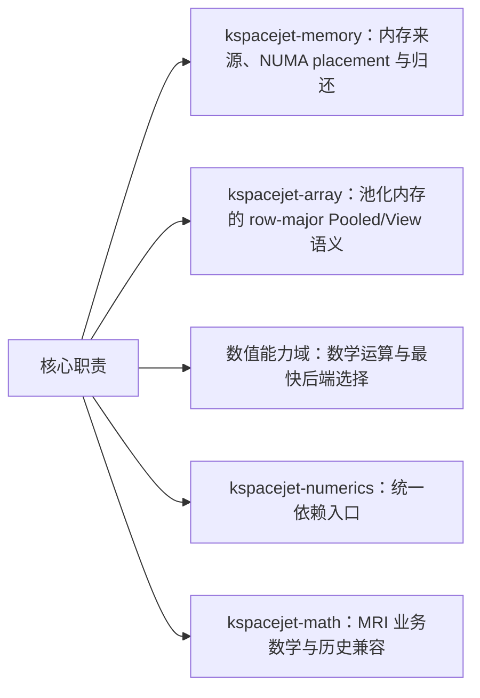
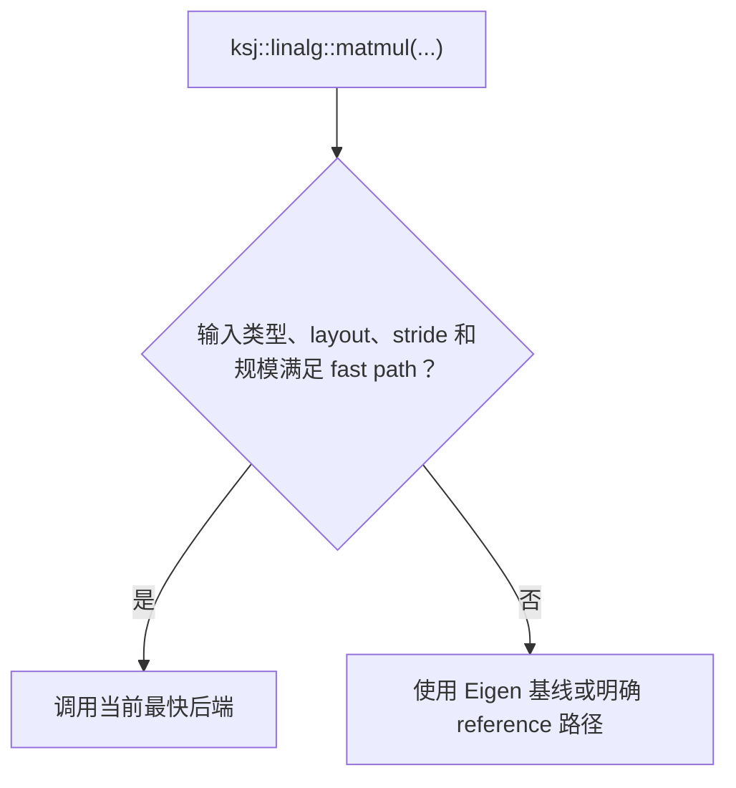
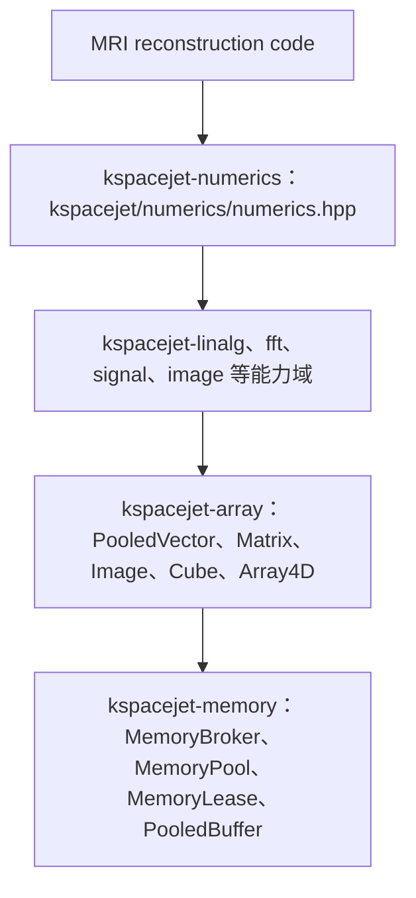
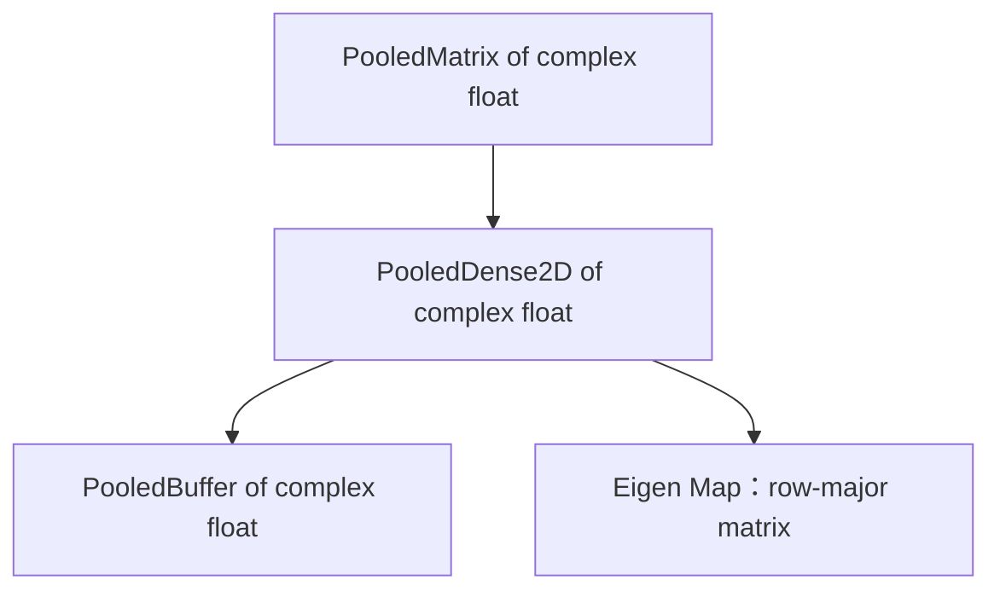
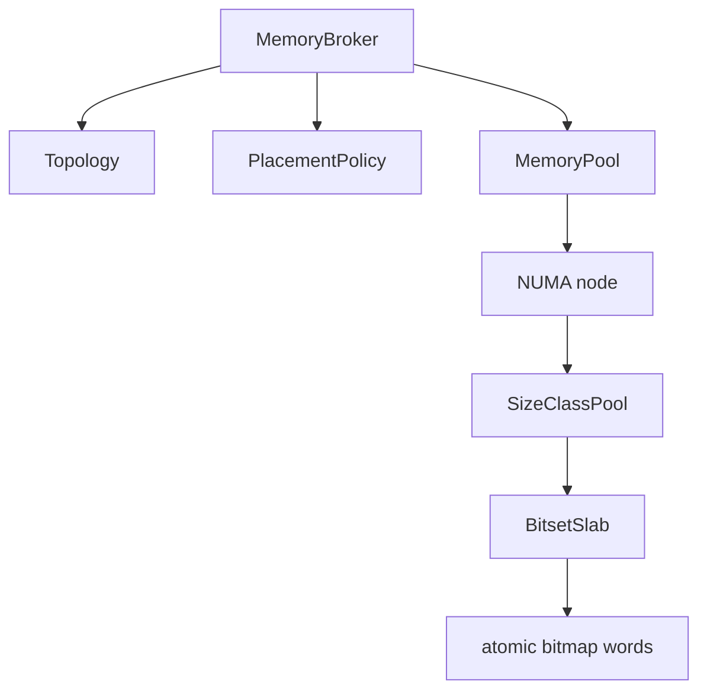
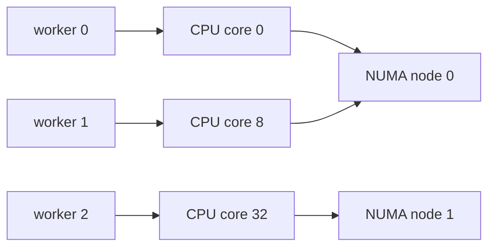
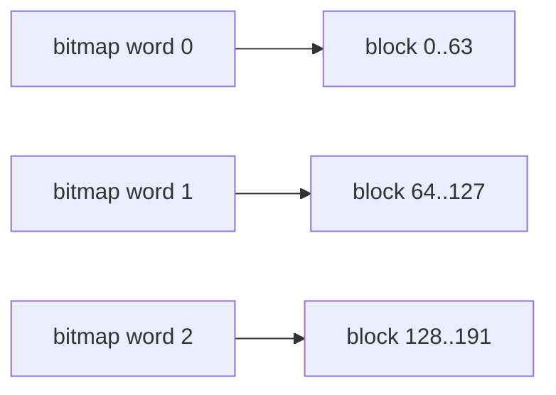
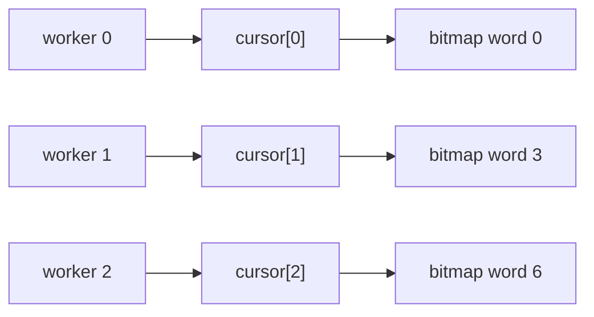

# KSpaceJet Memory、Array 与 Numerics 架构设计

## 摘要

本文档描述 KSpaceJet 新的数据访问、NUMA 内存管理和数值计算体系。该体系由几个边界清晰的层次组成：



核心职责可以概括为：



设计目标不是把所有能力塞进一个巨大的数学类，而是把内存、数据视图和算法调度拆成可组合的底层能力。上层 MRI 模块可以基于这些能力表达 k-space、image、coil、slice、echo、workspace 等业务概念，但这些业务语义不进入 `libs/core` 或 `libs/numerics`。

## 设计原则

### 统一入口，后端透明

用户代码调用对应能力域的公开接口，例如 `ksj::linalg::matmul()`、`ksj::linalg::dot()`、`ksj::fft::fft()`、`ksj::image::threshold()`，不直接关心 MKL、IPP、OpenCV、Eigen 或未来其他后端。后端只是一条优化路径，不能改变公开语义。



### 用 benchmark 决定阈值

是否调用 Intel/OpenCV/Eigen 某条路径、是否需要 pack、什么规模切换到某后端，都不能凭感觉写死。各能力域通过自己的 `detail::*_policy.hpp` 固化阈值，benchmark 工具负责扫描不同规模和后端，并生成推荐值。

```text
kspacejet-linalg/detail/linalg_policy.hpp
kspacejet-fft/detail/fft_policy.hpp
kspacejet-image/detail/image_policy.hpp
kspacejet-signal/detail/signal_policy.hpp
```

### View 优先，第三方后端私有

`kspacejet-array` 的对象对外暴露 KSpaceJet row-major `Pooled*` / `View` 语义。Eigen、OpenCV、ITK、MKL、IPP 等
第三方对象只属于 numerics backend/detail/source 实现边界，不能成为 public contract。需要把 KSpaceJet View 交给
第三方库时，由对应 backend implementation 创建 map/import/native view；如果 layout、stride 或连续性不兼容，
pack/copy 必须在 backend 代码中显式可见。

```cpp
auto image = ksj::array::make_pooled_image<float>(height, width);
auto image_view = image.view();
auto roi = image_view.subview(row_start, row_count, col_start, col_count);
```

需要 ROI、切片或 stride-aware 子视图时，应优先使用 KSpaceJet View。是否 materialize 到 pooled scratch buffer
由对应 numerics backend policy 和 benchmark 决定。

### 显式输出对象

公开数学 API 优先返回结果对象，让调用点保持简洁；大块临时内存由池化对象承载。若未来某个算法确实需要外部输出对象复用，应在对应能力域单独设计接口，但不使用 `_into` 这类不规范后缀。

```cpp
auto c = ksj::linalg::matmul(a, b);
auto y = ksj::linalg::gemv(a, x);
```

### 默认内存来源

池化数组默认使用进程级 `MemoryBroker` 单例。这样 KSpaceJet 内部多个库和接入 provider 会共享同一个 NUMA-aware memory pool，不会因为每个模块各自创建 broker 而导致池化碎片化、统计分散或 placement 策略不一致。

```cpp
auto matrix = ksj::array::make_pooled_matrix<float>(rows, cols);
auto image = ksj::array::make_pooled_image<float>(height, width);
```

显式 `MemoryBroker&` 入口只保留在 `kspacejet-memory` 底层，用于 core 单元测试、fake topology 注入、不同 pool options 的专项压测和隔离实验。业务侧常规代码应使用默认 broker 工厂。

## 总体架构

依赖方向如下：



类型组合关系如下：



这意味着：

- `kspacejet-array` 负责把池化内存解释为 KSpaceJet row-major 数值对象；不提供 column-major owning storage 或
  column-major View 入口。
- `kspacejet-memory` 只负责内存生命周期、NUMA placement 和诊断，不解释 shape 或矩阵语义。
- `kspacejet-linalg`、`kspacejet-fft` 等算法模块只依赖公开的池化对象接口，不感知 MRI 语义。
- MRI 业务层可以在靠近业务的位置定义更具体的别名，但不应把通用转发头放回 `libs/mri/kspacejet-math/include/linear_algebra`。

## kspacejet-memory

`libs/core/kspacejet-memory` 是 NUMA-aware 内存基础设施。

### 核心结构



| 组件 | 职责 |
| --- | --- |
| `Topology` | 描述机器上的 NUMA node、CPU socket、worker 到 NUMA node 的映射。 |
| `PlacementPolicy` | 根据 worker、locality 和 fallback 策略决定优先从哪个 NUMA node 分配。 |
| `MemoryBroker` | 应用侧首选入口，组合 topology、placement 和 memory pool。 |
| `MemoryPool` | 管理 size class、slab、bitmap 分配和释放。 |
| `MemoryLease` | move-only RAII handle，析构时归还内存。 |
| `MemoryView` | non-owning memory view，不持有生命周期。 |
| `PooledBuffer<T>` | typed owning buffer，底层由 `MemoryLease` 持有；数值对象层基于它构造 KSpaceJet row-major Pooled/View。 |

### worker 与 NUMA placement

worker 是 KSpaceJet 线程池中的逻辑工作线程编号，不是 CPU socket，也不是 NUMA node。线程池可以把 worker 绑定到具体 CPU core。通过 `Topology`，内存池可以从 worker 推导出它更适合访问的 NUMA node。



`worker_local` 比 `socket_local` 更具体：

- `worker_local` 优先选择 worker 当前绑定 core 所属的具体 NUMA node。
- `socket_local` 只要求在同一个物理 CPU socket 内，socket 内若有多个 NUMA node，可以选择其中一个。

### per-worker cursor

`BitsetSlab` 使用 atomic bitmap 表示 block 是否已占用。一个 bitmap word 通常是 64 bit，每个 bit 对应一个 block。



per-worker cursor 是每个 worker 自己的扫描起点。它不是把 bitmap 分区给某个 worker 独占，而是让不同 worker 避免总是从 word 0 开始竞争。



如果某个 cursor 指向的 bitmap word 已满，该 worker 会继续向后扫描，扫到末尾后回绕。这样确实可能扫到其他 worker 经常使用的区域，但竞争只发生在当前尝试的 atomic word 上。它的价值是降低起点集中造成的热点，而不是提供严格分区。真正需要进一步降低竞争时，可以继续演进为 per-worker slab shard 或按 worker 分片的 free region。

## kspacejet-array

`libs/numerics/kspacejet-array` 是业务无关的数值对象模块。它让池化内存以 KSpaceJet row-major `Pooled*` / `View`
形式暴露给算法模块；第三方 backend adapter 留在 numerics private/detail/source 边界。

### 核心类型

| 类型 | 职责 |
| --- | --- |
| `PooledVector<T>` | 一维 owning vector，底层为 `PooledBuffer<T>`，通过 `view()` 暴露借用 View。 |
| `PooledMatrix<T>` | 二维 row-major owning matrix，面向 linear algebra 语义。 |
| `PooledImage<T>` | 二维 row-major owning image，面向图像算法和 row stride 语义。 |
| `PooledCube<T>` | 三维 row-major owning dense tensor，面向体数据或多 slice 数据。 |
| `PooledArray4D<T>` | 四维 row-major owning dense tensor，面向 MRI 中常见的 4D 数据块。 |
| `VectorView<T>` / `MatrixView<T>` / `ImageView<T>` / `CubeView<T>` / `Array4DView<T>` | 不拥有内存的 KSpaceJet row-major 逻辑视图，可表达 ROI、切片和规则 stride。 |

`PooledMatrix` 和 `PooledImage` 是不同类型。矩阵算法和图像算法通过类型签名在编译期区分输入；两者都遵循
KSpaceJet row-major 逻辑语义。

### 后端访问边界

公开算法使用 `View` 作为输入输出：

```cpp
auto matrix = ksj::array::make_pooled_matrix<float>(rows, cols);
auto matrix_view = matrix.view();

auto image = ksj::array::make_pooled_image<float>(height, width);
auto image_view = image.view();
```

Eigen Map、OpenCV Mat、ITK import image、MKL/IPP pointer adapter 等只能在 backend implementation 中创建。
如果旧代码仍然直接使用 public Eigen adapter，应视为迁移债务；新代码不得仿照。

### Layout 转换

当不同语义对象之间需要 materialize 时，转换必须显式表达为拷贝：

```cpp
auto matrix = ksj::array::copy_as_matrix(image);
auto image = ksj::array::copy_as_image(matrix);
```

`copy_as_matrix` 和 `copy_as_image` 会保持逻辑下标不变并 materialize 新 owner。模块不提供隐式转换，也不使用
`to_matrix` / `to_image` 这类容易误导为零拷贝的名称。

## kspacejet-numerics 与能力域模块

`libs/numerics/kspacejet-numerics` 是聚合入口，不承载具体算法实现。具体算法按能力域放在独立模块中：

| 模块 | 公开入口 | 当前落地能力 |
| --- | --- | --- |
| `kspacejet-linalg` | `kspacejet/linalg/linalg.hpp` | `matmul`、`gemv`、`dot`、`transpose`。 |
| `kspacejet-fft` | `kspacejet/fft/fft.hpp` | 1D complex `fft` / `ifft`。 |
| `kspacejet-signal` | `kspacejet/signal/signal.hpp` | `window`、`convolve`。 |
| `kspacejet-image` | `kspacejet/image/image.hpp` | `threshold`、`normalize_minmax`。 |
| `kspacejet-stats` | `kspacejet/stats/stats.hpp` | `sum`、`mean`、`variance`、`covariance`。 |
| `kspacejet-optimization` | `kspacejet/optimization/optimization.hpp` | `least_squares`。 |
| `kspacejet-special` | `kspacejet/special/special.hpp` | `gamma`、`log_gamma`、`bessel_i0`。 |
| `kspacejet-sparse` | `kspacejet/sparse/sparse.hpp` | CSR matrix 与 `spmv`。 |

聚合入口用于需要全量能力的上层 target：

```cpp
#include "kspacejet/numerics/numerics.hpp"
```

如果调用侧只需要单个能力域，应优先包含具体模块头文件并依赖对应 target，例如 `KSpaceJet::linalg` 或 `KSpaceJet::fft`。

## benchmark 驱动最快实现

`libs/numerics` 的目标是“上层不感知后端，但总是走当前条件下最快的实现”。这需要用 benchmark 建立证据，而不是只依赖库名判断。

### benchmark 入口

benchmark target 已按能力域建立，并由统一 runner 管理：

```text
ksj_array_backend_benchmark
ksj_linalg_backend_benchmark
ksj_fft_backend_benchmark
ksj_signal_backend_benchmark
ksj_image_backend_benchmark
ksj_stats_backend_benchmark
ksj_optimization_backend_benchmark
ksj_sparse_backend_benchmark
ksj_special_backend_benchmark
```

统一 runner：

```bash
tools/devenv/linux/run.sh python tools/ksj_numerics_benchmark/run.py \
  --bin-dir out/build/linux-release-benchmark/bin \
  --iterations 50 \
  --module-sizes linalg=16,32,64,128,256,512,1024 \
  --module-sizes array=256,1024,4096,16384,65536,262144,1048576
```

runner 输出到：

```text
out/benchmarks/kspacejet-numerics-suite/<timestamp>/
```

### benchmark 覆盖点

| case | 用途 |
| --- | --- |
| KSpaceJet pooled array vs Eigen heap baseline | 验证池化对象封装不会引入不可接受的额外开销。 |
| linalg Eigen vs Intel MKL | 为 `matmul`、`gemv`、`dot`、`transpose` 选择后端和阈值。 |
| FFT Eigen FFT vs Intel MKL DFTI | 为 1D complex FFT/IFFT 选择后端和阈值。 |
| signal Eigen vs Intel IPP | 为 `window` 和 `convolve` 选择后端和阈值。 |
| image Eigen vs Intel IPP vs OpenCV | 为 `threshold` 和 `normalize_minmax` 选择后端和阈值。 |
| stats Eigen vs Intel IPP | 为 `sum` 和 `mean` 选择后端和阈值。 |
| optimization Eigen vs Intel LAPACKE | 为 `least_squares` 选择后端和阈值。 |
| sparse Eigen sparse vs Intel MKL sparse | 为 CSR `spmv` 选择后端和阈值。 |
| special Eigen baseline | 记录特殊函数当前 Eigen 后端性能；新后端需先补能力矩阵和 benchmark。 |

### 阈值调优流程

1. 选择代表真实重建工作负载的 size、type、layout 和算法 case。
2. 运行 benchmark 脚本生成 CSV 和推荐文档。
3. 找到候选后端相对 Eigen/reference 基线至少有稳定收益的规模。
4. 将推荐值固化到对应能力域的 `detail/*_policy.hpp`。
5. 保留 benchmark 报告路径或摘要，作为 policy 变更依据。

示例：

```bash
tools/devenv/linux/run.sh python tools/ksj_numerics_benchmark/run.py \
  --bin-dir out/build/linux-release-benchmark/bin \
  --iterations 50 \
  --module-sizes linalg=16,32,64,128,256,512,1024 \
  --module-sizes fft=16,32,64,128,256,512,1024,2048 \
  --only linalg fft
```

## MRI 侧使用边界

`libs/mri/kspacejet-math/include/linear_algebra` 不再放以下通用头文件：

- `array_algorithms.hpp`
- `array_backend.hpp`
- `sparse_array_bridge.hpp`
- `pooled_array.hpp`

这些能力已有正式入口：

| 能力 | 正式入口 |
| --- | --- |
| 池化数值对象 | `kspacejet/array/array.hpp` |
| dense linear algebra | `kspacejet/linalg/linalg.hpp` |
| FFT/IFFT | `kspacejet/fft/fft.hpp` |
| signal | `kspacejet/signal/signal.hpp` |
| image | `kspacejet/image/image.hpp` |
| stats | `kspacejet/stats/stats.hpp` |
| optimization | `kspacejet/optimization/optimization.hpp` |
| special functions | `kspacejet/special/special.hpp` |
| sparse | `kspacejet/sparse/sparse.hpp` |
| 全量聚合入口 | `kspacejet/numerics/numerics.hpp` |
| backend detail | 各模块 `detail/...`，业务代码不直接包含 |

如果某个 MRI 模块需要更具体的业务名字，应在靠近业务的模块里定义，而不是放在通用 `linear_algebra` 目录。例如：

```cpp
using KSpace4D = ksj::array::PooledArray4D<std::complex<float>>;
```

## 推荐使用方式

### 创建池化数组

```cpp
#include "kspacejet/array/array.hpp"
#include "kspacejet/linalg/linalg.hpp"

auto lhs = ksj::array::make_pooled_matrix<float>(rows, cols);
auto rhs = ksj::array::make_pooled_matrix<float>(cols, out_cols);

auto out = ksj::linalg::matmul(lhs, rhs);
```

### 矩阵与图像转换

```cpp
auto image = ksj::array::make_pooled_image<float>(height, width);
auto matrix = ksj::array::copy_as_matrix(image);
```

`copy_as_matrix` / `copy_as_image` 明确表示会发生拷贝和 layout materialization，性能敏感路径应避免不必要的跨语义转换。

## 并行使用策略

### 第一阶段：新代码直接用能力域模块

新写的业务无关数学代码应放到 `libs/numerics` 对应能力域模块，例如 `kspacejet-linalg`、`kspacejet-fft`、`kspacejet-image`。`kspacejet-numerics` 只作为聚合入口。

MRI 代码如果只是调用通用算法，也应优先包含：

```cpp
#include "kspacejet/linalg/linalg.hpp"
```

### 第二阶段：业务别名靠近业务

MRI 侧如果需要 `KSpace4D`、`CoilImageCube` 这类业务名字，应放在对应 reconstruction/domain 模块中。通用池化对象属于 `kspacejet/array/array.hpp`，不要放回 `libs/mri/kspacejet-math/include/linear_algebra`。

### 第三阶段：避免新增 MRI generic 转发

`linear_algebra/array_algorithms.hpp`、`array_backend.hpp`、`sparse_array_bridge.hpp` 和 `pooled_array.hpp`
这类通用 numerics 转发头不应继续放回 `libs/mri/kspacejet-math/include/linear_algebra`。旧
`kspacejet-math` 实现保持原样；新调用点和已经完成验证的调用点应直接使用 `kspacejet/array` 或对应能力域模块的正式入口。

### 第四阶段：用 benchmark 扩展后端

未来可以接入更多后端，例如新的 Intel 路径、OpenCV 扩展、Boost.Math 或 GPU 后端。新增后端必须满足：

- 上层 API 不变。
- 有 Eigen 或明确 reference 做正确性基线。
- 有 benchmark 覆盖目标 shape/type/layout。
- 有明确阈值或派发条件。
- 不把业务语义带入通用 numerics 模块。

## 当前完成度

当前已完成：

- NUMA-aware `kspacejet-memory` 内存池和池化 buffer。
- `libs/numerics` 按能力域拆分为 `kspacejet-array`、`kspacejet-linalg`、`kspacejet-fft`、`kspacejet-signal`、
  `kspacejet-image`、`kspacejet-stats`、`kspacejet-optimization`、`kspacejet-special`、`kspacejet-sparse` 和聚合
  `kspacejet-numerics`。
- 新 `kspacejet-array` 放在 `libs/numerics/kspacejet-array`，基于 `kspacejet-memory` 池化内存提供 row-major Pooled/View 对象；Eigen 等第三方库只作为 private backend 实现细节。
- `kspacejet-numerics` 仅作为 umbrella target/header，不再承载旧 dense/sparse/FFT 具体实现。
- `ksj_memory_tests`、`ksj_array_eigen_tests`、各 numerics 能力域单测和 `ksj_numerics_header_tests`。

仍需继续推进：

- 按生产 benchmark 报告反写各能力域 policy 阈值。
- 用真实重建 pipeline 数据完善 benchmark sweep。
- 增加更多候选后端，并用 benchmark 决定派发条件。
- 为 2D/3D FFT、NUFFT、插值等新增能力建立同样的 numerics backend 模型。

## 风险与约束

| 风险 | 说明 | 控制方式 |
| --- | --- | --- |
| 后端与 fallback 行为不一致 | fast path 和 Eigen/reference 基线可能分叉。 | 所有后端路径都以 Eigen 或明确 reference 单测为基准。 |
| pack 过早导致变慢 | 小 view 的 pack 成本可能超过收益。 | 使用 benchmark 阈值，不写死经验值。 |
| layout 默认值误用 | column-major 默认适合部分边界，但不是所有场景最优。 | 业务边界显式声明 layout。 |
| NUMA placement 不匹配线程 affinity | 内存放在错误 NUMA node 会变慢。 | 线程池绑定 worker，内存分配传入 worker/locality。 |
| 后端依赖污染 core | 把 MKL/IPP 塞进 core 会扩大基础依赖。 | 后端只放在 `libs/numerics`。 |
