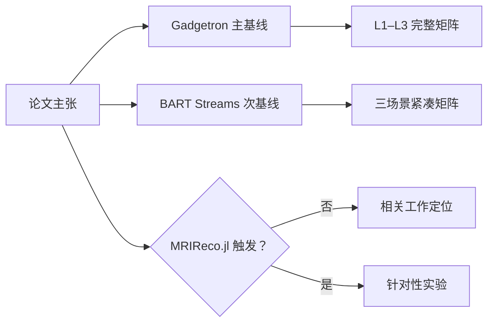
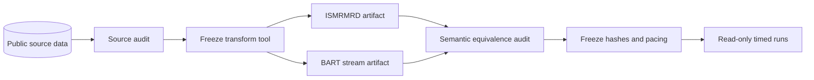
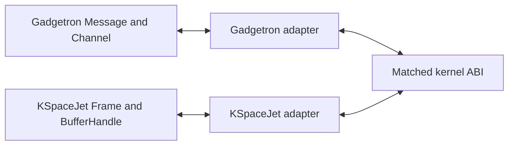

# KSpaceJet–Gadgetron 公平对照与复现实验协议

> 状态：多基线预注册草案。
> 目的：在看到正式性能结果之前冻结比较边界，避免挑选数据、指标、运行次数或配置。
> 关联稿件：[KSpaceJet 资源合约流式重建论文初稿](kspacejet_resource_contract_streaming_paper_draft.md)。
>
> **范围说明**：为避免现有链接失效，本文件保留以 Gadgetron 命名的文件名和标题；协议实际覆盖 **Gadgetron 完整主对照、BART Streams 紧凑次级对照，以及 MRIReco.jl 条件触发对照**。

## 1. 研究问题与允许的结论

本协议回答六个问题：

- **RQ1 正确性**：相同 ISMRMRD 输入和匹配重建数学下，KSpaceJet 是否产生等价图像和元数据？
- **RQ2 框架效率**：排除算法和数值后端差异后，KSpaceJet 是否降低框架开销、首图时间和尾延迟，或提高稳态吞吐？
- **RQ3 资源可预测性**：资源合约、图准入和进程内 item/byte 资源账本能否使框架管理内存保持在可计算上界内？
- **RQ4 过载行为**：输入突发、持续超载、慢输出和多 scan 竞争下，KSpaceJet 是否避免无界积压、OOM、死锁和跨 scan 饥饿？
- **RQ5 扩展成本**：第三方 Operator 是否能在不暴露私有 runtime 类型的情况下接入，且 batched ABI 开销可量化并受控？
- **RQ6 外部有效性**：在不把原生 stream 协议和算法差异误归因于 runtime 的前提下，KSpaceJet 对纯流式、公开 radial 实时 workload 和慢 sink/突发的结论能否在 BART Streams 上获得次级交叉验证？

### 1.1 基线角色和证据权重

| 系统 | 论文中的角色 | 默认实验范围 | 证据权重 |
| --- | --- | --- | --- |
| Gadgetron | 同类型在线重建框架，验证 KSpaceJet runtime 主张 | L1–L3、正确性、资源、过载和扩展性的完整矩阵 | **必须，主基线** |
| BART Streams | 直接重叠的模块化实时 pipeline 和网络流式工作 | BS-00 passthrough、BS-01 公开 radial、BS-02 slow sink/burst | **强烈建议，次级实测** |
| MRIReco.jl | 高性能、易扩展的离线算法开发框架 | 默认只做相关工作；只在触发明确论文主张时实验 | **不做默认在线对照** |

论文证据结构固定如下：



### 1.2 归因标签和升级门禁

每个 case 必须保存两个互不混用的机器枚举：

- `comparison_class ∈ {framework-isolation, matched-reconstruction, product-level, offline-algorithm, developer-task}`，描述**比较条件**；
- `evidence_role ∈ {primary-confirmatory, secondary-contextual, conditional-claim}`，描述**论文证据权重**。

Gadgetron FI/MR/PL 分别使用 `framework-isolation`、`matched-reconstruction`、`product-level`，其 `evidence_role=primary-confirmatory`。BART Streams 默认使用 `comparison_class=product-level` 与 `evidence_role=secondary-contextual`。MRIReco.jl 若被触发，使用 `offline-algorithm` 或 `developer-task` 与 `evidence_role=conditional-claim`。

允许的结论分为三个层级，禁止跨层解释：

| 层级 | 比较对象 | 可以回答 | 不可以回答 |
| --- | --- | --- | --- |
| L1 transport/runtime isolation | 无算法或共享参考 kernel | framing、队列、ownership、调度、copy、allocation、内部 reservation 开销 | 实际复杂重建总体更快 |
| L2 matched reconstruction | 相同数据、数学、精度和数值后端 | 框架在真实计算图中的额外成本和资源行为 | 两个项目全部内置算法的普遍优劣 |
| L3 product configuration | 各项目官方推荐 pipeline | 用户可获得的端到端体验 | 将数值 kernel/后端差异归因于 runtime |

论文不得只用 L3 结果宣称 runtime 优越，也不得用 synthetic workload 替代公开 MRI 数据的产品级验证。

KSpaceJet 的部署边界固定为：独立站点 Connector 隔离专有 scanner/厂商适配，`ksj-gateway` 监管/转发其公开 session，`ksj-recon` 独占 admission、Provider 和有界 reconstruction runtime；Connector、gateway 与 reconstruction service 之间只能传递冻结的公开 MRD/ISMRMRD session。L1/L2 的默认 KSpaceJet 路径是合规 replay client 直连 `ksj-recon`。若研究将 `ksj-gateway` 纳入计时，必须令 `same_wire_protocol_path`、`same_serialization`、`same_adapter_copy_scope` 和 `same_timed_boundary` 覆盖 Connector/gateway relay，并把 Connector/hop/staging/copy 单列；否则该 case 只能是 `product-level`。`ksj-research` 是随应用安装的外层实验 runner，绝不构成任何被测 runtime/data-plane 路径或私有 wire shortcut。

BART Streams 的三个场景默认都是 `comparison_class=product-level`、`evidence_role=secondary-contextual`，因为其原生多维数组 stream 协议、进程组合和 radial 算法路径与 KSpaceJet 不同。**只有 BS-00 passthrough 可以申请把 `comparison_class` 升级为 `framework-isolation`；其 `evidence_role` 仍保持 `secondary-contextual`。BS-01 radial 与 BS-02 slow-sink/burst 的 class 固定为 `product-level`，不能升级。** BS-00 必须在 manifest 中让 `same_logical_events`、`same_wire_protocol_path`、`same_serialization`、`same_adapter_copy_scope`、`same_kernel`、`same_precision`、`same_backend`、`same_thread_budget`、`same_output_semantics` 和 `same_timed_boundary` 十个字段全部为 `true`，并同时通过以下门禁：

1. 输入 payload、分片、顺序、pacing 和终止语义一致；
2. 数学操作、精度、数值 backend、线程预算和输出语义一致；
3. 计时边界包含相同的协议、serialization、copy 和 adapter 路径；
4. 两方都不使用预计时、私有 scanner 插件或未公开快路径；
5. 输入和输出通过相同正确性门禁，且所有差异字段在运行前冻结。

任一条不满足时，BS-00 的 `comparison_class` 仍为 `product-level`；三个 case 的 `evidence_role` 始终为 `secondary-contextual`。跨产品观察到的差异不能单独证明 KSpaceJet 资源合约的因果作用；该因果主张必须由 KSpaceJet 内部消融和可观测资源帐本支持。

正式实验遵循同一条冻结、门禁和分析链路：


## 2. 多基线冻结

正式实验开始前生成 `baseline-lock.json`，至少记录：

```json
{
  "comparison_policy": {
    "primary_confirmatory": "gadgetron",
    "secondary_contextual": "bart-streams",
    "related_work_only": "mrireco-jl"
  },
  "kspacejet": {
    "git_commit": "<full-sha>",
    "build_preset": "<preset>",
    "conan_lock_sha256": "<sha256>"
  },
  "gadgetron": {
    "git_commit": "<full-sha>",
    "release": "<tag-or-null>",
    "container_digest": "<digest-or-null>"
  },
  "bart_streams": {
    "paper_doi": "10.1002/mrm.70455",
    "reproduction_release": "v0.1",
    "reproduction_git_commit": "<full-sha>",
    "bart_git_commit": "<full-sha>",
    "container_digest": "<digest-or-null>",
    "public_data_doi": "10.5281/zenodo.17671124",
    "data_sha256": "<sha256>",
    "declared_license": "CC-BY-4.0",
    "license_evidence_sha256": "<sha256>",
    "redistribution_review": "pending",
    "human_data_privacy_review": "pending",
    "default_comparison_class": "product-level",
    "evidence_role": "secondary-contextual"
  },
  "mrireco_jl": {
    "mode": "related-work-only",
    "experiment_trigger": null
  },
  "matched_kernel": {
    "git_commit": "<full-sha>",
    "abi_identity_digest": "<sha256>"
  },
  "input_transform_lock_sha256": "<sha256>",
  "protocol_lock_sha256": "<sha256>"
}
```

### 2.1 Gadgetron 主基线

选择 Gadgetron 基线时遵循以下顺序：

1. 选择实验冻结日可公开构建并能完成目标数据集的正式 release 或明确 commit。
2. 不为制造差异而选择已知过旧版本。
3. 若正式 release 无法在目标编译器/依赖环境构建，可使用公开容器，同时记录 image digest。
4. 允许对基线做最小兼容补丁，但补丁必须公开、单独列出，并同时报告未补丁版本为何不可运行。
5. 主结果只使用一个冻结基线；新版本敏感性分析作为补充实验，不能运行中途替换主基线。

架构调研曾检查 Gadgetron commit `1d14c4cd380c57563500b27f5135d2c887e52de4`。该 commit 只作为设计调研证据，不自动成为最终实验基线。

### 2.2 BART Streams 次级基线

1. 以 BART Streams 论文的公开复现仓库 `v0.1` 为起点，同时冻结其完整 commit、BART commit、构建参数和容器 digest。
2. 记录公开数据 DOI `10.5281/zenodo.17671124`、实际下载文件列表、byte size 和 SHA-256。该记录当前声明 `CC BY 4.0`；冻结时保存 license 页面/文本 hash，并将 `redistribution_review` 与 `human_data_privacy_review` 作为独立门禁。两项审核完成前不得默认重分发原始或派生 payload。
3. 先复现论文自带的结果和环境自检，再运行 BS-00–BS-02；复现失败时不得直接将失败结果纳入 KSpaceJet 对照。
4. 只允许构建兼容、仪器接入和公开数据转换所需的最小补丁。补丁单独归档，不更改 BART Streams 的调度、stream 协议或算法语义。
5. BART Streams 仅执行预注册的三个场景；不把它扩展成 Gadgetron 式完整矩阵，也不将未覆盖场景解释为 BART Streams 的能力缺失。

### 2.3 MRIReco.jl 触发状态

`baseline-lock.json` 默认记录 `related-work-only` 且 `experiment_trigger=null`，不要求安装 Julia 或运行 MRIReco.jl。如果论文主张在解盲前触发第 5.6 节中任一条，则通过新的锁定 protocol artifact 冻结 MRIReco.jl 的外部发行标识、Julia manifest、数据、任务和端点；不得在看到性能结果后临时添加。

## 3. 数据集协议

### 3.1 数据来源

正式矩阵至少覆盖以下数据类型：

| ID | 类型 | 最低要求 | 候选公开来源 | 状态 |
| --- | --- | --- | --- | --- |
| D0 | deterministic phantom | Cartesian、multi-coil、固定 seed | ISMRMRD generator | 待生成 |
| D1 | 多厂商 phantom | 同一 phantom 的公开标准化数据 | ISMRMRD 论文公开制品 | 待下载和许可核对 |
| D2 | 2D Cartesian | 噪声/校准/多 coil | Gadgetron 官方 integration `.mrd` | 待筛选 |
| D3 | 3D accelerated Cartesian | 3D GRAPPA 或匹配并行成像 | Gadgetron 官方 integration `.mrd` | 待筛选 |
| D4 | dynamic/cine | 多帧、keyed ordering、首图时间 | Gadgetron 官方 RTCine `.mrd` | 待筛选 |
| D5 | general non-Cartesian | trajectory、NUFFT、迭代计算 | 公开 ISMRMRD 数据 | 待确定 |
| D6 | high-channel stress | 高 coil 数或放大后的合法 fixture | 公开数据或确定性生成器 | 待确定 |
| D7 | BART Streams radial FLASH | 官方 radial workload 与规范化 ISMRMRD 派生物 | DOI `10.5281/zenodo.17671124` | 公开可获取、声明 CC BY 4.0；待 hash、再分发与隐私审核 |

优先使用 Gadgetron 自己的官方 integration 数据，降低数据选择偏倚。若原始输入是 vendor 私有格式，必须先生成并冻结标准 ISMRMRD 版本；主论文比较不得让 KSpaceJet 读取 vendor 格式而 Gadgetron 读取 ISMRMRD，反之亦然。

### 3.2 数据清单

每个数据集必须具有 `dataset-manifest.json`：

```text
dataset_id
source_url / DOI
license and redistribution status
file name / HDF5 group
SHA-256 and byte size
ISMRMRD schema/library version
anonymization review
number of acquisitions/waveforms
sample/channel/trajectory distributions
encoding/matrix/FOV summary
acquisition timestamp availability
expected output groups
known limitations
```

数据只读使用。所有转换均输出到独立 artifact 目录，并保存转换器版本、命令和转换前后 hash。

### 3.3 一次性输入转换和 hash 冻结

BART Streams 原生使用多维数组 stream 协议，KSpaceJet 的原始采集输入合约则只允许 ISMRMRD。比较工具必须在实验外生成公开、可审计的派生物，不得向 KSpaceJet 产品引入 BART stream 或其他私有输入协议。



每个派生物必须通过 `input-transform-lock.json` 冻结：

- source URI/DOI、许可状态、原文件 SHA-256 和 byte size；
- 转换工具源码 commit、构建锁、完整命令、环境和转换日志；
- 产物的 schema/format identity、SHA-256、byte size 和语义摘要；
- sample、trajectory、coil/channel、frame/spoke 顺序、数值精度、尺寸和终止语义的逐项对照；
- replay chunking、pacing、burst seed、slow-sink schedule 和预计时边界。

转换只运行一次并且始终排除在 timed region 之外，但转换耗时、峰值内存和产物体积仍作为可用性附加结果报告。正式 runner 只接受与 lock 中 hash 相符的只读产物；运行期不得自动重新转换。只要两个系统接收的不是 byte-identical 协议路径，BART Streams 的 `comparison_class` 便继续为 `product-level`、`evidence_role` 继续为 `secondary-contextual`，即使语义审计通过也不自动升级。

### 3.4 Replay 语义

进入同一成对 case 的系统必须收到：

- 相同 XML header 字节或语义等价的规范化 XML；
- 相同 acquisition/waveform 顺序；
- 相同 samples、trajectory、header flags 和 active channel 数据；
- 相同 replay rate、burst schedule 和随机 seed；
- 相同 end-of-input 位置；
- 相同 network profile 或相同本地 stream profile。

不得把 ISMRMRD `scan_counter` 当 transport sequence。若原始数据无可靠 wall-clock pacing，则公开、固定的 synthetic pacing profile 为唯一基准。

## 4. 匹配算法协议

“同一数据”是必要条件但不是充分条件。L2 比较还必须匹配：

- 数学操作及其顺序；
- 输入和输出数据布局；
- floating-point precision；
- FFT normalization、centering 和方向；
- coil-combination 公式；
- calibration 区域和边界规则；
- 迭代停止条件、最大迭代数和初始化；
- FFT/BLAS/NUFFT vendor 与版本；
- backend 线程数和动态线程设置。

### 4.1 共享参考 kernel

建立独立、公开、无框架类型的 `matched-recon-kernels` 测试组件。公共 ABI 只使用固定宽度整数、plain descriptors 和 caller-owned spans/buffers。Gadgetron 主对照的两个薄 adapter 分别负责：



共享 kernel 至少包含：

| Kernel ID | 目的 | 输出 |
| --- | --- | --- |
| K0 no-op | 测量纯调度和消息开销 | 计数/状态，不触碰 payload |
| K1 identity | 测量 fan-out、ownership 和 sink | 等价 payload/image |
| K2 scale/copy | 测量内存带宽和显式 copy | 确定性 array |
| K3 Cartesian FFT + RSS | MRI 最小完整重建 | magnitude image |
| K4 open GRAPPA | 代表 calibration 与批处理 | reconstructed image |
| K5 iterative/non-Cartesian | 代表计算主导 workload | reconstructed image |

如果两个 adapter 必须进行布局转换，转换时间、分配次数和 copy bytes 属于各自框架集成成本，但必须单独报告。不能在一方预转换、另一方计入热路径。

BART Streams 不默认接入 `matched-recon-kernels`，因为强制把其改造成 KSpaceJet/Gadgetron ABI 会破坏原生 stream 产品路径的代表性。BS-00 使用两方各自最小的公开 passthrough，且只有它可以按第 1.2 节申请把 class 升为 `framework-isolation`；BS-01 使用各自文档化 radial pipeline，BS-02 在 BS-00 上施加外部负载，两者固定为 `comparison_class=product-level`、`evidence_role=secondary-contextual`，均不是 matched-kernel runtime 对照。

### 4.2 Product-level pipeline

L3 使用各参测项目的官方或文档化 pipeline，并记录所有差异。结果表必须显式列出：

```text
algorithm implementation
backend library
precision
threading
calibration
normalization
post-processing
output type
known mathematical differences
```

L3 只能描述“该冻结配置在该环境的结果”，不能解释为框架固有优势。BART Streams BS-01 在论文主表和图注中必须始终显示 `comparison_class=product-level` 与 `evidence_role=secondary-contextual`。

## 5. 实验场景矩阵

### 5.1 框架隔离场景

| Case | 输入 | Pipeline | 模式 | 主要指标 |
| --- | --- | --- | --- | --- |
| FI-00 | synthetic headers | K0 | local stream | message/s、CPU、alloc |
| FI-01 | D0/D2 acquisitions | K1 | local stream | GB/s、p99、copy bytes |
| FI-02 | D0/D2 acquisitions | K1 fan-out 1→2→1 | local stream | refcount、queue、RSS |
| FI-03 | variable-size fixture | K1 | local stream | byte/item budget accuracy |
| FI-04 | D0/D2 | K1 | TCP loopback | framing、syscalls、p99 |
| FI-05 | D0/D2 | K1 | TCP with matched security profile | transport CPU、p99 |

TLS 只有在双方能够使用等价安全 profile 时才进入直接比较；否则分别报告明文框架比较和 KSpaceJet 生产 TLS 成本，不混为一项。

### 5.2 匹配重建场景

| Case | 数据 | Kernel | 主要问题 |
| --- | --- | --- | --- |
| MR-00 | D0/D1/D2 | K3 | correctness、TTFI、steady throughput |
| MR-01 | D3 | K4 | calibration、peak memory、total latency |
| MR-02 | D4 | K3/K4 | keyed ordering、cine p99、jitter |
| MR-03 | D5 | K5 | compute-dominated overhead、workspace reuse |
| MR-04 | D6 | K3/K4 | memory bandwidth、NUMA、channel scaling |

“最大稳定输入速率”定义为：在目标 latency SLO 下持续至少 30 分钟，无 frame/image 丢失或错误，受管内存和 backlog 无增长趋势的最高 offered load。sender 因 backpressure 阻塞的时间属于结果，不能从 makespan 或 latency 中扣除。

### 5.3 Gadgetron 产品级场景

L3 至少执行一个不调用共享 `matched-recon-kernels` 的公开产品闭环，以验证用户实际可获得的配置；它与 L1/L2 分表、分图、分结论：

| Case | 数据 | 双方 pipeline | 计时边界 | 主端点 | 归因 |
| --- | --- | --- | --- | --- | --- |
| PL-00 | D2 | Gadgetron 冻结的官方 integration Cartesian pipeline；KSpaceJet 发布包中的文档化 reference Cartesian pipeline | 外部 harness 首条语义输入开始至最后一幅完整输出；转换排除在外 | correctness/quality gate、TTFI external、end-to-last-output、throughput、process-tree peak memory、失败率 | 固定 `product-level` |

PL-00 是 Gadgetron 主矩阵的必需 case；不能用 matched adapter 结果替代。双方只可调用公开 release/commit 中正常用户可访问的配置，不增加论文专用快路径。输入来自同一 D2 冻结语义事件序列，pipeline、backend、precision、线程、校准、normalization、post-processing、输出类型和已知数学差异全部入 manifest。输出先分别通过预注册质量门禁；数学或输出语义不同只影响解释范围，不得用速度抵消正确性失败。

### 5.4 压力与故障场景

| Case | 条件 | 持续时间/终态 | 必须观察 |
| --- | --- | --- | --- |
| ST-00 | 0.5×、0.8×、1.0× capacity | steady | baseline latency/throughput |
| ST-01 | 1.2×、1.5×、2.0× offered load | 固定窗口后解除 | throttle/reject、RSS、recovery |
| ST-02 | deterministic burst | 多个周期 | high-water、p99.9、内部 ledger occupancy |
| ST-03 | slow image consumer | 直到 output ledger 容量耗尽再恢复 | bounded send storage、worker progress |
| ST-04 | downstream operator stall | timeout/cancel | deadlock、reservation release |
| ST-05 | short/long multi-scan mix | 所有 scan 终态 | fairness、starvation、TTFI |
| ST-06 | deterministic disconnect | 明确失败；仅按公开语义从头启动新 run | duplicate/gap、输出完整性、资源回收 |
| ST-07 | provider contract violation | fail-fast | isolation、other-scan impact |
| ST-08 | 8–24 h soak | normal shutdown | RSS/thread/handle growth |

持续 offered load 超过 service capacity 时，不可能同时保证无拒绝、无丢失、内存有界和延迟有界。KSpaceJet 的预期策略必须记录为 admission reject、source throttle、deadline miss 或 explicit failure，不能把拒绝隐藏为成功。

每个 ST/BS-02 case 在运行前必须冻结 `recovery_deadline_ms`、`steady_state_baseline_window_ms`、`steady_state_tolerance`、`steady_state_hold_ms` 和用于判定的 queue/backlog、managed memory、throughput 与 latency 指标。恢复成功定义为：过载 actor 结束后在 deadline 内，全部预注册指标回到各自 baseline 区间并连续保持指定时长；超时、任一指标持续增长、OOM、死锁或永久饥饿均为失败。不得在看到 trace 后调整容差或恢复窗口。

### 5.5 BART Streams 紧凑次级矩阵

BART Streams 只执行下列三个预注册场景。每张结果表必须保留“归因”列，不得在图表精简时删除。

| Case | 输入与双方 pipeline | 负载 | 主端点 | `comparison_class` | `evidence_role` |
| --- | --- | --- | --- | --- | --- |
| BS-00 stream copy/passthrough | 冻结的确定性 payload/chunk schedule；两方各自公开最小 passthrough | local 与匹配 network profile；0.5×–1.0× capacity | effective payload GB/s、p50/p95/p99、CPU、process-tree peak memory、copy bytes（可观测时） | 默认 `product-level`；只有第 1.2 节全部通过时升为 `framework-isolation` | `secondary-contextual` |
| BS-01 public radial real-time | D7 公开 radial FLASH 数据；KSpaceJet 文档化 radial provider 与 BART Streams `v0.1` 复现 pipeline | 论文 pacing 和固定敏感性 pacing | TTFI、first complete result、稳态/端到端 latency、peak memory、成功率、输出正确性 | 固定 `product-level` | `secondary-contextual` |
| BS-02 slow sink + burst | BS-00 冻结 payload；同一外部 burst 与 sink-delay schedule | deterministic burst；慢 sink 至积压后恢复 | p99/p99.9、producer blocked time、reject/drop/error、backlog/RSS high-water、恢复时间 | 固定 `product-level`；KSpaceJet 合约因果只由消融证明 | `secondary-contextual` |

#### 5.5.1 BS-00 纯流式开销

- payload 内容、总字节数、分片尺寸分布、分片顺序、pacing 和 checksum 预先冻结；
- passthrough 只做必要的协议解析、输入到输出转发和 checksum，不加 MRI 数值操作；
- 使用外部 harness 同时采集发送、首输出、末输出和进程树指标；系统内部 timestamp 只做分解；
- 若 BART 原生 stream 与 KSpaceJet ISMRMRD transport 均保留在计时路径，则该场景比较的是两个产品路径，不是协议无关 runtime。

#### 5.5.2 BS-01 公开 radial workload

- 下载、许可审核、一次性转换和 hash 遵循第 2.2 和 3.3 节；
- 首先复现 BART Streams 仓库的公开预期结果，然后锁定脚本、GPU/CPU backend、warm-up 和 frame 语义；
- TTFI 的“首个有效结果”必须是两侧语义上相同的完整 frame；若不能映射，则分别报告而不计算比率；
- 数值算法、动态 coil compression、gradient-delay correction、GPU kernel 或后处理不同时，所有延迟和内存差异都只是产品级结果。

#### 5.5.3 BS-02 慢 sink 和突发

- burst 大小、间隔、seed、sink service time 和恢复时刻由外部负载器冻结；
- 外部观测 producer 阻塞、socket/pipe 积压、进程树内存、输出 gap/duplicate 和恢复时间；
- BART Streams 若无法提供 credit、内部 queue bytes 或 reject reason，结果填 `unavailable`，不能填零或从 RSS 反推；
- 比较可说明两个冻结产品路径的可观测过载行为，不能宣称 BART Streams 没有未暴露的资源控制。

### 5.6 MRIReco.jl 实验触发门禁

MRIReco.jl 不具有本文要验证的在线连接、端到端背压、scan admission 和输出交付生命周期，因此不给它安排 TTFI、慢 sink、burst、network 或多 scan 在线对照。仅下列主张可触发对应实验：

| 论文拟做的主张 | 必须增加的实验 | 预注册端点 | 不允许的替代 |
| --- | --- | --- | --- |
| “KSpaceJet 的算法开发更方便” | 两框架的匹配开发者任务实验 | 任务完成率、time-on-task、代码改动量、缺陷和主观负担 | 用 API 行数或作者自测代替用户研究 |
| “KSpaceJet 的数值重建普遍更快” | 数据、数学、精度、停止条件和硬件匹配的离线 benchmark | wall time、throughput、peak memory、数值误差和 compile/warm-up 分解 | 用 KSpaceJet 在线 runtime 或不同算法快慢代替数值比较 |
| “KSpaceJet 是完整算法工具箱” | 公开数据和文档支持的算法覆盖/成熟度矩阵 | 可执行算法数、数据/规迹覆盖、测试、文档和复现状态 | 仅比较仓库文件或 API 名称数量 |

如果论文不做上述三类主张，MRIReco.jl 保持在相关工作中的定位，“未实测”不影响主论文 go/no-go。如果触发实验，其结果独立分析，不与 Gadgetron/BART Streams 在线端点汇总成排名。

## 6. 消融设计

本节的机制消融默认只在 KSpaceJet 上执行，用于建立资源合约、内部 ledger、计划和工作区复用的因果证据。不要求 Gadgetron 或 BART Streams 实现未公开的对等开关，也不将它们无法消融某机制记为劣势。

### 6.1 资源控制消融

| 变体 | bounded edge | graph contract/admission | ingress ledger | output ledger |
| --- | ---: | ---: | ---: | ---: |
| A | 否 | 否 | 否 | 否 |
| B | 是 | 否 | 否 | 否 |
| C | 是 | 否 | 是 | 是 |
| D | 是 | 是 | 否 | 否 |
| E | 是 | 是 | 是 | 是 |

若 KSpaceJet 不保留可安全关闭某机制的实验开关，应使用等价 research-only runner；不得为消融污染生产 API。

### 6.2 内部 ledger 消融

- item-only；
- byte-only；
- byte + item；
- ingress-only；
- ingress + edge；
- ingress + edge + output ledger；
- fixed reservation window size sweep；
- reservation release batching threshold sweep。

必须同时测试大量小 frame、少量大 frame、混合尺寸和慢 sink。item-only、byte-only 的失败模式必须由实测任务/metadata 和真实 lease capacity 解释。

### 6.3 性能机制消融

```text
P0 serial/reference execution
P1 + pooled immutable BufferHandle
P2 + micro-batch
P3 + plan/workspace reuse
P4 + continuation publish
P5 + global backend thread budget
P6 + NUMA placement
P7 full runtime
```

每个变体都必须重新执行正确性门禁。若某机制没有独立显著收益，论文应报告 tie 或交互效应，而不是隐藏该变体。

### 6.4 Provider 违规

测试 provider 至少覆盖：

- 少报 scratch 10%、50% 和 100%；
- 数据相关 output expansion；
- 长期 retain input handle；
- 隐藏 `malloc/new`；
- 创建额外线程或嵌套 MKL/OpenMP；
- join 缺失 flush key；
- callback 异常、崩溃、hang 和 buffer leak。

分别比较声明但不强制与 host allocator/handle enforcement。native crash/hang 明确只用于验证进程内动态插件模型的非隔离边界；结果必须区分 declared、compiled、reserved、observed 和 enforced bound。

## 7. 正确性门禁

性能运行只在对应 case 正确性通过后有效。

- Gadgetron L1/L2 对照使用跨系统的精确 metadata 和数值等价门禁。
- BS-00 要求输出 payload、顺序和 checksum 精确相等。
- BS-01 的两个产品 pipeline 若数学不同，则各自与冻结参考输出比较，并使用预注册的最低质量门禁；图像质量和 latency 必须并列报告，不能用更快但未达质量门禁的输出宣称胜出。
- BS-02 要求无未声明 drop、duplicate 或顺序错误；显式 reject/failure 按预定义策略计分。

### 7.1 元数据

默认精确比较：

- image dimensions、dtype、channels；
- matrix、FOV、orientation、position；
- slice/contrast/repetition/set/series index；
- image count、sequence 和 group；
- 必要 attribute fields。

允许差异的字段必须预先列入 per-case allowlist，并给出原因，例如 framework-generated timestamp。禁止事后扩大 allowlist 以使失败通过。

### 7.2 数值

至少报告：

```text
max absolute error
relative L2 error / NRMSE
mean absolute error
complex magnitude/phase error（适用时）
SSIM（仅作为补充，不替代逐元素指标）
NaN/Inf count
```

容差由 matched kernel 的数值语义、backend 和精度在运行前冻结。使用相同 kernel/backend 且相同输入布局时，应优先追求 bitwise 或近 machine-precision 一致；迭代方法必须同时冻结停止条件和迭代次数。

## 8. 性能指标定义

所有时间使用同一主机的 monotonic clock。跨主机阶段如果没有经过验证的时钟同步，只报告各端本地阶段，不计算伪精确的端到端单向延迟。

### 8.1 延迟

- `TTFI_external`：外部 harness 开始发送首条语义输入至第一幅完整有效 image 被外部观测；这是跨系统主值。
- `TTFI_internal`：第一条输入被 source 接受至第一幅有效 image ready；只在语义与计时点可映射时用于框架内分解。
- `input_end_to_recon_complete`：最后一条输入接受至所有算法完成。
- `input_end_to_delivery_complete`：最后一条输入接受至所有 mandatory image 被外部完整观测。
- `frame_latency`：frame ingress 至其可追踪输出 ready；只用于 lineage 明确的 pipeline。
- `queue_wait`、`compute`、`emit_wait`、`output_local_release_wait`：按 stage 分解；本地 release 不解释为远端持久化。

报告 p50、p95、p99；样本数量足够时报告 p99.9，并给出样本数和置信区间。不能用跨 run 聚合后的平均值重新构造尾分位数。

### 8.2 吞吐与利用率

- accepted acquisitions/s 和 logical input GB/s；
- complete images/s 和 output GB/s；
- CPU user/system、每核利用率和 context switches；
- backend thread activity；
- network bytes/syscalls；
- throughput-at-fixed-latency 和 latency-at-fixed-throughput。

### 8.3 内存与资源

- process RSS、peak RSS、private/committed memory；
- framework-managed resident capacity；
- pool reserved/used/high-water/fallback；
- edge、reorder、join、output-send storage 和 executor pending bytes/items；
- allocation count、allocated bytes 和 application payload copy bytes；
- TLS/socket/vendor/GPU memory 的可测分解；
- declared、compiled、reserved、observed、enforced bound；
- prediction error：`(observed_managed - compiled_bound) / compiled_bound`。

如果 compiled bound 未覆盖 OS/TLS/vendor allocator，则不得与总 RSS 直接声称严格相等；应报告 `RSS = managed + measured_external + unexplained`。

### 8.4 稳定性和公平性

- admission rejection、deadline miss、cancel/failure 和 dropped data count；
- zero-reservation-capacity duration；
- overload 解除后恢复到稳态阈值的时间；
- OOM、deadlock、livelock、thread/handle leak；
- per-scan service share 和最大 starvation interval。

“过载稳定”在本协议中定义为：系统通过 admission rejection 和内部 ledger 驱动的 source throttling，使所有已准入 scan 的受管资源保持在预算内；移除过载后在有限观测时间内回到预定义稳态，且没有 OOM、死锁或跨 scan 永久饥饿。它不表示系统可以无损处理无限 offered load。

### 8.5 跨基线指标映射

| 指标类型 | 可比主值 | 框架内分解 | 缺失规则 |
| --- | --- | --- | --- |
| 时间 | 外部 harness 的 send/accept、first complete output、last complete output | queue/compute/emit/local-release 只在语义对应时并列 | 输出粒度不同则分别报告，不强制比率 |
| 吞吐 | harness 确认的 effective payload bytes/s 和 complete outputs/s | framework accepted/ready/released 只作辅助 | 不用协议字节冒充 logical payload |
| 内存 | 进程树 peak private/RSS 和 GPU peak | managed pool/queue/internal-ledger 只用于各框架内部解释 | 无内部计数器时填 `unavailable` |
| 过载 | producer block、reject/drop/error、backlog proxy、恢复时间 | internal-ledger 和 admission 事件只属 KSpaceJet 机制证据 | 不从无事件推断无机制 |

所有结果 schema 同时保存 `measurement_scope`、`comparison_class` 和 `evidence_role`。工具不能因为某字段缺失而用零补值，也不能把 BART 的 `evidence_role=secondary-contextual` 改写为 `primary-confirmatory`，或在门禁未通过时把其 class 从 `product-level` 改写为 `framework-isolation`。

## 9. 运行环境控制

每次正式 suite 记录：

```text
machine/BIOS/CPU/microcode/RAM/NUMA
OS/kernel or Windows build
compiler/linker/CMake/Ninja
Conan lock and all shared-library versions
CPU governor/frequency/turbo/power mode
SMT state and CPU affinity
memory policy and huge pages
runtime/backend thread counts
OpenMP/MKL/IPP/FFTW environment
network topology/MTU/socket buffers/TLS
filesystem and cache condition
background-load audit
temperature/throttling indicators
```

进入同一成对 case 的系统必须：

- 使用相同物理 CPU 集合和 NUMA policy；
- 使用相同总线程预算；
- 使用相同 Release 优化级别；
- 在相同 cache policy 下比较 cold 和 warm 场景；
- 串行执行独立进程 run，不同时争用机器；
- 随机化或平衡运行顺序，降低温度和时间漂移；
- 不在一方开启调试日志、sanitizer 或 profiling 而另一方关闭。

Linux 是 Gadgetron 正面对照的主要性能平台。Windows 仍需完成 KSpaceJet 的代表性 correctness、interop、resource-bound 和性能敏感性实验；若冻结 Gadgetron 基线没有等价原生 Windows 路径，则不得做跨操作系统的相对性能结论。任何 OS 只运行 smoke 都不能支持该 OS 的性能结论。

BART Streams 次级矩阵与其公开复现路径一样默认在 Linux 上运行，不将 Windows 移植列为投稿门禁。若 BS-01 使用 GPU，必须冻结 GPU、driver、BART backend、功率模式和 warm-up；如果 KSpaceJet 没有等价硬件路径，则仅报告产品配置，不作硬件无关结论。MRIReco.jl 若被触发，其离线实验环境单独冻结，不强行复用在线 suite 的进程和网络设置。

## 10. 统计协议

1. 每个 case 先执行不进入结果的 warm-up。
2. Gadgetron 主基线的主要条件目标为 20 个独立配对 process runs，任何主结果最低不得少于 10 个；压力和高成本次要条件至少 10 个。昂贵 scanner 实验可减少，但必须解释并使用层次化分析。
3. 单个进程内样本用于 latency distribution；独立进程是推断重复单位，禁止把数百万 frame 当作数百万独立实验。
4. 主端点预注册为 TTFI、run-level acquisition/group p99、最大稳定输入速率和 process-tree peak private memory；报告配对效应大小、paired-bootstrap 95% CI 和完整分布。
5. BS-00 和 BS-02 各目标 20 个独立配对 runs、最低 10 个；BS-01 目标 10 个独立配对 runs。BART Streams 结果是预注册次级证据，不能替代未通过的 Gadgetron 主端点。
6. KSpaceJet/Gadgetron 和 KSpaceJet/BART Streams 分别使用固定随机 seed 生成 balanced order；不要求三个系统同时竞争机器。
7. Gadgetron 确证主端点使用预先选择的多重比较校正（例如 Holm）；BART Streams 三场景作为单独次级 family 报告效应大小、paired-bootstrap 95% CI 和校正结果，不与 Gadgetron 端点混合校正。
8. 若 95% CI 跨越预注册 practical-equivalence margin，则结论为 inconclusive/tie，而不是胜出。
9. OOM、timeout 和 failed scan 计入成功率，不得作为 outlier 删除。其他异常 run 只有在预定义系统原因成立时才可剔除；原始记录和剔除原因仍须公开。
10. MRIReco.jl 若触发，按开发者任务、离线数值或覆盖矩阵的独立协议分析；不将其样本混入在线 latency family。

正式分析脚本在读取结果前校验 environment fingerprint、case hash、baseline lock、input-transform lock、`comparison_class` 和 `evidence_role`；不兼容结果必须拒绝合并。

### 10.1 全 case 完整性注册表

报告生成前必须写出 `case-completeness.json`，其 Gadgetron 主矩阵的封闭集合固定为：

```text
FI-00, FI-01, FI-02, FI-03, FI-04, FI-05
MR-00, MR-01, MR-02, MR-03, MR-04
PL-00
ST-00, ST-01, ST-02, ST-03, ST-04, ST-05, ST-06, ST-07, ST-08
```

每个 case 必须有 `status=completed|failed|excluded`、预定/纳入 run 数、correctness verdict、主端点 artifact hash，以及 failure/exclusion 的预注册 reason code 和证据路径。`excluded` 不能由性能结果触发，也不能自动满足“完整主矩阵”门禁；凡协议要求的主 case 未完成，claim audit 必须阻断对应结论或投稿冻结。报告器自动生成 Supplementary Tables S1（FI）、S2（MR）、S3（PL）和 S4（ST），主文表可紧凑展示，但不得通过省略补充表中的失败或不利 case 选择性报告。

## 11. 内部 go/no-go 标准

以下是论文工程目标，不是期刊统一标准，也不能替代实际效应和置信区间：

| 维度 | 投稿候选目标 |
| --- | --- |
| 正确性 | 所有主 case 通过预注册 metadata/数值门禁 |
| framework isolation | passthrough 吞吐约 2×或 p99 降低约 50%；否则收缩“极致性能”表述 |
| matched MRI | 至少两个代表 workload 的 TTFI 或 p99 改善约 20%–30% |
| compute-dominated | 不因框架引入超过约 5% 的稳定回退，或能解释并修复 |
| memory | 受管内存不超过 compiled/reserved bound；外部 overhead 可分解 |
| overload | burst、慢 sink 和 2× offered load 无 OOM/死锁/无界增长 |
| plugin | 合理 batch 下 in-process ABI 相对 builtin 开销目标不超过约 1% |
| BART Streams secondary evidence | BS-00–BS-02 完成且两轴标签正确，或正式 waiver 与 scope reduction 通过；不要求 KSpaceJet 必须“胜出” |
| MRIReco.jl scope | 默认不实测；若论文出现触发主张，对应独立实验必须完成 |
| reproducibility | 至少两台机器；Linux/Windows 各有代表性 KSpaceJet 结果；锁、脚本、报告和许可允许的制品公开 |
| causal evidence | 至少一组消融解释主要收益，不能只报告 full system |

若性能结果只有单机平均时间改善约 5%–10%，应把论文中心转向资源可预测性和过载控制，或在投稿前继续优化；不得继续使用“极致性能显著优于 Gadgetron”的标题和摘要。

## 12. 真实扫描仪验证

面向 MRM 风格 full paper，建议至少完成：

- phantom prospective online scan；
- 一项经伦理批准或可豁免的 volunteer/in-vivo demonstration；
- scanner → reconstruction host → image return 的在线闭环；
- acquisition cadence、TTFI、image-ready/complete-output timeline；
- 断开、取消或慢重建不会阻塞 scanner workflow 的安全说明；
- 与 offline replay 的输出一致性检查。

真实扫描仪实验不用于证明 runtime isolation 的微小性能差异，而用于证明系统可以在真实时序、网络和工作流中完成在线重建。涉及受试者时，论文必须填写伦理批准、同意、匿名化和数据共享限制。

## 13. 复现工具与制品

### 13.1 工具边界

下列是逻辑组件名，可以在一个 `paper-bench` CLI 下作为子命令实现；在 schema 和重复模型稳定前不构成 KSpaceJet 公共 API。

| 工具组件 | 输入 | 责任 | 强制边界 |
| --- | --- | --- | --- |
| baseline locker | Git/release/container/Conan/Julia metadata | 生成并验证 `baseline-lock.json` | 不自动跟随 latest；变更必须生成新的锁定 protocol artifact |
| dataset fetcher/auditor | DOI/URL/license policy | 下载、hash、匿名/许可检查和 manifest | 未确认再分发权时只发布获取说明与 hash |
| transform freezer | 只读 source artifact | 生成 ISMRMRD/BART 派生物、语义审计和 transform lock | 只存在于 benchmark tooling；不向 KSpaceJet 生产库添加 BART/私有协议 |
| replay/load driver | locked artifact + pacing profile | 网络/本地 replay、burst、slow sink、multi-scan | 确定性 seed；运行时拒绝 hash 不符数据 |
| system adapters | 公开系统边界 | 启动 KSpaceJet、Gadgetron 或 BART Streams，收集输出 | KSpaceJet 只走 ISMRMRD 公开输入；adapter 不编译进生产 runtime |
| external resource probe | process tree/PID set | monotonic timestamps、CPU、RSS/private、I/O/network/GPU | 两方相同采样率和权限；不可观测字段为 `unavailable` |
| correctness comparator | output + tolerance lock | metadata、NRMSE、NaN/Inf、lineage 门禁 | 性能脚本不能绕过失败门禁 |
| result normalizer | raw metrics + schema | 映射公共字段并保留 system-specific fields | 必须保留 measurement scope、missingness、`comparison_class` 和 `evidence_role` |
| analysis/figure builder | locked tidy results | 配对 bootstrap、多重校正、图表和报告 | 拒绝混合不兼容 lock；不手工修改结果数字 |
| artifact packager | manifests + raw + analysis | 许可过滤、checksums 和第三方复现包 | 不包含患者身份、私有 scanner 插件或未授权数据 |

### 13.2 制品结构

每次正式 paper suite 产生：

```text
paper-artifacts/<paper-identity>/
  baseline-lock.json
  input-transform-lock.json
  protocol.json
  baselines/
    gadgetron/
    bart-streams/
    mrireco-jl/          # only when triggered
  datasets/
    manifests/*.json
    derived-manifests/*.json
  pipelines/
    matched/
    product/
    bart-streams/
  configs/
    pacing/
    load/
  environments/
    machine-*.json
    conan.lock
    dynamic-dependencies.json
  raw/
    <case>/<system>/<run-id>/{metrics.json,trace,logs,output.h5}
  correctness/
  analysis/
    tidy-results.csv
    statistics.json
    attribution-audit.json
  figures/
  tables/
  report.md
  checksums.sha256
```

原始数据若因许可不能再分发，manifest 仍应提供 DOI/URL、hash 和获取说明。support artifact 默认不包含患者身份、原始 XML 中的敏感字段或未脱敏日志。

## 14. AI 执行映射

唯一权威工作单 ID、依赖 DAG、允许路径和验收命令定义在[架构规划第 11、14 节](../architecture/streaming_reconstruction_framework_plan.md)。本协议不再建立平行的 `PAPER-BENCH-*` namespace；runner、论文和 issue tracker 只能引用 `KSJ-BENCH-*`、`KSJ-PAPER-*` 及其 machine-readable work-item manifest。

| 协议证据步骤 | 权威实现工作单 | 权威执行/论文工作单 | 协议完成门禁 |
| --- | --- | --- | --- |
| baseline、环境和证据角色冻结 | KSJ-BENCH-001/002 | KSJ-PAPER-001 | schema、commit/container/build flags 和归因默认值可机器校验 |
| D0–D7 数据、许可、转换与 schedule 冻结 | KSJ-BENCH-003–005 | KSJ-PAPER-003 | source/license/converter/canonical/derived/schedule hash 完整；D7 的 CC BY 4.0 证据、再分发与隐私审核分列 |
| FI/MR matched kernels 与 Gadgetron adapters | KSJ-BENCH-007/008 | KSJ-PAPER-002 | K0–K5 同一 SHARED binary/backend/precision；layout copy 单列 |
| Gadgetron L3 product pipeline | KSJ-BENCH-008 | KSJ-PAPER-002/006 | PL-00 调用双方正常公开 pipeline，不调用 matched kernel，固定 product-level |
| fault actors、外部 collector、runner、correctness/attribution/statistics | KSJ-BENCH-006/010–012 | KSJ-PAPER-004/005 | deterministic schedules、外部计时、A–E/P0–P7、质量与归因门禁通过 |
| Gadgetron FI/MR/PL/ST 主实验 | KSJ-BENCH-008/010/011 | KSJ-PAPER-006 | 完整主矩阵、独立进程 runs、CI、raw artifacts 和 checksums 齐全 |
| BART Streams 复现、转换与 BS-00–BS-02 | KSJ-BENCH-004/009–012 | KSJ-PAPER-007 | `bart_status=completed` 时 v0.1 自检、D7、三场景、两轴标签和独立统计齐全；外部阻断时 `waived` 记录证据、已完成步骤及删除/收缩 claim |
| Linux 第二机器、Windows、scanner 或正式 waiver | 平台 CI 与 KSJ-BENCH-010/011 | KSJ-PAPER-008 | 跨平台报告必需；scanner 缺失时有阻断证据与 scope reduction |
| MRIReco.jl claim gate | KSJ-BENCH-013 | KSJ-PAPER-010（仅激活时） | 未激活时机器可读 skip；激活时完成独立预注册实验或删除 claim |
| 图表、结果文本、artifact 和外部复现 | KSJ-BENCH-012/014 | KSJ-PAPER-009/011 | Gadgetron 进入锁定生成链；BART `completed|waived` 状态与正文一致；激活的 MRIReco 结果已纳入；clean-machine 复现通过 |

每个权威工作单都不得恢复 BRF、DPC、ComQ 或私有算法；不得把 proprietary dataset 作为唯一证据；不得手工复制 benchmark 数值到论文而不保留生成链。

## 15. 一手资料入口

- Hansen MS, Sørensen TS. Gadgetron: An open source framework for medical image reconstruction. *Magn Reson Med.* 2013;69:1768–1776. [doi:10.1002/mrm.24389](https://doi.org/10.1002/mrm.24389)
- Gadgetron 官方代码与 integration 数据清单：[repository](https://github.com/gadgetron/gadgetron)、[data.json at reviewed commit](https://github.com/gadgetron/gadgetron/blob/1d14c4cd380c57563500b27f5135d2c887e52de4/test/integration/data.json)
- Inati SJ, et al. ISMRM Raw data format: A proposed standard for MRI raw datasets. *Magn Reson Med.* 2017;77:411–421. [doi:10.1002/mrm.26089](https://doi.org/10.1002/mrm.26089)
- Schaten P, Blumenthal M, Rapp B, Unterberg-Buchwald C, Uecker M. BART Streams: Real-Time Reconstruction Using a Modular Framework for Pipeline Processing. *Magn Reson Med.* 2026 Jun 4; online ahead of print. [doi:10.1002/mrm.70455](https://doi.org/10.1002/mrm.70455)
- BART Streams 公开复现制品：[reproduction code `v0.1`](https://gitlab.tugraz.at/ibi/mrirecon/papers/bart-streams)、[study data DOI](https://doi.org/10.5281/zenodo.17671124)、[公开代码与数据说明](https://pmc.ncbi.nlm.nih.gov/articles/PMC12687855/)。数据再分发许可状态仍须在冻结时单独核对。
- Knopp T, Grosser M. MRIReco.jl: An MRI reconstruction framework written in Julia. *Magn Reson Med.* 2021;86(3):1633–1646. [doi:10.1002/mrm.28792](https://doi.org/10.1002/mrm.28792)
- Ning Z, et al. From Offline to Inline Without Pain. *Magn Reson Med.* 2026;96:448–459. [doi:10.1002/mrm.70304](https://doi.org/10.1002/mrm.70304)
