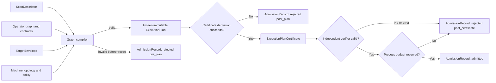
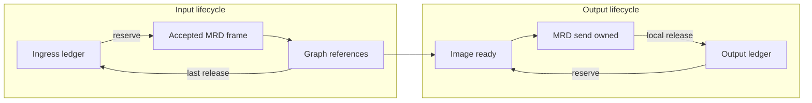

# KSpaceJet：面向可预测在线 MRI 重建的扫描专用资源合约流式框架

> English title: **KSpaceJet: Scan-Specialized, Resource-Contracted Streaming for Predictable Online MRI Reconstruction**
>
> 稿件状态：v0.2，预结果论文初稿。
> 目标体裁：Magnetic Resonance in Medicine 风格 full paper。
> 重要说明：本文当前描述的是研究设计和待实现方法。所有 `[待实验]`、`N`、`X%` 和图表占位必须由冻结协议产生的真实制品替换；不得把设计目标写成观察结果。
> 公平对照协议：[KSpaceJet–Gadgetron 公平对照与复现实验协议](kspacejet_gadgetron_comparison_protocol.md)。
> 产品架构基线：[KSpaceJet 流式重建框架实施规划](../architecture/streaming_reconstruction_framework_plan.md)。
> Pipeline schema 基线：[PipelineDefinition v1 与重建流水线设计](../architecture/pipeline_definition_v1.md)。
> Pipeline 与证明基线：[MRI 流水线、并行模型与可证明执行理论](../architecture/streaming_pipeline_parallelism_theory.md)。论文只摘要 schema、定理及其假设；规范定义以两份架构基线、ADR、schema 和独立 checker 为准。

作者：[待填写]

机构：[待填写]

通讯作者：[待填写]

## 摘要

### 目的

开放的在线磁共振成像重建框架需要同时支持标准化原始数据、低延迟流式处理和第三方算法扩展。现有工作已经证明模块化流式重建、动态 pipeline、分布式计算和易用的 inline 部署具有重要价值，但用户可扩展算子在可变 acquisition 尺寸、突发输入、慢输出和多扫描并发下的资源消耗通常由运行时行为决定，而不是由扫描开始前可验证的契约决定。本研究拟开发并评价 KSpaceJet，一种以 ISMRMRD 为公开数据语义、以扫描专用资源合约执行计划为核心的在线 MRI 重建框架。

### 方法

KSpaceJet 将 ISMRMRD scan descriptor、typed operator graph 和每个 Operator 的并发、scratch、retention、输出扩张、batch、ordering 与线程需求编译成 scan-specific execution plan。图编译器在准入前计算并预留 framework-managed resource bound。运行时通过不可变 host-owned BufferHandle、容量受限 edge、非阻塞 continuation、统一线程预算以及贯穿输入、算子图和输出交付的内部 byte/item reservation 维护同一资源账本；生产网络边界只使用公开 MRD/ISMRMRD session。部署上，独立站点 Connector 隔离专有 scanner/站点适配，`ksj-gateway` 监管/转发公开 session，`ksj-recon` 独占重建 runtime；这些边界之间不定义私有 wire protocol。第三方算法以独立动态库 Provider plugin 通过版本化 C ABI 和 C++ wrapper 接入，并由 conformance tests、host allocator 和 runtime checks 约束。评价采用分层证据框架：使用公开 ISMRMRD 数据，在相同硬件、数学算法、精度、数值后端和线程预算下对冻结版本 Gadgetron 完成主基线全矩阵；对 BART Streams 只执行 passthrough、公开 radial workload 和 slow-sink/burst 三类针对性次级实验；MRIReco.jl 默认仅用于相关工作定位。另执行机制消融、持续过载、多 scan 和 provider 违规实验。

### 结果

`[待实验]` 主结果将报告图像等价性、time-to-first-image、吞吐、p50/p95/p99 延迟、峰值内存、allocation/copy bytes、资源上界预测误差、过载恢复时间和插件开销。任何结果进入本节前必须具有独立进程重复、95% 置信区间、环境 fingerprint 和可公开的机器可读制品。

### 结论

`[待实验后改写]` 本稿提出的研究问题是：面向 MRI 生命周期的资源合约、图准入和端到端资源账本，能否在保留算法可扩展性的同时提供可计算的受管内存上界，并在公开在线重建 workload 中改善过载行为和尾延迟。结论只能覆盖实际验证的数据、硬件、插件执行模式和资源记账边界。

关键词：MRI reconstruction；ISMRMRD；streaming；resource contract；backpressure；Gadgetron；BART Streams；reproducible benchmarking

## 1. 引言

MRI 重建位于采集系统和临床图像之间。研究算法通常从离线原型开始，但在线部署还必须处理连续 acquisition、校准数据、波形、扫描生命周期、图像返回、取消、错误和硬件资源竞争。对交互式、动态和高分辨率扫描而言，平均总运行时间不足以描述系统是否可用；time-to-first-image、尾延迟、峰值内存、突发输入恢复以及慢输出端的行为同样重要。

Gadgetron 建立了开放 MRI 重建框架的重要范式：原始数据通过运行时配置的模块化 streaming pipeline 从采集转化为图像，算法模块可以像插件一样扩展而不重新编译框架基础设施 [1]。后续工作将 Gadgetron 扩展到分布式和云计算，以支持计算量更大的非线性重建 [2]。ISMRMRD 则为原始 k-space 和实验元数据提供了厂商无关的公开数据格式，并通过跨厂商、跨语言示例推动可复现研究 [3]。因此，“使用标准数据”“模块化 pipeline”“插件扩展”或“在线流式”本身已经不能构成新框架的充分学术创新。

近年来，MRIReco.jl 说明高性能和可扩展的重建原型可以通过现代科学编程环境结合 [4]；SIRF 提供统一 Python/MATLAB 接口并复用 Gadgetron 等重建后端 [5]；BART Streams 将多维数组 streaming 集成到 BART，并展示面向交互式实时 MRI 的模块化低延迟 pipeline [6]；近期 Gadgetron 上的实用 inline 框架进一步报告了异步触发、multi-scan 文件管理和 resource-aware scheduling [7]。这些工作使论文评价标准从“能够在线运行”提高到“为什么该执行模型在受控条件下更可靠、更高效，以及证据能否被复现”。

本文关注一个尚需系统研究的问题：**当 pipeline 由第三方算法动态组成，且 acquisition 尺寸、算子 retention、后端 workspace、输入速率和输出消费速率同时变化时，框架能否在 scan 开始前给出可验证的资源计划，并在运行期间使实际资源生命周期与该计划保持一致？**

KSpaceJet 的核心思想是把重建 pipeline 从“运行时自然生长的消息链”转化为“扫描专用、资源合约驱动的可执行计划”。每个 Operator 声明端口、并发、batch、scratch、per-scan state、retained input、输出扩张、ordering 和后端线程需求。图编译器使用 ISMRMRD header 提供的 scan shape 和目标部署 envelope 完成 shape propagation、资源预算、准入以及调度参数选择。运行时使用统一资源账本，将内部 ingress reservation、edge 容量、BufferHandle 生命周期、Operator reservation 和输出释放联系起来。

本文拟验证以下贡献：

1. 一种面向在线 MRI 生命周期的 Operator 资源合约和 scan-specific graph compilation 方法；它在明确假设下为 framework-managed resident resources 给出可计算上界。
2. 一种贯穿输入、算子图和输出交付的统一 byte/item runtime resource ledger；它结合不可变 pooled BufferHandle、有界 edge、非阻塞 continuation 和全局线程预算控制过载传播，同时保持公开 MRD/ISMRMRD session 为唯一生产在线 wire contract。
3. 一套公开、预注册的分层证据方法：Gadgetron 完整主对照在同一 ISMRMRD 数据、匹配数学和数值后端下分离 runtime 效率与产品 pipeline 差异；BART Streams 小规模次级对照检验结论在另一种实时 streaming 实现上的外部相关性；MRIReco.jl 仅在论文提出算法速度、工具箱覆盖或开发便利性主张时触发相应可选实验。

本文不声称发明一般意义上的 bounded queue、runtime credit accounting 或 admission control，也不声称在通用 Linux/Windows 上提供 hard real-time guarantee。研究贡献是这些机制如何围绕 MRI acquisition、calibration、keyed ordering、full-scan retention、第三方 provider 和双向 image delivery 形成可验证的端到端资源控制体系，而不是提出新的 scanner wire protocol。

## 2. 相关工作

本节的一手资料检索截止日期为 2026 年 8 月 11 日。正式投稿前必须重新执行系统化文献与专利检索，并记录数据库、检索式、纳入/排除规则和更新日期。

### 2.1 标准化 MRI 原始数据

ISMRMRD 使用 XML header 描述实验，并以 tagged acquisitions 保存 k-space samples、trajectory 和 acquisition metadata。原始论文在多个厂商数据和 C++、MATLAB、Python 重建中验证了其可移植性，同时公开了软件、数据和生成结果 [3]。MRD 官方文档还定义了基于 TCP session 的 config、header、acquisition、waveform、image 和 close message [11]。因此，标准 raw data 和客户端—服务器 MRD session 也不能作为 KSpaceJet 的首创。KSpaceJet 将 ISMRMRD 作为唯一公开 MRI 原始数据语义：离线输入和输出使用标准 HDF5，生产在线输入与图像返回只使用公开 MRD/ISMRMRD session，不增加 KSpaceJet 私有 flow-control message、wire extension 或持久化 raw format。

### 2.2 Gadgetron 及在线/分布式重建

Gadgetron 的主要贡献是动态配置的 streaming Gadget chain、插件式模块和可复用重建 toolbox [1]。GT-Plus 将重建作业分发到异构节点，展示了云资源对复杂并行成像重建时间的改善 [2]。当前 Gadgetron 还支持网络 server mode 和本地 serialized stream mode [8]。这些能力是 KSpaceJet 必须公平比较和互操作的基线，而不是可重新声明的新颖点。

在设计调研所检查的 Gadgetron commit `1d14c4cd380c57563500b27f5135d2c887e52de4` 中，核心 `MPMCChannel` 使用 `std::list` 保存消息，`push` 接口没有容量参数，线程池也复用该 channel [9,10]。这只是一个可检验的实现差异：论文实验必须测量其在所选 workload 中是否真的造成内存、过载或尾延迟差异，而不能由源代码结构直接推导性能结论。

### 2.3 算法框架、脚本化与实时 streaming

MRIReco.jl 以 Julia 的多重分派、包管理和数值生态构建可扩展 MRI 重建框架，并主要通过离线迭代重建与 BART 比较重建时间 [4]。它不是以在线连接、端到端背压、scan admission 和输出交付生命周期为主要研究对象的服务框架，因此不进入本文默认在线性能矩阵。SIRF 在 C++ 重建库之上提供统一数据对象以及 Python/MATLAB API，强调快速算法开发和 PET-MR 协同 [5]。

BART 提供重建算子和迭代优化工具；2026 年发表的 BART Streams 进一步引入多维数组 streaming 协议，在公开 radial FLASH 数据上组合 NUFFT、迭代重建、动态 coil compression 和 gradient-delay correction，并报告模块化实时 pipeline、网络传输、峰值内存和端到端 latency [6]。其问题设置与 KSpaceJet 的实时 streaming 主张直接重叠，因此不能只作为文字相关工作；本文预注册一个紧凑的次级实测矩阵，但不把协议、算法或 pipeline 不同造成的产品级差异解释为 KSpaceJet runtime 的因果收益。复现入口预定冻结 BART Streams code tag `v0.1` 和公开数据 DOI `10.5281/zenodo.17671124` [13]；数据可获取性不自动授予再分发权，正式纳入和发布转换产物前必须完成数据集 license、引用、派生物和 redistribution 条款核对。

因此，KSpaceJet 不把脚本化、模块组合、low-latency streaming 或“现代语言/现代 C++”作为主要科学主张。KSpaceJet 评价的对象是资源合约是否准确、编译预算是否可执行、资源是否守恒，以及这些性质在真实 MRI workload 和第三方扩展下是否改善可预测性。

### 2.4 从离线算法到 inline 部署

Ning 等的实用框架在 Gadgetron 上支持长任务的异步 trigger/retrieve、multi-scan input、scanner reconstruction 保留和 resource-aware parallel scheduling，并在真实 scanner workflow 中验证了 inline 部署 [7]。该工作说明“更方便接入离线算法”本身已有近期直接研究。KSpaceJet Provider SDK 的开发体验和独立 Conan SDK 是重要次级贡献，但论文核心必须由资源模型、执行机制和对照数据支撑。

### 2.5 可部署 MRD 应用

MRD Apps 已探索使用标准 MRD 通信和容器封装发布 Python、MATLAB 或 C++ 重建应用 [12]。因此，容器化算法分发、跨语言 server 和标准 MRD application 也不是本文主要新颖点。KSpaceJet 的 C ABI、Conan SDK 和独立动态库 Provider 分发只有在 ABI 兼容性、调用成本与资源强制得到定量验证后，才作为次级贡献；v1 不声称进程内 native plugin 的故障隔离。

### 2.6 本文定位

| 工作 | 论文主要解决的问题 | 与本文的关系 |
| --- | --- | --- |
| Gadgetron [1] | 开放、动态、插件式 streaming reconstruction | 完整主实验基线 |
| Gadgetron cloud [2] | 多节点分布式复杂重建 | 非首版目标；说明加速不能只靠单机 runtime |
| ISMRMRD [3] | 厂商无关 raw-data sharing | KSpaceJet 的公开数据语义 |
| MRIReco.jl [4] | 高性能与易扩展的离线科学编程 | 相关工作；仅由特定算法/易用性主张触发可选实验 |
| SIRF [5] | 跨重建后端的统一高级接口 | 易用性/复用相关工作 |
| BART Streams [6] | 模块化实时 pipeline、网络传输和端到端 latency | 选择性次级实测基线 |
| Practical Inline Framework [7] | 离线算法的可靠 scanner inline 部署 | 开发/部署相关基线 |
| MRD Apps [12] | 标准 MRD 通信和容器化多语言应用 | packaging/worker 相关基线 |
| KSpaceJet（本文） | scan-specific resource contract、compiled admission、统一资源账本 | 待实现并通过预注册实验验证 |

上表描述各论文的主要报告贡献，不表示其他系统一定不包含某项内部机制。正式投稿前应完成系统化 literature review，并更新到检索截止日期。

本文据此固定证据优先级：Gadgetron 是必须完成的同类型在线框架主基线；BART Streams 是强烈建议完成、但范围受限的次级实测；MRIReco.jl 默认只进入相关工作。不能因为某个次级系统更容易安装或某个 case 对 KSpaceJet 更有利而改变优先级、替换主基线或扩大论文结论。由于 BART Streams 与本文问题直接重叠，若最终未完成其次级矩阵，必须在局限性中说明客观阻断和由此产生的外部有效性缺口。

## 3. 方法

### 3.1 设计目标与 TargetEnvelope

KSpaceJet 面向 Linux x86_64 和 Windows x86_64，使用 C++20；第三方依赖通过 Conan 2 管理，公开 Provider 通过稳定 C ABI 接入。框架和论文方法不依赖私有 BRF、ComQ、DPC operation queue 或专有重建算法。

每个部署先定义 `TargetEnvelope`：

```text
maximum acquisition bytes and items/s
peak logical input GB/s and burst duration
maximum scan duration and concurrent scans
maximum image bytes and output rate
allowed TTFI / p99 latency SLO
per-scan and process memory budget
available CPUs / NUMA nodes / backend thread budget
transport and security profile
```

“在线”不是无条件属性。一个 pipeline 只有在给定 envelope 和已知硬件下通过准入，才能获得本文定义的资源界限。超出 envelope 的输入必须触发节流、拒绝、deadline miss 或显式 failure，而不是静默丢弃或无限缓存。

### 3.2 总体架构

图 1 展示控制、数据和资源控制在主流式路径上的关系：

```mermaid
flowchart LR
    siteSystem["Scanner / 站点系统"] --> siteConnector["独立站点 Connector"]
    siteConnector --> gateway["ksj-gateway"]
    gateway -->|"公开 MRD/ISMRMRD session"| recon["ksj-recon"]
    directClient["公开 MRD client / replay"] --> recon
    recon --> ingress["Ingress ledger"]
    ingress --> graph["Typed bounded graph"]
    graph --> sink["Image sink"]
    sink --> recon
    recon -->|"公开 image session"| gateway
    gateway --> siteSystem
    control["Admission and observability"] -.-> recon
    memoryBroker["MemoryBroker and BufferHandle"] -.-> ingress
    providerOperators["Provider operators"] -.-> graph
    runtimeServices["Compiler, executor, thread budget, plan cache"] -.-> graph
    outputLedger["Output reservation ledger"] -.-> sink
```

独立站点 Connector 负责厂商协议/SDK；`ksj-gateway` 只负责其注册/健康监管、认证、路由和有界公开-session relay；`ksj-recon` 负责 pipeline 选择、配置、准入、状态、取消、指标和所有 reconstruction runtime。Connector、gateway 与 reconstruction service 边界只传递公开 MRD/ISMRMRD session 定义的 MRI message；资源 reservation、生命周期和背压状态只存在于 reconstruction-service session adapter 之后的 KSpaceJet runtime 内部。Provider 只能看到 runtime frame、服务 facade 和 host buffer API，不直接访问 socket、TLS、控制服务、gateway 或 scanner transport。

离线 HDF5 source 与在线 source 必须产生语义相同的 runtime event sequence。生产在线 source 只实现公开 MRD/ISMRMRD session；KSpaceJet resource ledger 是 transport-neutral 的内部 runtime 语义，不编码为新的 wire message。`ksj-gateway` 的 relay staging、copy 和 hop latency 不属于 `ksj-recon` resource theorem，除非显式计量、限制并纳入相应部署计划。transport benchmark 单独评价公开 MRD framing、socket 和 TLS 成本；论文不得通过私有协议路径获取或解释性能收益。

### 3.3 数据与生命周期对象

`ScanDescriptor` 从 ISMRMRD XML 产生，是 scan 内不可变对象，包含 encoding、matrix、FOV、trajectory、coil 和可用于 shape inference 的字段。数据事件包括：

- `AcquisitionFrame`：ISMRMRD AcquisitionHeader、samples 和可选 trajectory；
- `WaveformFrame`：ISMRMRD WaveformHeader 和 samples；
- `ImageFrame`：ISMRMRD ImageHeader、attributes 和 pixels；
- `EndOfInput`、`Cancel`、`Failure` 和完成事件。

每个 frame 带有 scan id、单调 source sequence、lineage、monotonic timing marks 和 host-owned `BufferHandle`。bulk payload 默认不可变；DAG fan-out 只 retain handle。需要修改的 Operator 只有在 handle 唯一时才可原位写入，否则通过 host `make_writable` 显式产生 copy-on-write，并将 copy bytes 计入 telemetry。

现有 ISMRMRD reader 返回的 `AcquisitionView`/`std::span` 只在 reader callback 内有效。source 必须先从 ingress ledger 获得 item/charged-byte reservation，再把需要跨异步边界的数据 materialize 到 host-managed buffer。reader 没有 ingress reservation 时停止 read-ahead；不得先读取并缓存，再事后尝试记账。

### 3.4 Operator 资源合约

令有向无环重建图为

\[
G=(V,E),
\]

其中 \(V\) 是 Operator，\(E\) 是 typed edge。对每个 Operator \(v\)，定义资源合约

\[
C_v=(T_v,K_v,P_v,B_v,S_v,R_v,A_v,W_v,H_v,U_v,F_v),
\]

含义如下：

- \(T_v\)：接受和产生的 frame/port 类型；
- \(K_v\)：ordering 和 keyed-concurrency 规则；
- \(P_v\)：一次 scan 中 node \(v\) 的唯一 `OperatorInstance` 跨其 KeyShard 的最大并发 callback/firing 数；跨 scan instance 数由 process admission 另行计量，不进入单 scan \(P_v\)；
- \(B_v\)：batch 最大 items、bytes 和等待时间；
- \(S_v(x)\)：输入 shape \(x\) 下每个并发调用的最大 scratch capacity；
- \(R_v(x)\)：最大 retained input、join/reorder/window capacity 及 flush 条件；
- \(A_v(x)\)：最大输出 frame 数和 logical/resident bytes expansion；
- \(W_v(x)\)：per-scan persistent state、plan 和 workspace 上界；
- \(H_v\)：runtime 与 backend 内部线程需求；
- \(U_v\)：不能由 host allocator 管理、但可声明上界的 vendor/private memory；
- \(F_v\)：取消、flush、error 和 side-effect contract。

外部 Provider manifest 只能帮助 discovery。host 必须通过实际 ABI descriptor、pipeline 和 scan shape 重新核对资源合约。`strict-online` profile 要求跨 callback 的 bulk/scratch/state 由 host 管理；有限的 \(U_v\) 只能作为单独的外部预算实测，不能直接纳入进程内 handle 账本的严格证明。无法声明 finite output/retention bound 的 Operator 不得进入 `strict-online` 或 `bounded-best-effort` runtime；可以进入显式标记的 `offline-spooled`/`research-unbounded` runner，但其结果不能支持本文资源界限。四个 profile 的规范定义见 pipeline 与证明基线文档。

### 3.5 Scan-specific graph compilation

图编译发生在 XML 可用之后、第一条 acquisition 进入算法图之前。输入是：

```text
ScanDescriptor
canonical pipeline and provider descriptors
TargetEnvelope
machine topology and runtime policy
```

输出 `ExecutionPlan`：

```text
resolved port shapes and frame size bounds
edge item/byte capacities
operator concurrency and batching
scratch/state/retention reservations
ordering/reorder/join bounds
thread and NUMA placement
internal input/output reservation ceilings
expected output bound and completion semantics
finite termination occurrence/counter ranking
compiled resource bound
planner feasibility and dynamic admission requirements
pipeline/provider/config/machine digest
```

图 2 概括输入、编译和准入结果之间的关系：



算法 1 给出概念过程：

```text
Algorithm 1: compile_scan_plan(scan, graph, envelope, machine)
  validate graph is acyclic and all ports are type-compatible
  on validation failure, return a pre_plan rejected AdmissionRecord
  topologically propagate shapes from ScanDescriptor
  for each operator v:
      evaluate contract Cv at resolved shapes
      reject non-finite output/retention or invalid flush/ordering rules
  derive edge item/byte capacity from envelope, batching and downstream service plan
  compute ingress, edge, operator scratch/state, reorder/join and output reservation ceilings
  choose concurrency/thread/NUMA policy within machine-wide budgets
  compute M_plan and internal input/output reservation ceilings
  on any planning failure before plan freeze, return a pre_plan rejected AdmissionRecord
  freeze the canonical immutable ExecutionPlan and its digest
  derive ExecutionPlanCertificate from the frozen plan
  if certificate derivation, canonical serialization or digest construction fails:
      return post_plan rejected AdmissionRecord with verifier_status=not_run
  verify the certificate with the independent profile-aware checker
  if any required proof obligation is infeasible or unverified:
      return post_certificate rejected AdmissionRecord with verifier_status=rejected
  atomically reserve the dynamic process budget required by the frozen plan
  if the process budget reservation fails:
      return post_certificate rejected AdmissionRecord with verifier_status=verified
  return ExecutionPlan, certificate and AdmissionRecord with canonical digests
```

`ExecutionPlanCertificate=Cert(ExecutionPlan)` 是冻结计划的派生产物，不是计划内部的第二张 graph。最终 admission outcome、动态 process-budget reservation 和失败原因只写入独立 `AdmissionRecord`，不得回写并改变已哈希的 `ExecutionPlan` 或 certificate。`AdmissionRecord.decision_stage` 为 `pre_plan|post_plan|post_certificate`，`verifier_status` 为 `not_run|verified|rejected|error`；各阶段 digest、reservation 和 rejection code 的 nullability 严格服从理论基线第 12 节。每个 admitted 或 rejected scan 在标准 run artifact 中保留适用的 digest、AdmissionRecord、profile、verifier status 和 checksum。初版可使用确定性 heuristic，而不必声称求得全局最优调度；独立 verifier 证明的是 profile 约束和报告的 bound 是否成立，不会自动把 heuristic 变成最优解。若未来引入 ILP、cost model 或 autotuning，必须单独验证预测准确性、规划开销和 optimality gap。论文将“是否满足约束”与“是否达到最优性能”分开评价。

### 3.6 资源上界

令 edge \(e\) 的预留 resident capacity 为 \(Q_e\)，scan 内 Operator \(v\) 的最大并发 callback/firing 数为 \(P_v\)，每个并发调用的 scratch 为 \(S_v\)，其 per-scan retained/state capacity 为 \(R_v\) 和 \(W_v\)。scan 的编译预算写为：

\[
M_{plan}=M_{fixed}+M_{transport}+\sum_{e\in E}Q_e+
\sum_{v\in V}(P_vS_v+R_v+W_v)+M_{reorder}+M_{journal}+M_{exec}+M_{guard}.
\]

其中：

- \(M_{fixed}\) 是 scan control blocks 和固定 metadata；
- \(M_{transport}\) 是 host 可计量并预留的 ingress、egress、codec、receive/send 与 user-space TLS staging；
- \(M_{reorder}\) 是跨 Operator 明确的 ordering buffer；
- \(M_{journal}\) 是有界输出 delivery/send journal；
- \(M_{exec}\) 是有界 continuation/task/scheduler descriptors，以及 evidence mode 下预留的 proof-audit records；
- \(M_{guard}\) 只覆盖能够建模并预留的 allocator size-class、pool committed slack、user-space library staging 和安全余量；不可见 kernel socket buffer、不可拦截 TLS/vendor allocation 和网络在途字节不得用一个任意 guard 值伪装为已证明资源。

逻辑 payload bytes 和真实 resident capacity 必须分别记录。资源预算使用 `MemoryLease::capacity()` 或平台等价 committed capacity，而不是只使用 element count。

对 scan \(s\)，定理左值只统计唯一 charge 给该 scan 的 resident allocation：live handle、仍保留给该 scan 的 MemoryBroker committed free block 和已 commit 的 host transport storage。共享且尚未 charge 给任何 scan 的 pool block 进入互斥的 shared 子账户，不能同时进入某个 scan 的预算；process 级集合必须满足 `shared ⊎ scan_1 ⊎ ... ⊎ scan_n` 的不交分区。machine policy 与 certificate 固定有限的 \(M_{shared}^{cap}\) 和 \(M_{process}^{cap}\)，MemoryBroker 强制 \(M_{shared,resident}(t)\le M_{shared}^{cap}\)。scan block 只有在先取得 shared capacity 时才能转入共享池，否则 trim/decommit/release，防止连续 scan 累积 committed free blocks。

**命题 1（条件性 framework-managed memory bound）**：对一个有限 DAG，若（i）所有 edge、task、journal、retained frame 和 Operator bulk/scratch/state 均通过 host-controlled reservation 与 handle 记账；（ii）Operator 不超过经验证的合约；（iii）fan-out 在发布前原子预留全部目标容量；（iv）取消和失败最终归还全部 reservation；则 scan \(s\) 的 framework-managed resident capacity 满足 \(M_{managed,resident,s}(t)\le M_{plan,s}\)，并且并发 scan 满足 \(M_{process,managed}(t)\le M_{shared}^{cap}+\sum_sM_{plan,s}\le M_{process}^{cap}\)。不能拿全进程 resident 左值与单 scan \(M_{plan}\) 比较。

**证明思路**：系统中的每一块受管 capacity 在进入 active 状态前必须从唯一 ledger reservation 转移；edge publish、Operator execution、retention、fan-out 和 output delivery 只在预留子账户之间转移 ownership，不创建未记账 capacity。BufferHandle retain 增加引用但不重复计算同一 allocation；copy-on-write 必须先获得新 reservation。内部可用额度只在对应 reservation 归还时提升。取消/失败状态机通过 outstanding handle/continuation 计数归零后回收 reservation。因此同时 active 的受管 capacity 不超过各子账户预留量之和。

命题不覆盖无法拦截的 Provider `malloc/new`、vendor library hidden allocator、GPU driver memory、OS page cache 或外部服务。它们只能作为独立 external budget 实测；不能仅通过增大 \(M_{guard}\) 变成形式上受管资源。论文必须同时报告：

```text
declared bound
compiled bound
reserved bound
observed managed capacity
enforced process/device bound
total RSS and unexplained external overhead
```

### 3.7 统一 byte/item runtime ledger

TCP flow control 只能保护 socket buffer，不能表达 graph、Operator retention 或 image delivery 的内存。KSpaceJet 因此在公开 MRD session adapter 之后，对 input、edge、Operator 和 output 分别维护进程内 byte/item reservation；可用额度只是内部账本视图，不生成 scanner/client 可见消息，也不跨越进程边界。byte reservation 防止少量大 frame 击穿内存；item reservation 覆盖大量小 frame 的 metadata、task 和 queue-node 成本。

对每个受管 reservoir \(r\)，令 \(C_r=(N_r,B_r)\) 为 item/charged-byte capacity，\(R_r(t)\) 为 reserved credit，\(U_r(t)\) 为 committed/occupied credit。运行时保持逐分量不变量：

\[
0\le R_r(t)+U_r(t)\le C_r.
\]

账本只有 `try_reserve`、`commit` 和 `release` 三类原子状态转换。Operator callback 只有在 input claim、全部可能 output、scratch、task/token 和 CPU permits 一次性预留成功后才可运行；失败时完整回滚并注册一个有界 continuation，不允许持有部分资源等待另一项资源。

输入生命周期区分：

- `accepted`：MRD receiver 已校验标准 frame，并从内部 ingress ledger 获得 reservation；
- `released`：graph 最后一个引用释放真实 capacity，此时只向内部 ledger 归还 reservation。receiver 没有 ingress reservation 时停止从 MRD session read-ahead，让公开 TCP/MRD 路径自然产生背压。

输出生命周期区分：

- `image ready`：算法完成并从内部 output ledger 获得 reservation；
- `send owned`：公开 MRD session adapter 持有 image 和有界 send storage；
- `released`：本地 transport 不再引用 KSpaceJet payload，此时向内部 ledger 归还 reservation。该事件不声称远端已经持久化图像。

公开 MRD session 不需要 KSpaceJet 私有 ACK 才能运行资源账本。慢 sink 占满内部 output reservation 和有界 send storage 后，压力沿有界 edge 和 continuation 传播，最终停止 source read 或拒绝新的 scan，而不是让 image journal 无限增长。远端持久化确认若由部署环境另行提供，只能作为业务可观测事件，不参与本文基础 wire contract 或内存上界证明。

图 3 将输入和输出的本地释放映射到各自的内部 reservation 返还时点：



### 3.8 Executor、batch 与线程预算

固定 compute worker 不得阻塞等待满 downstream edge，否则多个互相依赖的 stage 可能耗尽 worker。scheduler 在 Operator callback 前使用 `try_reserve_firing` 原子取得 input claim、全部可能 output、scratch、task/token 和 CPU permits；失败时不持有部分资源，只注册有界 continuation。callback 成功后在已预留容量内 `commit_and_publish`，未使用的保守 output reservation 立即释放；超过 output contract 则 scan 失败。fan-out 的全部目标属于同一 reservation bundle，避免部分可见。

高频 acquisition 通过有界 micro-batch 摊薄调度、同步、C ABI 和 tracing 开销。batch 同时受 items、bytes 和 maximum wait time 限制；不能为了吞吐无界等待而破坏 TTFI。batch 参数来自 benchmark-backed policy，并记录到 ExecutionPlan。

runtime 拥有全局 worker budget。Operator 合约声明 backend thread demand；MKL、IPP、FFTW、OpenMP 和 runtime 并发不能各自假定拥有全部 CPU。默认策略优先使用 runtime 层并行加 sequential backend；只有 benchmark 证明收益时才为大 kernel 预留多线程后端并降低并发 Operator 数。

NUMA placement 由 scan plan 根据 worker、NIC/source 和 memory topology 选择。算法不得硬编码 CPU id。Linux cpuset 和 Windows processor groups 的差异由 platform layer 处理；论文报告实际 affinity 和 remote-NUMA 指标，而不只报告请求配置。

### 3.9 Provider 扩展边界

Provider 是包含一个或多个 MRI Algorithm Operator 的发布单元。外部 ABI 采用版本化 C ABI，C++20 SDK 提供 typed wrapper。ABI 只包含：

- 固定宽度 primitive、descriptor 和 opaque handles；
- host buffer allocate/retain/release/make-writable；
- batch input/output views；
- plan resources、scan start/frame/end/cancel lifecycle；
- structured status 和 capability/version negotiation。

ABI 不暴露 Eigen、MKL、IPP、OpenCV、ITK、FFTW、STL container 或异常。每个第三方 Provider 是独立动态库 plugin，被视为受信任高性能代码；合约由 conformance、host allocator 和 runtime checks 验证，但 v1 无法隔离任意 crash、hang、hidden allocation 或额外线程。

### 3.10 错误、取消和过载

所有 scan 只有一个终态：completed、cancelled、failed 或 rejected。资源错误使用稳定类别，例如 `ResourceExhausted`、`ResourceContractViolation`、`DeadlineExceeded` 和 `ProviderFailure`。任何 error/cancel 都必须：

1. 停止新输入和新 callback；
2. 取消 transport 和 pending continuations；
3. 关闭 Operator 并释放 handle；
4. 等待有界 cleanup deadline；
5. 归还 ledger reservation；
6. 产生不包含 PHI 的结构化终态 artifact。

“过载稳定”定义为：当 offered load 超过 admitted service envelope 时，系统通过 input throttle、output backpressure 和 new-scan rejection 保持已准入 scan 的受管资源不超过预算；过载解除后在有限时间回到预定义稳态，且没有 OOM、死锁或永久饥饿。该定义不承诺接收超过物理服务能力的所有输入，也不把 latency backlog 隐藏为成功。

## 4. 实验设计

完整冻结协议见配套文档。本文正文只保留审稿人理解结论所需的设计。

### 4.1 假设

- **H1 正确性**：在相同输入、数学、精度和数值后端下，KSpaceJet 和 Gadgetron matched pipeline 的 image metadata 与数值输出在预注册容差内等价。
- **H2 资源界限**：在合约受执行的 workload 中，KSpaceJet observed framework-managed resident capacity 不超过 compiled/reserved bound；取消、异常、slow sink 和 burst 不产生增长性泄漏。
- **H3 框架效率**：在 framework-isolation 和 matched MRI workload 中，KSpaceJet 降低 allocation/copy、TTFI 或 p99 latency，或提高固定延迟下吞吐；效应方向和大小由实验决定。
- **H4 过载行为**：超出 service envelope 时，KSpaceJet 通过节流/拒绝保持资源平台，并在解除过载后有限恢复；不发生 OOM、死锁或跨 scan 永久饥饿。
- **H5 扩展开销**：合理 batch 下，独立动态库中的 C ABI Operator 相对等价 builtin Operator 的额外开销处于预注册 practical-equivalence margin 内。v1 不提供跨进程 worker 隔离；Provider 必须遵守同一进程内的资源和协作取消合约。

H2 不蕴含 H3：内存有界的系统仍可能因 head-of-line blocking、不可抢占长 kernel、join 等待或慢 sink 产生高尾延迟。每个假设分别检验。

BART Streams 次级矩阵回答三个预注册的探索性问题，不替代 H1–H5，也不作为选择性补强主结果的来源：

- **SQ1 流式固定开销**：在 stream copy/passthrough case 中，两个系统的可持续吞吐、CPU、allocation/copy 和 p99 有何差异？
- **SQ2 公开 radial workflow**：在 BART Streams 公开 radial workload 上，TTFI、端到端 latency 和峰值内存有何差异？若算法、pipeline 或协议不能匹配，只报告 product-level comparison。
- **SQ3 压力传播**：在 slow sink 或 deterministic burst 下，资源是否形成平台、背压如何传播、是否 OOM/失败以及解除压力后的恢复时间有何差异？

### 4.2 三层证据框架

| 层级 | 系统 | 论文角色 | 实验范围 | 可支持的结论 |
| --- | --- | --- | --- | --- |
| 主证据 | Gadgetron | 同类型在线重建框架主基线 | 完整 correctness、framework isolation、matched pipeline、product pipeline、压力、资源和统计矩阵 | 在匹配条件下评价 KSpaceJet runtime；在产品条件下评价端到端系统 |
| 次级证据 | BART Streams | 直接重叠的实时 streaming 工作 | passthrough、一个公开 radial workload、slow sink/burst | 检查外部相关性；不匹配条件只支持 product-level 描述 |
| 相关工作 | MRIReco.jl | 高性能、灵活的离线算法开发框架 | 默认不实测 | 界定算法开发生态；不用于在线 runtime 排名 |

这三个层级在冻结实验前确定。Gadgetron 主矩阵未完成时，BART Streams 的有利结果不能代替主证据；MRIReco.jl 的可选结果也不能被补做后提升为未预注册的主要端点。

**Gadgetron 主基线。** 第一层为 framework isolation：两个框架通过薄 adapter 调用同一无框架类型 reference kernel，包括 no-op、identity、Cartesian FFT+RSS、open GRAPPA 和 iterative/non-Cartesian workload。第二层为 product-level comparison：分别运行两个项目的官方 pipeline，反映用户体验，但不把算法/backend 差异归因于 runtime。

主基线冻结 Gadgetron release/commit、container digest、编译选项和 patch。两个框架使用相同物理 CPU、NUMA policy、总线程预算、输入顺序、replay pacing、数值后端、精度和 cache 条件。`framework-isolation` 和 matched 主 case 默认用合规 client 直连 `ksj-recon`，避免把站点集成差异误计入 runtime；生产在线 case 均使用公开 MRD/ISMRMRD session。若将 `ksj-gateway` 纳入跨框架计时，双方必须匹配 relay、serialization、copy 和 timed boundary，否则该 case 降为 product-level。若另测 local/serialized stream，只作为隔离 transport 成本的辅助条件，不替代在线主结果。TLS 只有在安全 profile 可比时才直接比较；否则明文 runtime 和生产 TLS 成本分开报告。

**BART Streams 次级实测。** 复现实验固定以 code tag `v0.1` 为起点，并记录解析后的 commit；公开 radial 数据固定 DOI `10.5281/zenodo.17671124`，同时冻结实际文件清单和 SHA-256。另冻结依赖环境、网络拓扑、命令和 pipeline。实验前记录数据 landing page、权利人、license 和允许的研究使用范围；投稿 artifact 冻结前另行核对派生物、引用和 redistribution 条款。条款未明确允许时，不得把原始或转换 payload 复制进 KSpaceJet 仓库或论文 artifact。执行以下紧凑矩阵：

| ID | Case | 主要指标 | `comparison_class` | `evidence_role` | 状态 |
| --- | --- | --- | --- | --- | --- |
| BS-00 | stream copy/passthrough | throughput、CPU、p50/p99、allocation/copy | 默认 `product-level`；仅在全部归因门禁通过后升为 `framework-isolation` | `secondary-contextual` | 待实现、待实验 |
| BS-01 | 公开 radial 实时 workload | TTFI、端到端 latency、peak process-tree memory、正确性 | 固定 `product-level` | `secondary-contextual` | 待获取、待冻结、待实验 |
| BS-02 | slow sink 与 deterministic burst | queue/ledger high-water、peak memory、failure、recovery | 固定 `product-level` | `secondary-contextual` | 待实现、待实验 |

公开 radial 输入最多进行一次确定性转换。转换工具 commit、命令、源文件 hash、输出 hash、metadata 映射和丢失字段必须冻结；正式重复运行只读取冻结产物，不得为不同系统分别手工整理输入。若两个系统必须消费不同 wire protocol，则从同一冻结语义事件序列派生，并将编码/传输成本分别报告。只有输入与终止语义、数学与 backend、线程预算、完整协议/serialization/copy/adapter 计时边界、公开执行路径和正确性门禁全部匹配的 case 才能支持 runtime 归因；否则明确标为 product-level comparison。

**MRIReco.jl 证据门。** 默认不建立完整在线性能环境，也不把 MRIReco.jl 加入 H1–H5。只有最终稿保留下列主张时，才在冻结主张之后增加对应的预注册实验：

| 论文主张 | 必需的可选证据 |
| --- | --- |
| KSpaceJet 让第三方算法开发更方便 | 多名开发者、固定任务、顺序平衡的开发者实验；报告完成率、时间、错误和主观量表 |
| KSpaceJet 的数值重建普遍更快 | 相同数学、精度、backend policy 和输入的离线 benchmark |
| KSpaceJet 是更完整的算法工具箱 | 预定义算法/序列覆盖矩阵和独立可运行验证 |

若不提出这些主张，则不运行 MRIReco.jl 性能实验，并在范围说明中明确这是研究问题不重叠，而不是因为预先知道结果。

### 4.3 数据与 workload

Gadgetron 主矩阵和 BART Streams 次级矩阵计划使用：

| ID | 数据 | Pipeline | 研究目的 | 状态 |
| --- | --- | --- | --- | --- |
| D0 | deterministic multi-coil Cartesian phantom | identity、FFT+RSS | golden、framework isolation | 待生成 |
| D1 | ISMRMRD multi-vendor phantom | FFT+RSS | 跨来源 reproducibility | 待获取 |
| D2 | Gadgetron 官方 2D Cartesian `.mrd` | matched Cartesian | TTFI、steady state | 待冻结 |
| D3 | Gadgetron 官方 3D accelerated `.mrd` | open GRAPPA | calibration、memory | 待冻结 |
| D4 | Gadgetron 官方 RTCine `.mrd` | matched cine | ordering、jitter、p99 | 待冻结 |
| D5 | 公开 non-Cartesian ISMRMRD | iterative/NUFFT | compute-dominated path | 待确定 |
| D6 | 合法 high-channel fixture | matched pipeline | NUMA/memory stress | 待确定 |
| D7 | BART Streams radial FLASH，DOI `10.5281/zenodo.17671124` | 官方 radial pipeline 与冻结转换 | BART Streams 次级外部相关性 | 声明 CC BY 4.0；待 hash、再分发/隐私审核、转换与冻结 |

选择 Gadgetron 官方 integration 数据作为主要输入可以降低数据选择偏倚。每个数据集记录 DOI/URL、许可、SHA-256、HDF5 group、acquisition/shape 分布和匿名化审查。Synthetic fixture 只验证边界和机制，不能替代公开真实 MRI 数据。

### 4.4 负载与故障

Gadgetron 主矩阵中的每个适用 workload 在 0.5×、0.8×、1.0×、1.2×、1.5× 和 2.0× estimated capacity 下 replay，并增加 deterministic burst、slow image consumer、downstream stall、short/long multi-scan mix、disconnect/cancel 和 8–24 小时 soak。BART Streams 次级矩阵仅执行 BS-00 至 BS-02 冻结条件，不承担完整负载笛卡尔积；其中 BS-02 的 burst 波形和 sink service curve 必须与 KSpaceJet 运行使用同一 trace。

Provider violation suite 人为少报 scratch、产生数据相关 output expansion、长期 retain input、隐藏分配、嵌套线程、遗漏 flush、崩溃和 hang。比较只覆盖声明与 host enforcement 两种模式；native crash/hang 用于界定进程内动态插件模型不提供的故障隔离边界。

### 4.5 消融

资源控制消融：

```text
A traditional/unbounded research baseline
B bounded edge only
C bounded edge + internal input/output reservation
D bounded edge + contract/admission
E complete contract + admission + end-to-end runtime ledger
```

性能机制消融：

```text
P0 serial/reference
P1 pooled immutable BufferHandle
P2 micro-batch
P3 plan/workspace reuse
P4 continuation publish
P5 global backend thread budget
P6 NUMA placement
P7 full KSpaceJet runtime
```

内部 ledger 另比较 item-only、byte-only、byte+item、ingress-only 和 output-release-aware。每个变体先通过正确性门禁；没有显著收益的变体报告 tie，不能隐藏。

### 4.6 指标

正确性：metadata/shape、max absolute error、relative L2/NRMSE、mean absolute error、NaN/Inf，必要时 complex magnitude/phase error 和 SSIM。

性能：TTFI、input-end-to-recon-complete、input-end-to-delivery-complete、frame/stage p50/p95/p99/p99.9、accepted acquisition/s、logical GB/s、CPU、context switch、network syscall。

资源：RSS/peak RSS、framework-managed resident capacity、pool/edge/join/reorder/journal/task high-water、allocation count、allocated bytes、application payload copy bytes、vendor/uninterceptable-TLS/GPU external memory、declared/compiled/reserved/observed/enforced bound。

稳定性：admission rejection、deadline miss、zero-reservation duration、overload recovery、fairness、OOM/deadlock/livelock、thread/handle growth 和 contract violations。

### 4.7 统计

Gadgetron 主对照的主端点预注册为 TTFI、run-level acquisition/group p99、最大稳定输入速率和 process-tree peak private memory。主要条件目标为 20 个独立配对 process runs，任何主结果最低不得少于 10 个；压力和高成本次要条件至少 10 个。单进程内 frame 是 latency distribution 样本，独立进程是推断重复单位。运行顺序按固定 seed 做 AB/BA 分块，报告配对效应大小、median、p95/p99、paired-bootstrap 95% CI，并对主端点执行预注册的多重比较校正。CI 跨越 practical-equivalence margin 时结论为 tie/inconclusive。OOM、timeout 和 failed scan 计入成功率，不得作为 outlier 删除；其他异常 run 的剔除规则预先定义，原始记录不删除。

BART Streams 结果作为预注册次级分析，BS-00 至 BS-02 各自至少 10 个独立 process runs，报告原始分布、效应大小和 95% CI，不与 Gadgetron 主矩阵合并排名。若转换、正确性或语义匹配门禁失败，保留失败记录并把该 case 降级为可复现性/兼容性分析，不报告 runtime 优劣。MRIReco.jl 可选实验若被主张触发，必须另立 protocol、端点和样本量，不能事后复用本节统计设计。

### 4.8 真实扫描仪验证

面向 MRM 投稿，计划完成至少一个 phantom prospective online scan，并在伦理和资源允许时增加 volunteer/in-vivo demonstration。验证 `scanner → Connector → ksj-gateway → ksj-recon → ksj-gateway → image destination` 的闭环、acquisition cadence、TTFI、complete-image delivery timeline、取消/错误安全性和 offline replay 等价性。该集成实验单列 Connector/gateway hop、relay staging/copy、Connector failure 和 reconstruction-service runtime 指标；它用于证明真实 workflow 可行性，不替代严格受控的 direct-reconstruction-service runtime benchmark。

## 5. 结果

> 本节目前只是结果采集模板。未完成实验前不得把占位表述改成肯定结论。

### 5.1 正确性

`[待实验]` 表 1 将列出每个 dataset/pipeline 的输出数量、metadata mismatch、max absolute error、NRMSE 和 tolerance verdict。

| Dataset | Pipeline | Images | Metadata mismatch | NRMSE | Max abs | Verdict |
| --- | --- | ---: | ---: | ---: | ---: | --- |
| D0 | matched FFT+RSS | 待填 | 待填 | 待填 | 待填 | 待填 |
| D2 | matched Cartesian | 待填 | 待填 | 待填 | 待填 | 待填 |
| D3 | matched GRAPPA | 待填 | 待填 | 待填 | 待填 | 待填 |
| D4 | matched cine | 待填 | 待填 | 待填 | 待填 | 待填 |
| D5 | matched iterative | 待填 | 待填 | 待填 | 待填 | 待填 |

预定义解释：任何主 case 未通过正确性时，其性能结果从主比较中撤回并作为失败分析，不得继续参与“更快”结论。

### 5.2 冻结系统与实验环境

`[待冻结]` 表 2 固定所有系统、构建和测量边界；任何正式 run 与表中 digest 不一致时不得进入统计聚合。

| System | Revision/container | Build/dependency lock | Hardware/thread/NUMA policy | Input/transport/timed boundary | Status |
| --- | --- | --- | --- | --- | --- |
| KSpaceJet | 待填 | 待填 | 待填 | 待填 | 待冻结 |
| Gadgetron | 待填 | 待填 | 待填 | 待填 | 待冻结 |
| BART Streams | 待填 | 待填 | 待填 | 待填 | 待冻结 |

### 5.3 Gadgetron framework isolation

`[待实验]` 图 4 将展示 no-op/identity/fan-out 的 throughput–latency curve；表 3 报告相同固定 offered load 下的 CPU、allocation、copy bytes 和 p99。

| Case | System | Throughput | p50 | p99 | CPU | Alloc/frame | Copy bytes/frame |
| --- | --- | ---: | ---: | ---: | ---: | ---: | ---: |
| FI-01 | Gadgetron | 待填 | 待填 | 待填 | 待填 | 待填 | 待填 |
| FI-01 | KSpaceJet | 待填 | 待填 | 待填 | 待填 | 待填 | 待填 |

### 5.4 Gadgetron 匹配 MRI pipeline

`[待实验]` 图 5 展示 TTFI、总完成时间和 throughput；图 6 展示 frame/stage latency distribution，表 4 汇总 matched pipeline 主端点。计算主导的 iterative case 预期框架相对差异可能减小；若结果相当，应报告近似等价而不是强行声称加速。

| Dataset | System | TTFI | Recon complete | Delivery complete | p99 | Peak RSS |
| --- | --- | ---: | ---: | ---: | ---: | ---: |
| D2 | Gadgetron | 待填 | 待填 | 待填 | 待填 | 待填 |
| D2 | KSpaceJet | 待填 | 待填 | 待填 | 待填 | 待填 |
| D3 | Gadgetron | 待填 | 待填 | 待填 | 待填 | 待填 |
| D3 | KSpaceJet | 待填 | 待填 | 待填 | 待填 | 待填 |

### 5.5 Gadgetron 产品级 pipeline

`[待实验]` 表 5 单独报告协议 PL-00：双方使用各自发布包中的官方或文档化 Cartesian pipeline，不调用共享 matched kernel。输入使用同一 D2 冻结语义事件序列，计时从外部 harness 开始发送首条语义输入到最后一幅完整输出。该表只描述冻结产品配置的用户可观察结果，不能证明某个 runtime 机制的因果作用。

| Case | System | Pipeline/config digest | `comparison_class` | `evidence_role` | Quality verdict | TTFI external | End-to-last-output | Peak process-tree memory | Status |
| --- | --- | --- | --- | --- | --- | ---: | ---: | ---: | --- |
| PL-00 | Gadgetron | 待填 | `product-level` | `primary-confirmatory` | 待填 | 待填 | 待填 | 待填 | 待实验 |
| PL-00 | KSpaceJet | 待填 | `product-level` | `primary-confirmatory` | 待填 | 待填 | 待填 | 待填 | 待实验 |

### 5.6 Resource bound 与过载

`[待实验]` 图 7 绘制 predicted/reserved/observed managed capacity 和 total RSS；图 8 绘制 2× overload 与 slow sink 下的内部 reservation、queue、RSS、rejection 和 recovery timeline；表 6 汇总资源与恢复门禁。

| Case | Compiled bound | Observed managed peak | Total RSS peak | Unexplained external | OOM/deadlock | Recovery |
| --- | ---: | ---: | ---: | ---: | --- | ---: |
| steady | 待填 | 待填 | 待填 | 待填 | 待填 | 待填 |
| burst | 待填 | 待填 | 待填 | 待填 | 待填 | 待填 |
| slow sink | 待填 | 待填 | 待填 | 待填 | 待填 | 待填 |
| multi-scan | 待填 | 待填 | 待填 | 待填 | 待填 | 待填 |

### 5.7 消融与因果解释

`[待实验]` 图 9 分别展示资源控制 A–E 和性能机制 P0–P7。主要结论必须指出哪一机制影响 allocation/copy，哪一机制影响 p99，哪一机制影响 resource plateau；bounded memory 不能被自动解释为 lower latency。

### 5.8 Provider 动态库 ABI

`[待实验]` 表 7 比较 builtin 与独立动态库 C ABI Provider。报告 batch size、dispatch、copy bytes、p99、conformance 结果、memory enforcement 和 native crash/hang 不隔离这一边界。

### 5.9 跨平台和 scanner

`[待实验]` 表 8 报告第二硬件平台和 Windows 敏感性结果。图 10 展示 prospective scan 从 first acquisition 到完整 image 被外部观测的 timeline，并说明伦理、scanner、序列和网络环境。

### 5.10 BART Streams 次级实测

`[待实验]` 表 9 只报告预注册的 BS-00 至 BS-02。passthrough 先通过字节、顺序和计数等价门禁；radial workload 报告输入转换 hash、输出正确性和所有不能匹配的算法/协议条件；slow sink/burst 报告完整 offered-load、sink-rate、memory 和 recovery trace。只有 BS-00 通过全部门禁后才可把 `comparison_class` 从 `product-level` 升为 `framework-isolation`；BS-01/BS-02 固定为 `product-level`，三个 case 的 `evidence_role` 始终为 `secondary-contextual`。它们不得汇入 Gadgetron 主效应或用于声称资源合约造成加速。

| Case | System | `comparison_class` | `evidence_role` | TTFI | Throughput | p99/end-to-end | Peak memory | Recovery | Verdict |
| --- | --- | --- | --- | ---: | ---: | ---: | ---: | ---: | --- |
| BS-00 passthrough | BART Streams | 默认 `product-level`；待门禁判定 | `secondary-contextual` | 待填 | 待填 | 待填 | 待填 | 不适用 | 待实验 |
| BS-00 passthrough | KSpaceJet | 默认 `product-level`；待门禁判定 | `secondary-contextual` | 待填 | 待填 | 待填 | 待填 | 不适用 | 待实验 |
| BS-01 radial | BART Streams | `product-level` | `secondary-contextual` | 待填 | 待填 | 待填 | 待填 | 不适用 | 待实验 |
| BS-01 radial | KSpaceJet | `product-level` | `secondary-contextual` | 待填 | 待填 | 待填 | 待填 | 不适用 | 待实验 |
| BS-02 slow sink/burst | BART Streams | `product-level` | `secondary-contextual` | 待填 | 待填 | 待填 | 待填 | 待填 | 待实验 |
| BS-02 slow sink/burst | KSpaceJet | `product-level` | `secondary-contextual` | 待填 | 待填 | 待填 | 待填 | 待填 | 待实验 |

若外部可复现性、许可/隐私审核或公开接口兼容性造成客观阻断，表 9 不得静默删除：`bart-status.json` 必须标记 `waived`，列出阻断证据、已经完成的复现步骤、受影响 case、删除/收缩的 claim 和新增局限性；正文不得保留“相对最新实时工作已实测”的表述。

### 5.11 主矩阵完整性与补充材料

`[待实验]` `case-completeness.json` 必须逐项覆盖预注册的全部 Gadgetron 主矩阵，并自动生成下列补充表。主文可以只展示代表 case，但任何失败、排除或不利结果都必须保留在补充材料；缺少一项即由 claim audit 阻断最终报告。

| Supplement | 必需 case | 每行必需字段 | 状态 |
| --- | --- | --- | --- |
| Table S1 | FI-00–FI-05 | status、planned/included runs、correctness、主端点、artifact hash、failure/exclusion reason | 待实验 |
| Table S2 | MR-00–MR-04 | status、planned/included runs、correctness、主端点、artifact hash、failure/exclusion reason | 待实验 |
| Table S3 | PL-00 | status、planned/included runs、quality、主端点、artifact hash、failure/exclusion reason | 待实验 |
| Table S4 | ST-00–ST-08 | status、planned/included runs、resource/recovery verdict、artifact hash、failure/exclusion reason | 待实验 |

## 6. 讨论

### 6.1 预期意义

如果 H1–H5 获得支持，本文的主要意义不是 KSpaceJet 在所有算法上都比 Gadgetron 更快，而是表明一个用户可扩展 MRI 框架可以把资源需求从隐含运行时行为提升为 scan admission 的显式输入，并让网络/source、算子图和 image delivery 共享同一受管资源生命周期。对计算主导算法，框架差异可能只体现为更稳定的内存和 tail behavior，而不是显著缩短 kernel 时间；这种结果仍具有实际价值。

如果 framework-isolation 明显改善但 product-level pipeline 没有改善，说明算法 kernel 或 calibration 是主要瓶颈，论文应限制为 runtime efficiency 贡献。如果 product-level 改善而 matched kernel 不改善，则收益主要来自算法/backend 配置，不能归因于资源合约 runtime。

### 6.2 为什么有界不等于低延迟

资源上界防止无限积压，但不能消除长时间不可抢占 kernel、head-of-line blocking、错误 batch window、remote NUMA、后端过度订阅或 slow sink。低 p99 必须通过 continuation executor、thread budget、batch policy、placement 和 workload-specific service time 共同验证。本文将尾延迟作为实证结果，而不是由命题 1 推出的理论保证。

### 6.3 第三方扩展的信任边界

进程内 C ABI 可以隔离编译 ABI，却不能隔离任意内存分配、崩溃和 hang。受管内存命题只适用于遵守 host allocation/retention contract 的 Provider。不完全受信任的 native Provider 不属于 v1 的在线 registry；需要独立故障域时部署到单独的 reconstruction service 实例。

### 6.4 与 Gadgetron 比较的解释边界

Gadgetron 是成熟开放框架和本文基线，不是需要被“击败”的抽象概念。结果只适用于冻结 commit、配置、数据和硬件。相同数据但不同 FFT、GRAPPA、precision 或线程配置不能支撑 runtime 结论。本文通过共享 reference kernel 和 product-level pipeline 分层，避免把生态差异混为框架差异。

### 6.5 BART Streams 与 MRIReco.jl 的解释边界

BART Streams 次级实测用于检查 KSpaceJet 结论是否只依赖 Gadgetron 这一实现背景，而不是建立三个系统的总排名。BS-00 只有通过协议第 1.2 节的全部归因升级门禁、把 class 升为 `framework-isolation` 后才能讨论流式 runtime 开销；BS-01/BS-02 固定为 `comparison_class=product-level`，只比较用户可观察的 workflow/overload behavior。三个 case 的 `evidence_role` 始终为 `secondary-contextual`，KSpaceJet 资源合约的因果作用由内部消融验证。任何差异都必须连同转换、协议、kernel 和线程条件解释。

MRIReco.jl 的主要定位是高性能、灵活的离线算法开发。本文不声称 KSpaceJet 的算法 API 更易用、数值重建普遍更快或工具箱更完整，因此默认不做完整 MRIReco.jl 性能对照。如果最终稿加入其中任一主张，必须先执行 4.2 节定义的对应证据门；否则删除主张，而不是用描述性示例替代实验。

### 6.6 可复现性和维护

论文 artifact 将固定输入 hash、pipeline/config/provider digest、Conan lock、动态依赖、机器 topology、环境 fingerprint、原始 JSON/CSV、trace 和统计脚本。所有图表从锁定结果自动生成。Intel 路径只有在同一 benchmark 中证明收益时才启用，并同时保留 portable baseline。Linux 和 Windows shared-library bundle 在 clean machine 验证，避免结果依赖未记录的系统 oneAPI 安装。

## 7. 局限性

1. 资源命题是条件性的，不覆盖所有 third-party/vendor/OS hidden allocations；总 RSS 需要外部 overhead 分解或 worker quota。
2. 通用 Linux/Windows 不是 hard-real-time operating system，本文不能保证任意负载下的 worst-case latency。
3. 初版只研究单机在线重建；多节点调度、GPU cluster 和云资源弹性不属于主要结论。
4. reference provider 的算法数量有限，不能代表 Gadgetron 完整 toolbox 或全部 MRI 序列。
5. public replay 不能完整复制 scanner scheduling、网络和控制系统，因此需要 prospective demonstration，但单中心 scanner 结果仍限制外部有效性。
6. Provider 开发便利性如果没有多名外部开发者和预注册任务，只能作为描述性工程结果，不能声称普遍降低开发成本。
7. NUMA、Intel backend 和线程策略依赖硬件；第二平台验证仍不能证明对所有 CPU 普遍成立。
8. 论文不做诊断图像质量或临床结局验证；matched image correctness 只证明框架数据和数学执行等价。
9. BART Streams 只覆盖三个预注册代表场景，不能支持对 BART 完整算法生态或所有实时 pipeline 的总体优劣判断。
10. MRIReco.jl 不属于本文默认在线实验矩阵，因此本文不能据此比较三者的离线算法速度、开发者体验或工具箱完整度。

## 8. 结论

本文提出 KSpaceJet 的论文级研究框架：以 ISMRMRD 为公开 MRI 数据语义，将第三方重建图编译为 scan-specific resource-contracted execution plan，并使用统一 byte/item resource ledger 管理输入、edge、Operator 和 image delivery。其最强可验证主张是在明确合约和 enforcement 条件下为 framework-managed resident resources 提供可计算上界；过载稳定和较低尾延迟必须分别通过公开 workload、Gadgetron 完整主对照和机制消融实证，并由 BART Streams 的紧凑次级矩阵检查外部相关性。MRIReco.jl 只用于相关工作定位，除非最终稿提出会触发独立实验的算法或开发便利性主张。最终结论将在完成相应正确性、性能、资源、压力、跨平台和 scanner 实验后填写。

## 9. 图表规划

| 编号 | 内容 | 证据来源 | 状态 |
| --- | --- | --- | --- |
| Fig. 1 | KSpaceJet control/data/resource planes | architecture plan | Mermaid 草图已落盘 |
| Fig. 2 | ScanDescriptor + contracts → ExecutionPlan | graph compiler artifact | Mermaid 草图已落盘 |
| Fig. 3 | MRD input accepted/released 与 output send-owned/released 的内部 ledger lifecycle | runtime state tests | Mermaid 草图已落盘 |
| Fig. 4 | framework-isolation throughput–latency curve | FI raw results | 待实验 |
| Fig. 5 | matched pipeline TTFI/total time | MR raw results | 待实验 |
| Fig. 6 | p50/p95/p99 stage latency decomposition | traces | 待实验 |
| Fig. 7 | compiled/reserved/observed memory bound | resource metrics | 待实验 |
| Fig. 8 | overload/slow-sink timeline and recovery | ST traces | 待实验 |
| Fig. 9 | contract/runtime-ledger/performance ablation | ablation suite | 待实验 |
| Fig. 10 | prospective scanner end-to-end timeline | scanner artifact | 待外部验证 |
| Table 1 | correctness | comparator output | 待实验 |
| Table 2 | systems and environment | baseline lock | 待冻结 |
| Table 3 | framework isolation | FI statistics output | 待实验 |
| Table 4 | matched reconstruction | MR statistics output | 待实验 |
| Table 5 | Gadgetron/KSpaceJet product-level PL-00 | PL product artifacts | 待实验 |
| Table 6 | resource/overload | resource and ST output | 待实验 |
| Table 7 | Provider plugin | dynamic-library ABI benchmark | 待实验 |
| Table 8 | cross-platform/scanner | secondary experiments | 待实验 |
| Table 9 | BART Streams BS-00 至 BS-02 次级矩阵 | BART/KSpaceJet frozen secondary artifacts | 待实验 |
| Tables S1–S4 | FI/MR/PL/ST all-case completeness | generated `case-completeness.json` | 待实验 |

## 10. 开放科学、伦理与数据

KSpaceJet 源码、Provider SDK、matched kernels、pipeline、benchmark runner、统计脚本和非受限制 artifacts 计划在 `[待填写仓库/版本/DOI]` 发布。公开数据通过 DOI/URL 和 SHA-256 引用；受许可限制的数据只发布 manifest、原始获取说明和不含受限 payload 的转换/校验脚本。BART Streams 实验明确记录 code tag `v0.1`、解析 commit 和数据 DOI `10.5281/zenodo.17671124`；只有 license 明确允许时才再分发原始或派生数据。所有日志、trace、metrics 和 support bundle 默认删除患者标识和高基数敏感字段。

phantom 和纯公开离线数据通常不涉及人体伦理；任何 prospective volunteer 或 patient 数据必须填写机构伦理批准编号、知情同意、匿名化流程和共享限制：`[待填写]`。

利益冲突、资金和作者贡献：`[待填写]`。

## 11. 投稿前完成清单

- [ ] 完成检索截止日和系统化 related-work review。
- [ ] 冻结 KSpaceJet、Gadgetron、matched-kernel commit 和主对照环境。
- [ ] 冻结 BART Streams tag `v0.1`、解析 commit、数据 DOI、一次性输入转换及输入/输出 hash。
- [ ] 完成 BART Streams 数据 license、派生物、引用和 redistribution 门禁；未获许可的 payload 不进入仓库或论文 artifact。
- [ ] 实现并公开 resource contract、graph compiler、ledger 和 enforcement tests。
- [ ] 对命题 1 给出更正式的不变量定义和 machine-checked/model-based state tests。
- [ ] 冻结 D0–D7 数据许可、hash 和 pipeline。
- [ ] 完成所有 correctness gates。
- [ ] 完成 ≥10 独立进程的主性能、资源、过载和消融实验。
- [ ] 自动生成 Tables S1–S4；FI-00–05、MR-00–04、PL-00、ST-00–08 每项均有 completed/failed/excluded 状态和证据，缺项为零。
- [ ] 完成第二机器与 Windows 代表性实验。
- [ ] 完成 Provider violation 与动态插件 ABI/conformance 实验。
- [ ] 完成 BART Streams BS-00 至 BS-02 次级实测并保存两轴标签，或以机器可读正式 waiver 记录阻断证据、已完成步骤以及删除/收缩的 claim。
- [ ] 执行 MRIReco.jl claim gate：删除未取证主张，或为保留主张另立并完成预注册实验。
- [ ] 完成 prospective scanner validation 或在 scope 中解释缺失。
- [ ] 从原始制品自动生成全部图表和统计文本。
- [ ] 删除所有 `[待实验]` 占位并执行 claim–evidence audit。
- [ ] 外部研究者按 clean-machine 文档复现至少一个主要结果。
- [ ] 完成作者、机构、伦理、许可、资金和利益冲突信息。

## 参考文献

1. Hansen MS, Sørensen TS. Gadgetron: An open source framework for medical image reconstruction. *Magnetic Resonance in Medicine.* 2013;69(6):1768–1776. [https://doi.org/10.1002/mrm.24389](https://doi.org/10.1002/mrm.24389)
2. Xue H, Inati S, Sørensen TS, Kellman P, Hansen MS. Distributed MRI reconstruction using Gadgetron-based cloud computing. *Magnetic Resonance in Medicine.* 2015;73(3):1015–1025. [https://doi.org/10.1002/mrm.25213](https://doi.org/10.1002/mrm.25213)
3. Inati SJ, Naegele JD, Zwart NR, et al. ISMRM Raw data format: A proposed standard for MRI raw datasets. *Magnetic Resonance in Medicine.* 2017;77(1):411–421. [https://doi.org/10.1002/mrm.26089](https://doi.org/10.1002/mrm.26089)
4. Knopp T, Grosser M. MRIReco.jl: An MRI reconstruction framework written in Julia. *Magnetic Resonance in Medicine.* 2021;86(3):1633–1646. [https://doi.org/10.1002/mrm.28792](https://doi.org/10.1002/mrm.28792)
5. Ovtchinnikov E, Atkinson D, Kolbitsch C, et al. SIRF: Synergistic Image Reconstruction Framework. *Computer Physics Communications.* 2020;249:107087. [https://doi.org/10.1016/j.cpc.2019.107087](https://doi.org/10.1016/j.cpc.2019.107087)
6. Schaten P, Blumenthal M, Rapp B, Unterberg-Buchwald C, Uecker M. BART Streams: Real-time reconstruction using a modular framework for pipeline processing. *Magnetic Resonance in Medicine.* 2026 Jun 4; online ahead of print. [https://doi.org/10.1002/mrm.70455](https://doi.org/10.1002/mrm.70455)；[开放全文、代码与数据说明](https://pmc.ncbi.nlm.nih.gov/articles/PMC12687855/)
7. Ning Z, Brackenier Y, McElroy S, et al. From Offline to Inline Without Pain: A practical framework for translating offline MR reconstructions to inline deployment using the Gadgetron platform. *Magnetic Resonance in Medicine.* 2026;96(1):448–459. [https://doi.org/10.1002/mrm.70304](https://doi.org/10.1002/mrm.70304)
8. Gadgetron project. Using the Gadgetron: server and stream modes. [https://gadgetron.readthedocs.io/en/latest/using.html](https://gadgetron.readthedocs.io/en/latest/using.html)
9. Gadgetron project. `MPMCChannel.h`, reviewed commit `1d14c4c`. [https://github.com/gadgetron/gadgetron/blob/1d14c4cd380c57563500b27f5135d2c887e52de4/core/MPMCChannel.h](https://github.com/gadgetron/gadgetron/blob/1d14c4cd380c57563500b27f5135d2c887e52de4/core/MPMCChannel.h)
10. Gadgetron project. `ThreadPool.h`, reviewed commit `1d14c4c`. [https://github.com/gadgetron/gadgetron/blob/1d14c4cd380c57563500b27f5135d2c887e52de4/core/ThreadPool.h](https://github.com/gadgetron/gadgetron/blob/1d14c4cd380c57563500b27f5135d2c887e52de4/core/ThreadPool.h)
11. ISMRMRD project. MR Data streaming session protocol. [https://ismrmrd.readthedocs.io/en/latest/mrd_streaming_protocol.html](https://ismrmrd.readthedocs.io/en/latest/mrd_streaming_protocol.html)
12. ISMRM 2023. Standardized containerization of MRD Apps and source examples in Python, MATLAB and C++. [https://archive.ismrm.org/2023/4633.html](https://archive.ismrm.org/2023/4633.html)
13. BART Streams radial FLASH reproducibility data. Zenodo record `17671124`. [https://doi.org/10.5281/zenodo.17671124](https://doi.org/10.5281/zenodo.17671124)
