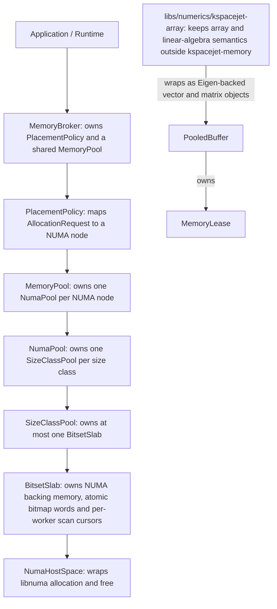
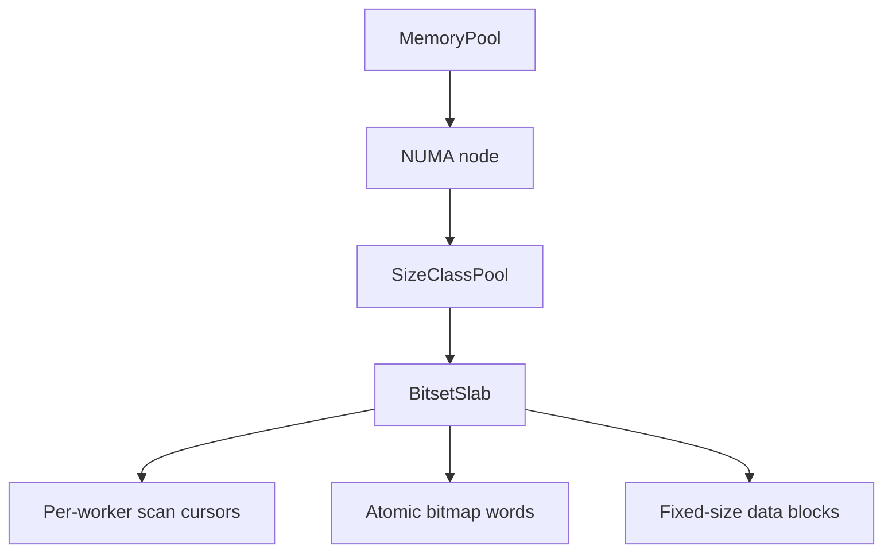
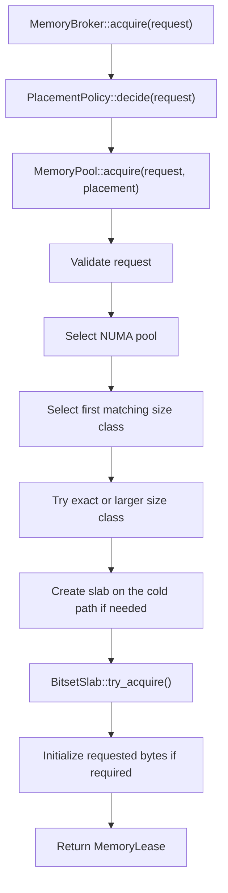
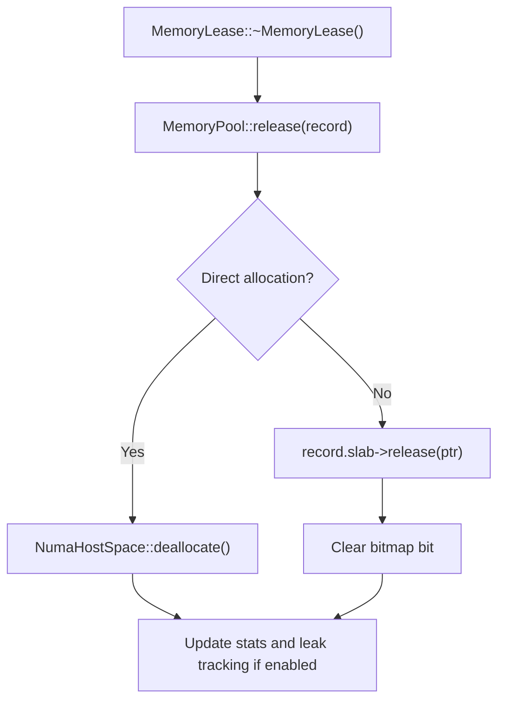
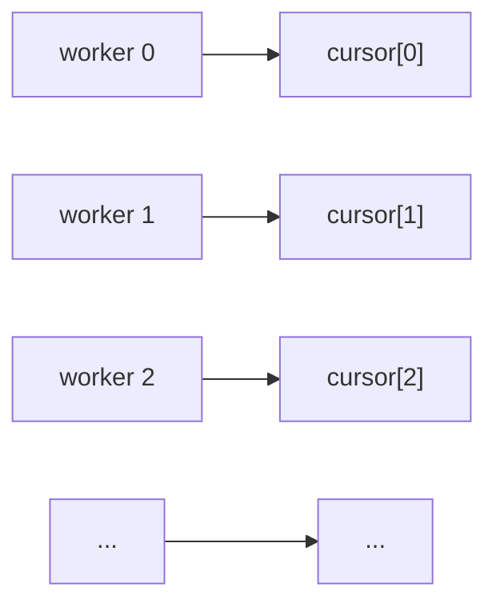

# KSpaceJet Memory Pool 架构设计

## 摘要

`kspacejet-memory` 是 KSpaceJet core 层提供的 NUMA-aware host memory pool。它面向高吞吐、多线程、双路或多路 CPU 环境中的临时内存复用场景，提供稳定的分配语义、明确的 NUMA 放置策略、cache-line 对齐保证，以及可选的运行期诊断能力。

本组件只表达通用内存管理概念，包括分配器类型、内存空间、NUMA locality、对齐、初始化、生命周期、池化 typed buffer 和诊断信息。它不包含任何上层领域语义；多维数组、矩阵、图像和 Eigen view 由 `libs/numerics/kspacejet-array` 提供。领域侧可以把自己的 workspace、stage、request 或 shard 映射到本组件的 `label`、`worker_index`、`shard_key` 和 `locality`，但 `libs/core/kspacejet-memory` 不解释这些字段的业务含义。

当前实现要求：

- C++20。
- Linux 上使用 `libnuma`，通过 `find_package(libnuma CONFIG REQUIRED)` 和 `libnuma::libnuma` 链接。
- Windows VS2022 构建使用 cache-line aligned host allocation fallback，不提供真实 NUMA placement。
- Linux host NUMA memory；支持池化 NUMA host allocation、direct NUMA host allocation、direct pinned host allocation，以及普通页、transparent hugepage hint 和显式 hugepage 策略。
- Windows fallback 只面向正常 host allocation；explicit hugepage 和 pinned host 不在 Windows 目标内。Stats 与 leak tracking 可在 Windows 编译开启，但 NUMA locality 相关诊断会退化为 unknown 或固定单节点语义。
- `device` 与 `unified` memory space 已作为 API 边界保留，当前实现会显式拒绝，避免业务代码误以为已经具备设备内存池能力。

## 设计目标

`kspacejet-memory` 的设计目标如下：

- **NUMA-aware**：按 NUMA node 组织内存池，尽量让 worker 使用本地内存，降低跨 socket 访问成本。
- **Cache-line aligned**：池化分配和 direct 分配返回的地址均至少按 CPU cache line 对齐。
- **低热路径开销**：block 获取和释放使用并发位图，不在常规路径上使用 mutex-protected freelist。
- **可预测容量边界**：每个 `NUMA node + size class` 最多持有一个 slab，不进行同 size class 动态扩容。
- **通用 core 抽象**：不引入上层领域术语、生命周期分桶或业务对象名称。
- **RAII 生命周期**：调用者通过 `MemoryLease` 持有内存，析构时自动归还。
- **Typed buffer**：提供池化 typed buffer，使上层可以在不暴露裸字节生命周期细节的情况下使用连续 typed storage。
- **可诊断但默认无成本**：stats 和 leak tracking 均为编译期可选能力，默认关闭。
- **可退化**：超出池化范围或池内无可用 block 时，可按配置 fallback 到 direct NUMA allocation。

## 非目标

本组件不覆盖以下能力：

- 不提供在线并发 slab 回收；`trim()` 是静默边界操作。
- 不为 request、task、epoch、session 等业务生命周期建立独立缓存桶。
- 不在 core 层输出 JSON、Prometheus 指标或绑定日志系统。
- 不在 core 层实现矩阵运算、张量表达式、FFT、BLAS/LAPACK 绑定或 Armadillo/Kokkos 适配器。
- 不保证 direct fallback 的内存可由池复用。
- 不实现跨 NUMA node 的自动迁移或远端访问纠偏；当前只提供可选 remote release suspect 诊断。
- 不实现 GPU/device memory space 的实际分配器。

## 公开接口

建议业务代码只使用聚合头：

```cpp
#include "kspacejet/memory/memory.hpp"
```

核心公开类型如下：

| 类型 | 职责 |
| --- | --- |
| `MemoryBroker` | 应用侧首选 singleton 入口；组合 topology、placement 和 memory pool。 |
| `AllocationRequest` | 描述一次分配请求，包括字节数、worker、shard 和分配属性。 |
| `AllocationProperties` | 描述 allocator、memory space、locality、alignment、initialization 等策略。 |
| `MemoryLease` | owning RAII handle；析构时归还内存。 |
| `MemoryView` | non-owning view；用于向不拥有生命周期的代码传递内存。 |
| `PooledBuffer<T>` | typed owning buffer；底层由 `MemoryLease` 持有，元素类型必须适合 raw typed storage。 |
| `allocate_bytes()` | 便捷字节分配 helper；补齐 cache-line alignment；无 broker 参数版本使用 `MemoryBroker::instance()`。 |
| `allocate_array<T>()` | typed array 分配 helper；检查字节数溢出并返回 `PooledBuffer<T>`；无 broker 参数版本使用 `MemoryBroker::instance()`。 |
| `MemoryPool` | NUMA node 与 size class 维度的池化实现。通常不直接由应用层使用。 |
| `NumaHostSpace` | Linux `libnuma` raw allocation 封装；Windows 使用 aligned host allocation fallback。 |
| `MemoryPoolStatsSnapshot` | 可选 stats 快照。 |
| `OutstandingMemoryAllocation` | 可选 leak tracking 记录。 |

最小示例：

```cpp
auto& memory = ksj::memory::MemoryBroker::instance();

ksj::memory::AllocationRequest request;
request.bytes = 8ULL * 1024ULL * 1024ULL;
request.worker_index = worker_index;
request.properties.label = "temporary.buffer";
request.properties.locality = ksj::memory::Locality::worker_local;
request.properties.initialization = ksj::memory::Initialization::zero;

auto lease = memory.acquire(request);
auto* data = lease.data();
auto bytes = lease.size();
```

`MemoryLease` 离开作用域时会自动归还对应内存。调用者不得手工释放 `lease.data()`。

Typed buffer 示例：

```cpp
ksj::memory::AllocationProperties properties;
properties.label = "scratch.buffer";
properties.locality = ksj::memory::Locality::worker_local;
properties.initialization = ksj::memory::Initialization::zero;

auto buffer = ksj::memory::allocate_array<float>(
  rows * cols * slices,
  properties,
  worker_index);

buffer.span()[0] = 1.0F;
```

`PooledBuffer<T>` 只提供 typed raw storage，不解释多维形状，也不依赖任何 array 模块。矩阵、向量、
多维数组和 Eigen view 属于 numerics 层职责；如果需要池化 Eigen 矩阵，应使用
`libs/numerics/kspacejet-array` 提供的 `ksj::array::PooledMatrix<T>` 或 `PooledVector<T>`。

## 总体架构

组件采用 broker、placement、pool、space 分层：



### 组件职责

| 层级 | 职责 | 关键约束 |
| --- | --- | --- |
| `MemoryBroker` | 应用侧入口；执行 placement；委托 pool 分配。 | 持有 `shared_ptr<MemoryPool>`，保证 lease 生命周期内 pool 存活。 |
| `PooledBuffer<T>` | typed owning buffer；对 `MemoryLease` 进行类型化封装。 | 不负责非平凡对象构造和析构；复杂对象应使用容器或专门生命周期 API。 |
| `PlacementPolicy` | 根据 `locality`、`worker_index`、`shard_key` 和 topology 决定 NUMA node。 | 不理解业务语义。 |
| `MemoryPool` | 选择 NUMA bucket 和 size class；处理 direct fallback；维护 stats/leak tracking。 | `MemoryPool` 依赖 `shared_from_this()`，应用侧应优先使用 `MemoryBroker`。 |
| `NumaPool` | 管理单个 NUMA node 下全部 size class。 | 每个 NUMA node 独立缓存。 |
| `SizeClassPool` | 管理某个 block size 的 slab 生命周期。 | 每个 size class 当前最多一个 slab。 |
| `BitsetSlab` | 管理固定大小 block 的并发获取与释放。 | 热路径使用 atomic bitmap，并通过 per-worker scan cursor 降低 bitmap word 竞争。 |
| `NumaHostSpace` | 执行 raw NUMA allocation/free。 | 所有返回地址至少 cache-line aligned；封装 hugepage 与 pinned host 细节。 |

## 内存空间结构

池内部结构是固定层次：



含义如下：

- **MemoryPool**：全局池对象，保存 topology、options、stats，以及每个 NUMA node 的 `NumaPool`。
- **NUMA node**：按物理 NUMA 节点隔离缓存。不同 NUMA node 下的 slab 互不共享。
- **SizeClassPool**：同一个 NUMA node 内，按固定 block size 分组。每个分组服务一段请求大小区间。
- **BitsetSlab**：一块连续的 NUMA backing memory，被切成相同大小的 block。
- **Per-worker scan cursors**：按 worker 分片保存 bitmap 扫描起点，减少多个 worker 同时从同一个 bitmap word 开始 CAS 的概率。
- **Atomic bitmap words**：每个 bit 表示一个 block 的占用状态；`0` 表示空闲，`1` 表示已借出。
- **Data blocks**：实际返回给调用者的内存区域。每个 block 起始地址满足 cache-line alignment。

当前实现中，每个 `NUMA node + size class` 最多创建一个 slab。该设计使池容量边界清晰，也避免某个热门 size class 在运行过程中无上限扩张。若当前 size class 已满，分配流程会根据 `allow_larger_class` 尝试更大的 size class；若仍无法满足，再根据 `direct_fallback` 决定是否执行 direct allocation。

## Size Class 设计

生产 backend 当前显式配置的 size class 策略如下。`kspacejet-memory` 本身不保留内置默认表；
使用 `MemoryPool` 或 `MemoryBroker::instance()` 前必须显式提供 `MemoryPoolOptions`。

| Size class | Blocks per slab | Slab capacity |
| ---: | ---: | ---: |
| 64 KiB | 1024 | 64 MiB |
| 1 MiB | 64 | 64 MiB |
| 2 MiB | 32 | 64 MiB |
| 4 MiB | 16 | 64 MiB |
| 8 MiB | 8 | 64 MiB |
| 16 MiB | 4 | 64 MiB |
| 32 MiB | 2 | 64 MiB |
| 64 MiB | 1 | 64 MiB |
| 128 MiB | 1 | 128 MiB |
| 256 MiB | 1 | 256 MiB |
| 512 MiB | 1 | 512 MiB |

设计理由：

- 64 KiB 到 32 MiB 的 size class 统一控制在约 64 MiB slab capacity，降低系统分配次数，同时避免一次创建过大的冷缓存。
- 64 MiB 及以上 size class 使用一块一 slab，避免超大请求导致 slab 内保留过多未使用容量。
- 所有 size class 均为 cache line size 的整数倍，保证 block 切分后仍满足对齐要求。
- 超过 512 MiB 的池化请求不进入 size class，按 `direct_fallback` 策略处理。
- `MemoryPoolOptions::pooling_enabled = false` 时不创建 size class slab，普通 pooled 请求直接使用
  direct NUMA allocation；这不是 fallback，`direct_fallbacks` 计数不会增加。

生产 backend 通过 `memory.pool.enabled` 控制是否启用池化。启用时，通过
`memory.pool.size_classes` 配置 size class 档位，并通过 `memory.pool.size_class_block_counts`
按索引配置每档 slab 的 block 数。两个 size class 配置都必须非空，且 entry 数量必须一致。

## 分配流程

一次池化分配流程如下：



关键规则：

- `request.bytes == 0` 会返回空 lease。
- `AllocatorKind::host_pool` 走池化路径。
- `AllocatorKind::host_direct` 直接走 `NumaHostSpace`，不进入 slab。
- `MemorySpaceKind::numa_host` 可走池化或 direct 路径。
- `MemorySpaceKind::pinned_host` 当前只支持 direct 路径，内部通过 `mlock()` 请求锁页。
- `MemorySpaceKind::device` 与 `MemorySpaceKind::unified` 当前会被显式拒绝。
- `PagePolicy::transparent_hugepage` 对 backing allocation 调用 `madvise(MADV_HUGEPAGE)`，属于 best-effort hint。
- `PagePolicy::explicit_hugepage` 通过 `MAP_HUGETLB` 申请显式 hugepage；若系统未预留 hugepage 资源，分配会失败。
- `Initialization::zero` 只清零调用者请求的 `bytes`，不清零整个 capacity。
- `allow_larger_class = true` 时，当前 size class 无空闲 block 可继续尝试更大的 size class。
- `allow_larger_class = false` 时，只尝试第一个匹配 size class。
- `MemoryPoolOptions::direct_fallback = true` 时，池化失败可退化为 direct NUMA allocation。
- `direct_fallback = false` 时，池化失败抛出 `std::bad_alloc`。

direct allocation 仍遵守 NUMA node 和 cache-line alignment 约束，但不会被 slab 复用。显式 hugepage direct allocation 的 `capacity()` 可能大于 `size()`，用于反映实际映射的 hugepage reservation。池化 slab 的 `PagePolicy` 在 slab 首次创建时生效；由于每个 `NUMA node + size class` 最多一个 slab，之后同 size class 的请求会复用已有 slab，不会为不同 page policy 动态追加第二个 slab。

## 释放流程

`MemoryLease` 持有一份 `AllocationRecord`。析构或 move-assignment 释放旧资源时，会调用 `MemoryPool::release(record)`：



池化释放会进行以下检查：

- 指针是否属于目标 slab。
- 指针是否按 block size 对齐。
- bitmap 中对应 bit 是否处于已占用状态。

若释放失败，例如重复释放或错误指针，stats 开启时会记录 `failed_releases`。

## 并发模型

热路径由 `BitsetSlab` 的 atomic bitmap 实现：

```text
bit = 0  free
bit = 1  used
```

获取 block：

1. 根据 `worker_index` 读取 per-worker scan cursor 作为扫描起点；没有 worker hint 元数据时退化到共享 `hint_`。
2. 读取 bitmap word 快照。
3. 通过 `~snapshot & valid_mask` 找出空闲 bit。
4. 使用 `std::countr_zero()` 定位候选 bit。
5. 通过 `compare_exchange_weak()` 把 bit 从 0 更新为 1。
6. CAS 成功后返回对应 block。

释放 block：

1. 计算指针对应 block index。
2. 通过 `fetch_and(~bit_mask)` 清除占用 bit。
3. 若原 bit 已为 0，则释放失败。

热路径不使用 mutex，不维护共享 freelist 节点，也不在 block 之间写入 next 指针。并发竞争被限制在 bitmap word 粒度。

`BitsetSlab` 为 worker 维护 cache-line aligned scan cursor：



`MemoryPool` 根据 topology 中的 CPU、affinity 和显式 worker binding 推导 cursor 数量，并在创建 slab 时传入 `BitsetSlab`。`try_acquire(worker_index)` 使用对应 cursor 作为 bitmap 扫描起点，从而减少多个 worker 同时竞争同一个 bitmap word 的概率。`worker_index` 只作为并发分片 key，不携带业务语义。

### 冷路径同步

`SizeClassPool` 使用 `std::atomic_flag` 保护 slab 创建和 trim：

- 第一次命中某个 `NUMA node + size class` 时创建 slab。
- `trim_empty_slabs()` 回收空 slab。

该同步不在已创建 slab 的常规 block acquire/release 路径上。

### Trim 边界

`MemoryBroker::trim()` 和 `MemoryPool::trim_empty_slabs()` 是静默边界接口。调用方必须保证没有线程正在使用该 broker/pool 进行分配、释放或持有待释放 lease。

当前实现不提供在线并发 slab reclamation。若需要在线回收，必须引入明确的 epoch、hazard pointer、RCU 或等价机制。

## NUMA 拓扑与放置策略

`TopologyDiscovery::discover()` 在 Linux 下采集：

- NUMA node 与 CPU 列表。
- CPU 到 socket 的映射。
- CPU 到 core id 的映射。
- 当前进程 CPU affinity。

拓扑快照由 `TopologySnapshot` 保存。若系统信息不可用，会降级为 node 0 的单节点拓扑。实际 raw allocation 仍依赖运行时 `numa_available() >= 0`。

线程运行时可以在 `TopologySnapshot` 上显式绑定 worker：

```cpp
topology.bind_worker_to_cpu(worker_index, cpu_id);
topology.bind_worker_to_numa(worker_index, numa_node);
```

显式绑定优先级高于基于进程 affinity 的启发式推导。线程池侧可通过 `kspacejet/threading/memory_affinity.hpp` 将 `ThreadPoolWorkerInfo` 应用到 topology：

```cpp
#include "kspacejet/threading/memory_affinity.hpp"

auto topology = ksj::memory::TopologyDiscovery::discover();
auto worker_infos = thread_pool.worker_infos();
ksj::threading::apply_worker_affinity(topology, worker_infos);

#if KSJ_MEMORY_ENABLE_TEST_ACCESS
ksj::memory::MemoryPoolOptions options;
options.size_classes = {64ULL * 1024ULL, 1ULL * 1024ULL * 1024ULL};
options.size_class_block_counts = {1024, 64};
auto memory = ksj::memory::MemoryBroker::create_for_testing(std::move(topology), options);
#else
auto& memory = ksj::memory::MemoryBroker::instance();
#endif
```

该桥接只传递 worker index 与 CPU affinity，不传递任务、请求、算法或业务对象信息。内存池仍只依据 `TopologySnapshot` 与 `AllocationRequest` 中的通用字段做放置决策。

`PlacementPolicy` 支持以下 locality：

| Locality | 放置规则 |
| --- | --- |
| `global` | 使用第一个 NUMA node。 |
| `worker_local` | 根据 `worker_index` 映射到进程 affinity 中的 CPU，再映射到 NUMA node。 |
| `shard_local` | 对 `shard_key` 做 hash，在 NUMA node 间稳定分布。 |
| `socket_local` | 根据 `worker_index` 选择 socket，再取该 socket 的第一个 NUMA node。 |
| `explicit_numa` | 使用 `properties.numa_node`。未设置时回退到第一个 node。 |
| `interleaved` | 按 `worker_index` 在 NUMA node 间轮转。 |

若显式请求不存在的 NUMA node，组件会抛出 `std::invalid_argument`。这通常表示调用者传入的 topology 假设与实际运行环境不一致。

## 对齐与初始化

对齐规则：

- `AllocationProperties::alignment` 必须为非零 2 的幂。
- 实际对齐会提升为 `max(requested_alignment, cache_line_size)`。
- 当前实现不支持 `effective_alignment > page_size`。
- `NumaHostSpace::allocate()` 会校验返回地址是否满足有效对齐。
- `BitsetSlab` 会校验 `block_size % cache_line_size == 0`。

初始化规则：

- `Initialization::none` 不清理内存。
- `Initialization::zero` 清零 `request.bytes`。
- 池化分配的 `capacity()` 可能大于 `size()`；调用者只能假设请求区间被初始化。

## Options 与属性

`MemoryPoolOptions`：

| 字段 | 默认值 | 含义 |
| --- | --- | --- |
| `pooling_enabled` | `true` | 是否启用 size-class slab 池化；关闭后 pooled 请求直接走 direct NUMA allocation。 |
| `direct_fallback` | `true` | 池化路径无法满足请求时，是否 fallback 到 direct NUMA allocation。 |
| `leak_tracking` | `false` | 在编译开启 leak tracking 后，是否在运行时记录 outstanding allocations。 |
| `size_classes` | 启用池化时必填 | 池化 block size 列表；生产 backend 由 `memory.pool.size_classes` 注入。 |
| `size_class_block_counts` | 启用池化时必填 | 每个 size class 的 slab block 数，必须与 `size_classes` 一一对应；生产 backend 由 `memory.pool.size_class_block_counts` 注入。 |

`AllocationProperties`：

| 字段 | 默认值 | 含义 |
| --- | --- | --- |
| `label` | 空字符串 | 诊断标签；core 层不解释。 |
| `allocator` | `host_pool` | `host_pool` 使用内存池；`host_direct` 直接 NUMA 分配。 |
| `space_kind` | `numa_host` | `numa_host` 支持池化和 direct；`pinned_host` 当前只支持 direct；`device` 和 `unified` 为保留边界。 |
| `locality` | `worker_local` | NUMA 放置策略。 |
| `numa_node` | `std::nullopt` | 显式 NUMA node，仅在相关 locality 下使用。 |
| `alignment` | `64` | 调用者请求的最低对齐。 |
| `initialization` | `none` | 是否清零请求区间。 |
| `page_policy` | `normal` | backing allocation 的页策略：普通页、transparent hugepage hint 或显式 hugepage。 |
| `allow_larger_class` | `true` | 当前 size class 无空闲 block 时，是否尝试更大 size class。 |

`PagePolicy` 的支持状态如下：

| Page policy | 行为 |
| --- | --- |
| `normal` | 使用普通 NUMA host allocation。 |
| `transparent_hugepage` | 在 allocation 后调用 `madvise(MADV_HUGEPAGE)`，由内核决定是否使用 transparent huge page。 |
| `explicit_hugepage` | 使用 `mmap(MAP_HUGETLB)` 申请显式 hugepage，并通过 `numa_tonode_memory()` 放置到目标 NUMA node。 |

`MemorySpaceKind` 的支持状态如下：

| Memory space | 支持状态 |
| --- | --- |
| `numa_host` | 支持池化分配和 direct 分配。 |
| `pinned_host` | 支持 direct 分配，内部通过 `mlock()` 请求锁页；不进入 slab pool。 |
| `device` | API 保留，当前显式拒绝。 |
| `unified` | API 保留，当前显式拒绝。 |

## 诊断能力

诊断能力默认关闭，以避免默认构建引入计数器、锁或额外状态。

### Stats

编译期开关：

```cmake
KSJ_MEMORY_ENABLE_STATS=ON
```

开启后，`MemoryBroker::stats_snapshot()` 返回 `MemoryPoolStatsSnapshot`。快照包含：

- 全局计数：requests、pool allocations、reuse hits、slab creations、direct allocations、releases、failed releases。
- 诊断计数：remote release suspects、unknown release CPUs、larger class spills、direct fallbacks、worker node mismatches。
- 字节计数：requested bytes、allocated bytes。
- NUMA 维度：reserved bytes、active bytes、cached bytes、slab count。
- size class 维度：block size、利用率、occupancy bar、active/free blocks、reserved bytes、active/free/cached bytes、allocations、reuse hits、misses。

Stats 的普通计数是跨平台能力。NUMA locality 诊断由 `KSJ_MEMORY_ENABLE_NUMA_DIAGNOSTICS` 控制：Linux stats 构建会启用该内部宏；Windows stats 构建不会启用真实 CPU/NUMA probe，因此 `remote_release_suspects` 不表达真实跨 NUMA 释放，`unknown_release_cpus` 可用于提示当前平台没有可用的 release CPU -> NUMA 映射。

组件提供纯格式化 helper：

```cpp
auto snapshot = memory.stats_snapshot();

ksj::memory::MemoryPoolHistogramOptions options;
options.bar_width = 32;
options.include_empty_size_classes = false;

auto text = ksj::memory::format_memory_pool_histogram(snapshot, options);
```

该 helper 不打印、不记录日志、不输出 JSON，也不绑定监控系统。`KSJ_MEMORY_ENABLE_STATS=OFF` 时返回空字符串。

直方图中每个 size class 行会显式输出：

| 字段 | 含义 |
| --- | --- |
| `[...]` | slab occupancy bar，按 active block 占比绘制。 |
| `util` | `active_blocks / total_blocks`，用于快速判断 size class 利用率。 |
| `active` / `free` | 当前借出的 block 数和空闲 block 数。 |
| `active_bytes` / `free_bytes` / `cached` | 当前借出字节数、空闲 block 字节数和 slab 内缓存字节数。当前固定 slab 模型下，`free_bytes` 与 `cached` 等价。 |
| `larger_class_spills` | header 中的全局计数，表示请求从原 size class 溢出到更大 size class 的次数。 |
| `direct_fallbacks` | header 中的全局计数，表示池化路径退化到 direct allocation 的次数。 |

`remote_release_suspects` 是一种 Linux NUMA locality 诊断信号：释放时如果当前线程所在 NUMA node 与 allocation NUMA node 不一致，就累计一次。该计数不能证明整段生命周期都发生了远端访问，但可以帮助发现 worker affinity 漂移、lease 跨 worker 传递或 placement 与实际执行位置不一致等问题。Windows 当前没有真实 CPU/NUMA probe，该计数不用于判断 Windows locality 问题。

其他诊断计数的含义如下：

| 字段 | 含义 |
| --- | --- |
| `unknown_release_cpus` | 释放线程当前 CPU 无法映射到 topology 中的 NUMA node。常见原因是测试拓扑不完整、进程 affinity 发生变化、运行环境隐藏了 CPU 拓扑，或当前平台未启用真实 NUMA probe。 |
| `larger_class_spills` | 请求命中的 size class 已满，且通过更大的 size class 获得了池化 block。该值持续增长通常表示当前 size class 容量不足或请求尺寸分布需要重新评估。 |
| `direct_fallbacks` | 池化路径无法满足请求后退化到 direct NUMA allocation。该值用于判断 direct fallback 是否成为常态路径。 |
| `worker_node_mismatches` | `worker_local` 请求的实际 placement 与 topology 中显式 worker binding 推导出的 NUMA node 不一致。该值通常表示线程池 affinity 与内存 broker 使用的 topology 没有同步。 |

这些计数只用于诊断，不参与分配决策。

### Leak Tracking

编译期开关：

```cmake
KSJ_MEMORY_ENABLE_LEAK_TRACKING=ON
```

运行时还需要启用：

```cpp
ksj::memory::MemoryPoolOptions options;
options.size_classes = {64ULL * 1024ULL, 1ULL * 1024ULL * 1024ULL};
options.size_class_block_counts = {1024, 64};
options.leak_tracking = true;

#if KSJ_MEMORY_ENABLE_TEST_ACCESS
auto memory = ksj::memory::MemoryBroker::create_for_testing(options);
#else
auto& memory = ksj::memory::MemoryBroker::instance();
#endif
```

生产路径使用 `MemoryBroker::instance()` 作为全局 broker。自定义 `MemoryPoolOptions` 或自定义
`TopologySnapshot` 的 broker 仅在 `KSJ_MEMORY_ENABLE_TEST_ACCESS` 打开时暴露，用于单元测试和诊断构造。

开启后，池会记录 outstanding allocations，包括地址、sequence id、请求大小、实际容量、NUMA node、size class、worker、label、shard、thread id 和 direct 标记。

调试接口：

```cpp
auto outstanding = memory.outstanding_allocations();
bool clean = memory.check_no_leaks();
```

推荐在阶段边界先调用 `check_no_leaks()`，确认没有仍被持有的 `MemoryLease`，再调用 `trim()`。

## 构建集成

`kspacejet-memory` 挂接到 core component。Linux 构建链接 `NUMA::numa`；Windows 构建不链接 libnuma，并使用 aligned host allocation fallback：

```cmake
if(CMAKE_SYSTEM_NAME STREQUAL "Linux")
  find_package(libnuma CONFIG REQUIRED)
endif()

ksj_add_core_component(
  memory
  INCLUDE_DIR "${CMAKE_CURRENT_SOURCE_DIR}/include"
  SOURCES
    src/bitset_slab.cpp
    src/memory_broker.cpp
    src/memory_lease.cpp
    src/memory_pool.cpp
    src/memory_space.cpp
    src/placement.cpp
    src/stats_formatter.cpp
    src/topology.cpp
  PUBLIC_LINK_LIBS
    ${_ksj_memory_public_link_libs}
)
```

诊断 preset：

```bash
cmake --preset linux-release-memory-diagnostics
cmake --build --preset linux-release-memory-diagnostics
```

默认 preset 保持：

```cmake
KSJ_MEMORY_ENABLE_STATS=OFF
KSJ_MEMORY_ENABLE_LEAK_TRACKING=OFF
KSJ_BUILD_BENCHMARKS=OFF
```

Windows VS2022 preset 也可以显式开启 `KSJ_MEMORY_ENABLE_STATS` 或 `KSJ_MEMORY_ENABLE_LEAK_TRACKING` 做通用诊断；只有真实 NUMA placement、pinned host 和 explicit hugepage 仍是 Linux-only 能力。

benchmark 默认不构建。需要进行本地性能测量时可显式开启：

```bash
cmake -S . -B out/build/linux-memory-benchmark \
  -DCMAKE_BUILD_TYPE=Release \
  -DKSJ_BUILD_BENCHMARKS=ON
cmake --build out/build/linux-memory-benchmark --target ksj_memory_benchmark
out/build/linux-memory-benchmark/bin/ksj_memory_benchmark \
  --threads 8 \
  --iterations 100000 \
  --bytes 4096
```

benchmark 输出 CSV 风格数据，包含 case、线程数、迭代次数、请求大小、总操作数、耗时、吞吐和单次操作耗时。该工具用于本地对比配置或实现变化，不注册为 CTest。

## 不变量

实现必须长期保持以下不变量：

- `libs/core/kspacejet-memory` 不引入上层领域类型或领域术语。
- `host_pool` 返回的 block 地址至少 cache-line aligned。
- `host_direct` 返回的地址至少 cache-line aligned。
- 同一时刻，同一 slab 内一个 block 最多只能被一个 live lease 持有。
- 每个 `NUMA node + size class` 当前最多一个 slab。
- size class 满时，不在同 size class 内动态追加 slab。
- `trim()` 仅允许在静默边界调用。
- stats 与 leak tracking 关闭时，不应改变分配行为。
- stats 只能描述事实，不应参与分配决策。

## 测试覆盖

单元测试位于：

```text
tests/unit/libs/core/kspacejet-memory/memory_pool_tests.cpp
tests/unit/libs/core/kspacejet-memory/memory_pool_stress_tests.cpp
tests/benchmarks/kspacejet-memory/memory_pool_benchmark.cpp
```

覆盖范围包括：

- NUMA topology discovery。
- placement 在多 NUMA 拓扑下的映射。
- 显式 worker affinity binding 对 placement 的覆盖。
- 线程池 worker affinity metadata 到 `TopologySnapshot` 的桥接。
- cache-line alignment。
- zero initialization。
- NUMA bucket 隔离。
- per-worker scan cursor 元数据。
- slab 复用。
- size class 满后尝试更大 class 或失败。
- direct allocation。
- transparent hugepage hint direct allocation。
- unsupported memory space 的显式拒绝。
- stats 默认关闭行为。
- stats 开启后的 per-NUMA/per-size-class 直方图数据。
- stats 开启后的 Linux remote release suspect 诊断。
- stats 开启后的 unknown release CPU、larger class spill、direct fallback 和 worker/node mismatch 诊断。
- leak tracking 默认关闭行为。
- leak tracking 编译和运行时开启后的 outstanding allocation 记录。
- oversized request 在 direct fallback 关闭时失败。
- 并发分配期间 live 地址不重复。
- 多线程混合尺寸压力分配与跨线程释放。
- 可选 benchmark target 的构建校验。

## 已知边界

当前边界：

- Linux 使用 `libnuma` 提供 NUMA-aware allocation。
- Windows VS2022 构建使用 cache-line aligned host allocation fallback，不提供真实 NUMA placement。
- Windows stats 和 leak tracking 可编译开启；NUMA locality 诊断不提供真实 Windows processor group / NUMA node probe。
- `pinned_host` 仅支持 direct allocation，不参与 size class pool。
- `device` 与 `unified` 仅作为 API 边界保留，尚未实现具体 memory space。
- 不支持 `effective_alignment > page_size`。
- 不支持在线并发 trim。
- size class 表固定。
- 每个 `NUMA node + size class` 仍最多一个 slab，不因不同 page policy 或 worker 维度动态追加 slab。
