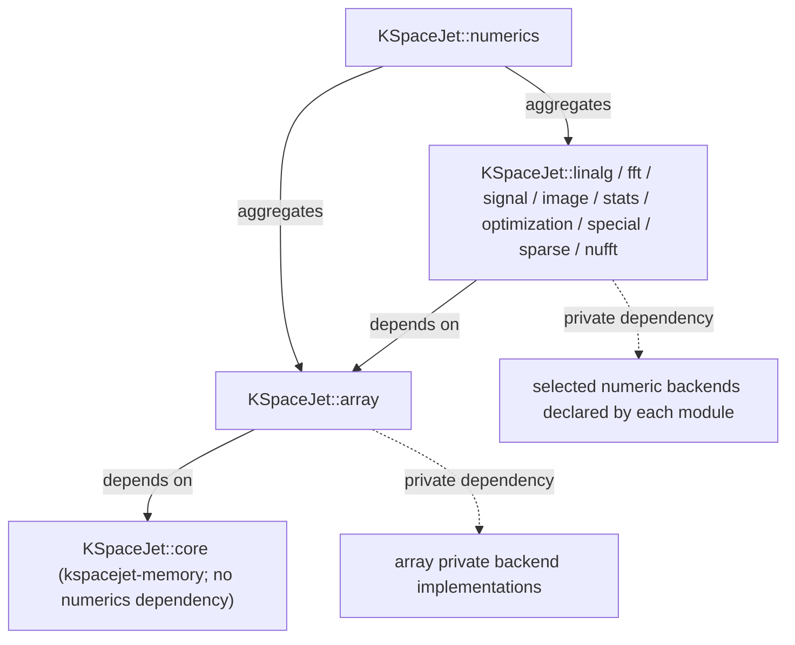
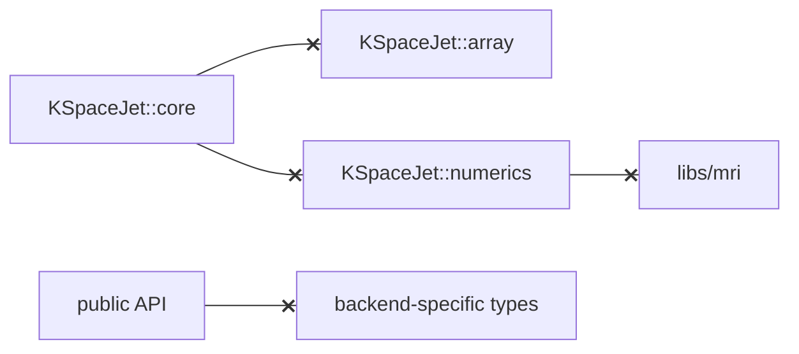

# libs/numerics

`libs/numerics` 是 KSpaceJet 的通用数值计算分区，用于承载与 MRI 业务语义无关、可被多个领域复用的数学计算能力。这里的代码只表达数学对象、数学运算、后端调度和性能验证，不表达 coil、echo、slice、k-space、scan、DICOM、recon workflow 等 MRI 领域概念。

本分区的目标不是固定绑定某一个第三方库，而是提供统一 API，并在内部根据数据类型、内存布局、stride、规模、硬件平台和 benchmark 数据选择最快实现。当前候选后端以 Eigen、Intel MKL、Intel IPP 和 OpenCV 为主；新的后端只有在完成接入、正确性测试和 benchmark 后，才会进入正式 policy。调用者不应该感知具体后端差异。

数值 API 的全仓统一规则见 [Numerics API Convention](../../docs/conventions/numerics_api.md)。简要规则是：长期持有数据使用
`Pooled*`，算法核心输入输出使用 `View`，Pooled 便捷接口只创建输出或转发到 View，输入输出默认分开，后端适配只借用
View 内存。

所有 numerics 能力模块都采用相同的多后端 dispatch policy 结构：

- public facade 放在 `include/kspacejet/<module>/<module>.hpp`，作为 umbrella 入口。
- 公开头按数学功能拆分，例如 `moments.hpp`、`reductions.hpp`、`thresholds.hpp`，不按容器类型或旧代码来源拆分。
- 后端声明放在 `include/kspacejet/<module>/detail/<backend>/<backend>_<module>_<feature>.hpp`，后端实现放在
  `src/<backend>/<backend>_<module>_<feature>.cpp`。很小的模块也要使用功能名，例如
  `eigen_special_functions.hpp` / `eigen_special_functions.cpp`，不要退回到整个 backend 一个总文件。
- 后端选择放在 `include/kspacejet/<module>/detail/<module>_policy.hpp`。
- 第三方头文件和 CMake target 默认只在 backend `.cpp` / private link 中出现，不能从 public API 暴露。
- policy 由 benchmark 数据驱动；新增后端必须先进入 benchmark，再决定是否进入默认路径。
- 即使当前只有 Eigen/reference backend，也保留 policy 层，后续接入 Intel、OpenCV、ITK、FFTW、BART 或自研 SIMD
  candidate 时不改变 public API。

## 目录结构

当前采用“多个能力域模块 + 一个聚合入口”的结构：

```text
libs/numerics
  kspacejet-array          row-major Pooled/View dense 对象和基础标量 traits
  kspacejet-linalg         dense linear algebra
  kspacejet-fft            1D/2D/3D complex FFT/IFFT；2D/3D batch FFT；1D/2D block FFT；1D/2D fftshift；FFT convolution/correlation；FFT plan
  kspacejet-signal         通用信号处理
  kspacejet-image          通用图像数值核
  kspacejet-stats          统计指标、协方差、误差度量
  kspacejet-optimization   数值优化
  kspacejet-special        特殊函数
  kspacejet-sparse         稀疏矩阵和稀疏运算
  kspacejet-nufft          NUFFT / MCNUFFT 数值核
  kspacejet-numerics       聚合入口，只负责组合上述模块
```

对应 CMake target：

| 模块 | Target | 职责 |
| --- | --- | --- |
| `kspacejet-array` | `KSpaceJet::array` | 基于 `kspacejet-memory` 池化内存的 row-major Pooled/View 数值对象层；public API 不暴露 Eigen。 |
| `kspacejet-linalg` | `KSpaceJet::linalg` | 矩阵乘法、矩阵向量乘法、向量内积、BLAS1 风格向量更新、转置、求逆、线性方程求解、least-squares variants 和常用 dense 分解。 |
| `kspacejet-fft` | `KSpaceJet::fft` | 1D/2D/3D complex FFT/IFFT、2D/3D batch FFT、1D/2D block FFT、1D/2D fftshift/ifftshift、FFT-based 2D full/same/valid convolution/correlation，以及 plan/output-buffer API。 |
| `kspacejet-signal` | `KSpaceJet::signal` | window、convolution、resample、phase/correlation 等信号处理。 |
| `kspacejet-image` | `KSpaceJet::image` | threshold、normalize 等通用图像核。 |
| `kspacejet-stats` | `KSpaceJet::stats` | sum、mean、variance、covariance 等统计计算。 |
| `kspacejet-optimization` | `KSpaceJet::optimization` | least squares 等优化算法。 |
| `kspacejet-special` | `KSpaceJet::special` | Bessel、Gamma、elementary special functions。 |
| `kspacejet-sparse` | `KSpaceJet::sparse` | CSR sparse matrix 与 SpMV。 |
| `kspacejet-nufft` | `KSpaceJet::nufft` | NUFFT / NUDFT 数值核；公开 API 使用 `ksj::array` View/Pooled 对象。 |
| `kspacejet-numerics` | `KSpaceJet::numerics` | 总入口 target；上层需要全量数值能力时依赖它。 |

## 依赖边界

推荐依赖方向：



禁止依赖方向：



图中带叉箭头表示禁止依赖。

`kspacejet-memory` 只提供 raw bytes、`MemoryLease`、`MemoryView`、`PooledBuffer<T>` 等内存生命周期能力；它不解释 shape、stride、矩阵、FFT 或统计语义。数组、向量、矩阵、图像、cube 和 4D View/Pooled 语义由 `kspacejet-array` 提供。

## 模块职责

### kspacejet-array

`kspacejet-array` 是数值对象层。它对外只暴露 KSpaceJet 的 row-major `Pooled*` / `View` 抽象、基础标量 traits 和
轻量 view primitive；Eigen、OpenCV、ITK、MKL、IPP 等第三方类型不能成为 public contract。现存 public
Eigen adapter 属于迁移债务，新代码不得继续扩散。

核心规则：

- `PooledMatrix`、`PooledCube` 和 `PooledArray4D` 使用行主序，贴合 KSpaceJet MRI 现有 dense buffer；
  BLAS/LAPACK/FFT 后端显式使用 row-major 或规则 stride 调用约定。
- 底层内存来自 `kspacejet-memory` 的 `PooledBuffer<T>`，保证池化、NUMA-aware、cache-line aligned。
- `kspacejet-array` 的通用 primitive 是其它 numerics 模块和单独授权 provider 的默认 dense 数组工具层。上层代码遇到
  elementwise、copy/fill、reduction、complex magnitude/phase、dimwise、gather/scatter、reshape/subview 等通用
  操作时，应优先调用 `kspacejet-array`，让 backend policy、IPP/Eigen 加速、连续块 traversal 和 alias 处理统一生效。
- 如果某个通用 dense 数组操作缺失，应优先补到 `kspacejet-array` 并配套 unit test/benchmark，再让上层模块调用。
  只有 MRI/算法域专有控制流、stencil、region growing、图搜索等语义才留在对应模块本地实现。
- numerics 内部所有随输入规模增长的数值数据对象和 scratch buffer 都应使用 `PooledVector`、`PooledMatrix`、
  `PooledImage`、`PooledCube` 或 `PooledArray4D`；`std::vector` 不应用作大块数值存储。
- 固定小对象可以使用栈内存，例如 `Vector3f`、`Vector3d`、`Matrix3f`、`Matrix3d` 这类 3x3/3 元素对象。
- `std::span` 和 `VectorView` / `MatrixView` / `ImageView` / `CubeView` 只表达非拥有借用视图，不负责内存生命周期。
- 对外算法接口必须成对支持 View 和 Pooled 对象：如果提供 `VectorView` / `MatrixView` /
  `ImageView` / `CubeView` / `Array4DView` 版本，就必须提供对应 `PooledVector` / `PooledMatrix` /
  `PooledImage` / `PooledCube` / `PooledArray4D` 版本；反之亦然。Pooled 版本只做 `.view()` 转发，
  不能另写一套计算逻辑，避免池化对象和借用 view 的结果、边界检查或后端策略分叉。
- 后端对象只应在必要时拥有大块数值内存。把池化对象交给 Eigen、OpenCV、ITK、MKL、IPP 等后端时，
  默认用 `Map`、`cv::Mat(data, step)`、ITK import image 或库原生 view 借用现有内存；只有类型转换、
  layout/stride 不兼容、padding/重采样输出、后端 API 强制拥有内存时才允许 pack/copy 到新的池化 scratch。
  这类必要拷贝必须在代码结构上可见，不能隐藏在普通转换 helper 里。
- `scalar_traits.hpp` 承载跨模块共享的基础标量类型规则，例如 `real_scalar_t<T>`、
  `reduction_result_t<T>` 和 `magnitude_result_t<T>`。上层模块不要重复定义自己的 `result_types.hpp`。
- array 内部可以使用 Eigen 作为实现后端，但 Eigen include、Eigen Map 类型和 Eigen 表达式必须留在
  private/detail/source 边界。对外 API 使用 KSpaceJet `View` / `Pooled` 和显式 output primitive。
- 不在 `kspacejet-array` 内实现 MRI 语义，也不放复杂数学算法。

### numerics backend 迁移模板

迁移其它 numerics 子模块时，以 `kspacejet-stats` 为模板：

- `include/kspacejet/<module>/<module>.hpp` 是 umbrella，只 include 对外功能头。
- 功能头按数学语义命名，例如 `moments.hpp`、`norms.hpp`、`error_metrics.hpp`，只放 API、轻量校验和
  View/Pooled 转发。
- `detail/<backend>/<backend>_<module>_<feature>.hpp` 只放后端声明和轻量 support trait，不 include 第三方库头。
- `src/<backend>/<backend>_<module>_<feature>.cpp` 放完整后端实现。Eigen 是基础通用后端；IPP/MKL/OpenCV/ITK/FFTW/BART
  是扩展或加速后端。
- 不新增 `generic_*.hpp` 或 `reference_*.hpp` 伪后端。通用基础实现放进 Eigen 后端；小型 public
  状态对象放对应功能头。
- CMake 中第三方依赖使用 `PRIVATE`，public 依赖只暴露稳定 KSpaceJet target。

### kspacejet-linalg

`kspacejet-linalg` 负责 dense linear algebra。它可以使用 Eigen、MKL、BLAS/LAPACK 或其他后端，但公开 API 不暴露后端类型。

当前公开能力：

- matrix multiply
- matrix-vector multiply
- vector dot
- BLAS1-style scale/axpy/norm helpers, including output-buffer variants for output reuse
- transpose / rotated transpose
- determinant / inverse / solve
- LU solve `solve` API for caller-owned output buffers
- covariance / whitening
- Cholesky factor/solve, QR solve, least-squares variants, singular values, full SVD U/V, self-adjoint/general eigen decomposition, small fixed-size solve

当前 float/double 的 vector/matrix RHS LU、Cholesky、QR、SVD values、full SVD U/V 和 self-adjoint eigen
已接入 MKL LAPACKE 候选后端，并由 `detail::LinalgDispatchPolicy` 按 benchmark 阈值选择；complex
vector/matrix RHS LU、Cholesky factor/solve、QR least-squares、singular values、full SVD U/V 和
Hermitian eigen 也已接入 LAPACKE `gesv` / `potrf` / `potrs` / `gels` / `gesvd` / `heev` public
policy；real/complex covariance 和 `whiten_samples` 已按阈值接入 MKL GEMM path，real/complex
`whitening_matrix_from_covariance` 已按独立 benchmark 阈值接入 LAPACKE self-adjoint eigen path；
complex double general eigen 从 `64x64` 起接入 LAPACKE `zgeev`，real/complex float `geev` 仍保留为
benchmark candidate；SVD least-squares variant 已按阈值接入 LAPACKE `gelss`。rank-deficient
least-squares 已提供 `LeastSquaresSolver::rank_revealing_qr`，vector RHS 保持 Eigen
`CompleteOrthogonalDecomposition`，real matrix RHS 和 complex double matrix RHS 从 `128` columns 起
优先尝试 LAPACKE `gelsy`。LU solve 已提供 `solve` 输出参数 API。thin SVD 和
normal-equations least-squares variants 保持 Eigen/reference path。
通用非线性 least squares 的优化 API 仍归 `kspacejet-optimization`。

### kspacejet-fft

`kspacejet-fft` 负责频域变换。FFT 后端选择必须由 benchmark 驱动，不默认假设某个库永远最快。

当前已建立的公开能力：

- 1D complex FFT/IFFT。
- 2D complex FFT/IFFT，默认 API 已有 MKL DFTI policy。
- 3D complex FFT/IFFT，默认 API 已有 MKL DFTI policy。
- 2D batch FFT 和基于 `PooledArray4D` 的 3D batch FFT；3D batch API 已有 MKL DFTI batch policy。
- 1D/2D block FFT/IFFT，按连续等长 segment 或指定矩阵轴分块，不做隐式 shift。
- FFT/IFFT 与 1D/2D `fftshift` / `ifftshift`，包括可复用输出缓冲的 output-buffer variants。
- `Fft1Plan<T>` 缓存 1D MKL DFTI descriptor；`Fft2Plan<T>` 缓存可用的 2D MKL DFTI descriptor；
  `Fft3Plan<T>` 缓存可用的 3D MKL DFTI descriptor；`Fft3Plan<T>::batch` 复用固定尺寸 3D
  batch descriptor。
- FFT-based 2D full/same/valid convolution/correlation。
- Eigen FFT、Intel MKL DFTI，以及已验证但不进入默认 policy 的 detail 级 FFTW 3D/3D batch
  benchmark 候选。
- DCT、小尺寸 direct convolution/correlation policy、block/overlap FFT composition 和更多 FFT domain composition 属于规划能力，落地前需要单独 API、测试和 benchmark。

### kspacejet-signal / kspacejet-image / kspacejet-stats

这些模块放通用数值核，不放业务编排。当前落地能力如下：

- `kspacejet-signal`：window、band-pass/dual-band window、convolution、nearest/linear/cubic/mitchell/lanczos3 resample、phase wrap/unwrap、2D same-correlation、separable 2D same-correlation 和 FFT large-kernel 2D correlation；2D correlation 已有 OpenCV `filter2D` / `sepFilter2D` policy、IPP float large-kernel policy 与 FFT large-kernel policy。
- `kspacejet-image`：threshold、normalize_minmax、padding、nearest/linear/cubic/area/lanczos4 resize、connected components、region grow、box/gaussian/bilateral/median filter、Sobel/gradient/Laplacian、unsharp mask、morphology。
- `kspacejet-stats`：sum、mean、variance、covariance、sum of squares、root sum of squares。

warp、更多高级 resampling/filter variants、segmentation 和 error metrics 等仍是规划能力；新增时必须先明确数学语义、公开类型、候选后端和 benchmark 覆盖。

### kspacejet-nufft

`kspacejet-nufft` 负责 NUFFT / NUDFT 的通用数值核。它不负责 radial trajectory、scan/channel
workspace、Q function barrier、debug dump 或 MRI 业务流程，这些仍然属于单独授权 provider 或 runtime。

当前公开能力：

- `KSpaceJet::nufft` 是 shared-library target。
- `kspacejet/nufft/nufft.hpp` 是唯一对外入口。
- 2D direct NUDFT forward / adjoint，支持 `MatrixView` / `VectorView` 和对应 `PooledMatrix` /
  `PooledVector` overload。

该模块不公开 Armadillo、matio、BART、MKL、IPP、OpenCV 或 ITK 类型。BART 后端是可选的 private detail
实现，通过 `ksj::nufft::Backend` 选择；后续如果增加 gridding/table interpolation、
Toeplitz/preconditioner 或 FINUFFT/MKL 候选后端，也必须放在 detail/source 中，由 benchmark 和 policy
决定是否进入默认路径。

### kspacejet-numerics

`kspacejet-numerics` 是聚合入口，不应承载具体实现。它的职责是让上层可以通过一个 target 和一个 umbrella header 使用全量数值能力：

```cpp
#include "kspacejet/numerics/numerics.hpp"
```

如果调用侧只需要某个能力域，应优先依赖对应 target，例如 `KSpaceJet::array` 或 `KSpaceJet::fft`，避免不必要的依赖扩散。

## 后端选择原则

每个公开计算函数只应该表达一种稳定的数学语义，但内部可以根据输入情况选择不同 fast path。选择依据必须来自 benchmark 数据，而不是经验猜测。

后端选择应考虑：

- value type：`float`、`double`、complex、integer。
- rank 和 shape：1D、2D、3D、small/medium/large。
- layout：row-major、dense contiguous、regular stride、复杂 view。
- 内存属性：是否连续、是否 cache-line aligned、是否来自 pooled scratch。
- 后端开销：小尺寸数据避免重后端调用；大尺寸数据优先调用高性能库。
- pack 阈值：非连续 view 是否值得 pack 到连续 scratch buffer。

每个 fast path 都必须有 Eigen 或明确 reference 正确性基线，并有 benchmark 覆盖。正式发布版本使用固化在 header/policy 中的阈值；benchmark 工具可以临时覆盖阈值，用于生产机器上重新标定。

## 迁移原则

`libs/mri/kspacejet-math` 中已有很多纯数学实现，但迁移时不直接改旧实现。新模块应在 `libs/numerics` 下基于池化对象和现代后端重新实现同等数学能力，然后通过测试和 benchmark 验证后，再逐步让调用侧迁移。

可以迁入：

- 与业务无关的矩阵、向量、FFT、卷积、插值、统计、优化、特殊函数。
- 可以用数学输入输出解释清楚的算法。
- 可以通过 reference 实现验证正确性的计算函数。

不应迁入：

- MRI 重建流程编排。
- 需要 coil、echo、slice、k-space、scan 等领域概念才能解释的算法。
- 历史外部 ABI 兼容层。
- MAT/HDF5/DICOM 等文件 IO。
- 调试 dump、日志、可视化。

## 测试和 Benchmark

每个模块都需要两类验证：

```text
tests/unit/libs/numerics
  正确性、边界条件、layout/stride、reference vs backend 一致性

tests/benchmarks
  backend 对比、Eigen 对比、pack threshold、小尺寸 fallback、生产环境重标定
```

当前 benchmark 驱动工具位于 [tools/ksj_numerics_benchmark](../../tools/ksj_numerics_benchmark/README.md)。它只要求传入一个
benchmark 可执行程序目录，并统一设置与生产重建一致的 Intel 线程环境：

```bash
tools/devenv/linux/run.sh python tools/ksj_numerics_benchmark/run.py \
  --bin-dir out/build/linux-release-benchmark/bin \
  --iterations 50 \
  --sizes 16,32,64,128,256,512,1024,2048
```

生产环境 benchmark 应输出：

- raw timing 数据。
- 每个函数和输入形态下最快后端。
- 推荐阈值。
- 与 reference/Eigen/第三方后端的差异。
- 可反写到正式阈值 header 的建议。

当前已建立 backend benchmark 的模块：

| 模块 | Benchmark target | 对比后端 |
| --- | --- | --- |
| `kspacejet-array` | `ksj_array_backend_benchmark` | KSpaceJet pooled array vs Eigen heap baseline |
| `kspacejet-linalg` | `ksj_linalg_backend_benchmark` | Eigen vs Intel MKL BLAS/LAPACKE |
| `kspacejet-fft` | `ksj_fft_backend_benchmark` | Eigen FFT/direct reference vs Intel MKL DFTI / FFT plan |
| `kspacejet-signal` | `ksj_signal_backend_benchmark` | window: Eigen vs Intel IPP；convolve: Eigen vs Intel IPP；2D correlation: Eigen vs Intel IPP/OpenCV `filter2D` / `sepFilter2D` / FFT；resample/phase reference path |
| `kspacejet-image` | `ksj_image_backend_benchmark` | Eigen vs Intel IPP vs OpenCV |
| `kspacejet-stats` | `ksj_stats_backend_benchmark` | Eigen vs Intel IPP |
| `kspacejet-optimization` | `ksj_optimization_backend_benchmark` | Eigen vs Intel LAPACKE |
| `kspacejet-sparse` | `ksj_sparse_backend_benchmark` | Eigen sparse vs Intel MKL sparse |
| `kspacejet-special` | `ksj_special_backend_benchmark` | Eigen special functions vs Intel MKL/VML |

当前仍需补齐候选后端或扩展 benchmark 的模块：

| 模块 | 当前状态 | 后续要求 |
| --- | --- | --- |
| `kspacejet-special` | Eigen baseline + benchmark-selected Intel MKL/VML vector paths | 继续按能力矩阵和 benchmark 数据维护特殊函数 policy；升级 MKL/VML 或 CPU/compiler 后需要重跑阈值。 |
| `kspacejet-fft` | 1D 已有 Eigen/MKL 和 cached descriptor plan；2D 已有默认 MKL policy、cached MKL descriptor plan 和 row-major centered cached MKL executor；3D 已有默认 MKL policy、cached MKL descriptor plan 和 3D batch MKL policy；FFTW 3D/3D batch 候选已验证但不进入默认 policy；shift/batch/block FFT 已有 reference path；FFT-based 2D full/same/valid convolution/correlation 已有显式 FFT API | 小尺寸 direct convolution/correlation policy、block/overlap FFT 等能力落地后需要扩展 benchmark。 |
| `kspacejet-signal` | window/convolve 已有候选后端；2D same-correlation/separable correlation 已有 OpenCV policy；large-kernel 2D correlation 已有 IPP float 和 FFT/double policy；band-pass/dual-band window、nearest/linear/cubic/mitchell/lanczos3 resample、phase wrap/unwrap 已有 reference path | 更多 resampling/filter variants 落地后需要扩展 benchmark。 |
| `kspacejet-image` | threshold/normalize 已有 Eigen/IPP/OpenCV；padding/nearest-linear-cubic-area-lanczos4 resize/filter/Laplacian/unsharp/connected components/region grow/morphology 已有 reference path；float bilateral filter 已有 OpenCV policy | segmentation 等新 API 落地后需要扩展 benchmark。 |

## 命名规则

- 公开命名空间按能力域划分，例如 `ksj::array`、`ksj::linalg`、`ksj::fft`。
- 聚合命名空间使用 `ksj::numerics`。
- 后端细节只允许出现在 `detail` 或 backend 内部命名空间。
- 不使用 `intel_*`、`mkl_*`、`ipp_*` 作为公开 API 名称。
- 具体业务别名留在业务模块；通用数学类型留在 numerics。
