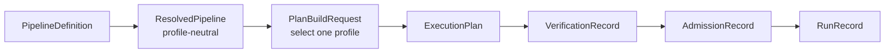

# KSpaceJet artifact schemas

These Draft 2020-12 schemas are the machine-readable structural boundary for
KSpaceJet's versioned reconstruction artifacts. Their implementation baseline is
[KSpaceJet pipeline review, optimized v1](../docs/architecture/KSpaceJet_pipeline_review_optimized_v1.md).
They validate shape, finite JSON values, fixed version/kind tags, and forbidden
fields; the resolver, compiler, independent verifier, and runtime remain the
authorities for semantic checks.

| Schema | Owner | Purpose |
| --- | --- | --- |
| <code>pipeline-v1.schema.json</code> | pipeline author | Scan-independent graph, Provider selection intent, node configuration, public ISMRMRD bindings, and explicit calibration bindings. Nodes never duplicate Provider port declarations. |
| <code>operator-contract-v1.schema.json</code> | Provider | Immutable execution contract: exact <code>TypeDescriptor</code> ports, finite execution/rate/resource bounds, completion, calibration, join/reorder, and terminal semantics. The contract digest is detached. |
| <code>resolved-pipeline-v1.schema.json</code> | resolver | Exact Provider bundle and detached OperatorContract digest snapshot. It is deliberately profile-neutral. |
| <code>plan-build-request-v1.schema.json</code> | compiler caller | Chooses one profile and binds a profile-neutral resolved pipeline to a scan, envelope, machine policy, and contract snapshot. It is an input, not a replacement for an ExecutionPlan. |
| <code>target-envelope-v1.schema.json</code> | scanner/deployment integration | Finite input, arrival, and public-sink service envelope. |
| <code>machine-policy-v1.schema.json</code> | deployment | Permitted execution profiles and multi-domain resource capacity. It never specifies scan task counts or queue sizing. |
| <code>execution-plan-v1.schema.json</code> | scan compiler | Frozen scan-specific dense KeySlot tables, dense Cartesian ReorderPlans, edge capacities, ResourceVector demand, and finite terminal occurrence count. |
| <code>verification-record-v1.schema.json</code> | independent verifier | Immutable conclusion about one ExecutionPlan; it carries verified resource/terminal bounds and obligations, not a second graph or admission decision. |
| <code>admission-record-v1.schema.json</code> | admission controller | Dynamic admitted/rejected decision and, only for admission, the leased ResourceVector. |
| <code>run-record-v1.schema.json</code> | runtime/supervisor | Immutable final outcome, bounded cause history, egress visibility, and explicit fail-stop or source-replay lineage. It does not claim durable checkpointing or cross-run exactly-once delivery. |

## Artifact chain and profiles



The only v1 profile strings are:

- <code>offline</code>
- <code>bounded-online</code>
- <code>isolated-strict-online</code>
- <code>deadline-qualified-online</code>
- <code>research-unbounded</code>

`isolated-strict-online` and `deadline-qualified-online` are claims that require
a qualified worker/fault boundary. The current in-process Provider runtime must
reject them rather than silently weakening their semantics.

## Structural versus semantic validation

Schema validation does not establish a safe executable pipeline. The semantic
implementation must additionally validate:

- unique IDs, graph reachability/DAG closure, frozen-contract port direction,
  exact TypeDescriptor equality, cardinality, and required inputs;
- trusted Provider bundle resolution and detached contract-digest attestation;
- profile eligibility, checked bound arithmetic, completion semantics, calibration
  gates, joins/reorders, and finite terminal drain;
- component-wise ResourceVector capacity, host-total hierarchy, admission lease,
  and runtime backpressure/cancellation behavior.

`PipelineDefinition` intentionally rejects task counts, KeyShard/KeySlot counts, queue
depths/bytes, worker/thread counts, NUMA placement, GPU stream counts, batch
sizing, and reservation fields. Such physical values are compiler-owned and
appear only after a `PlanBuildRequest` yields an `ExecutionPlan`.

All quantities use canonical JSON integers capped at 9007199254740991
(2^53 - 1). Canonical artifact identity is SHA-256 with the repository's
domain-separated canonicalization rules. Provider and contract digests are
detached integrity inputs; consumers must not treat a textual type id alone as
an ABI compatibility rule.

M3 `ReorderPlan` artifacts are intentionally narrower than generic output
reordering: their fixed ordinal binding is a completed `FrameSlotContext`
semantic key arriving through one exact immutable `ksj.kspace-frame`
`TypeDescriptor`, followed by exactly one selected output envelope. The plan
does not accept a Provider ordinal source or an acquisition-firing mapping.
Its `max_gap_ordinals` field is only the derived closed-domain value
`ordinal_domain_bound - 1`; it is not a dispatch window or skip policy. The
compiler and independent verifier attest this with
`PO-07.m3_completed_frame_slot_binding`. Its required occurrence policy,
`strict-dense-all-tuples-eoi-fail`, is accompanied by
`RA-01.m3_strict_dense_all_tuples_eoi`: XML limits define a finite expected
mapping, not proof that every raw tuple arrives. Runtime must fail the scan at
EndOfInput for a missing, duplicate, or out-of-domain ordinal. This is a
runtime/trace obligation, not a claim that the schema proves FrameAssembler
provenance or source coverage.

## Fixtures

Schema fixtures live in [tests/unit/libs/recon/fixtures](../tests/unit/libs/recon/fixtures):

- <code>valid/</code> contains one minimal example for every schema, including
  both AdmissionRecord outcomes and pre-admission, completed, and source-replay
  RunRecord outcomes.
- <code>invalid/</code> contains representative structural rejections: a
  copied node-port declaration or authored runtime field, profile leakage into
  ResolvedPipeline, fixed task configuration in MachinePolicy, integer
  overflow, a cancelled admission outcome, and an unsafe TargetEnvelope
  integer.

To syntax-check every artifact locally:

```bash
for file in schemas/*.json tests/unit/libs/recon/fixtures/{valid,invalid}/*.json; do
  jq empty "$file"
done
```

A Draft 2020-12 validator should assert that every <code>valid/</code> fixture
validates against its matching root schema and every <code>invalid/</code>
fixture is rejected.
