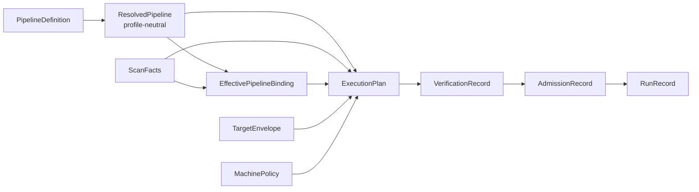

# KSpaceJet artifact schemas

These Draft 2020-12 schemas are the machine-readable structural boundary for
KSpaceJet's reconstruction artifacts. Their implementation baseline is
[the canonical execution ledger](../docs/architecture/KSpaceJet_project_plan_and_acceptance.md).
They validate shape, finite JSON values, fixed kind tags, and forbidden
fields; the parser, resolver, compiler, independent verifier, and runtime
remain the authorities for semantic checks. Historical architecture papers are
reference material only and cannot create a second artifact authority.

| Schema | Owner | Purpose |
| --- | --- | --- |
| <code>provider-operator-catalog.schema.json</code> | in-tree Provider planning | Canonical in-tree Provider/Operator taxonomy. It reserves product identities and links planned Operators to planning-only interfaces; it is not a bundle manifest, resolver input, or runtime artifact. |
| <code>operator-interface.schema.json</code> | Provider planner | Planning-only reservation of one unimplemented Operator's Provider ownership, semantic ports, and configuration-key boundary. It deliberately omits executable contract fields and cannot be loaded or resolved. |
| <code>pipeline.schema.json</code> | pipeline author | Scan-independent graph, one standard ISMRMRD HDF5 input profile, typed static parameters, Provider selection intent, node configuration, declared scan-fact bindings, and explicit calibration bindings. Nodes never duplicate Provider port declarations. |
| <code>operator-contract.schema.json</code> | Provider | Immutable typed interface declaration: only the Operator identity and authored registry <code>type_ref</code> ports. |
| <code>resolved-pipeline.schema.json</code> | resolver | Exact Provider bundle, OperatorContract identity, and parameter-expanded node-configuration snapshot. It is deliberately profile-neutral. |
| <code>scan-facts.schema.json</code> | runtime ISMRMRD preflight | Immutable observed scan facts and identities derived from one validated ISMRMRD XML header and acquisition scan; it is never authored or supplied by a CLI caller. |
| <code>effective-pipeline-binding.schema.json</code> | runtime/compiler | One resolved pipeline and one ScanFacts identity bound to the complete canonical effective config of every node. It excludes input/output paths, loader/contract material and physical runtime policy. |
| <code>target-envelope.schema.json</code> | caller/deployment planner | Finite caller-submitted input, local arrival, and local result-delivery envelope; it is not a scanner, session, relay, or network transport contract. |
| <code>machine-policy.schema.json</code> | deployment | Permitted execution profiles and multi-domain resource capacity. It never specifies scan task counts or queue sizing. |
| <code>execution-plan.schema.json</code> | scan compiler | Frozen scan-specific generic synchronous graph: explicit ingress/node/egress edges, static calibration artifacts, resolved TypeDescriptors, bounded firing capacity, ResourceVector demand, and finite terminal occurrence count. |
| <code>verification-record.schema.json</code> | independent verifier | Immutable conclusion about one ExecutionPlan; it carries verified resource/terminal bounds and obligations, not a second graph or admission decision. |
| <code>admission-record.schema.json</code> | admission controller | Dynamic admitted/rejected decision and, only for admission, the leased ResourceVector. |
| <code>run-record.schema.json</code> | runtime/supervisor | Immutable final outcome, bounded cause history, egress visibility, and explicit fail-stop or source-replay lineage. It does not claim durable checkpointing or cross-run exactly-once delivery. |

## Artifact chain and profiles



The Provider catalog and planned OperatorInterface files are deliberately not
part of this artifact chain. `providers/catalog.json` is a source-tree
planning index, while `providers/interfaces/` reserves unimplemented algorithm
boundaries. Neither is a Provider bundle/loader descriptor nor a valid input
to the resolver, compiler, verifier, or runtime. Only a completed Provider
may publish an exact `OperatorContract` and become Pipeline-resolvable.

The diagram is the only current artifact-authority sequence. `PlanBuildRequest`
is an in-memory compiler assembly struct, not a portable artifact: the runtime
constructs it from the owned values shown above and no caller submits a parallel
digest tuple. Schemas establish structural validity only; the owning
parser/resolver/compiler/verifier/runtime establishes semantic validity at its
corresponding step. No architecture note, Provider catalog entry, or scaffold
can substitute for an artifact in this chain.

## P2 planning-artifact ownership

The compiler must receive values from their owning boundary, rather than a
collection of caller-claimed digest strings. The table below is the current
field-owner matrix; it is the implementation contract for P2-001 and the
foundation for the user-editable reconstruction entry planned in P2-007.

| Value | Sole owner / creation boundary | May contain | Must not contain | Plan identity field |
| --- | --- | --- | --- | --- |
| `PipelineDefinition` | pipeline author | one `ismrmrd-hdf5` input profile, logical graph, Provider/Operator intent, typed parameter defaults, static algorithm configuration, and declared scan-fact selector keys | input/output paths, Provider library/contract paths, raw scan values, or physical runtime policy | indirectly through `ResolvedPipeline` |
| `ResolvedPipeline` | controlled Provider resolver | exact authored-pipeline artifact identity, resolved Provider bundle/OperatorContract identities, and parameter-expanded static configuration | requested profile, scan facts, effective config, resource policy, or a second semantic digest | `resolved_pipeline` |
| `ScanFacts` | runtime-owned ISMRMRD preflight | descriptor/XML identities and observed acquisition/channel/sample/trajectory facts | author configuration, route selection, Provider identity, paths, or resource policy | `scan_facts` |
| `EffectivePipelineBinding` | runtime/compiler after controlled resolution and ISMRMRD preflight | the bound `ResolvedPipeline` + `ScanFacts` identities and one canonical effective config per node | caller-supplied unrelated identities, Provider handles/paths, loader/contract material, static-algorithm overrides, or physical resource policy | `effective_pipeline_binding` |
| `TargetEnvelope` | deployment/host planning input | approved finite input/output bounds | graph/Provider selection or observed scan identity | `target_envelope` |
| `MachinePolicy` | deployment/host planning input | allowed profile and physical resource policy | authored algorithm choice or observed scan facts | `machine_policy` |
| `ExecutionPlan` | compiler | the exact identity tuple above plus derived bindings/resources/terminal obligations | editable author fields or dynamic admission outcome | detached `ExecutionPlan.digest()` |
| `RunRecord` | runtime after a run terminates | later provenance links and final outcome | a replacement Pipeline, plan, or input artifact | deferred to P1-006 after this ownership chain is accepted |

`PipelineDefinition` exposes one complete `artifact_digest`; there is no
alternate `semantic_digest` or digest alias. `ResolvedPipeline` records that
one authored identity exactly once. `ScanFacts` and
`EffectivePipelineBinding` each derive a detached, domain-separated identity
from their own canonical bytes. The compiler derives TargetEnvelope and
MachinePolicy identities from the immutable model values it actually receives;
callers do not supply parallel digest claims.

An effective node config is deliberately not a second authored config. It
preserves every parameter-expanded static value from its resolved node, then
adds only a top-level key explicitly declared in that node's
`scan_fact_bindings`. The current closed selector set is acquisition count,
physical channel count, maximum samples per acquisition, trajectory dimensions,
and the encoded/reconstructed x/y/z matrix component for an explicit ISMRMRD
encoding index. It exists only in `EffectivePipelineBinding` after ISMRMRD
preflight. Provider startup receives that binding config, while the
user-authored Pipeline remains scan-independent; callers cannot inject a raw
host-derived configuration map into the generic pipeline path.

The execution-profile strings selectable by PipelineDefinition and MachinePolicy are:

- <code>offline-reference</code>
- <code>bounded-reconstruction-graph</code>
- <code>provider-development</code>
- <code>embedded-incremental</code>
- <code>isolated-provider-runtime</code>

`isolated-provider-runtime` is a claim that requires a qualified worker/fault
boundary. The current in-process Provider runtime must reject it rather than
silently weakening its semantics.

OperatorContract does not carry a profile-selection, scheduling, resource, or
topology field. PipelineDefinition, NodePlanningRequirements, MachinePolicy,
admission, and the runtime handle those plan/run-specific choices. The
Provider ABI remains the executable capability upper bound.

## Structural versus semantic validation

Schema validation does not establish a safe executable pipeline. The semantic
implementation must additionally validate:

- unique IDs, graph reachability/DAG closure, frozen-contract port direction,
  registry TypeRef resolution, exact TypeDescriptor equality, and every
  declared input binding;
- host-controlled Provider bundle and parsed OperatorContract resolution, with
  no catalog, directory discovery, DLL/SO path, or contract path in the
  PipelineDefinition;
- profile eligibility, checked bound arithmetic, calibration
  gates, joins/reorders, and finite terminal drain;
- component-wise ResourceVector capacity, host-total hierarchy, admission lease,
  and runtime backpressure/cancellation behavior.

`PipelineDefinition` intentionally rejects task counts, queue depths/bytes,
worker/thread counts, NUMA placement, GPU stream counts, batch sizing,
reservation fields, external file/library/contract paths, and ISMRMRD-derived
shape/count fields. Such physical values are compiler-owned and appear only in
the compiler-derived `ExecutionPlan`; observed scan facts first enter through
the runtime-owned `ScanFacts` value. `PlanBuildRequest` is only the typed,
in-memory assembly used to invoke that compiler, not an artifact boundary.

All quantities use canonical JSON integers capped at 9007199254740991
(2^53 - 1). Canonical artifact identity is SHA-256 with the repository's
domain-separated canonicalization rules. Provider bundle digests are detached
integrity inputs. Provider-authored contracts carry only a readable
registry TypeRef; compiled plans carry the resolved structural descriptor and
its automatic identity digest. Consumers must not treat a textual TypeRef
alone as an ABI compatibility rule.

The current execution-plan schema represents only the generic synchronous
graph: nodes, bounded pools, FIFO data edges, explicit calibration-artifact
bindings, resource demand, and terminal obligations. Ordering and frame
completion remain explicit node or ingress semantics; no hidden ordinal table
or special reorder section is part of the artifact format.

## Fixtures

Artifact-chain schema fixtures live in [tests/unit/libs/recon/fixtures](../tests/unit/libs/recon/fixtures):

- <code>valid/</code> contains minimal examples for every artifact-chain root
  schema, including both AdmissionRecord outcomes and pre-admission, completed,
  and source-replay RunRecord outcomes.
- <code>invalid/</code> contains representative negative cases. Structural
  cases cover a copied node-port declaration, authored runtime field, external
  input path, scan-derived Pipeline dimension, profile leakage into
  ResolvedPipeline, fixed task configuration in MachinePolicy, integer
  overflow, a cancelled admission outcome, and an unsafe TargetEnvelope
  integer. Schema-valid semantic cases are accepted by their JSON Schema and
  must then be rejected by the resolver, compiler, or verifier that owns the
  relevant semantic rule.

The Provider catalog and OperatorInterface schemas deliberately do not use
generic artifact fixtures: the checked-in catalog and each interface it
references are the source-tree planning data. Their JSON shape, cross
references, Provider/Operator identity, and planned-not-built rule are checked
by [provider_catalog_validation.py](../tests/unit/providers/provider_catalog_validation.py).
They remain outside the executable artifact chain and are never accepted as
resolver, compiler, verifier, or runtime input.

To syntax-check every artifact locally:

```bash
for file in schemas/*.json providers/catalog.json providers/interfaces/*/*.json tests/unit/libs/recon/fixtures/{valid,invalid}/*.json; do
  jq empty "$file"
done
```

A Draft 2020-12 validator should assert that every artifact-chain
<code>valid/</code> fixture validates against its matching root schema and
every <code>invalid/</code> fixture is rejected. Run the Provider catalog
cross-reference check separately:

```bash
tools/devenv/linux/run.sh python tests/unit/providers/provider_catalog_validation.py --project-root .
```
