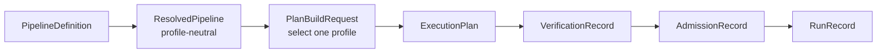

# KSpaceJet artifact schemas

These Draft 2020-12 schemas are the machine-readable structural boundary for
KSpaceJet's reconstruction artifacts. Their implementation baseline is
[KSpaceJet pipeline review, optimized](../docs/architecture/KSpaceJet_pipeline_review_optimized.md).
They validate shape, finite JSON values, fixed kind tags, and forbidden
fields; the resolver, compiler, independent verifier, and runtime remain the
authorities for semantic checks.

| Schema | Owner | Purpose |
| --- | --- | --- |
| <code>provider-operator-catalog.schema.json</code> | in-tree Provider planning | Canonical in-tree Provider/Operator taxonomy. It reserves product identities and links planned Operators to planning-only interfaces; it is not a bundle manifest, resolver input, or runtime artifact. |
| <code>operator-interface.schema.json</code> | Provider planner | Planning-only reservation of one unimplemented Operator's Provider ownership, semantic ports, and configuration-key boundary. It deliberately omits executable contract fields and cannot be loaded or resolved. |
| <code>pipeline.schema.json</code> | pipeline author | Scan-independent graph, Provider selection intent, node configuration, public ISMRMRD bindings, and explicit calibration bindings. Nodes never duplicate Provider port declarations. |
| <code>operator-contract.schema.json</code> | Provider | Immutable typed interface declaration: only the Operator identity and authored registry <code>type_ref</code> ports. |
| <code>resolved-pipeline.schema.json</code> | resolver | Exact Provider bundle and Operator snapshot. It is deliberately profile-neutral. |
| <code>plan-build-request.schema.json</code> | compiler caller | Chooses one profile and binds a profile-neutral resolved pipeline to a scan, envelope, machine policy, and one NodePlanningRequirements payload per node. It is an input, not a replacement for an ExecutionPlan. |
| <code>target-envelope.schema.json</code> | scanner/deployment integration | Finite input, arrival, and public-sink service envelope. |
| <code>machine-policy.schema.json</code> | deployment | Permitted execution profiles and multi-domain resource capacity. It never specifies scan task counts or queue sizing. |
| <code>execution-plan.schema.json</code> | scan compiler | Frozen scan-specific generic synchronous graph: explicit ingress/node/egress edges, static calibration artifacts, resolved TypeDescriptors, bounded firing capacity, ResourceVector demand, and finite terminal occurrence count. |
| <code>verification-record.schema.json</code> | independent verifier | Immutable conclusion about one ExecutionPlan; it carries verified resource/terminal bounds and obligations, not a second graph or admission decision. |
| <code>admission-record.schema.json</code> | admission controller | Dynamic admitted/rejected decision and, only for admission, the leased ResourceVector. |
| <code>run-record.schema.json</code> | runtime/supervisor | Immutable final outcome, bounded cause history, egress visibility, and explicit fail-stop or source-replay lineage. It does not claim durable checkpointing or cross-run exactly-once delivery. |

## Artifact chain and profiles



The Provider catalog and planned OperatorInterface files are deliberately not
part of this artifact chain. `providers/catalog.json` is a source-tree
planning index, while `providers/interfaces/` reserves unimplemented algorithm
boundaries. Neither is a Provider bundle/loader descriptor nor a valid input
to the resolver, compiler, verifier, or runtime. Only a completed Provider
may publish an exact `OperatorContract` and become Pipeline-resolvable.

The execution-profile strings selectable by PipelineDefinition and MachinePolicy are:

- <code>offline</code>
- <code>bounded-online</code>
- <code>isolated-strict-online</code>
- <code>deadline-qualified-online</code>
- <code>research-unbounded</code>

`isolated-strict-online` and `deadline-qualified-online` are claims that require
a qualified worker/fault boundary. The current in-process Provider runtime must
reject them rather than silently weakening their semantics.

OperatorContract does not carry a profile-selection, scheduling, resource, or
topology field. PipelineDefinition, NodePlanningRequirements, MachinePolicy,
admission, and the runtime handle those plan/run-specific choices. The
Provider ABI remains the executable capability upper bound.

## Structural versus semantic validation

Schema validation does not establish a safe executable pipeline. The semantic
implementation must additionally validate:

- unique IDs, graph reachability/DAG closure, frozen-contract port direction,
  registry TypeRef resolution, exact TypeDescriptor equality, and every
  declared input binding;
- trusted Provider bundle resolution and resolved Operator selection;
- profile eligibility, checked bound arithmetic, calibration
  gates, joins/reorders, and finite terminal drain;
- component-wise ResourceVector capacity, host-total hierarchy, admission lease,
  and runtime backpressure/cancellation behavior.

`PipelineDefinition` intentionally rejects task counts, queue depths/bytes,
worker/thread counts, NUMA placement, GPU stream counts, batch sizing, and
reservation fields. Such physical values are compiler-owned and appear only
after a `PlanBuildRequest` yields an `ExecutionPlan`.

All quantities use canonical JSON integers capped at 9007199254740991
(2^53 - 1). Canonical artifact identity is SHA-256 with the repository's
domain-separated canonicalization rules. Provider bundle digests are detached
integrity inputs. Provider-authored contracts carry only a readable
registry TypeRef; compiled plans carry the resolved structural descriptor and
its automatic identity digest. Consumers must not treat a textual TypeRef
alone as an ABI compatibility rule.

The current execution-plan schema represents only the generic synchronous
graph: nodes, bounded pools, FIFO data edges, explicit calibration-artifact
bindings, resource demand, and terminal obligations. Ordering and frame
completion remain explicit node or ingress semantics; no hidden ordinal table
or special reorder section is part of the artifact format.

## Fixtures

Artifact-chain schema fixtures live in [tests/unit/libs/recon/fixtures](../tests/unit/libs/recon/fixtures):

- <code>valid/</code> contains minimal examples for every artifact-chain root
  schema, including both AdmissionRecord outcomes and pre-admission, completed,
  and source-replay RunRecord outcomes.
- <code>invalid/</code> contains representative structural rejections: a
  copied node-port declaration or authored runtime field, profile leakage into
  ResolvedPipeline, fixed task configuration in MachinePolicy, integer
  overflow, a cancelled admission outcome, and an unsafe TargetEnvelope
  integer.

The Provider catalog and OperatorInterface schemas deliberately do not use
generic artifact fixtures: the checked-in catalog and each interface it
references are the source-tree planning data. Their JSON shape, cross
references, Provider/Operator identity, and planned-not-built rule are checked
by [provider_catalog_validation.py](../tests/unit/providers/provider_catalog_validation.py).
They remain outside the executable artifact chain and are never accepted as
resolver, compiler, verifier, or runtime input.

To syntax-check every artifact locally:

```bash
for file in schemas/*.json providers/catalog.json providers/interfaces/*/*.json tests/unit/libs/recon/fixtures/{valid,invalid}/*.json; do
  jq empty "$file"
done
```

A Draft 2020-12 validator should assert that every artifact-chain
<code>valid/</code> fixture validates against its matching root schema and
every <code>invalid/</code> fixture is rejected. Run the Provider catalog
cross-reference check separately:

```bash
tools/devenv/linux/run.sh python tests/unit/providers/provider_catalog_validation.py --project-root .
```
