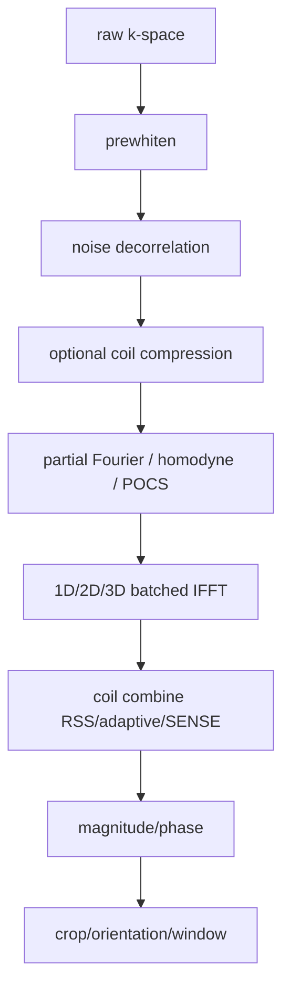

# C++ 高性能数值计算代码实现与优化手册

本文档用于沉淀 KSpaceJet 中 C++ 数值计算热点代码的实现经验。它面向 MRI 重建、复数数组处理、迭代求解、FFT 前后处理以及 dense array/matrix kernel 等场景，重点讨论“具体代码怎么写更高效”，不讨论 KSpaceJet numerics 模块的架构分层和 public API 设计。

| 项目 | 内容 |
| --- | --- |
| 文档状态 | Research handbook |
| 适用范围 | C++ CPU 数值计算热点实现、局部 kernel 设计、数据访问方式选择 |
| 非目标 | 不作为生产 backend policy，不作为最终性能阈值，不替代 `tests/benchmarks` 的正式 benchmark 报告 |
| 证据来源 | `tests/research/cpp-numerics-performance-handbook/cases/` 中的独立 case |
| 构建入口 | `cmake --build --preset linux-release-research --target ksj_cpp_numerics_performance_handbook` |
| 结果记录 | 本文第 9 节记录当前已执行 case 的结果快照 |

---

## 目录

0. [使用规则](#0-使用规则)
1. [核心原则](#1-核心原则)
2. [性能优化分档总览](#2-性能优化分档总览)
3. [S 档：高收益主线，优先建立证据](#3-s-档高收益主线优先建立证据)
4. [A 档：核心数学层必须掌握](#4-a-档核心数学层必须掌握)
5. [B 档：热点 kernel 值得做](#5-b-档热点-kernel-值得做)
6. [C 档：极致优化阶段再做](#6-c-档极致优化阶段再做)
7. [D 档：常见反模式，尽量避免](#7-d-档常见反模式尽量避免)
8. [MRI 重建专项优化](#8-mri-重建专项优化)
9. [可运行 case 与证据](#9-可运行-case-与证据)
10. [具体实现检查清单](#10-具体实现检查清单)

---

## 0. 使用规则

### 0.1 规范用语

本文使用下面的规范用语：

| 用语 | 含义 |
| --- | --- |
| 必须 | 实现若违反该要求，通常会引入明显性能风险、正确性风险或维护风险。 |
| 应 | 推荐默认采用；只有在 benchmark 或约束条件明确反向时才偏离。 |
| 可以 | 可选实现策略，需要结合代码复杂度、调用频率和性能证据判断。 |
| 不应 | 默认禁止的写法；只有在有明确证据和局部封装时才允许。 |

### 0.2 证据等级

本文结论按证据强度分为三类：

| 等级 | 说明 | 使用方式 |
| --- | --- | --- |
| 已验证 | 已有独立 case 执行结果支撑，结果写入第 9 节。 | 可以作为实现评审依据，但不能直接作为生产阈值。 |
| 部分验证 | case 支持主要趋势，但存在尺寸、类型、layout 或编译器边界。 | 应在真实调用点继续 benchmark。 |
| 待验证 | 当前仅为工程经验或理论分析，尚无独立 case。 | 不应写入生产 policy，新增实现前应补 case。 |

### 0.3 结果解释原则

研究 case 的结果只能解释该 case 覆盖的输入规模、数据类型、layout、编译器和 CPU。结论迁移到生产代码前，应满足以下条件：

```text
1. 有 reference 实现和误差验证。
2. 有覆盖目标输入规模的 benchmark。
3. 对尺寸、数据类型、layout、线程策略和后端库版本有明确记录。
4. 若结论依赖阈值，阈值必须来自正式 benchmark 报告，而不是本文手工摘录。
```

---

## 1. 核心原则

C++ 高性能数值计算代码的关键不是固定使用某一个第三方库，而是在清楚数据访问模式和调用规模的前提下，减少不必要的分配、复制、临时对象和内存遍历，并把大规模通用计算交给成熟后端。

```text
少分配
少搬运
少临时
少 transpose
少 fftshift
少全量扫内存
大线代交给成熟库
大 FFT 交给成熟库
MRI 特有逐点复数操作自己 fuse
每个具体写法用实测数据验证，不靠经验判断
```

在 MRI 重建中，真正影响速度的通常不是单个 `for` 循环的表面形式，而是计算路径是否避免了系统性的内存流量和调度开销：

```text
1. FFT / NUFFT 的 plan 和 batch 策略
2. complex elementwise kernel 是否融合
3. coil 维度的数据布局是否合适
4. 是否反复分配、复制、transpose、fftshift
5. 大 GEMM/SVD/Cholesky 是否交给 MKL/cuBLAS/cuSOLVER
6. 小固定矩阵是否走 Eigen fixed-size 或 custom kernel
7. 线程调度是否 oversubscription
8. CPU/GPU 之间是否反复搬数据
```

---

## 2. 性能优化分档总览

分档按照当前 case 证据和工程风险共同决定。`已验证` 只表示第 9 节已有独立 case 结果支撑；`部分验证` 表示趋势成立但存在尺寸、类型、layout 或实现路径边界；`待验证` 表示当前仍是工程经验或理论判断，不能直接写进生产 policy。

| 档位 | 优化类型 | 证据状态 | 典型收益 | 适用性 | 处理方式 |
|---|---:|---:|---:|---:|---:|
| S | 热路径零分配 / workspace 复用 | 已验证 | 很高 | 几乎所有核心模块 | 必做 |
| S | 减少内存 pass / fused kernel | 已验证 | 很高 | MRI 逐点复数计算、迭代更新 | 优先评估 |
| S | 数据布局匹配访问模式 / 连续访问 | 已验证 | 很高 | image、matrix、coil combine、SENSE | 必做 |
| S | FFT plan cache / batched FFT | 待验证 | 很高 | FFT 密集任务 | 补 case 后固化 |
| S | matrix-free operator | 待验证 | 很高 | SENSE、CS、NUFFT、CG | 补 case 后固化 |
| A | 大 GEMM/SVD/FFT 调成熟后端 | 已验证 GEMM | 中到高 | 大线代、大 FFT | 按后端 benchmark 选择 |
| A | small fixed-size Eigen/custom kernel | 已验证 | 高 | 小矩阵、小 coil 维度算子 | 优先评估 |
| A | branchless kernel | 已验证 | 高 | threshold、mask、prox | 优先评估 |
| A | mask 稠密/稀疏双路径 | 已验证 | 中到高 | 采样 mask、稀疏采样 | 按输出语义选择 |
| A | cache-blocked transpose/crop/pad | 已验证 transpose | 中到高 | 大数组搬运 | 优先评估 tiled |
| A | Eigen `.noalias()` / `.eval()` | 部分验证 | 小到中高 | Eigen 表达式 | 按场景验证 |
| A | alignment 契约 / no-alias 信息 / SIMD hint | 部分验证 | 低到中高 | 自研 kernel | 需实测 |
| A | 避免嵌套并行 | 待验证 | 高 | CPU 多线程 | 补 case 或生产 benchmark |
| B | ROI 直接访问 vs materialization | 已验证 | 中 | ROI、crop、view 计算 | 默认避免不必要 copy |
| B | shifted-index vs fftshift materialization | 已验证 | 小到中 | FFT 前后处理 | 只读语义优先 index mapping |
| B | false sharing 处理 | 待验证 | 中 | 多线程 reduction | 补 case |
| B | precision 分层 | 待验证 | 中 | float/double 混合 | 补 case 并做误差分析 |
| C | 手写 AVX/AVX512/NEON | 待验证 | 不稳定但可高 | 已确认热点 | 后期做 |
| C | prefetch / streaming store | 待验证 | 不稳定 | 特殊访存 | 后期做 |
| C | LTO/PGO | 待验证 | 不稳定 | 稳定 workload | 成熟后做 |
| C | fast-math / FTZ / DAZ | 待验证且有风险 | 不稳定 | 数值允许时 | 验证后做 |
| D | 库之间频繁转换 | 待验证但风险明确 | 负收益 | OpenCV/Eigen/ITK 混用 | 避免 |
| D | 所有逐点操作都交给 BLAS/VML/IPP | 待验证但风险明确 | 通常负收益 | 多个 pointwise 串联 | 避免 |

分档表达的是实现评审时的优先级和风险位置，不是脱离 case 的绝对结论。已经有 case 支撑的项在第 9 节给出结果；尚未覆盖的项只能作为待验证方向，不能直接写进生产 policy。后续章节按主题组织，历史章节编号不等于最新证据档位；新增或调整优化项时，以本表和第 9 节结果为准。

---

## 3. S 档：高收益主线，优先建立证据

---

### S1. 热路径零分配：所有临时内存显式走 workspace

#### 问题

MRI 重建算法通常包含迭代循环，例如：

```text
CG
FISTA
ADMM
POCS
ESPIRiT calibration
NUFFT iterative reconstruction
Compressed Sensing reconstruction
```

如果这些循环里不断创建 `std::vector`、`Eigen::VectorXcf`、临时 `cv::Mat` 或 `itk::Image`，性能会非常差。

#### 反例：每次调用都分配临时

```cpp
void apply_normal_op_bad(const Eigen::VectorXcf& x,
                         Eigen::VectorXcf& y,
                         int n) {
    Eigen::VectorXcf tmp1(n);
    Eigen::VectorXcf tmp2(n);

    tmp1 = x.array() * 2.0f;
    tmp2 = tmp1.array().sin();
    y    = tmp2.array() + x.array();
}
```

问题：

```text
1. 每次调用都 heap allocation
2. tmp1/tmp2 产生额外内存写入和读取
3. 迭代次数多时分配器开销被放大
4. cache 被临时数组污染
```

#### 推荐写法：workspace 外部传入

```cpp
#include <vector>
#include <complex>

struct Workspace {
    std::vector<std::complex<float>> buf0;
    std::vector<std::complex<float>> buf1;

    void ensure(size_t n) {
        if (buf0.size() < n) buf0.resize(n);
        if (buf1.size() < n) buf1.resize(n);
    }
};

void apply_normal_op_good(const std::complex<float>* x,
                          std::complex<float>* y,
                          int n,
                          Workspace& ws) {
    ws.ensure(n);

    auto* tmp1 = ws.buf0.data();
    auto* tmp2 = ws.buf1.data();

    for (int i = 0; i < n; ++i) {
        tmp1[i] = x[i] * 2.0f;
    }

    for (int i = 0; i < n; ++i) {
        tmp2[i] = std::sin(tmp1[i]);
    }

    for (int i = 0; i < n; ++i) {
        y[i] = tmp2[i] + x[i];
    }
}
```

#### 更推荐：能融合就不要临时

```cpp
void apply_normal_op_best(const std::complex<float>* x,
                          std::complex<float>* y,
                          int n) {
    for (int i = 0; i < n; ++i) {
        y[i] = std::sin(x[i] * 2.0f) + x[i];
    }
}
```

#### 设计原则

```text
初始化阶段：允许分配
FFT plan 创建阶段：允许分配
LAPACK workspace query 阶段：允许分配
重建迭代热循环：禁止分配
逐点 kernel：禁止分配
```

其中 LAPACK workspace query 可以分配，但应在热循环外完成，并将 workspace 传入后续计算。若某个临时对象无法消除，至少应做到容量复用、生命周期清晰、调用点可见。

#### 推荐接口风格

```cpp
struct ReconWorkspace {
    std::vector<std::complex<float>> kspace_tmp;
    std::vector<std::complex<float>> image_tmp;
    std::vector<std::complex<float>> coil_tmp;
    std::vector<std::complex<float>> cg_r;
    std::vector<std::complex<float>> cg_p;
    std::vector<std::complex<float>> cg_Ap;
    std::vector<float> reduction_tmp;

    void reserve_for_case(int voxels, int coils) {
        const size_t vc = static_cast<size_t>(voxels) * coils;
        kspace_tmp.resize(vc);
        image_tmp.resize(vc);
        coil_tmp.resize(vc);
        cg_r.resize(voxels);
        cg_p.resize(voxels);
        cg_Ap.resize(voxels);
        reduction_tmp.resize(1024);
    }
};
```

---

### S2. 减少内存 pass：多个逐点操作优先评估 fuse

#### 问题

MRI 重建里大量操作是 memory bandwidth bound：

```text
complex multiply
scale
mask
density compensation
coil sensitivity multiply
phase ramp
crop/pad
RSS
soft threshold
CG axpy
```

这些操作如果一个函数扫一遍内存，会被内存带宽限制。

#### 反例：四次全量扫内存

```cpp
#include <vector>
#include <complex>
#include <cstdint>

void apply_bad(const std::complex<float>* x,
               const std::complex<float>* s,
               const float* dcf,
               const uint8_t* mask,
               std::complex<float>* y,
               int n) {
    std::vector<std::complex<float>> tmp1(n);
    std::vector<std::complex<float>> tmp2(n);
    std::vector<std::complex<float>> tmp3(n);

    for (int i = 0; i < n; ++i) {
        tmp1[i] = x[i] * s[i];
    }

    for (int i = 0; i < n; ++i) {
        tmp2[i] = tmp1[i] * dcf[i];
    }

    for (int i = 0; i < n; ++i) {
        tmp3[i] = mask[i] ? tmp2[i] : std::complex<float>{0, 0};
    }

    for (int i = 0; i < n; ++i) {
        y[i] = tmp3[i];
    }
}
```

#### 推荐写法：一次 pass 完成

```cpp
void apply_good(const std::complex<float>* x,
                const std::complex<float>* s,
                const float* dcf,
                const uint8_t* mask,
                std::complex<float>* y,
                int n) {
    for (int i = 0; i < n; ++i) {
        const auto v = x[i] * s[i] * dcf[i];
        y[i] = mask[i] ? v : std::complex<float>{0.0f, 0.0f};
    }
}
```

#### 更进一步：把 scale 也融合进去

```cpp
void apply_best(const std::complex<float>* x,
                const std::complex<float>* s,
                const float* dcf,
                const uint8_t* mask,
                float scale,
                std::complex<float>* y,
                int n) {
    for (int i = 0; i < n; ++i) {
        const float w = dcf[i] * scale;
        const auto v = x[i] * s[i] * w;
        y[i] = mask[i] ? v : std::complex<float>{0.0f, 0.0f};
    }
}
```

#### 对比

| 写法 | 内存 pass | 临时数组 | 适合场景 |
|---|---:|---:|---|
| 多步骤拆开 | 4 次以上 | 多个 | 仅适合调试/原型 |
| workspace 临时 | 4 次以上 | 复用临时 | 中间过渡 |
| fused kernel | 1 次 | 无 | 生产核心路径 |

---

### S3. 数据布局优先于代码技巧

#### 问题

不同 MRI 计算阶段喜欢不同 layout。

FFT 阶段通常希望 spatial 连续：

```text
x[c][z][y][x]
```

coil combine / RSS / SENSE adjoint 阶段希望同一 voxel 的 coil 连续：

```text
x[v][c]
```

#### layout 1：coil-major

```text
x[c][v] -> x[c * voxels + v]
```

优点：

```text
每个 coil 的 image/k-space 连续
适合 batched FFT
适合 coil-wise filtering
```

缺点：

```text
同一 voxel 的不同 coil stride 很大
RSS / coil combine cache miss 严重
```

#### layout 2：voxel-major

```text
x[v][c] -> x[v * coils + c]
```

优点：

```text
同一 voxel 的 coil 连续
适合 RSS / SENSE adjoint / coil compression apply
```

缺点：

```text
FFT 轴 stride 可能变复杂
不适合直接交给大多数 FFT 库
```

#### 反例：在 coil-major 上做 voxel 内 coil combine

```cpp
void rss_bad_coil_major(const std::complex<float>* x,
                        float* y,
                        int voxels,
                        int coils) {
    for (int v = 0; v < voxels; ++v) {
        float acc = 0.0f;

        for (int c = 0; c < coils; ++c) {
            // stride = voxels，非常不连续
            const auto z = x[static_cast<size_t>(c) * voxels + v];
            acc += z.real() * z.real() + z.imag() * z.imag();
        }

        y[v] = std::sqrt(acc);
    }
}
```

#### 推荐：voxel-major 上做 coil combine

```cpp
void rss_good_voxel_major(const std::complex<float>* x,
                          float* y,
                          int voxels,
                          int coils) {
    for (int v = 0; v < voxels; ++v) {
        const auto* xv = x + static_cast<size_t>(v) * coils;

        float acc = 0.0f;
        for (int c = 0; c < coils; ++c) {
            const auto z = xv[c];
            acc += z.real() * z.real() + z.imag() * z.imag();
        }

        y[v] = std::sqrt(acc);
    }
}
```

#### 建议定义 layout 枚举

```cpp
enum class Layout {
    CoilMajorSpatialContiguous,
    VoxelMajorCoilContiguous,
    BlockedVoxelCoil
};
```

#### 建议策略

```text
FFT 密集阶段：CoilMajorSpatialContiguous
coil combine / SENSE voxel solve：VoxelMajorCoilContiguous
迭代重建：避免每轮来回 transpose，根据 A/AH 成本选择长期 layout
极致优化：BlockedVoxelCoil / AoSoA
```

---

### S4. 循环顺序必须匹配内存连续方向

#### 反例：row-major 矩阵按列扫

```cpp
void scale_bad(float* a, int height, int width, float alpha) {
    for (int x = 0; x < width; ++x) {
        for (int y = 0; y < height; ++y) {
            a[static_cast<size_t>(y) * width + x] *= alpha;
        }
    }
}
```

问题：

```text
内层访问 stride = width
cache line 利用率差
硬件 prefetch 效果差
SIMD 更难
```

#### 推荐：最后一维放内层

```cpp
void scale_good(float* a, int height, int width, float alpha) {
    for (int y = 0; y < height; ++y) {
        float* row = a + static_cast<size_t>(y) * width;

        for (int x = 0; x < width; ++x) {
            row[x] *= alpha;
        }
    }
}
```

#### MRI 例子

如果 layout 是：

```text
img[z][y][x][coil]
```

则高效循环通常是：

```cpp
void scale_voxel_major(std::complex<float>* img,
                       int nz,
                       int ny,
                       int nx,
                       int coils,
                       float alpha) {
    for (int z = 0; z < nz; ++z) {
        for (int y = 0; y < ny; ++y) {
            for (int x = 0; x < nx; ++x) {
                auto* p = img + (((static_cast<size_t>(z) * ny + y) * nx + x) * coils);

                for (int c = 0; c < coils; ++c) {
                    p[c] *= alpha;
                }
            }
        }
    }
}
```

如果 layout 是：

```text
img[coil][z][y][x]
```

则高效循环通常是：

```cpp
void scale_coil_major(std::complex<float>* img,
                      int coils,
                      int nz,
                      int ny,
                      int nx,
                      float alpha) {
    const int voxels = nz * ny * nx;

    for (int c = 0; c < coils; ++c) {
        auto* pc = img + static_cast<size_t>(c) * voxels;

        for (int i = 0; i < voxels; ++i) {
            pc[i] *= alpha;
        }
    }
}
```

#### case 观察

当前 `ksj_numerics_perf_contiguity` case 使用相同逐点 FMA 计算，对比 row-major/column-major 下沿连续方向访问和跨 stride 方向访问。本轮 `256x256`、`512x512`、`1024x1024` 测试点中，连续访问均显著快于跨 stride 访问；`1024x1024` 下，跨 stride FMA 相比连续 FMA 可慢到约 20x 至 42x。

这说明 layout 不是展示层属性，而是计算性能契约。`PooledImage` 这类 row-major 对象应让 `x/column` 方向成为内层连续访问；`PooledMatrix` 这类 column-major 对象应让 `row` 方向成为内层连续访问。跨 layout 使用时应显式转换或重排，不能靠调用者记住“看起来同样是二维数组”。

---

### S5. 不要显式构造大矩阵，尽量用 operator form

#### 问题

SENSE、CS、NUFFT、parallel imaging 里常见数学形式：

```text
A(x)  = M F S x
A^H(y) = S^H F^H M y
```

如果显式构造矩阵 `A`，矩阵规模会巨大。

#### 反例：显式构造 A

```cpp
Eigen::MatrixXcf A(samples * coils, voxels);

// 每次迭代：
y.noalias() = A * x;
x2.noalias() = A.adjoint() * y;
```

问题：

```text
1. A 极其巨大
2. 存储和构造成本不可接受
3. 无法利用 FFT 结构
4. 无法融合 mask / coil / scale
5. cache 行为差
```

#### 推荐：实现 forward 和 adjoint operator

```cpp
struct SenseOperator {
    int voxels;
    int coils;

    const std::complex<float>* sens;
    FFTPlanCache* fft_cache;
    Workspace* ws;

    void forward(const std::complex<float>* x,
                 std::complex<float>* y) const {
        // y = mask * FFT(S * x)
        apply_coils_fused(x, sens, ws->buf0.data(), voxels, coils);
        batched_fft_forward(ws->buf0.data(), y, coils, *fft_cache);
        apply_sampling_mask_inplace(y, voxels, coils);
    }

    void adjoint(const std::complex<float>* y,
                 std::complex<float>* x) const {
        // x = sum_c conj(S_c) * IFFT(mask * y_c)
        apply_sampling_mask(y, ws->buf0.data(), voxels, coils);
        batched_fft_inverse(ws->buf0.data(), ws->buf1.data(), coils, *fft_cache);
        combine_conj_sens_fused(ws->buf1.data(), sens, x, voxels, coils);
    }
};
```

#### CG 中使用 operator

```cpp
template<class Op>
void conjugate_gradient(const Op& A,
                        const std::complex<float>* b,
                        std::complex<float>* x,
                        int n,
                        int max_iter,
                        Workspace& ws) {
    auto* r  = ws.cg_r.data();
    auto* p  = ws.cg_p.data();
    auto* Ap = ws.cg_Ap.data();

    // r = b - A(x)
    A.normal(x, Ap);
    for (int i = 0; i < n; ++i) {
        r[i] = b[i] - Ap[i];
        p[i] = r[i];
    }

    float rr_old = dot_complex_real(r, r, n);

    for (int iter = 0; iter < max_iter; ++iter) {
        A.normal(p, Ap);

        const float pAp = dot_complex_real(p, Ap, n);
        const float alpha = rr_old / pAp;

        for (int i = 0; i < n; ++i) {
            x[i] += alpha * p[i];
            r[i] -= alpha * Ap[i];
        }

        const float rr_new = dot_complex_real(r, r, n);
        const float beta = rr_new / rr_old;

        for (int i = 0; i < n; ++i) {
            p[i] = r[i] + beta * p[i];
        }

        rr_old = rr_new;
    }
}
```

---

### S6. FFT plan 必须缓存，不能每次创建

#### 反例：每次 FFT 都创建/destroy plan

```cpp
void fft2_bad(fftwf_complex* in,
              fftwf_complex* out,
              int nx,
              int ny) {
    auto plan = fftwf_plan_dft_2d(
        ny,
        nx,
        in,
        out,
        FFTW_FORWARD,
        FFTW_ESTIMATE);

    fftwf_execute(plan);
    fftwf_destroy_plan(plan);
}
```

问题：

```text
1. plan 创建很贵
2. FFT shape 重复时浪费巨大
3. 无法使用更优 plan strategy
4. 多线程环境中还会带来额外同步问题
```

#### 推荐：按 shape/dtype/stride/batch 缓存 plan

```cpp
#include <unordered_map>

struct FFTKey {
    int nx;
    int ny;
    int batch;
    int direction;

    bool operator==(const FFTKey& other) const {
        return nx == other.nx &&
               ny == other.ny &&
               batch == other.batch &&
               direction == other.direction;
    }
};

struct FFTKeyHash {
    size_t operator()(const FFTKey& k) const {
        size_t h = 1469598103934665603ull;

        auto mix = [&](int v) {
            h ^= static_cast<size_t>(v);
            h *= 1099511628211ull;
        };

        mix(k.nx);
        mix(k.ny);
        mix(k.batch);
        mix(k.direction);
        return h;
    }
};

class FFTPlanCache {
public:
    fftwf_plan get_or_create(const FFTKey& key,
                             fftwf_complex* in,
                             fftwf_complex* out) {
        auto it = plans_.find(key);
        if (it != plans_.end()) {
            return it->second;
        }

        int n[2] = {key.ny, key.nx};

        auto plan = fftwf_plan_many_dft(
            2,
            n,
            key.batch,
            in,
            nullptr,
            1,
            key.nx * key.ny,
            out,
            nullptr,
            1,
            key.nx * key.ny,
            key.direction,
            FFTW_MEASURE);

        plans_[key] = plan;
        return plan;
    }

    ~FFTPlanCache() {
        for (auto& kv : plans_) {
            fftwf_destroy_plan(kv.second);
        }
    }

private:
    std::unordered_map<FFTKey, fftwf_plan, FFTKeyHash> plans_;
};
```

#### plan key 至少包含

```text
dtype
shape
batch
in-place / out-of-place
stride
distance
direction
normalization
device
thread count
```

---

### S7. 能做 batch 就不要循环调用小 kernel

#### 反例：每个 coil 单独 FFT

```cpp
for (int c = 0; c < coils; ++c) {
    fft2_single(kspace + static_cast<size_t>(c) * voxels,
                image  + static_cast<size_t>(c) * voxels,
                nx,
                ny);
}
```

问题：

```text
1. 函数调用 overhead 多
2. plan 管理复杂
3. FFT 库无法跨 batch 优化
4. cache/thread 调度不理想
```

#### 推荐：batched FFT

```cpp
void fft2_batched(fftwf_complex* in,
                  fftwf_complex* out,
                  int nx,
                  int ny,
                  int coils,
                  FFTPlanCache& cache) {
    FFTKey key{
        .nx = nx,
        .ny = ny,
        .batch = coils,
        .direction = FFTW_BACKWARD
    };

    auto plan = cache.get_or_create(key, in, out);
    fftwf_execute_dft(plan, in, out);
}
```

#### 同类优化

```text
很多 GEMV -> 尽量改 GEMM
很多小 FFT -> batched FFT
很多小矩阵 solve -> batched solve 或 fixed-size kernel
很多逐点 op -> fused kernel
很多小 kernel launch -> 一个大 kernel
```

---

### S8. 避免显式 fftshift，尽量用索引、phase ramp 或 view

#### 反例：显式 fftshift copy

```cpp
void fftshift2_bad(const std::complex<float>* in,
                   std::complex<float>* out,
                   int nx,
                   int ny) {
    const int hx = nx / 2;
    const int hy = ny / 2;

    for (int y = 0; y < ny; ++y) {
        const int yy = (y + hy) % ny;

        for (int x = 0; x < nx; ++x) {
            const int xx = (x + hx) % nx;
            out[static_cast<size_t>(yy) * nx + xx] = in[static_cast<size_t>(y) * nx + x];
        }
    }
}
```

问题：

```text
fftshift 本质是全量搬内存
FFT 前后反复 shift 成本很高
大 3D 数据或多 coil 数据上尤其明显
```

#### 推荐 1：访问时做 index mapping

```cpp
inline int shifted_index(int i, int n) {
    return (i + n / 2) % n;
}

std::complex<float> load_shifted(const std::complex<float>* x,
                                 int ix,
                                 int iy,
                                 int nx,
                                 int ny) {
    const int sx = shifted_index(ix, nx);
    const int sy = shifted_index(iy, ny);
    return x[static_cast<size_t>(sy) * nx + sx];
}
```

#### 推荐 2：用 checkerboard phase 吸收某些 shift

```cpp
void apply_checkerboard_phase(std::complex<float>* x,
                              int nx,
                              int ny) {
    for (int y = 0; y < ny; ++y) {
        for (int x0 = 0; x0 < nx; ++x0) {
            const float sign = ((x0 + y) & 1) ? -1.0f : 1.0f;
            x[static_cast<size_t>(y) * nx + x0] *= sign;
        }
    }
}
```

#### 注意

是否可以用 phase ramp 取代 `fftshift`，取决于：

```text
FFT convention
k-space center 定义
奇偶尺寸
normalization 约定
是否需要和已有重建结果 bitwise 对齐
```

必须写单元测试验证。

---

## 4. A 档：核心数学层必须掌握

---

### A1. 大 GEMM/GEMV/SVD/Cholesky 交给 BLAS/LAPACK，小固定矩阵交给 Eigen/custom

#### 反例：手写大矩阵乘

```cpp
void matmul_bad(const float* A,
                const float* B,
                float* C,
                int M,
                int N,
                int K) {
    for (int i = 0; i < M; ++i) {
        for (int j = 0; j < N; ++j) {
            float sum = 0.0f;

            for (int k = 0; k < K; ++k) {
                sum += A[static_cast<size_t>(i) * K + k] *
                       B[static_cast<size_t>(k) * N + j];
            }

            C[static_cast<size_t>(i) * N + j] = sum;
        }
    }
}
```

问题：

```text
1. 没有高级 blocking
2. 没有 micro-kernel
3. 没有 packed panel
4. 没有 SIMD/AMX 优化
5. 没有 NUMA/thread tuning
```

#### 推荐：大矩阵用 BLAS

```cpp
#include <cblas.h>

void matmul_good_blas(const float* A,
                      const float* B,
                      float* C,
                      int M,
                      int N,
                      int K) {
    const float alpha = 1.0f;
    const float beta  = 0.0f;

    cblas_sgemm(CblasRowMajor,
                CblasNoTrans,
                CblasNoTrans,
                M,
                N,
                K,
                alpha,
                A,
                K,
                B,
                N,
                beta,
                C,
                N);
}
```

#### 推荐：小固定尺寸用 Eigen

```cpp
#include <Eigen/Dense>
#include <complex>

template<int Nc>
void apply_small_matrix_eigen(const std::complex<float>* A,
                              const std::complex<float>* x,
                              std::complex<float>* y) {
    using Mat = Eigen::Matrix<std::complex<float>, Nc, Nc>;
    using Vec = Eigen::Matrix<std::complex<float>, Nc, 1>;

    Eigen::Map<const Mat> Am(A);
    Eigen::Map<const Vec> xv(x);
    Eigen::Map<Vec> yv(y);

    yv.noalias() = Am * xv;
}
```

#### 经验规则

```text
大 GEMM：MKL / OpenBLAS / BLIS / cuBLAS
大 SVD/eigen/Cholesky：MKL LAPACK / cuSOLVER
小固定矩阵：Eigen fixed-size / custom
海量小矩阵：batched kernel / custom SIMD / GPU batched
```

---

### A2. Eigen 表达式要会用 `.noalias()` 和 `.eval()`

#### 普通写法

```cpp
Eigen::MatrixXcf A, B, C;
C = A * B;
```

Eigen 为了保证 alias 安全，有时会更保守。

#### 推荐：明确无别名

```cpp
C.noalias() = A * B;
```

#### 反例：in-place transpose alias 问题

```cpp
Eigen::MatrixXf A(1024, 1024);
A = A.transpose();
```

#### 推荐 1：明确 in-place

```cpp
A.transposeInPlace();
```

#### 推荐 2：需要落地时用 `.eval()`

```cpp
A = A.transpose().eval();
```

#### Eigen 使用建议

```text
小固定矩阵：推荐 Eigen
大 GEMM：显式 BLAS 更可控
复杂复数 + mask + stride：自研 fused kernel
表达式很长时：检查是否重复计算或产生临时
```

---

### A3. 用 restrict/no-alias 信息帮助编译器

#### 普通写法

```cpp
void axpy_bad(float* y,
              const float* x,
              float alpha,
              int n) {
    for (int i = 0; i < n; ++i) {
        y[i] += alpha * x[i];
    }
}
```

编译器必须保守考虑 `x` 和 `y` 是否重叠。

#### 可选写法：显式声明 no-alias

```cpp
#if defined(__GNUC__) || defined(__clang__)
#define RESTRICT __restrict__
#elif defined(_MSC_VER)
#define RESTRICT __restrict
#else
#define RESTRICT
#endif

void axpy_good(float* RESTRICT y,
               const float* RESTRICT x,
               float alpha,
               int n) {
    for (int i = 0; i < n; ++i) {
        y[i] += alpha * x[i];
    }
}
```

#### 注意

```text
restrict 是契约
如果传入重叠内存，结果可能错误
只在你能保证 no-alias 时使用
它不保证一定比普通循环快
```

---

### A4. 保证 32/64 byte alignment

#### 反例：不知道内存是否对齐

```cpp
float* x = new float[n];
float* y = new float[n];
```

#### 推荐：统一由内存池保证 64-byte 对齐

```cpp
#include <cstdlib>
#include <cstddef>
#include <stdexcept>

inline size_t round_up(size_t x, size_t a) {
    return ((x + a - 1) / a) * a;
}

template<class T>
T* aligned_alloc_64(size_t count) {
    const size_t bytes = round_up(count * sizeof(T), 64);

#if defined(_MSC_VER)
    void* p = _aligned_malloc(bytes, 64);
    if (!p) throw std::bad_alloc{};
#else
    void* p = std::aligned_alloc(64, bytes);
    if (!p) throw std::bad_alloc{};
#endif

    return static_cast<T*>(p);
}

template<class T>
void aligned_free_64(T* p) {
#if defined(_MSC_VER)
    _aligned_free(p);
#else
    std::free(p);
#endif
}
```

#### 配合 assume aligned

```cpp
#if defined(__GNUC__) || defined(__clang__)
#define ASSUME_ALIGNED_64(p) \
    static_cast<decltype(p)>(__builtin_assume_aligned((p), 64))
#else
#define ASSUME_ALIGNED_64(p) (p)
#endif

void scale_aligned(float* y, const float* x, float alpha, int n) {
    y = ASSUME_ALIGNED_64(y);
    x = ASSUME_ALIGNED_64(x);

    for (int i = 0; i < n; ++i) {
        y[i] = alpha * x[i];
    }
}
```

#### 建议

```text
AVX2：至少 32-byte alignment
AVX-512：建议 64-byte alignment
Eigen fixed-size vectorizable object：注意成员变量对齐
MKL：可使用 mkl_malloc / mkl_free 或自己的 aligned allocator
GPU transfer：host pinned memory 单独管理
```

#### case 观察

当前 `ksj_numerics_perf_alignment` case 对比了 64-byte aligned buffer 和故意偏移 1 个元素的非 cache-line aligned buffer。手写 pointer FMA 中，aligned buffer 在本轮测试点明显快于 unaligned buffer；Eigen Map 路径中，aligned/unaligned 的差异明显更小，并且部分尺寸下 `Eigen::Unaligned` map 反而略快。

因此 alignment 是必须设计清楚的底层契约，但不能只根据 aligned/unaligned 名称推断最终性能。真正的策略仍要结合具体 kernel、编译器自动向量化结果、Eigen 表达式路径、Intel 后端和目标 CPU benchmark。

---

### A5. 显式 SIMD hint：`#pragma omp simd`

#### 普通写法

```cpp
void saxpy_bad(float* y,
               const float* x,
               float alpha,
               int n) {
    for (int i = 0; i < n; ++i) {
        y[i] += alpha * x[i];
    }
}
```

#### 可选写法：无 alias + 对齐 + SIMD

```cpp
void saxpy_simd(float* RESTRICT y,
                const float* RESTRICT x,
                float alpha,
                int n) {
    y = ASSUME_ALIGNED_64(y);
    x = ASSUME_ALIGNED_64(x);

    #pragma omp simd aligned(y, x:64)
    for (int i = 0; i < n; ++i) {
        y[i] += alpha * x[i];
    }
}
```

#### reduction 示例

```cpp
float dot_simd(const float* RESTRICT a,
               const float* RESTRICT b,
               int n) {
    a = ASSUME_ALIGNED_64(a);
    b = ASSUME_ALIGNED_64(b);

    float sum = 0.0f;

    #pragma omp simd aligned(a, b:64) reduction(+:sum)
    for (int i = 0; i < n; ++i) {
        sum += a[i] * b[i];
    }

    return sum;
}
```

#### 注意

当前 `ksj_numerics_perf_restrict_simd` case 显示，简单逐点循环中编译器通常已经能自动优化，`restrict` 和 `#pragma omp simd` 的收益多数情况下接近 0。它们适合用于表达明确的 no-alias/alignment 契约，不能替代 benchmark。

---

### A6. AoS vs SoA：复数数据布局必须按 kernel 实测选择

#### AoS：`std::complex<float>`

```text
re, im, re, im, re, im ...
```

优点：

```text
和 FFT/BLAS 接口兼容性好
代码可读性好
Eigen / MKL complex 适配方便
```

缺点：

```text
某些 SIMD kernel 不如 SoA 直接
复杂 fused kernel 可能需要 shuffle
```

#### SoA

```text
real: re, re, re, re ...
imag: im, im, im, im ...
```

优点：

```text
手写 SIMD 更直接
复数 multiply-add 可控
某些 reduction 更快
```

缺点：

```text
和库接口转换成本高
代码复杂度增加
```

#### AoS 写法

```cpp
void cmul_aos(const std::complex<float>* a,
              const std::complex<float>* b,
              std::complex<float>* y,
              int n) {
    for (int i = 0; i < n; ++i) {
        y[i] = a[i] * b[i];
    }
}
```

#### SoA 写法

```cpp
struct ComplexSoA {
    float* re;
    float* im;
};

struct ConstComplexSoA {
    const float* re;
    const float* im;
};

void cmul_soa(ConstComplexSoA a,
              ConstComplexSoA b,
              ComplexSoA y,
              int n) {
    for (int i = 0; i < n; ++i) {
        const float ar = a.re[i];
        const float ai = a.im[i];
        const float br = b.re[i];
        const float bi = b.im[i];

        y.re[i] = ar * br - ai * bi;
        y.im[i] = ar * bi + ai * br;
    }
}
```

#### AVX2 SoA skeleton

```cpp
#include <immintrin.h>

void cmul_soa_avx2(ConstComplexSoA a,
                   ConstComplexSoA b,
                   ComplexSoA y,
                   int n) {
    int i = 0;

    for (; i + 8 <= n; i += 8) {
        __m256 ar = _mm256_load_ps(a.re + i);
        __m256 ai = _mm256_load_ps(a.im + i);
        __m256 br = _mm256_load_ps(b.re + i);
        __m256 bi = _mm256_load_ps(b.im + i);

        __m256 yr = _mm256_fmsub_ps(ar, br, _mm256_mul_ps(ai, bi));
        __m256 yi = _mm256_fmadd_ps(ar, bi, _mm256_mul_ps(ai, br));

        _mm256_store_ps(y.re + i, yr);
        _mm256_store_ps(y.im + i, yi);
    }

    for (; i < n; ++i) {
        const float ar = a.re[i];
        const float ai = a.im[i];
        const float br = b.re[i];
        const float bi = b.im[i];

        y.re[i] = ar * br - ai * bi;
        y.im[i] = ar * bi + ai * br;
    }
}
```

#### 建议

FFT/BLAS 主路径通常优先使用 AoS / `std::complex<T>`，因为它和 Eigen、MKL、FFTW 等库的 complex 接口天然一致。SoA 或 AoSoA 更适合手写 SIMD、只访问 real/imag 单侧数据、或需要定制复数 fused kernel 的场景。

当前 `ksj_numerics_perf_complex_layout` case 使用普通 64-byte aligned storage 后，SoA 在多数测试点快于 AoS，但仍存在一个测试点 AoS 更快。早先如果把 KSpaceJet 池化对象和 wrapper 混入 case，结果会偏向另一组结论；这说明 layout 选择不仅取决于 AoS/SoA 形式本身，还取决于具体存储对象、kernel、编译器和后端。因此本节不应解读为“AoS 一定更快”或“SoA 一定更快”，而应解读为：

```text
复数 layout 是 kernel-specific 选择。
AoS 是默认兼容路径。
SoA/AoSoA 只有在对应 kernel 的 benchmark 证明收益后才应引入。
跨布局转换成本必须计入总耗时。
```

---

### A7. 对 mask 分稠密/稀疏两条路径

#### 反例：永远全量扫

```cpp
void apply_mask_bad(const std::complex<float>* x,
                    const uint8_t* mask,
                    std::complex<float>* y,
                    int n) {
    for (int i = 0; i < n; ++i) {
        y[i] = mask[i] ? x[i] : std::complex<float>{0, 0};
    }
}
```

#### 稠密 mask：branchless

```cpp
void apply_mask_dense(const std::complex<float>* x,
                      const float* mask01,
                      std::complex<float>* y,
                      int n) {
    for (int i = 0; i < n; ++i) {
        y[i] = x[i] * mask01[i];
    }
}
```

#### 稀疏 mask：只遍历非零点

```cpp
#include <algorithm>

void apply_mask_sparse(const std::complex<float>* x,
                       const int* nonzero_idx,
                       int nnz,
                       std::complex<float>* y,
                       int n) {
    std::fill(y, y + n, std::complex<float>{0.0f, 0.0f});

    for (int k = 0; k < nnz; ++k) {
        const int i = nonzero_idx[k];
        y[i] = x[i];
    }
}
```

#### 自动选择

```cpp
void apply_mask_auto(const std::complex<float>* x,
                     const uint8_t* mask,
                     const int* nonzero_idx,
                     int nnz,
                     std::complex<float>* y,
                     int n) {
    const float density = float(nnz) / float(n);

    if (density > 0.60f) {
        for (int i = 0; i < n; ++i) {
            y[i] = mask[i] ? x[i] : std::complex<float>{0, 0};
        }
    } else {
        std::fill(y, y + n, std::complex<float>{0, 0});

        for (int k = 0; k < nnz; ++k) {
            const int i = nonzero_idx[k];
            y[i] = x[i];
        }
    }
}
```

#### 注意

阈值 `0.60f` 只是示例，实际应按 shape、CPU、cache、线程数和输出语义 benchmark。当前 `ksj_numerics_perf_mask_density` case 表明：

```text
如果 sparse 路径每次都必须清空完整输出，清零成本可能抵消稀疏遍历收益。
如果输出已经由上游预清零，或者输出语义允许只更新 active 点，sparse index list 才更容易胜出。
```

---

### A8. CG/FISTA/ADMM 更新应优先评估 fused kernel

#### 反例：CG 每一步多个 pass

```cpp
for (int i = 0; i < n; ++i) {
    x[i] += alpha * p[i];
}

for (int i = 0; i < n; ++i) {
    r[i] -= alpha * Ap[i];
}

float rr = 0.0f;
for (int i = 0; i < n; ++i) {
    rr += std::norm(r[i]);
}

for (int i = 0; i < n; ++i) {
    p[i] = r[i] + beta * p[i];
}
```

#### 推荐：融合 update 与 reduction

```cpp
float cg_update_fused(std::complex<float>* RESTRICT x,
                      std::complex<float>* RESTRICT r,
                      std::complex<float>* RESTRICT p,
                      const std::complex<float>* RESTRICT Ap,
                      float alpha,
                      float beta,
                      int n) {
    float rr = 0.0f;

    #pragma omp simd reduction(+:rr)
    for (int i = 0; i < n; ++i) {
        x[i] += alpha * p[i];
        r[i] -= alpha * Ap[i];

        const float re = r[i].real();
        const float im = r[i].imag();
        rr += re * re + im * im;

        p[i] = r[i] + beta * p[i];
    }

    return rr;
}
```

#### 注意

Fused kernel 通常能减少 memory pass，但不应被无条件写死。当前 `ksj_numerics_perf_cg_update` case 中，fused 版本在本轮全部测试点快于 split axpy/reduction；这支持“优先评估 fused update”，但真实生产实现仍需要按数据类型、尺寸、编译器和线程策略继续 benchmark。

标准 CG 里 `beta = rr_new / rr_old`，严格实现通常要拆成：

```text
第一段：x/r update + rr_new reduction
第二段：p update
```

但仍然应该减少不必要 pass。

```cpp
float cg_update_x_r(std::complex<float>* RESTRICT x,
                    std::complex<float>* RESTRICT r,
                    const std::complex<float>* RESTRICT p,
                    const std::complex<float>* RESTRICT Ap,
                    float alpha,
                    int n) {
    float rr = 0.0f;

    #pragma omp simd reduction(+:rr)
    for (int i = 0; i < n; ++i) {
        x[i] += alpha * p[i];
        r[i] -= alpha * Ap[i];

        const float re = r[i].real();
        const float im = r[i].imag();
        rr += re * re + im * im;
    }

    return rr;
}

void cg_update_p(std::complex<float>* RESTRICT p,
                 const std::complex<float>* RESTRICT r,
                 float beta,
                 int n) {
    #pragma omp simd
    for (int i = 0; i < n; ++i) {
        p[i] = r[i] + beta * p[i];
    }
}
```

---

### A9. RSS、SENSE adjoint、coil combine 都应写 fused kernel

#### 反例：RSS 拆成多个阶段

```cpp
void rss_bad(const std::complex<float>* img,
             float* out,
             int voxels,
             int coils) {
    std::vector<float> mag2(static_cast<size_t>(voxels) * coils);

    for (int i = 0; i < voxels * coils; ++i) {
        mag2[i] = std::norm(img[i]);
    }

    for (int v = 0; v < voxels; ++v) {
        float sum = 0.0f;

        for (int c = 0; c < coils; ++c) {
            sum += mag2[static_cast<size_t>(v) * coils + c];
        }

        out[v] = std::sqrt(sum);
    }
}
```

#### 推荐：RSS 一次完成

```cpp
void rss_good(const std::complex<float>* img,
              float* out,
              int voxels,
              int coils) {
    for (int v = 0; v < voxels; ++v) {
        const auto* xv = img + static_cast<size_t>(v) * coils;

        float acc = 0.0f;

        for (int c = 0; c < coils; ++c) {
            const float re = xv[c].real();
            const float im = xv[c].imag();
            acc += re * re + im * im;
        }

        out[v] = std::sqrt(acc);
    }
}
```

#### SENSE adjoint fused

```cpp
void sense_adjoint_good(const std::complex<float>* coil_img,
                        const std::complex<float>* sens,
                        std::complex<float>* out,
                        int voxels,
                        int coils) {
    for (int v = 0; v < voxels; ++v) {
        std::complex<float> acc{0.0f, 0.0f};

        const auto* xv = coil_img + static_cast<size_t>(v) * coils;
        const auto* sv = sens     + static_cast<size_t>(v) * coils;

        for (int c = 0; c < coils; ++c) {
            acc += std::conj(sv[c]) * xv[c];
        }

        out[v] = acc;
    }
}
```

---

### A10. 并行策略：大库内部并行和外层并行不要嵌套打架

#### 反例：外层 OpenMP，里面 MKL 也多线程

```cpp
#pragma omp parallel for
for (int s = 0; s < slices; ++s) {
    // 每个线程里又调用多线程 MKL FFT/GEMM
    mkl_fft_or_gemm(slice_data[s]);
}
```

问题：

```text
线程数爆炸
oversubscription
cache/NUMA 竞争
性能波动
```

#### 推荐 1：大 GEMM / 大 FFT 让 MKL 自己并行

```cpp
void run_big_fft_all_slices(...) {
    mkl_set_num_threads_local(16);

    // 外层不再 parallel for
    mkl_batched_fft(...);
}
```

#### 推荐 2：大量小任务时，外层并行，MKL 内部单线程

```cpp
void run_many_small_ops(...) {
    #pragma omp parallel
    {
        mkl_set_num_threads_local(1);

        #pragma omp for schedule(static)
        for (int s = 0; s < slices; ++s) {
            small_fft_or_small_gemm_single_thread(slice_data[s]);
        }
    }
}
```

#### 策略表

| 场景 | 并行策略 |
|---|---|
| 一个很大的 GEMM | BLAS 内部多线程 |
| 一个很大的 batched FFT | FFT 库内部多线程 |
| 很多小 FFT | 外层并行，FFT 单线程 |
| 很多小矩阵 | 外层并行，小矩阵 fixed-size/custom |
| 逐点 fused kernel | OpenMP/TBB 并行 + SIMD |
| GPU pipeline | CUDA stream，减少同步 |

---

## 5. B 档：热点 kernel 值得做

---

### B1. cache blocking：transpose、crop、pad、permute 优先评估 tiled

#### 反例：naive transpose

```cpp
void transpose_bad(const float* in,
                   float* out,
                   int rows,
                   int cols) {
    for (int r = 0; r < rows; ++r) {
        for (int c = 0; c < cols; ++c) {
            out[static_cast<size_t>(c) * rows + r] =
                in[static_cast<size_t>(r) * cols + c];
        }
    }
}
```

问题：

```text
写 out 时 stride 很大
cache miss 严重
大矩阵性能很差
```

#### 推荐：blocked transpose

```cpp
#include <algorithm>

void transpose_blocked(const float* in,
                       float* out,
                       int rows,
                       int cols) {
    constexpr int BS = 32;

    for (int r0 = 0; r0 < rows; r0 += BS) {
        for (int c0 = 0; c0 < cols; c0 += BS) {
            const int rmax = std::min(r0 + BS, rows);
            const int cmax = std::min(c0 + BS, cols);

            for (int r = r0; r < rmax; ++r) {
                for (int c = c0; c < cmax; ++c) {
                    out[static_cast<size_t>(c) * rows + r] =
                        in[static_cast<size_t>(r) * cols + c];
                }
            }
        }
    }
}
```

#### MRI 推荐做专用版本

```text
complex<float> transpose
center crop
zero pad
slice reorder
coil reorder
orientation transform
crop + scale
pad + zero-fill + phase
```

不要把它们拆成多个 copy。

---

### B2. 避免 materialize view：crop、slice、ROI 尽量用 view

#### 反例：crop 先复制

```cpp
std::vector<std::complex<float>> crop_bad(
    const std::complex<float>* img,
    int nx,
    int ny,
    int x0,
    int y0,
    int cw,
    int ch) {
    std::vector<std::complex<float>> out(static_cast<size_t>(cw) * ch);

    for (int y = 0; y < ch; ++y) {
        for (int x = 0; x < cw; ++x) {
            out[static_cast<size_t>(y) * cw + x] =
                img[static_cast<size_t>(y0 + y) * nx + (x0 + x)];
        }
    }

    return out;
}
```

#### 推荐：传 view，不复制

```cpp
template<class T>
struct View2D {
    T* data;
    int rows;
    int cols;
    int stride;

    T& operator()(int y, int x) {
        return data[static_cast<size_t>(y) * stride + x];
    }

    const T& operator()(int y, int x) const {
        return data[static_cast<size_t>(y) * stride + x];
    }
};

template<class T>
View2D<T> crop_view(T* img,
                    int nx,
                    int /*ny*/,
                    int x0,
                    int y0,
                    int cw,
                    int ch) {
    return View2D<T>{
        .data = img + static_cast<size_t>(y0) * nx + x0,
        .rows = ch,
        .cols = cw,
        .stride = nx
    };
}

void scale_crop_inplace(View2D<std::complex<float>> roi,
                        float alpha) {
    for (int y = 0; y < roi.rows; ++y) {
        for (int x = 0; x < roi.cols; ++x) {
            roi(y, x) *= alpha;
        }
    }
}
```

---

### B3. false sharing：多线程 reduction 不要让线程写同一个 cache line

#### 反例

```cpp
#include <vector>
#include <omp.h>

float parallel_sum_bad(const float* x, int n, int threads) {
    std::vector<float> partial(threads, 0.0f);

    #pragma omp parallel num_threads(threads)
    {
        int tid = omp_get_thread_num();

        #pragma omp for
        for (int i = 0; i < n; ++i) {
            partial[tid] += x[i];
        }
    }

    float sum = 0.0f;
    for (float v : partial) sum += v;
    return sum;
}
```

问题：

```text
partial[0], partial[1] 可能在同一个 cache line
多个核心写同一 cache line 造成 invalidation
```

#### 推荐：cache-line padding

```cpp
struct alignas(64) PaddedFloat {
    float value;
    char padding[64 - sizeof(float)];
};

float parallel_sum_good(const float* x, int n, int threads) {
    std::vector<PaddedFloat> partial(threads);

    for (auto& p : partial) {
        p.value = 0.0f;
    }

    #pragma omp parallel num_threads(threads)
    {
        int tid = omp_get_thread_num();
        float local = 0.0f;

        #pragma omp for nowait
        for (int i = 0; i < n; ++i) {
            local += x[i];
        }

        partial[tid].value = local;
    }

    float sum = 0.0f;
    for (const auto& p : partial) {
        sum += p.value;
    }

    return sum;
}
```

#### 更简单：OpenMP reduction

```cpp
float parallel_sum_reduction(const float* x, int n) {
    float sum = 0.0f;

    #pragma omp parallel for reduction(+:sum)
    for (int i = 0; i < n; ++i) {
        sum += x[i];
    }

    return sum;
}
```

---

### B4. 分支消除：热点内层不要有复杂 if

#### 反例

```cpp
void threshold_bad(float* x,
                   const uint8_t* mask,
                   float lambda,
                   int n) {
    for (int i = 0; i < n; ++i) {
        if (mask[i]) {
            if (x[i] > lambda) {
                x[i] -= lambda;
            } else if (x[i] < -lambda) {
                x[i] += lambda;
            } else {
                x[i] = 0.0f;
            }
        }
    }
}
```

#### 推荐：branchless soft-threshold

```cpp
#include <cmath>
#include <algorithm>

void soft_threshold_good(float* x,
                         float lambda,
                         int n) {
    for (int i = 0; i < n; ++i) {
        const float v = x[i];
        const float a = std::fabs(v);
        const float s = std::copysign(1.0f, v);
        x[i] = s * std::max(a - lambda, 0.0f);
    }
}
```

#### 稀疏 mask 用 index list

```cpp
void soft_threshold_sparse(float* x,
                           const int* idx,
                           int nnz,
                           float lambda) {
    for (int k = 0; k < nnz; ++k) {
        const int i = idx[k];
        const float v = x[i];
        const float a = std::fabs(v);
        const float s = std::copysign(1.0f, v);
        x[i] = s * std::max(a - lambda, 0.0f);
    }
}
```

---

### B5. 小固定尺寸用模板参数，避免动态循环和 heap

#### 反例

```cpp
void solve_small_bad(const Eigen::MatrixXcf& A,
                     const Eigen::VectorXcf& b,
                     Eigen::VectorXcf& x) {
    x = A.ldlt().solve(b);
}
```

问题：

```text
动态尺寸
可能有 heap
编译器优化空间小
不适合大量小矩阵
```

#### 推荐

```cpp
template<int Nc>
void solve_small_good(const std::complex<float>* A_ptr,
                      const std::complex<float>* b_ptr,
                      std::complex<float>* x_ptr) {
    using Mat = Eigen::Matrix<std::complex<float>, Nc, Nc>;
    using Vec = Eigen::Matrix<std::complex<float>, Nc, 1>;

    Eigen::Map<const Mat> A(A_ptr);
    Eigen::Map<const Vec> b(b_ptr);
    Eigen::Map<Vec> x(x_ptr);

    x.noalias() = A.ldlt().solve(b);
}
```

#### 场景

```text
coil covariance 8x8 / 16x16 / 32x32
small geometry matrix
per-voxel small solve
coil compression apply
```

---

### B6. 函数调用、虚函数、lambda 不要放在元素级内层

#### 反例：每个元素一次虚函数调用

```cpp
struct Op {
    virtual float apply(float x) const = 0;
    virtual ~Op() = default;
};

void map_bad(const Op& op,
             const float* x,
             float* y,
             int n) {
    for (int i = 0; i < n; ++i) {
        y[i] = op.apply(x[i]);
    }
}
```

#### 推荐：模板内联

```cpp
struct SquareOp {
    float operator()(float x) const noexcept {
        return x * x;
    }
};

template<class Op>
void map_good(Op op,
              const float* RESTRICT x,
              float* RESTRICT y,
              int n) {
    for (int i = 0; i < n; ++i) {
        y[i] = op(x[i]);
    }
}

void call_map(const float* x, float* y, int n) {
    map_good(SquareOp{}, x, y, n);
}
```

#### runtime dispatch 放到循环外

```cpp
using KernelFn = void(*)(const float*, float*, int);

void square_kernel(const float* x, float* y, int n) {
    for (int i = 0; i < n; ++i) {
        y[i] = x[i] * x[i];
    }
}

void run_kernel(KernelFn fn,
                const float* x,
                float* y,
                int n) {
    fn(x, y, n);
}
```

---

### B7. 使用 pointer increment，减少复杂 index 计算

#### 普通写法

```cpp
void scale_strided_bad(float* x,
                       int nx,
                       int ny,
                       int stride_y,
                       float alpha) {
    for (int y = 0; y < ny; ++y) {
        for (int x0 = 0; x0 < nx; ++x0) {
            x[static_cast<size_t>(y) * stride_y + x0] *= alpha;
        }
    }
}
```

#### 推荐写法

```cpp
void scale_strided_good(float* x,
                        int nx,
                        int ny,
                        int stride_y,
                        float alpha) {
    for (int y = 0; y < ny; ++y) {
        float* row = x + static_cast<size_t>(y) * stride_y;

        #pragma omp simd
        for (int x0 = 0; x0 < nx; ++x0) {
            row[x0] *= alpha;
        }
    }
}
```

---

### B8. OpenMP `collapse` 只用于合适的嵌套循环

#### 反例：外层任务太少

```cpp
#pragma omp parallel for
for (int z = 0; z < nz; ++z) {
    for (int y = 0; y < ny; ++y) {
        for (int x = 0; x < nx; ++x) {
            img[(static_cast<size_t>(z) * ny + y) * nx + x] *= scale;
        }
    }
}
```

如果 `nz` 很小，比如 4 或 8，线程可能吃不满。

#### 推荐

```cpp
#pragma omp parallel for collapse(2) schedule(static)
for (int z = 0; z < nz; ++z) {
    for (int y = 0; y < ny; ++y) {
        float* row = img + (static_cast<size_t>(z) * ny + y) * nx;

        #pragma omp simd
        for (int x = 0; x < nx; ++x) {
            row[x] *= scale;
        }
    }
}
```

---

### B9. 标准并行算法可以用，但核心 kernel 不要完全依赖它

#### 简单写法

```cpp
#include <execution>
#include <algorithm>

void scale_std_par(float* x, int n, float alpha) {
    std::for_each(std::execution::par_unseq,
                  x,
                  x + n,
                  [alpha](float& v) {
                      v *= alpha;
                  });
}
```

#### 核心数学层更推荐显式控制

```cpp
void scale_manual(float* RESTRICT x, int n, float alpha) {
    x = ASSUME_ALIGNED_64(x);

    #pragma omp parallel for schedule(static)
    for (int block = 0; block < n; block += 4096) {
        const int end = std::min(block + 4096, n);

        #pragma omp simd aligned(x:64)
        for (int i = block; i < end; ++i) {
            x[i] *= alpha;
        }
    }
}
```

#### 建议

```text
std::execution：适合非核心路径、简单 transform、快速原型
OpenMP/TBB/custom thread pool：适合核心数学层
```

---

### B10. 预取只在规律访问且 miss 明显时使用

#### 手动 prefetch 示例

```cpp
#include <immintrin.h>

void copy_scale_prefetch(const float* RESTRICT x,
                         float* RESTRICT y,
                         int n,
                         float alpha) {
    constexpr int PF = 64;

    for (int i = 0; i < n; ++i) {
        if (i + PF < n) {
            _mm_prefetch(reinterpret_cast<const char*>(x + i + PF),
                         _MM_HINT_T0);
        }

        y[i] = alpha * x[i];
    }
}
```

#### 适合

```text
间接索引
稀疏 gather
NUFFT gridding
不规则 trajectory
跨大 stride 访问
```

#### 不适合

```text
简单连续数组
cache 已经命中
硬件 prefetcher 已经有效
```

---

### B11. nontemporal store：只写一次且很快不会再读时才用

#### 示例

```cpp
#include <immintrin.h>

void fill_stream_ps(float* y, int n, float value) {
    __m256 v = _mm256_set1_ps(value);

    int i = 0;
    for (; i + 8 <= n; i += 8) {
        _mm256_stream_ps(y + i, v);
    }

    for (; i < n; ++i) {
        y[i] = value;
    }

    _mm_sfence();
}
```

#### 适合

```text
大 buffer 初始化
输出之后短时间不会再读
避免污染 cache
```

#### 不适合

```text
刚写完马上读
小数组
未对齐内存
```

---

### B12. denormal 数可能拖慢浮点 kernel

#### x86 FTZ/DAZ 示例

```cpp
#include <xmmintrin.h>
#include <pmmintrin.h>

struct ScopedFlushToZero {
    unsigned int old_mxcsr;

    ScopedFlushToZero() {
        old_mxcsr = _mm_getcsr();
        _MM_SET_FLUSH_ZERO_MODE(_MM_FLUSH_ZERO_ON);
        _MM_SET_DENORMALS_ZERO_MODE(_MM_DENORMALS_ZERO_ON);
    }

    ~ScopedFlushToZero() {
        _mm_setcsr(old_mxcsr);
    }
};

void iterative_kernel(float* x, int n) {
    ScopedFlushToZero ftz;

    for (int iter = 0; iter < 50; ++iter) {
        for (int i = 0; i < n; ++i) {
            x[i] *= 0.999999f;
        }
    }
}
```

#### 风险

```text
数值结果会有细微变化
需要和 MRI 质量指标一起验证
不能盲目用于所有算法
```

---

### B13. float/double 精度分层，而不是全 double

#### 反例

```cpp
using Real = double;
using Complex = std::complex<double>;
```

问题：

```text
内存带宽翻倍
cache 压力更大
FFT/GEMM 成本更高
GPU 吞吐更低
```

#### 推荐

```cpp
using ImageReal    = float;
using ImageComplex = std::complex<float>;

using AccumReal    = double;
using SolveReal    = double;
```

#### RSS 精度可选

```cpp
template<class AccumT>
void rss_precision_select(const std::complex<float>* img,
                          float* out,
                          int voxels,
                          int coils) {
    for (int v = 0; v < voxels; ++v) {
        AccumT acc = AccumT{0};

        for (int c = 0; c < coils; ++c) {
            const auto z = img[static_cast<size_t>(v) * coils + c];
            const AccumT re = static_cast<AccumT>(z.real());
            const AccumT im = static_cast<AccumT>(z.imag());
            acc += re * re + im * im;
        }

        out[v] = static_cast<float>(std::sqrt(acc));
    }
}
```

#### 建议

```text
图像域主数据：complex<float>
最终显示图：float
全局 residual / dot：可选 double accumulation
病态 calibration solve：double
GPU fast path：float / mixed precision，需要验证
```

---

## 6. C 档：极致优化阶段再做

---

### C1. 手写 intrinsic 只用于确认的热点

#### 标量写法

```cpp
void scale_scalar(const float* x,
                  float* y,
                  float alpha,
                  int n) {
    for (int i = 0; i < n; ++i) {
        y[i] = alpha * x[i];
    }
}
```

#### AVX2 写法

```cpp
#include <immintrin.h>

void scale_avx2(const float* x,
                float* y,
                float alpha,
                int n) {
    __m256 a = _mm256_set1_ps(alpha);

    int i = 0;
    for (; i + 8 <= n; i += 8) {
        __m256 xv = _mm256_load_ps(x + i);
        __m256 yv = _mm256_mul_ps(a, xv);
        _mm256_store_ps(y + i, yv);
    }

    for (; i < n; ++i) {
        y[i] = alpha * x[i];
    }
}
```

#### 注意

```text
必须处理 tail
必须保证 alignment 或使用 loadu/storeu
需要 AVX2/AVX512/NEON 多版本 dispatch
必须测是否真的快于 auto-vectorization
```

---

### C2. 函数多版本：AVX2/AVX512/Scalar runtime dispatch

#### 示例

```cpp
enum class CpuIsa {
    Scalar,
    AVX2,
    AVX512
};

CpuIsa detect_cpu_isa();

using RssFn = void(*)(const std::complex<float>*, float*, int, int);

void rss_scalar(const std::complex<float>*, float*, int, int);
void rss_avx2  (const std::complex<float>*, float*, int, int);
void rss_avx512(const std::complex<float>*, float*, int, int);

RssFn select_rss_kernel() {
    switch (detect_cpu_isa()) {
        case CpuIsa::AVX512:
            return &rss_avx512;
        case CpuIsa::AVX2:
            return &rss_avx2;
        default:
            return &rss_scalar;
    }
}

void rss_dispatch(const std::complex<float>* x,
                  float* y,
                  int voxels,
                  int coils) {
    static RssFn fn = select_rss_kernel();
    fn(x, y, voxels, coils);
}
```

#### 原则

```text
kernel 入口 dispatch 一次
不要在元素级循环内判断 ISA
不要把所有函数都手写多版本，只给热点做
```

---

### C3. 编译选项要分层，不要全局乱开

#### 保守生产配置

```bash
-O3 -DNDEBUG
```

#### 针对固定机器

```bash
-O3 -march=native -DNDEBUG
```

#### 允许 FMA contraction

```bash
-O3 -march=native -ffp-contract=fast -DNDEBUG
```

#### 危险但可能更快

```bash
-Ofast -ffast-math -march=native
```

#### CMake 示例

```cmake
target_compile_features(recon_core PUBLIC cxx_std_20)

target_compile_options(recon_core PRIVATE
    -O3
    -march=native
    -DNDEBUG
)

set_source_files_properties(
    fused_pointwise_kernels.cpp
    PROPERTIES
    COMPILE_OPTIONS "-ffp-contract=fast"
)
```

#### 建议

```text
FFT、CG、正则化、相位敏感算法：谨慎 fast-math
magnitude/display/window：可以更激进
最终用误差、SSIM、NRMSE、残差曲线验证
```

---

### C4. LTO/PGO：成熟后再加

#### LTO CMake

```cmake
include(CheckIPOSupported)
check_ipo_supported(RESULT lto_supported)

if (lto_supported)
    set_property(TARGET recon_core PROPERTY INTERPROCEDURAL_OPTIMIZATION TRUE)
endif()
```

#### PGO 思路

```bash
# 1. instrument build
-fprofile-generate

# 2. 用真实 MRI case 跑一遍
./recon_benchmark real_case_256_32coils.dat

# 3. optimized build
-fprofile-use
```

PGO 适合：

```text
shape 固定
协议固定
调用库和实现路径固定
临床 workflow 稳定
```

不适合：

```text
shape、调用库和实现路径非常多变
代码还在快速迭代
benchmark case 不代表真实负载
```

---

### C5. 日志、异常、检查不要进入 hot loop

#### 反例

```cpp
void normalize_bad(float* x, int n, float scale) {
    for (int i = 0; i < n; ++i) {
        if (!std::isfinite(x[i])) {
            std::cerr << "bad value at " << i << "\n";
            throw std::runtime_error("NaN");
        }

        x[i] *= scale;
    }
}
```

#### 推荐

```cpp
#ifndef NDEBUG
void validate_finite(const float* x, int n) {
    for (int i = 0; i < n; ++i) {
        if (!std::isfinite(x[i])) {
            throw std::runtime_error("NaN detected");
        }
    }
}
#endif

void normalize_good(float* x, int n, float scale) noexcept {
    for (int i = 0; i < n; ++i) {
        x[i] *= scale;
    }
}
```

调用：

```cpp
#ifndef NDEBUG
validate_finite(x, n);
#endif

normalize_good(x, n, scale);
```

---

## 7. D 档：常见反模式，尽量避免

---

### D1. 不要在核心路径 Eigen/OpenCV/ITK/std::vector 来回转换

#### 反例

```cpp
Eigen::MatrixXcf eig = load_kspace();

cv::Mat cv_img = eigen_to_cv(eig);
cv::Mat filtered;
cv::GaussianBlur(cv_img, filtered, cv::Size(3, 3), 0);

Eigen::MatrixXcf back = cv_to_eigen(filtered);
itk::Image<float, 2>::Pointer itk_img = eigen_to_itk(back);
```

问题：

```text
转换产生复制
layout 改变
alignment 丢失
stride 信息丢失
热路径不可控
```

#### 推荐：核心路径统一 TensorView

```cpp
template<class T, int Rank>
struct TensorView {
    T* data;
    int64_t shape[Rank];
    int64_t stride[Rank];

    T& operator()(int64_t i, int64_t j, int64_t k) {
        return data[i * stride[0] + j * stride[1] + k * stride[2]];
    }
};

void recon_core(TensorView<std::complex<float>, 4> kspace,
                TensorView<std::complex<float>, 4> image,
                Workspace& ws);
```

#### 使用边界

```text
OpenCV：显示、2D 后处理
ITK：DICOM/NIfTI、registration、segmentation、geometry
Eigen：小矩阵、大矩阵胶水、Map 外部内存
核心重建循环：TensorView + primitive
```

---

### D2. 不要把所有逐点操作都交给 BLAS/VML/IPP

#### 反例思路

```text
scale 用 BLAS
sqrt 用 VML
mask 用 IPP
complex multiply 用 Eigen
RSS 再自己写
```

问题：

```text
每个步骤都扫一遍内存
每个库调用都有 overhead
临时数组多
无法跨操作 fusion
```

#### 反例伪代码

```cpp
// 伪代码
mkl_cblas_cscal(n, &alpha, x, 1);
mkl_vml_cAbs(n, x, mag);
ipp_threshold(mag, mag2);
custom_mask(mag2, mask, out);
```

#### 推荐：写成一个业务 kernel

```cpp
void magnitude_threshold_mask_fused(const std::complex<float>* x,
                                    const uint8_t* mask,
                                    float threshold,
                                    float* out,
                                    int n) {
    for (int i = 0; i < n; ++i) {
        const float re = x[i].real();
        const float im = x[i].imag();
        const float mag = std::sqrt(re * re + im * im);

        const float v = mag > threshold ? mag : 0.0f;
        out[i] = mask[i] ? v : 0.0f;
    }
}
```

#### 正确使用位置

```text
BLAS：大 GEMM/GEMV/AXPY/DOT/NORM
LAPACK：SVD/eigen/QR/Cholesky/solve
VML/IPP：单个大向量数学函数，可测
自研 fused：多个 pointwise 串联
```

---

### D3. 不要让抽象层隐藏分配和复制

#### 反例接口

```cpp
std::vector<std::complex<float>> apply_coils_bad(
    const std::vector<std::complex<float>>& img,
    const std::vector<std::complex<float>>& sens);
```

问题：

```text
返回 vector 必然可能分配
隐藏 output 大小
隐藏 workspace
隐藏 layout
隐藏是否复制
```

#### 推荐接口

```cpp
void apply_coils_good(const std::complex<float>* img,
                      const std::complex<float>* sens,
                      std::complex<float>* out,
                      int voxels,
                      int coils,
                      Workspace& ws);
```

#### 更完整的 primitive 接口

```cpp
struct KernelContext {
    int num_threads;
    bool allow_nested_parallel;
    Workspace* workspace;
};

struct TensorDesc {
    void* data;
    int64_t shape[8];
    int64_t stride[8];
    int ndim;
    bool aligned64;
};

void apply_coils(KernelContext& ctx,
                 const TensorDesc& img,
                 const TensorDesc& sens,
                 TensorDesc& out);
```

---

## 8. MRI 重建专项优化

---

### 8.1 笛卡尔重建推荐路径

典型流程：



推荐实现：

| 阶段 | 推荐实现 |
|---|---|
| prewhiten | Cholesky 用 MKL LAPACK；应用白化矩阵用 GEMM 或 custom small GEMM |
| coil compression | 大 calibration matrix 用 MKL SVD；小 coil 矩阵用 Eigen fixed-size |
| batched IFFT | oneMKL DFTI / FFTW / cuFFT |
| fftshift | 尽量用 phase/index/view 消除 copy |
| RSS | 自研 fused SIMD/CUDA |
| crop/pad/orientation | 自研 tiled copy / view |

---

### 8.2 SENSE forward/adjoin 中融合 coil multiply、mask、scale

#### 拆开写

```cpp
apply_sensitivity(x, sens, coil_img);
fft_batched(coil_img, kspace);
apply_mask(kspace, mask, y);
scale(y, norm);
```

#### 推荐写法

```cpp
void sense_forward_fast(const std::complex<float>* x,
                        const std::complex<float>* sens,
                        const uint8_t* mask,
                        std::complex<float>* y,
                        int voxels,
                        int coils,
                        FFTPlanCache& fft,
                        Workspace& ws) {
    auto* coil_img = ws.buf0.data();

    // fused: coil_img[v,c] = x[v] * sens[v,c]
    for (int v = 0; v < voxels; ++v) {
        const auto xv = x[v];

        for (int c = 0; c < coils; ++c) {
            coil_img[static_cast<size_t>(v) * coils + c] =
                xv * sens[static_cast<size_t>(v) * coils + c];
        }
    }

    fft_batched(coil_img, y, voxels, coils, fft);

    // fused mask + normalization
    const float norm = 1.0f / std::sqrt(static_cast<float>(voxels));

    for (int i = 0; i < voxels * coils; ++i) {
        y[i] = mask[i] ? y[i] * norm : std::complex<float>{0.0f, 0.0f};
    }
}
```

#### Adjoint

```cpp
void sense_adjoint_fast(const std::complex<float>* y,
                        const std::complex<float>* sens,
                        const uint8_t* mask,
                        std::complex<float>* x,
                        int voxels,
                        int coils,
                        FFTPlanCache& fft,
                        Workspace& ws) {
    auto* masked = ws.buf0.data();
    auto* coil_img = ws.buf1.data();

    for (int i = 0; i < voxels * coils; ++i) {
        masked[i] = mask[i] ? y[i] : std::complex<float>{0.0f, 0.0f};
    }

    fft_batched_inverse(masked, coil_img, voxels, coils, fft);

    for (int v = 0; v < voxels; ++v) {
        std::complex<float> acc{0.0f, 0.0f};

        const auto* cv = coil_img + static_cast<size_t>(v) * coils;
        const auto* sv = sens     + static_cast<size_t>(v) * coils;

        for (int c = 0; c < coils; ++c) {
            acc += std::conj(sv[c]) * cv[c];
        }

        x[v] = acc;
    }
}
```

---

### 8.3 GRAPPA：calibration 用大矩阵库，apply 用专用 stencil kernel

#### 错误思路

```cpp
for (int p = 0; p < missing_points; ++p) {
    // 每个点一次小 GEMM，函数调用过多
    cblas_cgemm(...);
}
```

#### 推荐

```text
calibration 阶段：MKL LAPACK / BLAS
apply 阶段：自研 stencil kernel
```

#### GRAPPA apply 示例

```cpp
void grappa_apply_fast(const std::complex<float>* src,
                       const std::complex<float>* weights,
                       std::complex<float>* dst,
                       int nx,
                       int ny,
                       int coils,
                       int kx,
                       int ky) {
    for (int y = ky / 2; y < ny - ky / 2; ++y) {
        for (int x = kx / 2; x < nx - kx / 2; ++x) {
            for (int cout = 0; cout < coils; ++cout) {
                std::complex<float> acc{0.0f, 0.0f};

                int widx = cout * ky * kx * coils;

                for (int dy = -ky / 2; dy <= ky / 2; ++dy) {
                    for (int dx = -kx / 2; dx <= kx / 2; ++dx) {
                        const auto* src_pixel =
                            src + ((static_cast<size_t>(y + dy) * nx + (x + dx)) * coils);

                        for (int cin = 0; cin < coils; ++cin) {
                            acc += weights[widx++] * src_pixel[cin];
                        }
                    }
                }

                dst[(static_cast<size_t>(y) * nx + x) * coils + cout] = acc;
            }
        }
    }
}
```

---

### 8.4 NUFFT / gridding 是 gather/scatter 问题，不是 BLAS 问题

#### 反例：强行构造 sparse matrix

```cpp
Eigen::SparseMatrix<std::complex<float>> G;
y = G * x;
```

问题：

```text
G 极大
构造开销大
存储开销大
通用 sparse matvec 不一定匹配 trajectory 结构
难以融合 DCF/kernel/deapodization
```

#### 推荐：trajectory-specific gridding kernel

```cpp
struct Sample {
    float kx;
    float ky;
    float dcf;
    std::complex<float> value;
};

float kernel_lookup(float d, float width);

void grid_radial_simple(const Sample* samples,
                        int nsamples,
                        std::complex<float>* grid,
                        int nx,
                        int ny,
                        float kernel_width) {
    for (int s = 0; s < nsamples; ++s) {
        const float gx = samples[s].kx + nx * 0.5f;
        const float gy = samples[s].ky + ny * 0.5f;

        const int x0 = static_cast<int>(std::floor(gx));
        const int y0 = static_cast<int>(std::floor(gy));

        for (int dy = -2; dy <= 2; ++dy) {
            for (int dx = -2; dx <= 2; ++dx) {
                const int x = x0 + dx;
                const int y = y0 + dy;

                if (x < 0 || x >= nx || y < 0 || y >= ny) {
                    continue;
                }

                const float wx = kernel_lookup(gx - x, kernel_width);
                const float wy = kernel_lookup(gy - y, kernel_width);
                const float w  = wx * wy * samples[s].dcf;

                grid[static_cast<size_t>(y) * nx + x] += samples[s].value * w;
            }
        }
    }
}
```

#### CPU gridding 优化方向

```text
trajectory binning
thread-local grid
reduce thread-local grid
kernel lookup table
cache blocking
避免 atomic 热点
```

#### GPU gridding 优化方向

```text
sector/binning
shared memory tile
atomic conflict reduction
coalesced load
DCF/kernel fusion
Toeplitz normal operator
```

---

### 8.5 coil compression

#### 推荐流程

```text
1. 提取 calibration 数据
2. 构造 coil covariance 或 data matrix
3. SVD/eigen decomposition
4. 选前 Nc' 个虚拟 coil
5. 对 k-space/image 应用压缩矩阵
```

#### 大矩阵用 LAPACK/SVD

```cpp
// 伪代码：大矩阵 SVD 用 LAPACK / MKL LAPACKE
// LAPACKE_cgesvd(...)
```

#### 应用 compression matrix

如果输入是：

```text
X: [voxels, coils]
W: [coils, compressed_coils]
Y: [voxels, compressed_coils]
```

这是大 GEMM：

```cpp
void coil_compress_apply_blas(const std::complex<float>* X,
                              const std::complex<float>* W,
                              std::complex<float>* Y,
                              int voxels,
                              int coils,
                              int compressed_coils) {
    const std::complex<float> alpha{1.0f, 0.0f};
    const std::complex<float> beta {0.0f, 0.0f};

    cblas_cgemm(CblasRowMajor,
                CblasNoTrans,
                CblasNoTrans,
                voxels,
                compressed_coils,
                coils,
                &alpha,
                X,
                coils,
                W,
                compressed_coils,
                &beta,
                Y,
                compressed_coils);
}
```

---

## 9. 可运行 case 与证据

本手册的原则必须对应到可运行 case。当前 case 放在 `tests/research/cpp-numerics-performance-handbook/cases/`，每个 `*_case.cpp` 生成一个独立可执行程序。

本节数据来自 `linux-release-research` 构建，所有 case 均已单独、按顺序串行执行，没有并行运行。每个 case 在入口调用 `ksj::numerics::initialize_numerics_runtime()`，通过统一 numerics runtime API 将 IPP/MKL internal threading 固定为 1。

这些 case 使用 research-local 64-byte aligned buffer 和 Eigen Map，不使用 `ksj::array::Pooled*` 或 kspacejet-memory。这样可以把研究对象限定在具体 kernel 写法、layout、Eigen/MKL 后端和内存访问模式上，避免池化分配器和 KSpaceJet array wrapper 影响结论。结果目录为：

```text
out/research/cpp-numerics-performance-handbook/20260605-192810-march-native-intel-env-aligned-storage
```

执行方式是按 case 类型选择尺寸范围，使用 `--csv` 输出；这些数据只作为本手册的代码实现证据，不作为生产阈值或正式 backend policy。`matmul` 的小尺寸点对启动抖动更敏感，因此在同一构建下单独使用 `--iterations 50 --trials 7` 复测，其余 case 使用默认 sweep 参数。

### 9.1 执行状态、支持性结论和重复性检查

| 可执行程序 | 源文件 | 对应主题 | 结果是否支持文档说法 | 处理结论 |
| --- | --- | --- | --- | --- |
| `ksj_numerics_perf_matmul` | `cases/matmul_case.cpp` | A1/A2：Eigen GEMM 与 Intel MKL CBLAS | 支持。`-march=native`、Intel runtime 固定为 sequential/internal-threading-off、普通 aligned storage 下，测试尺寸内 MKL CBLAS 均快于 Eigen 动态 GEMM。 | 保留 |
| `ksj_numerics_perf_workspace_reuse` | `cases/workspace_reuse_case.cpp` | S1/S2：热路径分配、workspace 复用、完全融合 | 支持。完全融合最快；workspace 复用优于热路径内部分配。 | 保留 |
| `ksj_numerics_perf_complex_mul_scale_mask` | `cases/complex_mul_scale_mask_case.cpp` | S2/D2：复数逐点 multiply/scale/mask 融合 | 支持。单次 fused pass 在所有测试点胜出。 | 保留 |
| `ksj_numerics_perf_loop_order` | `cases/loop_order_case.cpp` | S4/B7：循环顺序与连续内存方向 | 支持但有尺寸和 cache 边界。大多数测试点 row-major 连续方向遍历更快，个别小尺寸点差异受 cache、预取和循环开销影响。 | 保留 |
| `ksj_numerics_perf_contiguity` | `cases/contiguity_case.cpp` | S4：row-major/column-major 与连续/跨 stride 访问 | 支持。相同逐点 FMA 下，连续方向访问在全部测试点显著快于跨 stride 访问，大尺寸差距可达几十倍。 | 保留 |
| `ksj_numerics_perf_fftshift_access` | `cases/fftshift_access_case.cpp` | S8：避免不必要的 fftshift materialization | 支持。只读 shifted 语义时，index mapping 比先 materialize 再读更快。 | 保留 |
| `ksj_numerics_perf_eigen_noalias` | `cases/eigen_noalias_case.cpp` | A2：Eigen noalias | 基本支持。本轮测试点中 `noalias()` 多数更快，但仍存在一个小尺寸点普通 assignment 略快。 | 保留 |
| `ksj_numerics_perf_restrict_simd` | `cases/restrict_simd_case.cpp` | A3/A5：restrict/no-alias 与 SIMD hint | 弱支持。`restrict`/`omp simd` 在部分点更快，但收益很小；它是帮助编译器消除 alias 疑虑的工具，不是固定性能保证。 | 保留，作为“hint 不是银弹”的证据 |
| `ksj_numerics_perf_alignment` | `cases/alignment_case.cpp` | A4：64-byte alignment 与非 cache-line aligned buffer | 支持。手写 pointer FMA 中 aligned buffer 明显更快；Eigen Map 路径差异较小且受尺寸、类型和表达式路径影响。 | 保留 |
| `ksj_numerics_perf_complex_layout` | `cases/complex_layout_case.cpp` | A6：复数 AoS 与 SoA | 支持 layout-by-kernel 结论。普通 aligned storage 下 SoA 在多数点更快，但仍有一个点 AoS 更快，不能脱离 kernel 和后端假设。 | 保留 |
| `ksj_numerics_perf_mask_density` | `cases/mask_density_case.cpp` | A7：dense mask 与 sparse index | 支持边界化结论。若输出已预清零，只更新 active 点最快；若每次 sparse 都要清空输出，清零成本会抵消 sparse 遍历收益。 | 保留 |
| `ksj_numerics_perf_cg_update` | `cases/cg_update_case.cpp` | A8：CG update 融合 | 支持。本轮测试点中 fused update 全部快于 split axpy/reduction。 | 保留 |
| `ksj_numerics_perf_rss_coil_combine` | `cases/rss_coil_combine_case.cpp` | S3/A9：RSS coil combine layout | 支持。row-major voxel/coil layout 在全部测试点更快，coil 数越多收益越明显。 | 保留 |
| `ksj_numerics_perf_blocked_transpose` | `cases/blocked_transpose_case.cpp` | B1：blocked transpose | 支持。本轮测试点中 cache-blocked transpose 均快于 naive transpose。 | 保留 |
| `ksj_numerics_perf_roi_materialization` | `cases/roi_materialization_case.cpp` | B2/D3：ROI materialization 与直接访问 | 支持。直接 ROI 访问在全部测试点更快。 | 保留 |
| `ksj_numerics_perf_branchless` | `cases/branchless_case.cpp` | B4：branchless soft-threshold | 支持。branchless 在全部测试点显著更快。 | 保留 |
| `ksj_numerics_perf_fixed_size` | `cases/fixed_size_case.cpp` | B5：小固定尺寸 Eigen | 支持。fixed-size Eigen 在全部测试点明显快于 dynamic 3x3。 | 保留 |

重复性检查结论：当前没有删除 case。虽然 `workspace_reuse`、`complex_mul_scale_mask` 和 `cg_update` 都涉及“减少 memory pass”，但它们分别覆盖热路径分配、复数逐点业务 kernel、迭代求解状态更新，代码形态和性能原因不同，保留为独立 case。

需要修正文档理解的地方：

- `complex_layout` 说明 layout 结论会受到存储对象和 kernel 形态影响；去掉池化对象后，本轮 SoA 多数点更快，因此这里只能得出“按 kernel 实测选择布局”，不能固定说 AoS 或 SoA 永远更快。
- `restrict_simd` 不支持“加 hint 一定更快”的说法；简单循环中编译器通常已经能自动优化，hint 只能作为帮助编译器消除疑虑的工具。
- `alignment` 说明 alignment 对手写 pointer loop 更直接，对 Eigen/库表达式路径不一定稳定；不能只凭 aligned/unaligned 名称推断性能。
- `mask_density` 说明 sparse index list 的优势依赖输出语义；如果每次都必须清空输出，清零成本会抵消 sparse 遍历收益。
- `loop_order` 说明内存访问方向需要结合 layout、尺寸、cache 和预取行为实测确认；大尺寸上连续方向的收益更稳定。
- `contiguity` 说明 row-major/column-major 直接决定哪一维连续；跨 stride 访问的代价远大于普通循环开销，不应把它当作无关紧要的语法选择。
- `cg_update` 当前支持 fused update，但只覆盖本 case 的单线程内层更新形态；不能外推到所有 CG/FISTA/ADMM 生产路径。

### 9.2 完整结果数据

#### `ksj_numerics_perf_matmul`

| type | size | coils | fastest | speedup vs slowest | measured variants |
| --- | ---: | ---: | --- | ---: | --- |
| double | 64 | 0 | intel_mkl_cblas | 1.02x | intel_mkl_cblas 8.07 us / eigen_expression 8.21 us |
| double | 128 | 0 | intel_mkl_cblas | 1.02x | intel_mkl_cblas 56.15 us / eigen_expression 57.52 us |
| double | 256 | 0 | intel_mkl_cblas | 1.04x | intel_mkl_cblas 430.95 us / eigen_expression 450.16 us |
| float | 64 | 0 | intel_mkl_cblas | 1.87x | intel_mkl_cblas 4.07 us / eigen_expression 7.61 us |
| float | 128 | 0 | intel_mkl_cblas | 1.03x | intel_mkl_cblas 28.25 us / eigen_expression 29.07 us |
| float | 256 | 0 | intel_mkl_cblas | 1.02x | intel_mkl_cblas 212.34 us / eigen_expression 216.01 us |

#### `ksj_numerics_perf_workspace_reuse`

| type | size | coils | fastest | speedup vs slowest | measured variants |
| --- | ---: | ---: | --- | ---: | --- |
| double | 1024 | 0 | fused_no_temporary | 2.90x | fused_no_temporary 142.77 ns / reuse_workspace 234.80 ns / allocate_each_call 413.75 ns |
| double | 4096 | 0 | fused_no_temporary | 2.32x | fused_no_temporary 1.17 us / reuse_workspace 1.80 us / allocate_each_call 2.70 us |
| double | 16384 | 0 | fused_no_temporary | 2.69x | fused_no_temporary 4.37 us / reuse_workspace 8.10 us / allocate_each_call 11.75 us |
| double | 65536 | 0 | fused_no_temporary | 2.90x | fused_no_temporary 17.92 us / reuse_workspace 29.32 us / allocate_each_call 52.02 us |
| float | 1024 | 0 | fused_no_temporary | 3.13x | fused_no_temporary 75.97 ns / reuse_workspace 120.29 ns / allocate_each_call 238.02 ns |
| float | 4096 | 0 | fused_no_temporary | 2.41x | fused_no_temporary 452.56 ns / reuse_workspace 765.64 ns / allocate_each_call 1.09 us |
| float | 16384 | 0 | fused_no_temporary | 2.57x | fused_no_temporary 2.19 us / reuse_workspace 3.73 us / allocate_each_call 5.63 us |
| float | 65536 | 0 | fused_no_temporary | 3.31x | fused_no_temporary 8.19 us / reuse_workspace 15.88 us / allocate_each_call 27.12 us |

#### `ksj_numerics_perf_complex_mul_scale_mask`

| type | size | coils | fastest | speedup vs slowest | measured variants |
| --- | ---: | ---: | --- | ---: | --- |
| double | 1024 | 0 | single_fused_pass | 2.07x | single_fused_pass 755.65 ns / three_memory_passes 1.56 us |
| double | 4096 | 0 | single_fused_pass | 1.72x | single_fused_pass 3.12 us / three_memory_passes 5.36 us |
| double | 16384 | 0 | single_fused_pass | 1.97x | single_fused_pass 12.29 us / three_memory_passes 24.20 us |
| double | 65536 | 0 | single_fused_pass | 2.16x | single_fused_pass 63.31 us / three_memory_passes 136.72 us |
| float | 1024 | 0 | single_fused_pass | 1.17x | single_fused_pass 1.07 us / three_memory_passes 1.25 us |
| float | 4096 | 0 | single_fused_pass | 1.56x | single_fused_pass 3.35 us / three_memory_passes 5.21 us |
| float | 16384 | 0 | single_fused_pass | 1.49x | single_fused_pass 13.78 us / three_memory_passes 20.54 us |
| float | 65536 | 0 | single_fused_pass | 1.51x | single_fused_pass 56.24 us / three_memory_passes 84.92 us |

#### `ksj_numerics_perf_loop_order`

| type | size | coils | fastest | speedup vs slowest | measured variants |
| --- | ---: | ---: | --- | ---: | --- |
| double | 256 | 0 | row_major_row_inner | 1.04x | row_major_row_inner 23.87 us / row_major_col_inner 24.73 us |
| double | 512 | 0 | row_major_row_inner | 2.69x | row_major_row_inner 96.53 us / row_major_col_inner 259.30 us |
| double | 1024 | 0 | row_major_row_inner | 5.32x | row_major_row_inner 382.76 us / row_major_col_inner 2.04 ms |
| float | 256 | 0 | row_major_row_inner | 1.00x | row_major_row_inner 45.92 us / row_major_col_inner 46.09 us |
| float | 512 | 0 | row_major_col_inner | 1.55x | row_major_col_inner 118.76 us / row_major_row_inner 183.57 us |
| float | 1024 | 0 | row_major_row_inner | 5.53x | row_major_row_inner 383.55 us / row_major_col_inner 2.12 ms |

#### `ksj_numerics_perf_contiguity`

| type | size | coils | fastest | speedup vs slowest | measured variants |
| --- | ---: | ---: | --- | ---: | --- |
| double | 256 | 0 | row_major_contiguous_fma | 12.74x | row_major_contiguous_fma 9.89 us / column_major_contiguous_fma 10.57 us / row_major_strided_fma 125.61 us / column_major_strided_fma 125.98 us |
| double | 512 | 0 | column_major_contiguous_fma | 10.60x | column_major_contiguous_fma 82.73 us / row_major_contiguous_fma 89.66 us / column_major_strided_fma 802.89 us / row_major_strided_fma 877.21 us |
| double | 1024 | 0 | column_major_contiguous_fma | 19.92x | column_major_contiguous_fma 458.87 us / row_major_contiguous_fma 528.86 us / column_major_strided_fma 8.55 ms / row_major_strided_fma 9.14 ms |
| float | 256 | 0 | column_major_contiguous_fma | 33.92x | column_major_contiguous_fma 4.53 us / row_major_contiguous_fma 8.26 us / column_major_strided_fma 116.48 us / row_major_strided_fma 153.57 us |
| float | 512 | 0 | row_major_contiguous_fma | 41.03x | row_major_contiguous_fma 37.25 us / column_major_contiguous_fma 42.07 us / column_major_strided_fma 1.48 ms / row_major_strided_fma 1.53 ms |
| float | 1024 | 0 | row_major_contiguous_fma | 41.70x | row_major_contiguous_fma 160.92 us / column_major_contiguous_fma 164.69 us / column_major_strided_fma 6.67 ms / row_major_strided_fma 6.71 ms |

#### `ksj_numerics_perf_fftshift_access`

| type | size | coils | fastest | speedup vs slowest | measured variants |
| --- | ---: | ---: | --- | ---: | --- |
| double | 1024 | 0 | shifted_index_read | 1.16x | shifted_index_read 367.53 ns / materialize_then_read 427.99 ns |
| double | 4096 | 0 | shifted_index_read | 1.28x | shifted_index_read 1.48 us / materialize_then_read 1.90 us |
| double | 16384 | 0 | shifted_index_read | 1.26x | shifted_index_read 6.05 us / materialize_then_read 7.60 us |
| double | 65536 | 0 | shifted_index_read | 1.25x | shifted_index_read 24.46 us / materialize_then_read 30.63 us |
| float | 1024 | 0 | shifted_index_read | 1.06x | shifted_index_read 713.66 ns / materialize_then_read 753.64 ns |
| float | 4096 | 0 | shifted_index_read | 1.10x | shifted_index_read 2.86 us / materialize_then_read 3.13 us |
| float | 16384 | 0 | shifted_index_read | 1.19x | shifted_index_read 5.96 us / materialize_then_read 7.07 us |
| float | 65536 | 0 | shifted_index_read | 1.13x | shifted_index_read 24.04 us / materialize_then_read 27.23 us |

#### `ksj_numerics_perf_eigen_noalias`

| type | size | coils | fastest | speedup vs slowest | measured variants |
| --- | ---: | ---: | --- | ---: | --- |
| double | 64 | 0 | noalias_assignment | 1.05x | noalias_assignment 7.53 us / plain_assignment 7.91 us |
| double | 128 | 0 | plain_assignment | 1.02x | plain_assignment 56.73 us / noalias_assignment 58.01 us |
| double | 256 | 0 | noalias_assignment | 1.06x | noalias_assignment 427.14 us / plain_assignment 453.43 us |
| float | 64 | 0 | noalias_assignment | 1.05x | noalias_assignment 10.02 us / plain_assignment 10.51 us |
| float | 128 | 0 | noalias_assignment | 1.03x | noalias_assignment 74.32 us / plain_assignment 76.36 us |
| float | 256 | 0 | noalias_assignment | 1.42x | noalias_assignment 214.19 us / plain_assignment 304.85 us |

#### `ksj_numerics_perf_restrict_simd`

| type | size | coils | fastest | speedup vs slowest | measured variants |
| --- | ---: | ---: | --- | ---: | --- |
| double | 1024 | 0 | restrict_omp_simd | 1.04x | restrict_omp_simd 65.91 ns / plain_pointer_loop 68.43 ns |
| double | 4096 | 0 | plain_pointer_loop | 1.00x | plain_pointer_loop 513.11 ns / restrict_omp_simd 513.79 ns |
| double | 16384 | 0 | plain_pointer_loop | 1.00x | plain_pointer_loop 2.05 us / restrict_omp_simd 2.05 us |
| double | 65536 | 0 | restrict_omp_simd | 1.03x | restrict_omp_simd 8.96 us / plain_pointer_loop 9.19 us |
| float | 1024 | 0 | restrict_omp_simd | 1.94x | restrict_omp_simd 49.56 ns / plain_pointer_loop 96.30 ns |
| float | 4096 | 0 | plain_pointer_loop | 1.01x | plain_pointer_loop 163.86 ns / restrict_omp_simd 164.70 ns |
| float | 16384 | 0 | restrict_omp_simd | 1.13x | restrict_omp_simd 1.02 us / plain_pointer_loop 1.15 us |
| float | 65536 | 0 | restrict_omp_simd | 1.00x | restrict_omp_simd 4.09 us / plain_pointer_loop 4.09 us |

#### `ksj_numerics_perf_alignment`

| type | size | coils | fastest | speedup vs slowest | measured variants |
| --- | ---: | ---: | --- | ---: | --- |
| double | 1024 | 0 | aligned_pointer_fma | 1.59x | aligned_pointer_fma 128.60 ns / aligned_eigen_fma 137.86 ns / unaligned_eigen_fma 159.27 ns / unaligned_pointer_fma 204.07 ns |
| double | 4096 | 0 | unaligned_eigen_fma | 1.16x | unaligned_eigen_fma 978.44 ns / aligned_pointer_fma 1.04 us / aligned_eigen_fma 1.05 us / unaligned_pointer_fma 1.14 us |
| double | 16384 | 0 | unaligned_eigen_fma | 1.15x | unaligned_eigen_fma 3.96 us / aligned_pointer_fma 4.20 us / aligned_eigen_fma 4.21 us / unaligned_pointer_fma 4.56 us |
| double | 65536 | 0 | aligned_eigen_fma | 1.93x | aligned_eigen_fma 8.93 us / unaligned_eigen_fma 9.35 us / aligned_pointer_fma 15.61 us / unaligned_pointer_fma 17.25 us |
| float | 1024 | 0 | aligned_pointer_fma | 1.51x | aligned_pointer_fma 68.37 ns / unaligned_eigen_fma 73.03 ns / aligned_eigen_fma 75.07 ns / unaligned_pointer_fma 102.95 ns |
| float | 4096 | 0 | aligned_pointer_fma | 1.44x | aligned_pointer_fma 422.19 ns / unaligned_eigen_fma 428.08 ns / aligned_eigen_fma 434.71 ns / unaligned_pointer_fma 607.74 ns |
| float | 16384 | 0 | unaligned_eigen_fma | 1.10x | unaligned_eigen_fma 2.11 us / aligned_eigen_fma 2.11 us / aligned_pointer_fma 2.17 us / unaligned_pointer_fma 2.32 us |
| float | 65536 | 0 | aligned_pointer_fma | 1.20x | aligned_pointer_fma 7.82 us / unaligned_eigen_fma 7.88 us / aligned_eigen_fma 7.91 us / unaligned_pointer_fma 9.38 us |

#### `ksj_numerics_perf_complex_layout`

| type | size | coils | fastest | speedup vs slowest | measured variants |
| --- | ---: | ---: | --- | ---: | --- |
| double | 1024 | 0 | soa_real_imag | 3.04x | soa_real_imag 163.13 ns / aos_std_complex 495.29 ns |
| double | 4096 | 0 | soa_real_imag | 1.15x | soa_real_imag 1.85 us / aos_std_complex 2.14 us |
| double | 16384 | 0 | soa_real_imag | 1.17x | soa_real_imag 7.08 us / aos_std_complex 8.29 us |
| double | 65536 | 0 | aos_std_complex | 1.04x | aos_std_complex 50.61 us / soa_real_imag 52.67 us |
| float | 1024 | 0 | soa_real_imag | 4.60x | soa_real_imag 159.47 ns / aos_std_complex 733.24 ns |
| float | 4096 | 0 | soa_real_imag | 1.59x | soa_real_imag 2.46 us / aos_std_complex 3.90 us |
| float | 16384 | 0 | soa_real_imag | 1.56x | soa_real_imag 8.34 us / aos_std_complex 13.01 us |
| float | 65536 | 0 | soa_real_imag | 2.63x | soa_real_imag 19.66 us / aos_std_complex 51.63 us |

#### `ksj_numerics_perf_mask_density`

| type | size | coils | fastest | speedup vs slowest | measured variants |
| --- | ---: | ---: | --- | ---: | --- |
| double | 1024 | 0 | sparse_index_precleared | 2.88x | sparse_index_precleared 97.21 ns / sparse_index_list 122.82 ns / dense_branchless_scan 280.24 ns |
| double | 4096 | 0 | sparse_index_precleared | 1.60x | sparse_index_precleared 316.17 ns / sparse_index_list 435.60 ns / dense_branchless_scan 504.55 ns |
| double | 16384 | 0 | sparse_index_precleared | 2.29x | sparse_index_precleared 1.22 us / dense_branchless_scan 2.09 us / sparse_index_list 2.79 us |
| double | 65536 | 0 | sparse_index_precleared | 2.24x | sparse_index_precleared 4.73 us / dense_branchless_scan 9.56 us / sparse_index_list 10.63 us |
| float | 1024 | 0 | sparse_index_precleared | 4.02x | sparse_index_precleared 22.54 ns / sparse_index_list 38.05 ns / dense_branchless_scan 90.61 ns |
| float | 4096 | 0 | sparse_index_precleared | 2.04x | sparse_index_precleared 81.47 ns / sparse_index_list 141.02 ns / dense_branchless_scan 165.81 ns |
| float | 16384 | 0 | sparse_index_precleared | 1.83x | sparse_index_precleared 941.72 ns / dense_branchless_scan 1.01 us / sparse_index_list 1.72 us |
| float | 65536 | 0 | sparse_index_precleared | 1.78x | sparse_index_precleared 3.81 us / dense_branchless_scan 4.02 us / sparse_index_list 6.81 us |

#### `ksj_numerics_perf_cg_update`

| type | size | coils | fastest | speedup vs slowest | measured variants |
| --- | ---: | ---: | --- | ---: | --- |
| double | 1024 | 0 | single_fused_pass | 1.54x | single_fused_pass 736.70 ns / split_axpy_reduction 1.14 us |
| double | 4096 | 0 | single_fused_pass | 1.82x | single_fused_pass 2.94 us / split_axpy_reduction 5.34 us |
| double | 16384 | 0 | single_fused_pass | 1.80x | single_fused_pass 11.82 us / split_axpy_reduction 21.29 us |
| double | 65536 | 0 | single_fused_pass | 1.81x | single_fused_pass 47.37 us / split_axpy_reduction 85.71 us |
| float | 1024 | 0 | single_fused_pass | 1.29x | single_fused_pass 706.98 ns / split_axpy_reduction 913.10 ns |
| float | 4096 | 0 | single_fused_pass | 1.48x | single_fused_pass 2.86 us / split_axpy_reduction 4.23 us |
| float | 16384 | 0 | single_fused_pass | 1.44x | single_fused_pass 11.49 us / split_axpy_reduction 16.59 us |
| float | 65536 | 0 | single_fused_pass | 1.43x | single_fused_pass 46.00 us / split_axpy_reduction 65.64 us |

#### `ksj_numerics_perf_rss_coil_combine`

| type | size | coils | fastest | speedup vs slowest | measured variants |
| --- | ---: | ---: | --- | ---: | --- |
| double | 1024 | 8 | row_major_voxel_coils | 1.21x | row_major_voxel_coils 2.62 us / column_major_matrix 3.18 us |
| double | 1024 | 32 | row_major_voxel_coils | 1.98x | row_major_voxel_coils 8.64 us / column_major_matrix 17.14 us |
| double | 4096 | 8 | row_major_voxel_coils | 1.22x | row_major_voxel_coils 10.46 us / column_major_matrix 12.74 us |
| double | 4096 | 32 | row_major_voxel_coils | 1.49x | row_major_voxel_coils 56.62 us / column_major_matrix 84.46 us |
| double | 16384 | 8 | row_major_voxel_coils | 2.20x | row_major_voxel_coils 43.27 us / column_major_matrix 95.37 us |
| double | 16384 | 32 | row_major_voxel_coils | 4.35x | row_major_voxel_coils 158.07 us / column_major_matrix 687.93 us |
| float | 1024 | 8 | row_major_voxel_coils | 1.43x | row_major_voxel_coils 4.21 us / column_major_matrix 6.00 us |
| float | 1024 | 32 | row_major_voxel_coils | 1.40x | row_major_voxel_coils 18.55 us / column_major_matrix 25.97 us |
| float | 4096 | 8 | row_major_voxel_coils | 1.43x | row_major_voxel_coils 17.01 us / column_major_matrix 24.40 us |
| float | 4096 | 32 | row_major_voxel_coils | 2.46x | row_major_voxel_coils 34.61 us / column_major_matrix 84.98 us |
| float | 16384 | 8 | row_major_voxel_coils | 1.04x | row_major_voxel_coils 43.87 us / column_major_matrix 45.84 us |
| float | 16384 | 32 | row_major_voxel_coils | 3.85x | row_major_voxel_coils 136.53 us / column_major_matrix 525.22 us |

#### `ksj_numerics_perf_blocked_transpose`

| type | size | coils | fastest | speedup vs slowest | measured variants |
| --- | ---: | ---: | --- | ---: | --- |
| double | 256 | 0 | blocked_32x32 | 1.24x | blocked_32x32 99.85 us / naive_transpose 123.51 us |
| double | 512 | 0 | blocked_32x32 | 1.06x | blocked_32x32 573.46 us / naive_transpose 610.15 us |
| double | 1024 | 0 | blocked_32x32 | 1.13x | blocked_32x32 2.37 ms / naive_transpose 2.69 ms |
| float | 256 | 0 | blocked_32x32 | 5.83x | blocked_32x32 18.82 us / naive_transpose 109.70 us |
| float | 512 | 0 | blocked_32x32 | 1.34x | blocked_32x32 379.49 us / naive_transpose 509.34 us |
| float | 1024 | 0 | blocked_32x32 | 1.11x | blocked_32x32 2.49 ms / naive_transpose 2.77 ms |

#### `ksj_numerics_perf_roi_materialization`

| type | size | coils | fastest | speedup vs slowest | measured variants |
| --- | ---: | ---: | --- | ---: | --- |
| double | 256 | 0 | direct_roi_view_sum | 1.32x | direct_roi_view_sum 5.95 us / copy_roi_then_sum 7.83 us |
| double | 512 | 0 | direct_roi_view_sum | 1.34x | direct_roi_view_sum 23.92 us / copy_roi_then_sum 31.98 us |
| double | 1024 | 0 | direct_roi_view_sum | 1.74x | direct_roi_view_sum 95.70 us / copy_roi_then_sum 166.88 us |
| float | 256 | 0 | direct_roi_view_sum | 1.18x | direct_roi_view_sum 11.44 us / copy_roi_then_sum 13.51 us |
| float | 512 | 0 | direct_roi_view_sum | 1.17x | direct_roi_view_sum 45.87 us / copy_roi_then_sum 53.64 us |
| float | 1024 | 0 | direct_roi_view_sum | 1.73x | direct_roi_view_sum 95.75 us / copy_roi_then_sum 165.80 us |

#### `ksj_numerics_perf_branchless`

| type | size | coils | fastest | speedup vs slowest | measured variants |
| --- | ---: | ---: | --- | ---: | --- |
| double | 1024 | 0 | branchless_soft_threshold | 4.21x | branchless_soft_threshold 98.71 ns / branchy_soft_threshold 415.58 ns |
| double | 4096 | 0 | branchless_soft_threshold | 3.51x | branchless_soft_threshold 470.56 ns / branchy_soft_threshold 1.65 us |
| double | 16384 | 0 | branchless_soft_threshold | 3.55x | branchless_soft_threshold 1.87 us / branchy_soft_threshold 6.64 us |
| double | 65536 | 0 | branchless_soft_threshold | 3.38x | branchless_soft_threshold 8.02 us / branchy_soft_threshold 27.12 us |
| float | 1024 | 0 | branchless_soft_threshold | 6.33x | branchless_soft_threshold 103.33 ns / branchy_soft_threshold 653.73 ns |
| float | 4096 | 0 | branchless_soft_threshold | 10.97x | branchless_soft_threshold 264.10 ns / branchy_soft_threshold 2.90 us |
| float | 16384 | 0 | branchless_soft_threshold | 8.15x | branchless_soft_threshold 1.21 us / branchy_soft_threshold 9.87 us |
| float | 65536 | 0 | branchless_soft_threshold | 7.46x | branchless_soft_threshold 4.11 us / branchy_soft_threshold 30.63 us |

#### `ksj_numerics_perf_fixed_size`

| type | size | coils | fastest | speedup vs slowest | measured variants |
| --- | ---: | ---: | --- | ---: | --- |
| double | 1024 | 0 | fixed_3x3_eigen | 4.14x | fixed_3x3_eigen 18.06 us / dynamic_3x3_eigen 74.71 us |
| double | 4096 | 0 | fixed_3x3_eigen | 4.16x | fixed_3x3_eigen 70.55 us / dynamic_3x3_eigen 293.27 us |
| double | 16384 | 0 | fixed_3x3_eigen | 4.35x | fixed_3x3_eigen 273.19 us / dynamic_3x3_eigen 1.19 ms |
| double | 65536 | 0 | fixed_3x3_eigen | 4.39x | fixed_3x3_eigen 1.08 ms / dynamic_3x3_eigen 4.76 ms |
| float | 1024 | 0 | fixed_3x3_eigen | 252.66x | fixed_3x3_eigen 356.34 ns / dynamic_3x3_eigen 90.03 us |
| float | 4096 | 0 | fixed_3x3_eigen | 185.39x | fixed_3x3_eigen 1.54 us / dynamic_3x3_eigen 284.95 us |
| float | 16384 | 0 | fixed_3x3_eigen | 185.77x | fixed_3x3_eigen 6.30 us / dynamic_3x3_eigen 1.17 ms |
| float | 65536 | 0 | fixed_3x3_eigen | 186.01x | fixed_3x3_eigen 25.49 us / dynamic_3x3_eigen 4.74 ms |


## 10. 具体实现检查清单

写一个新的热点 kernel 前，先检查下面这些具体事项：

```text
是否在 hot loop 内分配内存
是否创建了不必要临时数组
是否把多个 pointwise pass 拆开了
是否把 reduction 和 update 分开扫了多次
内层循环是否沿连续内存方向访问
是否重复做 transpose / fftshift / crop copy
是否每次调用都创建 FFT plan 或其它重型对象
是否把元素级操作隐藏在虚函数、std::function 或不可内联 lambda 后面
是否对输入输出 alias 情况有明确处理
是否有 checksum 或 reference 结果防止优化器消掉计算
```

热点路径应尽量避免：

```text
new/delete
malloc/free
std::vector resize
Eigen 动态临时大对象
cv::Mat 临时转换
itk::Image 临时转换
重复 FFT plan 创建
重复 transpose/fftshift copy
隐式容器返回
元素级虚函数调用
```

---

## 结论

这份手册只研究具体代码实现。基于当前已执行 case，可以形成以下已验证或部分验证的实现原则：

```text
热路径不应分配；分配应前置到初始化、scan start 或 workspace reserve 阶段。
能 fuse 的逐点业务 kernel 应优先评估 fused 实现。
内层循环按连续内存走
row-major / column-major 必须服务真实内层访问方向。
layout 要服务真实访问模式，并由 case 或 benchmark 验证。
大矩阵乘优先比较成熟 GEMM 后端。
小固定矩阵应优先使用 fixed-size Eigen 或定制 kernel。
```

当前结果同时说明，下面这些规则不能绝对化：

```text
SoA 不一定快于 AoS。
restrict / SIMD hint 不一定带来可测收益。
稀疏 mask 路径是否更快取决于输出是否需要完整清零。
当前 fused 相关 case 均显示 fused 路径胜出，但这只能证明已覆盖 kernel；不能外推到所有生产路径。
```

因此，生产代码中的最终实现选择仍应由正式 benchmark 决定；本文的价值是把可复现实验、代码形态和性能现象放在同一份手册中，作为实现评审和新增 case 的依据。
